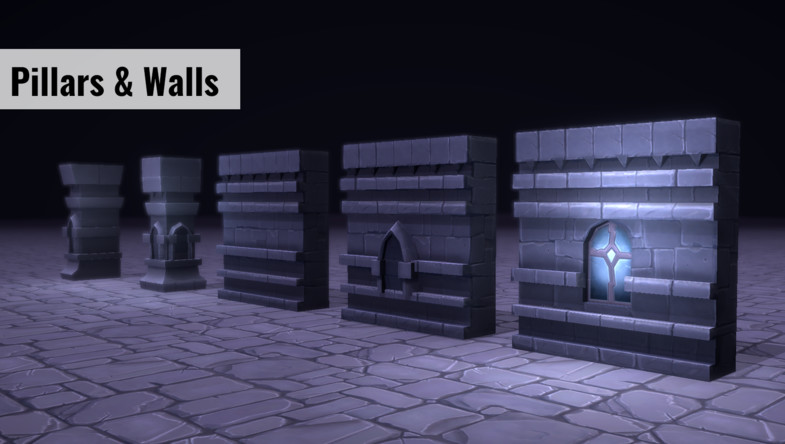
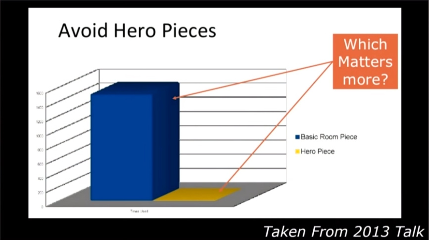
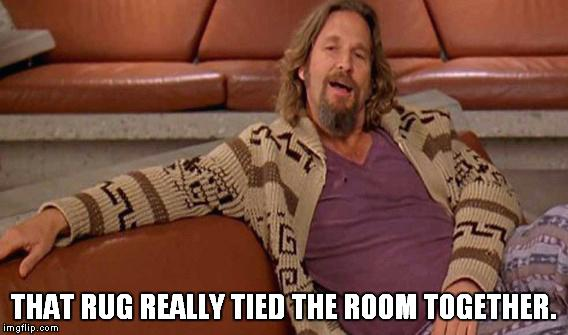
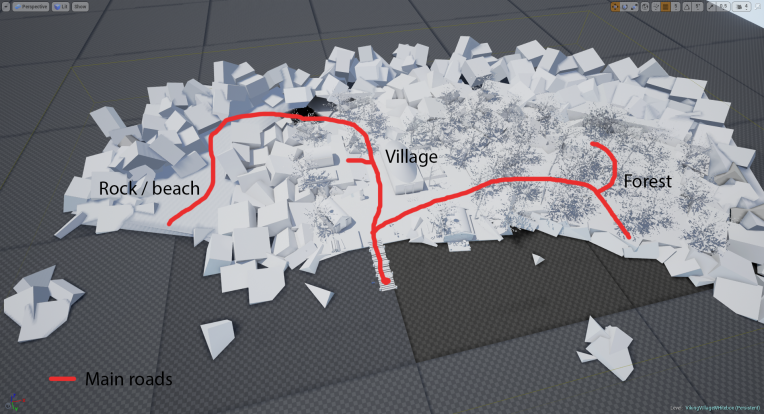
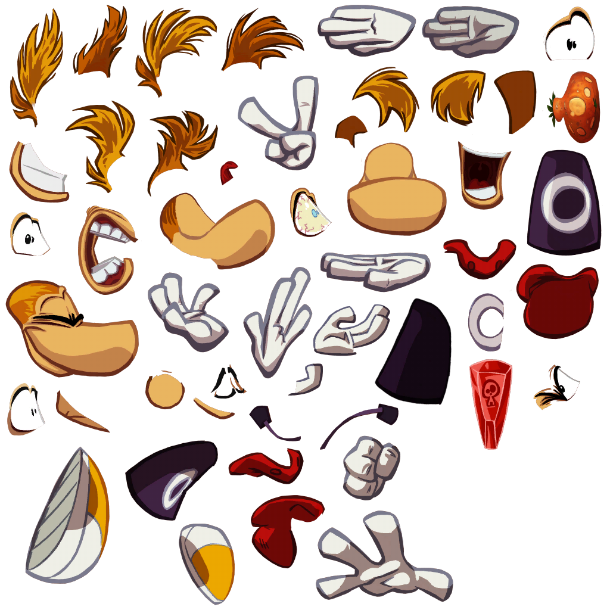
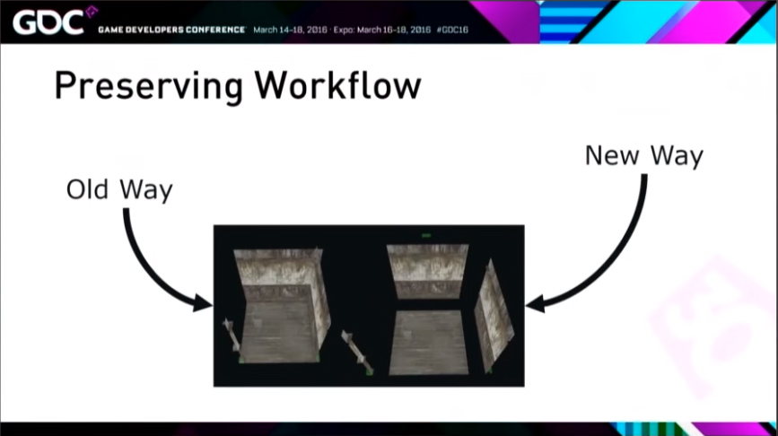

# Modular Level/Environment Design

## Game Levels

Game level: A place you explore in a game. There are usually points to start off, and an exit or goal.

  
_Guacamelee_

_Level 8 by Lord Mithios on Deviantart_
___

## Things a level has
The list of things a level has could go on forever, or a level can have none of them. It's up to the designer and the game type. Here are some of the most common. 

> 1. Spawn points
> 2. Ground, barriers, sky or ceiling
> 3. Obstacles
> 4. Items. Pickups, hazards, info points.
> 5. Enemies
> 6. Bosses
> 7. Paths for you/Enemies
> 8. Secrets
> 9. Often an exit or goal.
> 10. Collidable things 

## Level Editors

In a game these things could be defined by geometry, by imported xml/bsp files, by objects placed in an editor, completely in code, or any other method a team comes up with. We'll use Maya and Unity.

_Unity level editing_

_Tile based map editing_  
  
 
# Modular Construction
  

> Modular: Made up of compatible, standardized units for easy and flexible construction.     
  
Real world environments are big, varied, but also have a lot of repeating features. We need to reduce our concept art to pieces that can snap together seamlessly, or at least in a way that baked light, shaders or post effects can cover for (like ambient occlusion or grungy cavities.)  

Here are some of the central ideas:
> 1. Define the footprint of pieces
> 1. Only use non uniform pieces last resort
> 1. Pick a pivot and stick with it
> 1. Base kit for simple, square based layout
> 1. Inserts to make it organic, cover corners and seams, add interest.
> 1. Lighting brings atmosphere and more variance.
> 1. Obects!

  
  

_Fallout 4 GDC - [Youtube Link](https://www.youtube.com/watch?v=QBAM27YbKZg&t=330s)_

  

_Modular dungeon pieces, Baldi Konijn: - [Arstation Link](https://www.artstation.com/artwork/3a0yo:)_

 

_Fantasy Dungeon Starter Kit - [Unity Asset Store](https://assetstore.unity.com/packages/3d/environments/dungeons/fantasy-dungeon-starter-kit-110082)_

# Making modules

* Establish a **footprint**
  - square, hex
  - can use multiple of these per object
  - try to only break this footprint (half, quarter) with good reason
* Establish an **origin**
  - All pieces should join together in a predictable way, say front left corner of footprint.
  - Origin should be on a corner, not the center, so we can snap them together
  - Unity and other editors support snapping to ensure no seams are created 
  - Unit snapping or geometry snapping.  
* Utility vs Hero
  - Mundane room parts are most of the game
  - Variant parts are a big part of that
  - Hero pieces create truly unique areas but are expensive time eaters.. but the heros make the mundane parts work.

_Mundane pieces are king! - [Fallout 4 GDC talk](https://www.youtube.com/watch?v=QBAM27YbKZg)_

_But that rug really did tie the room together_

___

## Blocking out and iterating

> We can't make pieces till we know what the game needs.  
> We won't really know what the game needs till we make pieces and start testing.  
> We're dead.

Wait! We block out, and we iterate. We survive. 
* We plan as best we can from experience or example. 
* We have a game type and story for the level 
* We make ultra simple blocks of our basic pieces to serve that and start building
* We find problems and we fix them
* We discover efficiences where we might have wasted loads of time
* Keep cycling, adding rough textures, tweaking geometry, cleaning textures.

_First pass on Fallout 4 Level- [Fallout 4 GDC talk](https://www.youtube.com/watch?v=QBAM27YbKZg)_

_Shipping version of same Fallout 4 Level- [Fallout 4 GDC talk](https://www.youtube.com/watch?v=QBAM27YbKZg)_

_Level Whitebox by [ErikStarander](https://erikstarander.wordpress.com/2016/09/20/white-boxing-the-level/)_
  

_Level Whitebox by [ErikStarander](https://erikstarander.wordpress.com/2016/09/20/white-boxing-the-level/)_
  
# Technical Considerations  

* Levels are big, keep geo low. Exception: geometry instancing.
* Minimise rework and reimporting. Unity uses prefabs for this.
* Ram and hdd space aren't infinite so we repeat a lot of the same texture. 
  - Different UV procedures.
  - Clever seam hiding
*  Lots of materials and objects = lots of drawcalls = low frame rate. Techniques like atlasing and batching can get around this, but we have to build accordingly.
* Don't put holes in everything - use view blocking pieces to keep draw distance down.
  - avoids popup
  - avoids overlapping transparency blowing out drawcalls

___

## Atlasing  
  
  Atlases will be a familiar idea if you've done made sprites in 3D, or even in 2D. It's when you take a lot of textuers and arrange them into a single image. It's easier and faster for the computer to deal with one large image than many small images, and historically a power of 2 (2048x2048) resolution has been ideal. It can also save space if you support non rectangular shapes.

  
  
_Truck Simulator buildings in Unity alongside their texture atlas_

  
  
_Rayman texture atlas utilising texture space with non rectangular shapes_

## Fancy Shaders
Have a section of the texture with replaceable colour. 

  

___
  
## Batching  
  
Batching takes lots of objects using the same material and separate geometry and merges it into a single big object, removing plenty of drawcalls. Atlasing makes it possible to heavily reduce the number of materials.   
  
Two types of batching:  
> Static Batching: Many objects are batched into a large static object. Like combine in Maya. 

> Dynamic Batching: Small enough moving objects can be merged and their verts tranformed.  

___  

## Prefabs
If we break up our objects into the smallest pieces it's great for reuse, but a pain to build everything we need. Grouping them together into larger pieces once and reusing those pieces would be great. Like making a four pane window with frame from four panes, two beams and a brick frame. This is where a prefab comes in. Then we update a single fbx and all objects using that piece are updated.

_Walls are using parts of floors, 20 pieces_

  

_Now more granular - fewer types of pieces but more in scene, much work_

_Solved with in-editor made, reusable pieces: prefabs_

___

## Game Logic Controls
Your coders, or fingers if you are doing everything, will supply you with a variety of odd objects to drop into your scene. These might be waypoints for enemies to follow, the path a trail of magical fire will take, or spawnpoints. These are often a 3D object with a script attached.

