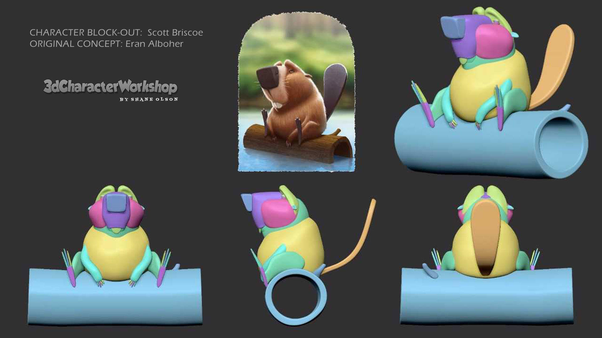
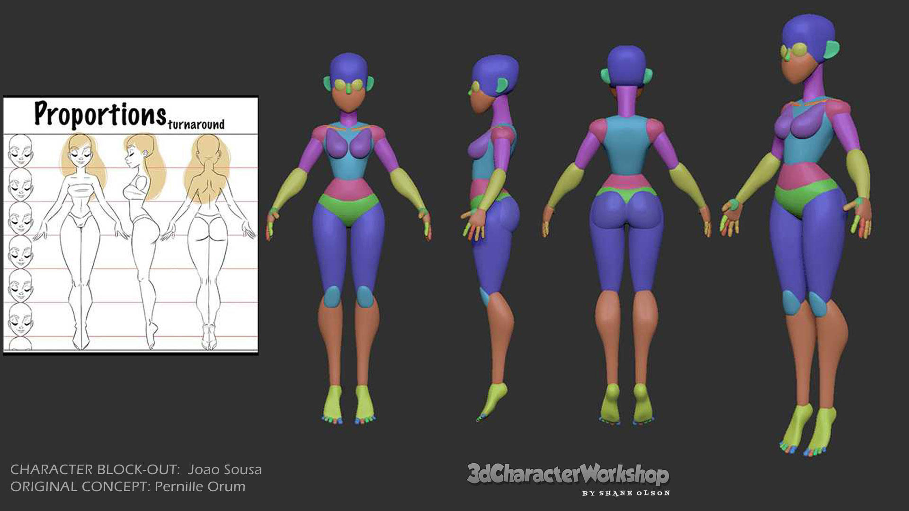
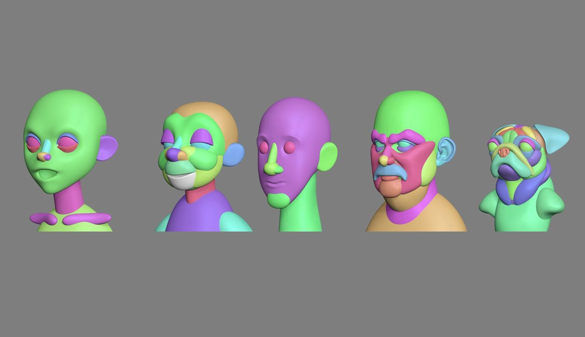
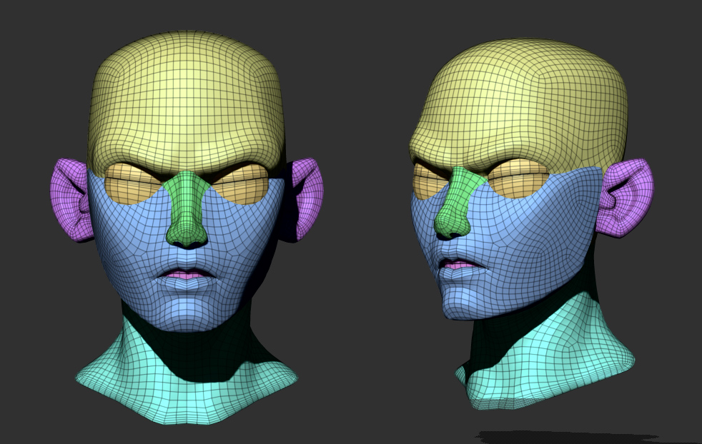
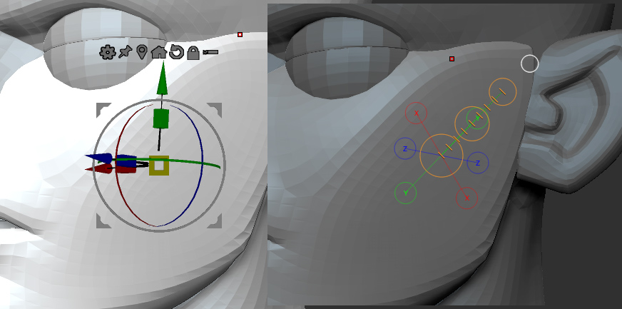
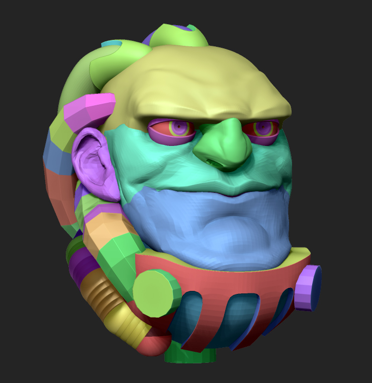
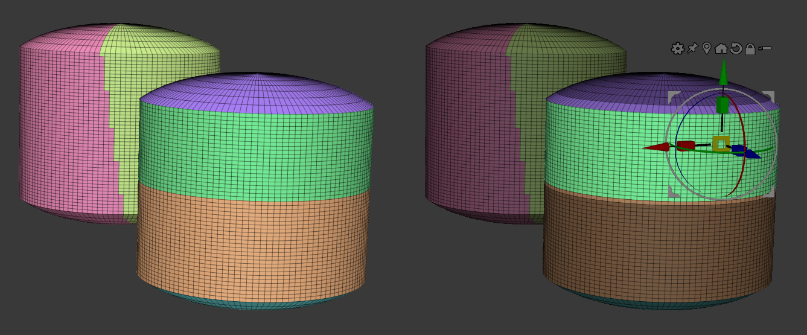
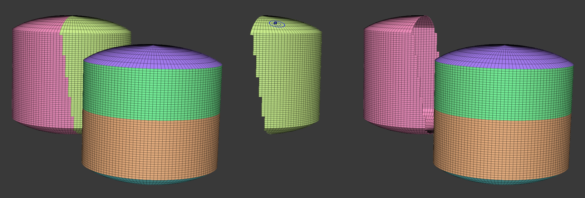
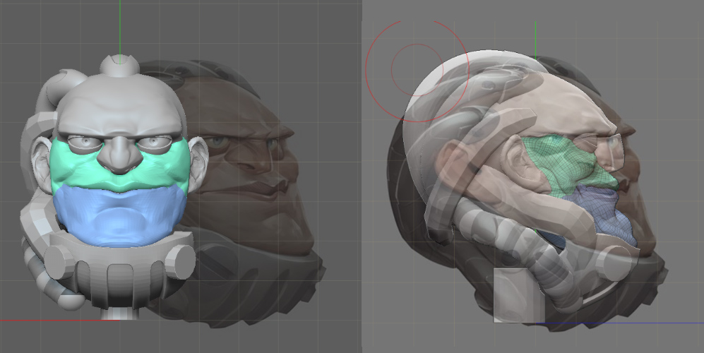
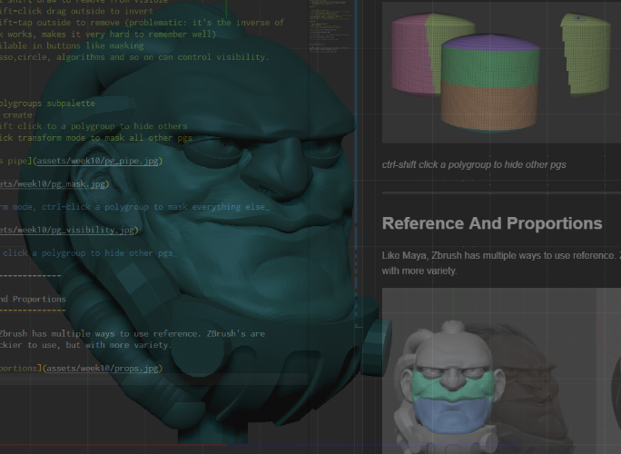

# Week 10: Working with a basemesh

<!-- @import "[TOC]" {cmd="toc" depthFrom=1 depthTo=6 orderedList=false} -->

<!-- code_chunk_output -->

- [Week 10: Working with a basemesh](#week-10-working-with-a-basemesh)
	- [What's a good base mesh look like?](#whats-a-good-base-mesh-look-like)
	- [Transforming](#transforming)
	- [Masking and automasking](#masking-and-automasking)
		- [Auto masking:](#auto-masking)
	- [Reference And Proportions](#reference-and-proportions)
	- [What to bring next week (11)](#what-to-bring-next-week-11)

<!-- /code_chunk_output -->

We want to start **very low rez** and drag things around. But this requires a fair bit more ZBrush know-how than just drawing, because you're going to exercise.. **control!** The muck-in-there-with-a-brush approach feels faster to start, but you **end up blocked** as detail grows or you need to change proportions. 

_Scott Briscoe and Joao Sousa, created under Shane Olson_

**Staying low poly as long as you can** gives you a much stronger sculpt because it's hard to mess up great shapes and proportions, and **near impossible to save a bad base with detail.** It's blockouts ZBrush style.

_Steve James from his [2D-to-3D videos](http://www.cgmeetup.net/home/3d-to-2d-with-steve-james/)_

_Low poly is relative.. Zbrush low poly is pretty high_

## What's a good base mesh look like?

Those heads above, done for Shane's class, are built up from new primitives, but that's the point of that class and it's longer than ours. To save time, and like a lot of industry artists, we'll start with a flexible base mesh.

_Brice St Martin's base is pretty great_

## Transforming

`w`,`e` and `r` enter transform mode, just like in Maya. If you're in new ZBrush you'll see a Gizmo. In old ZBrush, you'll meet Transpose Line. `q` goes back to drawing.

How do we scale a whole group of objects? if 2018, we have gizmo. If 4r7 we'll be using transpose master and transpose line. Yikes! Only because it's very unusual. In some obvious ways it's weaker than a gizmo, and in some surprising ways stronger.

## Masking and automasking

How do we grow a chin or move an eye socket only?  We use masks, which are much like Marquee/Lasso selections in photoshop. It protects areas from change. Just like photoshop there are loads of manual tools for making selections and plenty of conversions/algorithms to create them.

> * tools->masking subpalette
> * ctrl+draw to mask.  
> * ctrl+alt+draw to unmask. 
> * crl+tap empty to invert
> * Rect,lasso,circle, algorithms and so on can control masks
> * soften/sharpen with ctrl tap surface, ctrl+alt+tap

### Auto masking:
In the Brush menu you can turn on a few different auto masking modes. This is where ZBrush automatically limits what you can change, depending on where you start sculpting.
 > * topological means only polys sharing topology will move
 > * back face lets you sculpt on skinny things like blades
 > * polygroup auto mask is amazing!

Visibility
-----------

> * tools-visibility subpalette
> * ctrl+shift+draw area to remain visible (default is a rectangle)
> * ctrl-alt-shift-draw to remove from visible
> * ctrl-shift-click drag outside to invert
> * ctrl-shift-tap outside to remove (problematic: it's the inverse of the way mask works, makes it very hard to remember well)
> * All available in buttons like masking
> * Rect,lasso,circle, algorithms and so on can control visibility.

Polygroups
----------

> * tools-polygroups subpalette
> * ways to create
> * ctrl-shift click to a polygroup to hide others
> * ctrl-click transform mode to mask all other pgs

_In transform mode, ctrl-click a polygroup to mask everything else_

_ctrl-shift click a polygroup to hide other pgs_

------------------------

## Reference And Proportions

Like Maya, Zbrush has multiple ways to use reference. ZBrush's are zanier: trickier to use, but with more variety.

_Using tool transparency and reference images_

_A slider turns zbrush see through. Yep._

## What to bring next week (11)

First I'm going to be helping you resolve any proportion issues. After that we'll be increasing resolution and merging things together. To do this you need to have push and pulled, brushed and smoothed your character somewhere close to this level of detail:

_Brice's sculpt at [this point in vid 1](https://youtu.be/Ay-UY6JTbF4?t=519)_

Obviously it **doesn't have to (won't) look as amazing or on target as his Brice's**, he's ridiculously experienced. I can't model like him either. You can see though that the polygons are still big, he is still on the low resolution mesh, and all the parts are still separate. If you get really stuck on say the nose and need some extra geometry, you can hit ctrl-d (tool-geometry-divide) one time and double your count, but try to avoid it if you can.

If you can't get the sharp eyebrows or nose planes he has, try the pinch brush (b-p-i), and to soften them and try again you have smooth (hold shift).

##Helpful Links

* More great 2D concepts to choose from:
    - <https://www.pinterest.com.au/dmacdraws/face-inspiration/2d/>
* Face topology. The wireframes on the faces make the shapes much easier to see
    - <https://www.pinterest.com.au/dmacdraws/topology>
* Planes of the head m&f
    - [FacePlanesRef on onedrive](https://laureateaus-my.sharepoint.com/:u:/g/personal/daniel_mcgillick_laureate_edu_au/EUt11q4KlnlNgEaAOshHhyMBYadRwwtDlPFAxOb4UoYPbQ?e=shjhI5)
* A collection of unified, exaggerated cartoony style 3d faces:
    - [cartoony 3d face ref](https://laureateaus-my.sharepoint.com/:u:/g/personal/daniel_mcgillick_laureate_edu_au/ESBfT9bTg0xCvxZvGYbNk-IBoqt1BBPycSEMnVz_VgvwOQ?e=QCbvBG)
* Anime face shapes:
    - [AnimeFaces.pur on onedrive](https://laureateaus-my.sharepoint.com/:u:/g/personal/daniel_mcgillick_laureate_edu_au/EVswR3maoWJNiw_LMWV4fVMBFKPxLmQp2_e0vA7vOfvIKA?e=pXG9JI)
