---
html:
  embed_local_images: false
  offline: false
export_on_save:
  html: true
---

# Week 11: Painting 2D Textures

<!-- @import "[TOC]" {cmd="toc" depthFrom=2 depthTo=3 orderedList=false} -->

<!-- code_chunk_output -->

- [Week 11: Painting 2D Textures](#week-11-painting-2d-textures)
  - [This week](#this-week)
  - [Amazing resources](#amazing-resources)
  - [Tip on checking your proportions](#tip-on-checking-your-proportions)
  - [UV Mr Crisis again](#uv-mr-crisis-again)
  - [Overcoming the blank grey model](#overcoming-the-blank-grey-model)
    - [Open your imported model](#open-your-imported-model)
    - [Start with ambient occlusion.](#start-with-ambient-occlusion)
  - [Blocking in](#blocking-in)
    - [Major objects in colour](#major-objects-in-colour)
    - [Paint using pencil mode](#paint-using-pencil-mode)
  - [BIG TO SMALL](#big-to-small)
    - [More light and shadow](#more-light-and-shadow)
    - [Don't get caught up.](#dont-get-caught-up)
    - [Merge small forms](#merge-small-forms)
  - [Changes to the model](#changes-to-the-model)
    - [Reimporting a changed model](#reimporting-a-changed-model)
    - [Adding form to details.](#adding-form-to-details)
    - [Game study: TF2s art approach](#game-study-tf2s-art-approach)
    - [As the shader paints it](#as-the-shader-paints-it)
  - [Keep moving](#keep-moving)
    - [Zoom in and out](#zoom-in-and-out)
    - [Free yourself up](#free-yourself-up)
    - [Layers are faster until they're slower](#layers-are-faster-until-theyre-slower)
  - [Details: Edge control](#details-edge-control)
    - [Photoshop smoothing](#photoshop-smoothing)
  - [Face planes](#face-planes)
  - [Look at my model, recreate some stuff](#look-at-my-model-recreate-some-stuff)

<!-- /code_chunk_output -->

## This week

Q&A Uv unwrapping. Fixes

## Amazing resources

Painting a dagger in 3D Coat:
[
_80% of the painting process, fantastic learning._](https://www.youtube.com/watch?v=5YMu2jy7Oqw)

Blizzard style explanation/workflow:

I found this last night and I've only watched first 10 minutes so far. Totally worth it alread for the breakdown of Blizzard's style.

## Tip on checking your proportions

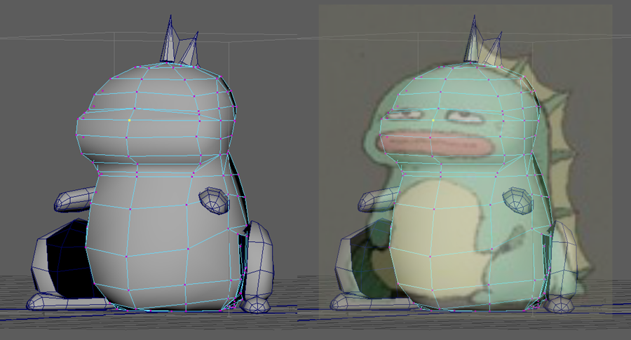

Screen shotting your model and laying the concept over it in photoshop is a great way to check you're in the right ballpark proportion wise. 
- 3D won't match stylised 2D perfectly, 
- Can check things like head to body ratio, placement of joints.

## UV Mr Crisis again

 [Grab the Mr Crisis project here](assets/week11/crisis_w11_maya_UV.zip)

## Overcoming the blank grey model

* So many brushes and infinite colours. Where to start?
* Do I start painting in features? Do I start on the hair or the outfit?

> Nothing worthwhile seems possible when taken in its totality.

#### To get it done:
* Break it into steps, and get the first one done.
* Begin quick and broad, and get all the major info in.

### Open your imported model
Last week's exercise was to unwrap and import your model to 3D coat.
* Open the 3b model
* If you haven't reached that stage, use Mr Crisis.bbq

### Start with ambient occlusion.
So that you can see and think about the volumes, create some AO on new layers. One hemispherical, one spherical. Leave them on multiply.

## Blocking in

### Major objects in colour
Identify clothing, wood, skin etc before going forward. Work in a middle tone.

### Paint using pencil mode 
    * How to draw sharp/pencil mode in 3D coat
    * Jump to photoshop to demo, show pencil in ps
    * Great for selecting and hue shifting (0 tolerance/pixel wand)
    * Disappears when scaled down. (work at double size)

#### What's a middle tone?
Light and shadow have to appear on the surface. What does the middle of that spectrum look like?

#### Rough in the details if needed
You can paint a few of the smaller details as lines on another layer if necessary. Don't get caught up.

## BIG TO SMALL

Hand painting textures is just regular painting. We're moving it from a single rectangle to 3D surfaces, but:
- the principles and techniques are the same. 
- If anything it's easier: we don't have to guess where the surface turns away from the light

[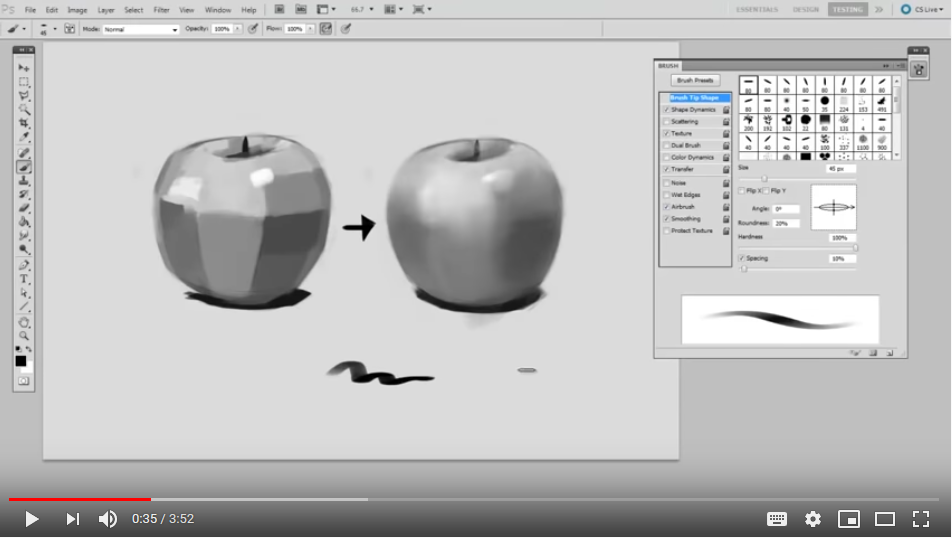
_Get the big idea, then refine and and contrast sharp against soft_](https://www.youtube.com/watch?v=EfQNadGEPBU)

### More light and shadow
  
We can identify many of the properties of a material before we touch it.
  * How shiny/reflective is it?
  * How does it fold?
  
 ### Don't get caught up. 
  * Start big, think about light and shadow

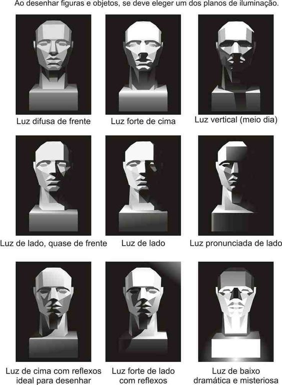

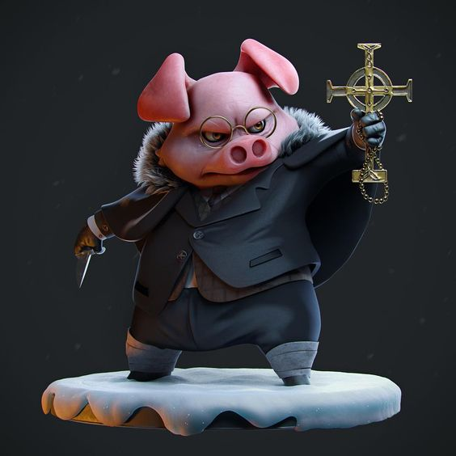

[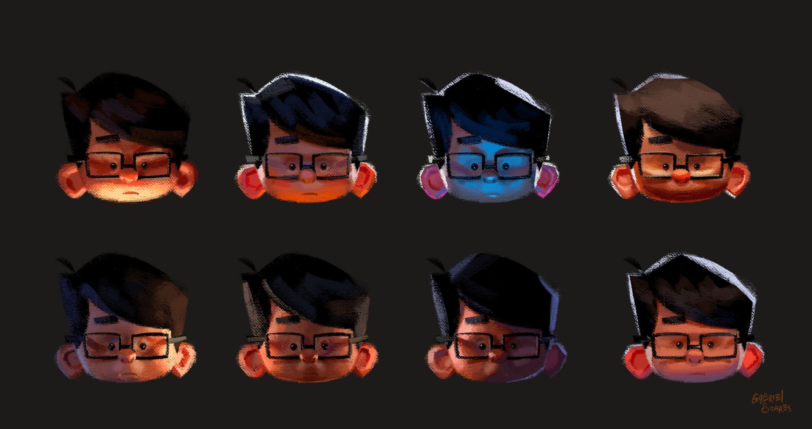
_Lighting studies by Gus Soares. Click for hi res versions_](https://www.artstation.com/artwork/VdgQEn)

  * Put those on layers that use blending so we can work under them
  * Hue shift! Light isn't white, shadow isn't black.
    * Shift the AO
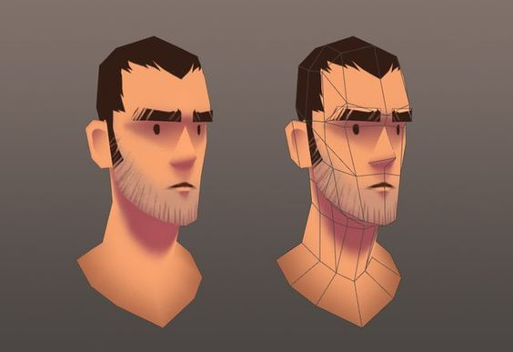
_Look at the richness of colour in the shadows_
  * I mostly use cel shading for first lighting, even if it requires some banding. 
  
  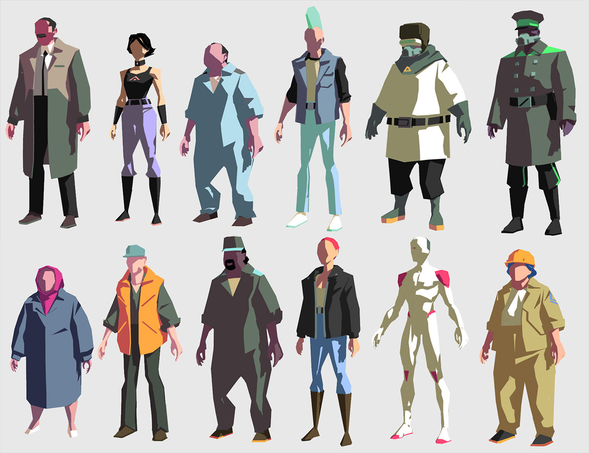
  _These concepts show off 2 tone cel shading. (Don't light your models from the side btw)_
  * If your character is nothing but soft gradients, use those. On layers.
 
// Pictures: aliased (jaggy/pixelated edges) vs anti aliased (smoothed/averaged edges)
// Pictures: select and fill on jaggy vs smoothed edges

### Merge small forms

Lots of small shapes make characters noisy and slow to read.

[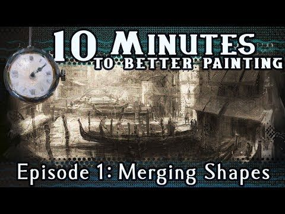
_Merging shadows into simpler shapes_](https://www.youtube.com/watch?v=9fknSkyN6_0&list=PLLmXZMqb_9sbNLM83NrM005vRQHw1yTKn&index=8)

## Changes to the model

Working with the model, you'll discover shortcomings of the model/uv unwrap you couldn't have anticipated. It's why we move fast, to make these discoveries while the work is still easily adaptable.

### Reimporting a changed model

You don't have to lose all your work just because you need to change the model/uv unwrap. There are options:
  - replace model in current scene
  - Export texture layers and import into new scene

### Adding form to details. 
How to go from flat to 3D.
  * Shadowed and lit planes

### Game study: TF2s art approach

Now valve was able to use custom shaders to do a lot of what we'll be hand painting in, but if you can turn it into an algorithm then you can break it into steps and do  it!

This was more than "a cartoony style". It was the eventual result of a process heavily biased towards making the game as readable and understandable as possible.

They made a slide deck that teaches how:
[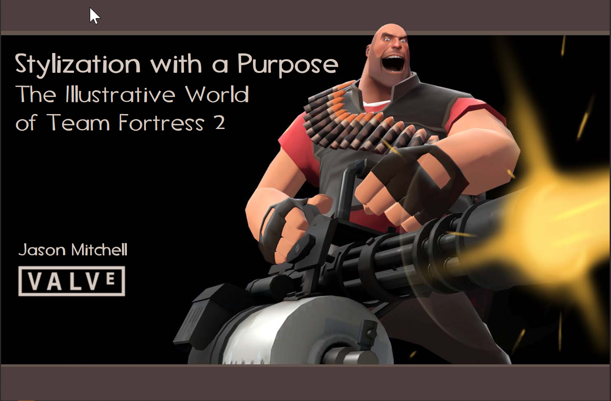
_This was made to go along with a GDC talk_](https://steamcdn-a.akamaihd.net/apps/valve/2008/GDC2008_StylizationWithAPurpose_TF2.pdf)
[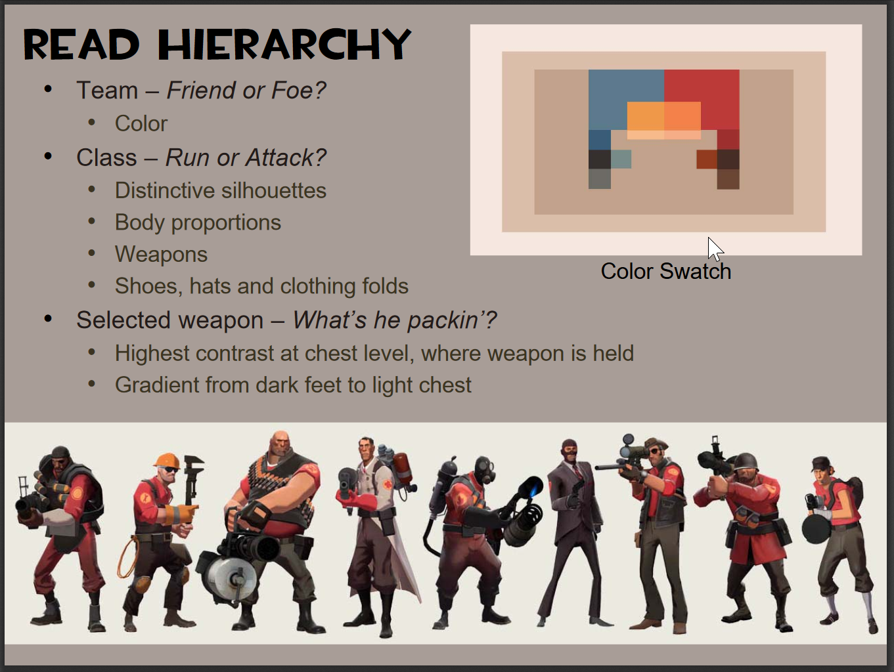
_Reading from top to bottom, Friend vs foe_](https://steamcdn-a.akamaihd.net/apps/valve/2008/GDC2008_StylizationWithAPurpose_TF2.pdf)
[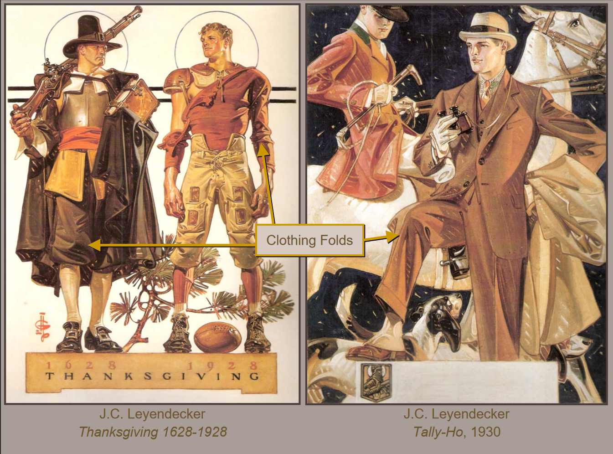
_Simplifying folds.. don't reinvent the wheel, look at earlier artists!_](https://steamcdn-a.akamaihd.net/apps/valve/2008/GDC2008_StylizationWithAPurpose_TF2.pdf)

### As the shader paints it

A shader is the rules of light applied when rendering the models. It also allows certain imaginary lights to be baked in, and can support arbitrary effects like outlining and gradients. We think of it as the "material" applied in Unity.

The shader in tf2 uses a number of passes to achieve a final, composited image, just like we're painting light and shadow in various layers.

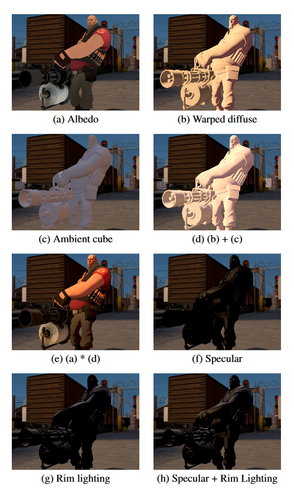
_Each pass represents a layer you'd composite in photoshop_

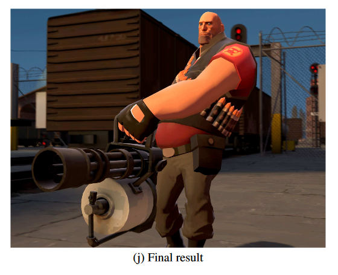
_The result_

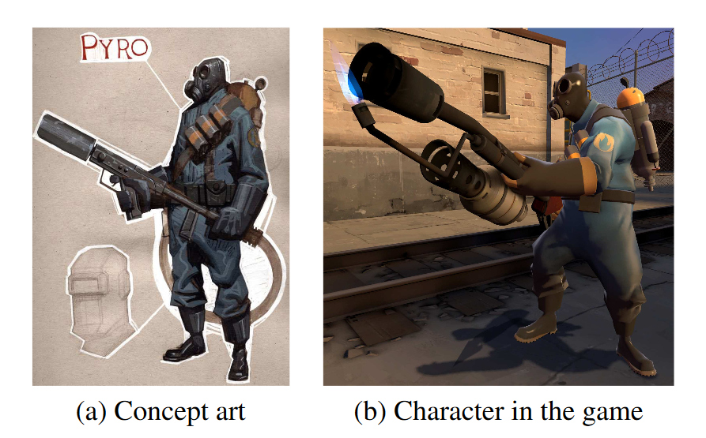
_It developed a fair way from concept to finished models, textures and shader_

## Keep moving

### Zoom in and out
  * DON'T GET STUCK IN ONE AREA. Work big to small.
  * If you stay zoomed in you noodle around and forget big picture. Everyone.

### Free yourself up
  * create new layers and try stuff
  * It's digital. If you think you might reck it by trying something, duplicate the file. Save a copy of `dinoTexture.005.3b` as maybe `dinoTexture.005a.purpleEyes.3b` and go for it. If it looks bad, go back to .005.

### Layers are faster until they're slower  
  * Duplicate a couple of layers and flatten them, then you can smudge and colour pick easy again.

## Details: Edge control
  * When two planes/forms meet they do so in many ways. Sharp edge, soft edge, one side sharp, one smooth, etc.
  
  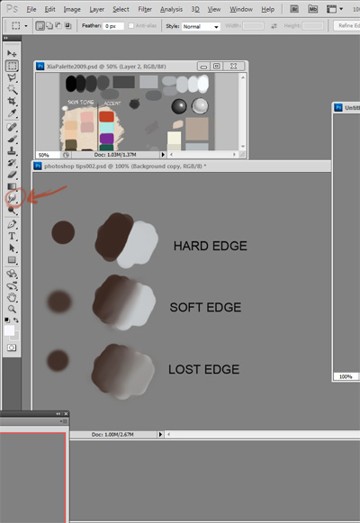
  
  
  * This is critical to painting, maybe the second most important thing after lighting major forms.
  * We can do it with a few tones in pixel form if we want to stay adaptable

### Photoshop smoothing

This is complete magic. Sadly 3D coat, in my efforts so far, has never revealed a good blending/smudging brush.

[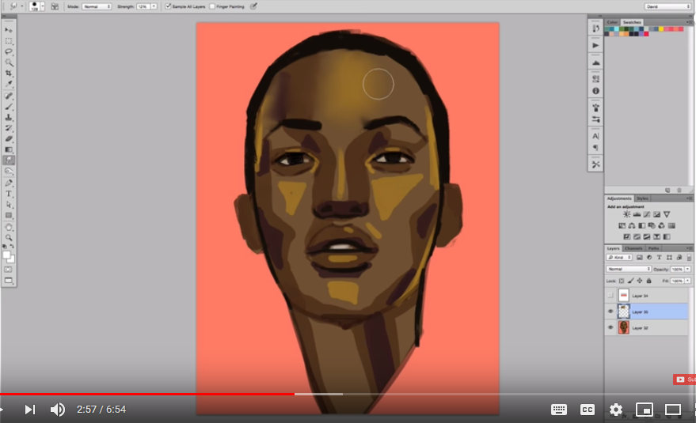
_Tutorial: Using the smudge tool_](https://www.youtube.com/watch?v=KZ4Cqkmut3Y)

> Shane Olsen, when asked how he made the Disney Infinity characters look so crisp when sculpting in ZBrush, said something along the lines of:
>  The best way to keep your forms super clean is to touch them as little as possible.

This is why the smooth brush is good. Humans are finicky, imperfect, organic things. To get a big soft transition, paint it harsh and then let the computer average/blur it out. 
- We don't try to draw perfect circles, we grab a compass (or ellipse tool) if we need that.
- Smoothing is the same.

It takes a lot of art experience and knowledge to know where and how much to do it, but the computer takes care of the inhumanly smooth averaging.

## Face planes
Changing textures is often the best way to get facial expressions on low poly characters.

## Look at my model, recreate some stuff

