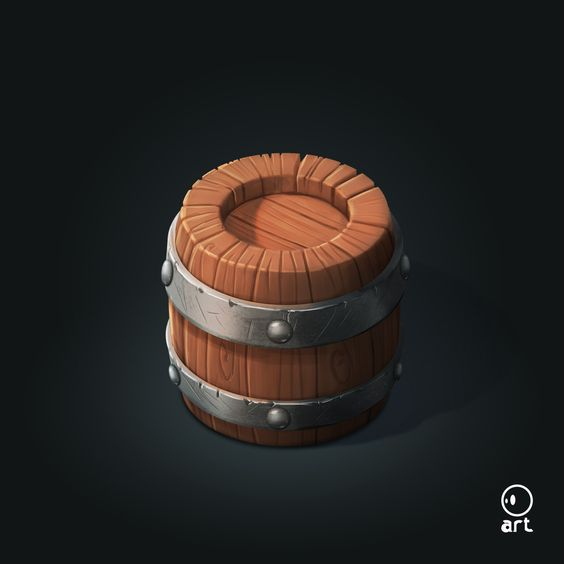
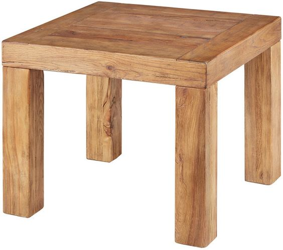
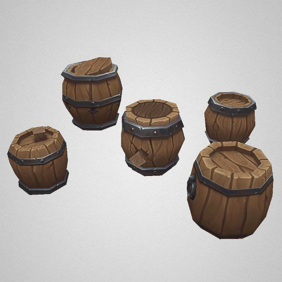

---
html:
  embed_local_images: false
  embed_svg: true
  offline: false
  toc: undefined
export_on_save:
  html: true
---
# ACR103 Week 1

<!-- @import "[TOC]" {cmd="toc" depthFrom=1 depthTo=6 orderedList=false} -->

<!-- code_chunk_output -->

- [ACR103 Week 1](#acr103-week-1)
  - [Hello!](#hello)
  - [This week](#this-week)
    - [Resources](#resources)
  - [What is Maya?](#what-is-maya)
  - [Our first model](#our-first-model)
    - [Make a table top](#make-a-table-top)
    - [Transforming objects in Maya](#transforming-objects-in-maya)
      - [Duplicate an object](#duplicate-an-object)
      - [Mirror objects](#mirror-objects)
  - [Make a Barrell](#make-a-barrell)
    - [Create cylinder.](#create-cylinder)
    - [Editing edges with scale to create barrel belly.](#editing-edges-with-scale-to-create-barrel-belly)
    - [Creating rings with insert edge loop](#creating-rings-with-insert-edge-loop)
    - [Extruding rings](#extruding-rings)
    - [Adding top and base indent](#adding-top-and-base-indent)
      - [Go deeper: barrel modelling](#go-deeper-barrel-modelling)

<!-- /code_chunk_output -->

## Hello!

**Me:** Danny McGillick. Computer Science @ UTS, Web dev, Creative technologist in advertising (flash/actionscript, unity), 2D and 3D artist for Torus, Halfbrick, Blowfish studios. Keyboard enthusiast, bits maker.

https://cargocollective.com/dmac/ - Flash/Unity 
http://www.artstation.com/dmacdraws/ - game art

**You:** The next makers with long futures.

## This week

* Get into modelling in Maya 2019!
* Won't into the course too much
* Links to resources to study at home

_We'll model a similar barrel to this, designed by Alvaro Vera_

### Resources

Easy to find up here

* Interface basics YT: https://youtu.be/dbjAnutq1vQ
* Modelling basics YT: 
* Extrude (2019 help?)
* Slice
* Connect
* Other simple objects to model, with pictures
* Pureref portable zip
* Link to interface cheat sheet

## What is Maya?

Quick tour.
* Open
* Open a model
  - pic of dagger or chest -
* tumble, pan, zoom.
* Space bar, views
* Workspaces and resetting the worspace if you can't find something.
  
> **Go deeper:** 
>  [Maya Interface Tour on YT](https://www.youtube.com/watch?v=okaC2_NxPYQ&list=PLD8E5717592CF5C26&index=10)

___

## Our first model

Let's model a very basic table, something like this:

### Make a table top 
First, we'll make it from primitives. We'll make several boxes, then move and resize them until they look like a table top and legs.

> Primitives are basic 3D prisms. Cube, pyramid, cylinder.

### Transforming objects in Maya
Move and scale the table top.

**QWER:**
* **Q:** Select an object with the cursor
* **W:** Display object moving handles
  - [Moving objects lesson YT](https://www.youtube.com/watch?v=1n89UOtMI_Y&list=PLD8E5717592CF5C26&index=7)
* **E:** Display object rotation handles
  - [Rotate Objects lesson YT](https://www.youtube.com/watch?v=BvsN5GzxoHo&list=PLD8E5717592CF5C26&index=8)
* **R:** Display object scaling handles (expand, shrink)
  - [Saling objects lesson YT](https://www.youtube.com/watch?v=Kmuf2M9Nvp0&list=PLD8E5717592CF5C26&index=9)

..modelling..

#### Duplicate an object
Duplicate top, turn it into a leg

#### Mirror objects
Create remaining legs in the right position.

> **Go deeper**
> * Add thin top stretchers 
> * Add thick bottom stretchers
> * Make a table using edge loops and extrude (after barrell)
  
---

## Make a Barrell

### Create cylinder.

Need loops/edges around body.

### Editing edges with scale to create barrel belly.
  - edge mode. Try scaling.
  - undo
  - enable z symmetry
  - scale.

### Creating rings with insert edge loop
  - with symmetry on, create a few edge loops
    (screenshot, link to help)

### Extruding rings

1. Enter face mode
2. Select face loop. Click first face, shift-double-click adjacent. 
3. Extrude.

### Adding top and base indent

1. Select top of barrel. 
2. Inset with extrude tool.
3. Now extrude inwards.

#### Go deeper: barrel modelling

Try adding more!
- Tilted lid
- Round or Square plug
- Ring made from another cylinder primitive.

