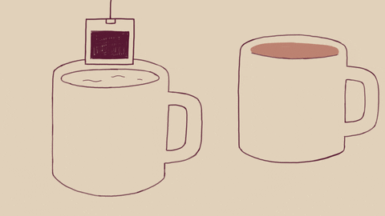
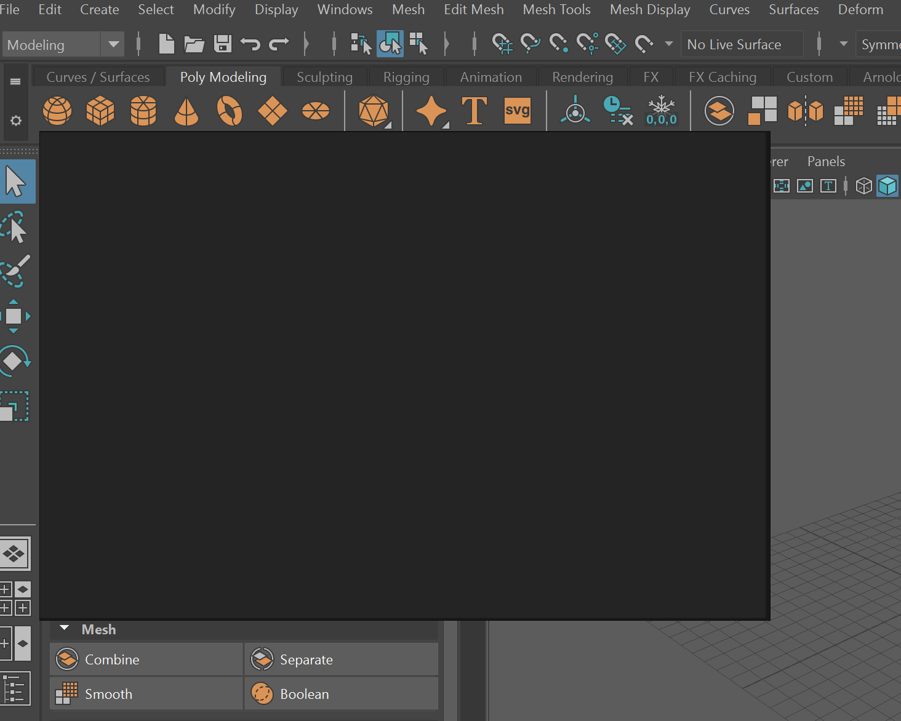
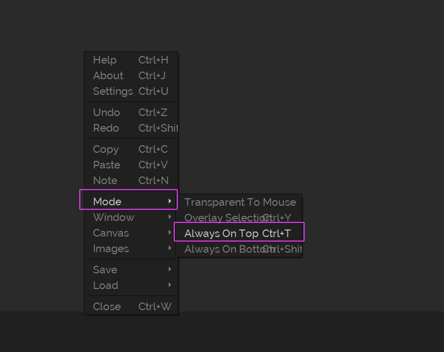
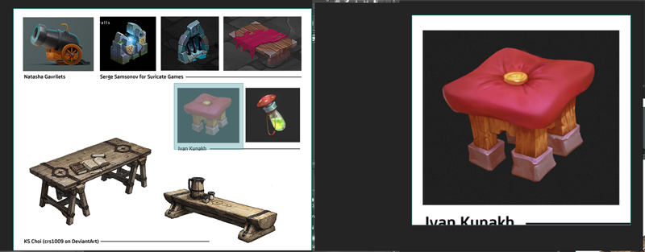
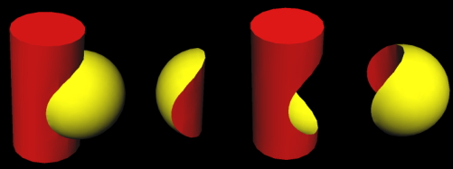
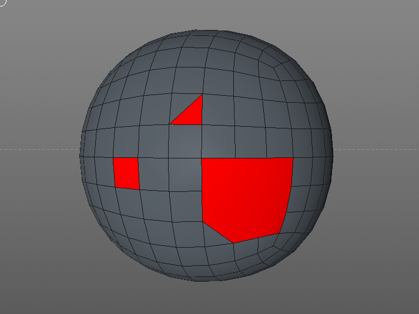
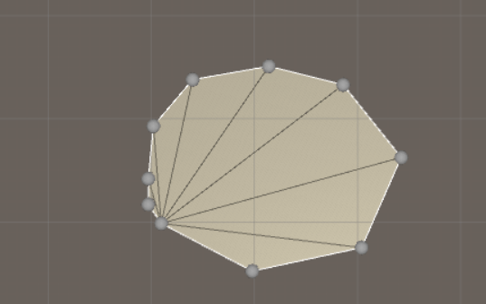
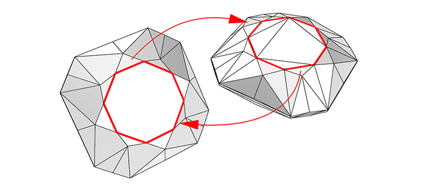

---
html:
  embed_local_images: false
  offline: false
export_on_save:
  html: true
---
# ACR103 Week 2

<!-- @import "[TOC]" {cmd="toc" depthFrom=1 depthTo=2 orderedList=false} -->

<!-- code_chunk_output -->

- [ACR103 Week 2](#acr103-week-2)
  - [Assignment 1](#assignment-1)
    - [Choose your concept](#choose-your-concept)
    - [Presentation](#presentation)
  - [Block out time](#block-out-time)
    - [PureRef](#pureref)
    - [Upcoming assignment learning](#upcoming-assignment-learning)
  - [Modeling demo](#modeling-demo)
    - [The pivot point](#the-pivot-point)
    - [Transform options](#transform-options)
    - [Channel Box](#channel-box)
    - [Freeze transformations](#freeze-transformations)
    - [Bevels](#bevels)
    - [Amputation with Multi Cut](#amputation-with-multi-cut)
    - [Joining with Bridge](#joining-with-bridge)
    - [Booleans](#booleans)
    - [Thin things ( not a big detail)](#thin-things--not-a-big-detail)
    - [N-gons](#n-gons)

<!-- /code_chunk_output -->

## Assignment 1
Model and render a _**prop**_. Things found in a game that isn't part of, say, the tiling environment. Treasure chests, tools, candle stands, computers, siege weapons, furniture, guns.
> **Prop** _(noun)_: An item in a scene distinct from the characters and static environment

NOTE: We won't be designing anything from scratch.

Lets **check out the brief** on [subject's assessment page](https://laureate-au.blackboard.com/webapps/blackboard/content/listContentEditable.jsp?content_id=_8008757_1&course_id=_75841_1&mode=reset) on Blackboard.

### Choose your concept

Let's pick something achievable and fun to model. You have **30 mins** to:
1. Pick a prop to model from the concepts below
2. Decide how you think you'd model the parts of the prop.
3. Think about any changes/additions you'd like to make. Think about how those would be made.

> **Cartoony models:** They're pretty low detail and chunky. Aim to block out first, and then add the bounce and dynamism.
> **Gritty-realcore models:** Block them out, then look to add details like bands, rivets.

#### The Options:

### Presentation

30 mins **Present** Come up front and describe what you'll model. Classmates can offer ideas, constructive thoughts.
  1. What did you choose and why?
  2. Are you making any changes?
  3. What bits do you feel like you can already make (and how)?
  4. What's a part you're very unsure about? (each concept potentially has that)

---

_Break time._

---

## Block out time
Now you need to try things, find the barriers, the challenges you'll need to overcome

So start **blocking out** your models. We're just going for **big shapes**.
  - Aiming for proportions and feel
  - Primitives with some scaling
  - Cut off parts where needed
  - Make sure you move around and hit all needed pieces. Don't stop to detail.

### PureRef

Optional (great) way to keep your reference visible. 
* Grab it from [pureref.com](http://www.pureref.com) to install on a personal machine.
* For uni machines [download the portable version here.](https://www.dropbox.com/s/vx9ggk74018p2bl/PureRefPortable_192.zip?dl=1)

Here are a few tips and shortcuts:

**_Pureref opens as a plain, dark grey rectangle._**

  
**_Set Pureref to be always on top with the right click menu._**

  
**_Drag and drop your image from the notes._**

_**c-drag a square selection to crop, ctr-alt-drag the image to resize**_

* **Right click** to move pureref
* ** Middle drag** to move canvas inside program
* **Left click/drag** to move image
* **Ctrl-V** to paste a copied image in, or **drag drop**
* **ctrl-alt-drag** on an image to resize
* **c-drag** to crop, **ctrl-shift-c** to remove cropping.

### Upcoming assignment learning

**Week 3:**
  1. How to add details, add flat material colour

**Week4:**
  1. Rendering, shading.

## Modeling demo

I'll block out and partly detail a simple concept

### The pivot point

**Press d to enter pivot edit mode**
  - **click** on features to **snap**
  - **v drag** to snap to **vert** (applies to vertex transforms too)
  - **x drag** to snap to **grid** (also applies to vert xforms)

### Transform options

Can be changed via the modelling toolkit or double clicking the transform controls on left side toolbar.
* Control what you **xform relative to**: world/object/tangent/normal and other
* Control what happens when snapping with multiple elements selected (maintain distance)
* Also available in w-right-click, e-right-click and r-right-click context menus

### Channel Box

* Changing parameters on newly made primitives
* Precise position/rotation/scale
* Renaming (along with outliner)

### Freeze transformations

### Bevels

### Amputation with Multi Cut

### Joining with Bridge

### Booleans

### Thin things ( not a big detail)

How would you do thin things without a nightmare of selecting.?

_**- bendy strap box with things close together -**_

We can make that as a flat surface, then thicken later.
* Start from a plane with only x axis divisions
* Start from a box, delete back and side faces.
* Use Quad Draw feature (will need home learning with videos and practise, but big rewards)

_**- picture of flat ribbon -**_

### N-gons

