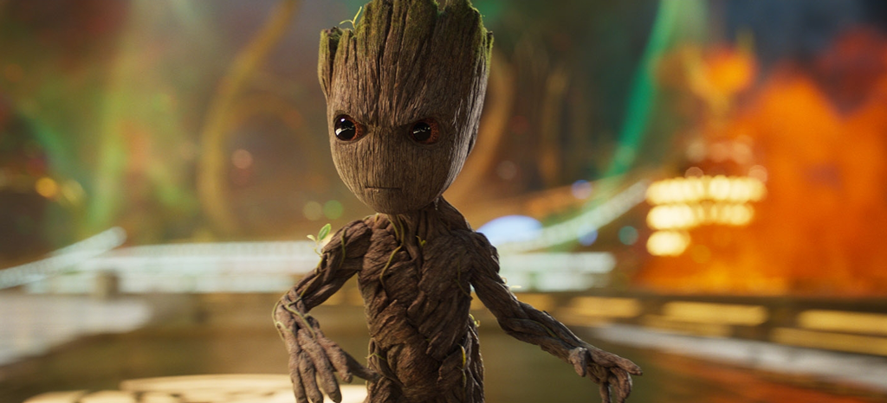
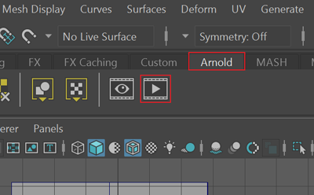
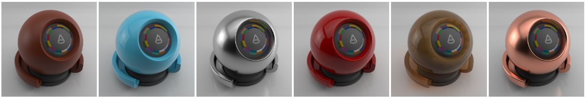
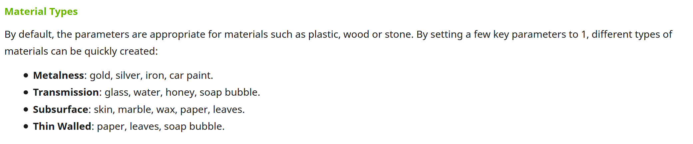

---
html:
  embed_local_images: false
  offline: false
export_on_save:
  html: true
---

# ACR103 Week 4

<!-- @import "[TOC]" {cmd="toc" depthFrom=1 depthTo=6 orderedList=false} -->

<!-- code_chunk_output -->

- [ACR103 Week 4](#acr103-week-4)
  - [Assessment 1](#assessment-1)
  - [Intro to Rendering with Arnold](#intro-to-rendering-with-arnold)
  - [More on PBR](#more-on-pbr)

<!-- /code_chunk_output -->

## Assessment 1

What counts towards marks, according the the assessment PDF.

* Assessment page on Blackboard is [here](https://laureate-au.blackboard.com/webapps/blackboard/content/listContentEditable.jsp?content_id=_8008775_1&course_id=_75841_1)
* PDF Brief is [here](https://laureate-au.blackboard.com/bbcswebdav/pid-8008804-dt-content-rid-14342462_1/xid-14342462_1)

#### Marking covers three components:
  - week 2 block/chat done: 40
  - Detailed modelling: 30
  - Shading: 30

### Blocking
Everyone participated well on blocking, and instead of written forum posts we had class presentation and blocking during lesson.

#### Deliver: 
* Just a brief note (readme.txt) summarising in a paragraph what you said during week -why you picked/designed your concept, what challenges you had expected, and what turned out to be the real challenges. Not very formal, just something to help me understand how you’re going.

### Detailed Modelling
* How you applied the techniques taught in class
* How successfully did you capture the details and evoke the feel of the concept art
* How much control did you achieve over the tools.

#### Deliver:
* **Your maya scene file**. Either .ma or .mb extension. Zip it up.
* File naming:
  - **A1_prop_danny_mcgillick_table.ma.zip** 

### Shading

Lighting the model and positioning the camera to see its forms.
Creating, selecing, applying and changing materials to make enhance your model.

#### deliver
Use lighting to get maximum form across.

**Renders:**
When you render with arnold you can either save out the image, or just screenshot it.

Deliver PNG or JPG files, zipped into a single archive.

1.**2+ images**. Hero shots: A hero shot is whatever you think shows off your model best.
2. **2 images**. 3/4 isometric from two opposing sides. Think Diablo view.
3. **3 images**. Top, side and front: Simple structural shots. screenshot your viewport with "wireframe on shaded" enabled.

## Intro to Rendering with Arnold

Arnold is what's called a "Ray Tracing Renderer". 

> **Arnold paints your scene** (rendering is a word often used for painting or drawing), using your polygons, lights and materials to figure out the colour of each pixel.

**Ray Tracing** means it trys to figure out when rays from your lights would bounce off the surfaces and hit the camera. The results can be pretty convincing:

_Groot in Guardians 2, rendered with Arnold. See more Arnold renders [on the Arnold website](https://www.arnoldrenderer.com/gallery/)_

### Pre made arnold rendering scene

Grab the **scene file** with size reference [here](assets/week4/prop_maya_arnold.zip)

_An arnold render next to the perspective view_

#### Opening the render view

At the top of Maya, beneath the menu bar and toolbar, you'll find the _shelf_. It's tabbed, and contains several different shelves including one for Arnold.

**To start a render:**
1. Select the Arnold shelf (by its tab)
2. Click the render view button: it looks like a youtube icon.
3. It should render whatever is in your perspective view. It might wait for you to update the scene, so if it remains black try tumbling or zooming in and out of the perspective view a little.

#### IPR on/off

Interactive rendering is really useful, but also taxing on your machine. 

- enable/disable with the playStop button in Arnold viewer.

### HDR lighting

  - the image lighting your scene
  - Rotating it
  - using other hdr images

### Materials

Arnold Materials use the Arnold Standard Surface Shader, which has a bunch of handy settings to simulate all kinds of real world surfaces.

_Material types described in the [Standard Surface help](https://docs.arnoldrenderer.com/display/A5AFMUG/Standard+Surface)_

Controlling it:

## More on PBR

Physically based rendering.

