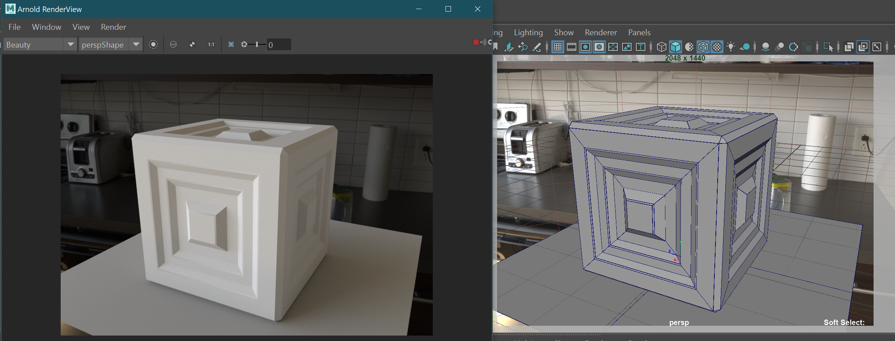
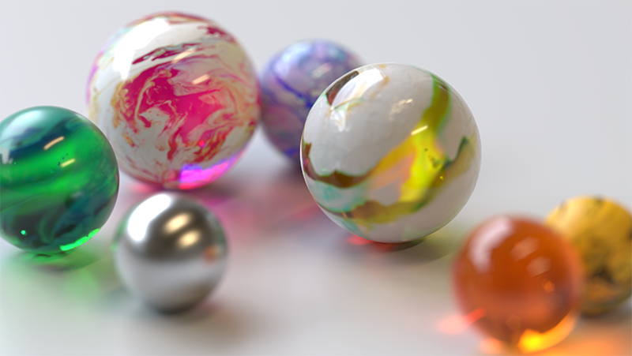
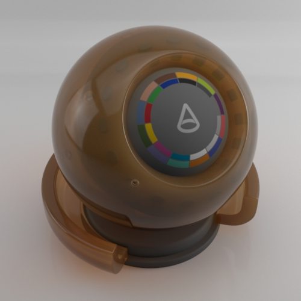
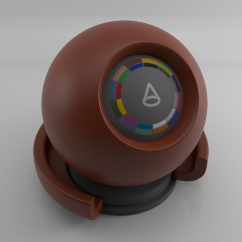
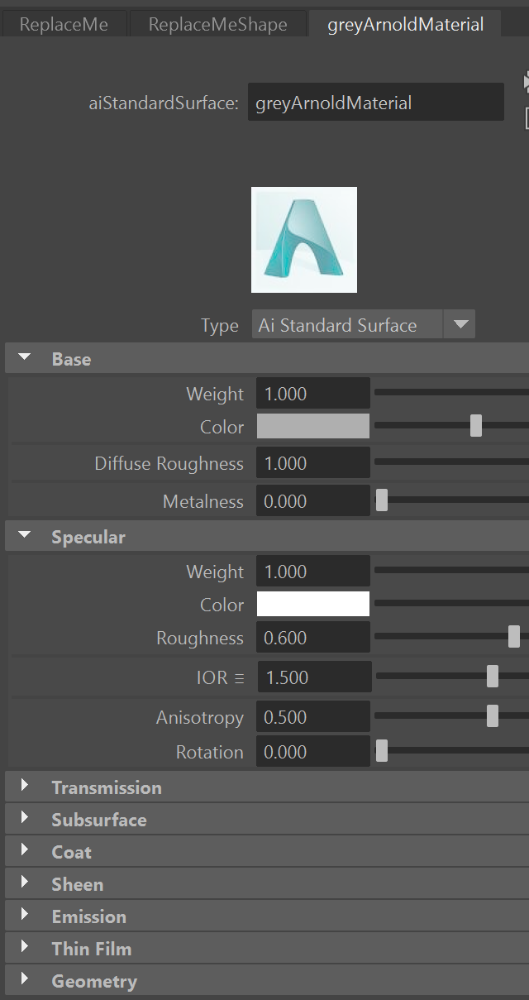

---
html:
  embed_local_images: false
  offline: false
export_on_save:
  html: true
---

# ACR103 Week 4

<!-- @import "[TOC]" {cmd="toc" depthFrom=1 depthTo=6 orderedList=false} -->

<!-- code_chunk_output -->

- [ACR103 Week 4](#acr103-week-4)
  - [Assessment 1](#assessment-1)
  - [Intro to Rendering with Arnold](#intro-to-rendering-with-arnold)
  - [More on Arnold](#more-on-arnold)

<!-- /code_chunk_output -->

## Assessment 1

What counts towards marks, according the the assessment PDF.

* Assessment page on Blackboard is [here](https://laureate-au.blackboard.com/webapps/blackboard/content/listContentEditable.jsp?content_id=_8008775_1&course_id=_75841_1)
* PDF Brief is [here](https://laureate-au.blackboard.com/bbcswebdav/pid-8008804-dt-content-rid-14342462_1/xid-14342462_1)

#### Marking covers three components:
  - week 2 block/chat done: 40
  - Detailed modelling: 30
  - Shading: 30

### Blocking
Everyone participated well on blocking, and instead of written forum posts we had class presentation and blocking during lesson.

#### Deliver: 
* Just a brief note (readme.txt) summarising in a paragraph what you said during week -why you picked/designed your concept, what challenges you had expected, and what turned out to be the real challenges. Not very formal, just something to help me understand how you’re going.

### Detailed Modelling
* How you applied the techniques taught in class
* How successfully did you capture the details and evoke the feel of the concept art
* How much control did you achieve over the tools.

#### Deliver:
* Your maya scene file. Either .ma or .mb extension. Zip it up.
* File naming:
  - **A1_prop_danny_mcgillick_table.ma.zip** 

**shading**

Lighting the model and positioning the camera to see its forms.
Creating, selecing, applying and changing materials to make enhance your model.

_deliver_
Use lighting to get maximum form across.

Renders:
When you render with arnold you can either save out the image, or just screenshot it.

Deliver PNG or JPG files, zipped into a single archive.

1. 2+ images. Hero shots: A hero shot is whatever you think shows off your model best.
2. 2 images. 3/4 isometric from two opposing sides. Think Diablo view.
3. 3 images. Top, side and front: Simple structural shots. screenshot your viewport with "wireframe on shaded" enabled.

## Intro to Rendering with Arnold

Arnold render scene with size reference downloadable [here](assets/week4/prop_maya_arnold.zip)

#### The render view

#### IPR on/off

Interactive rendering is really useful, but also taxing on your machine. 

- enable/disable with the playStop button in Arnold viewer.

### HDR lighting

  - the image lighting your scene
  - Rotating it
  - using other hdr images

### Materials

Controlling it:

## More on Arnold

The Standard Surface Shader and physically based rendering.

