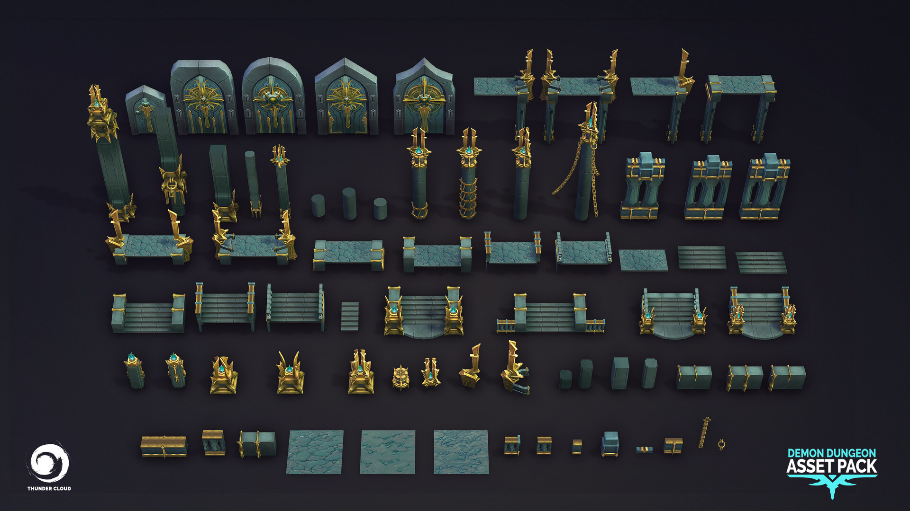
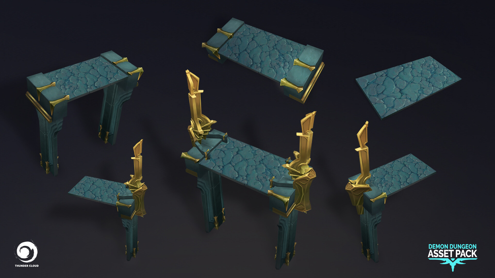
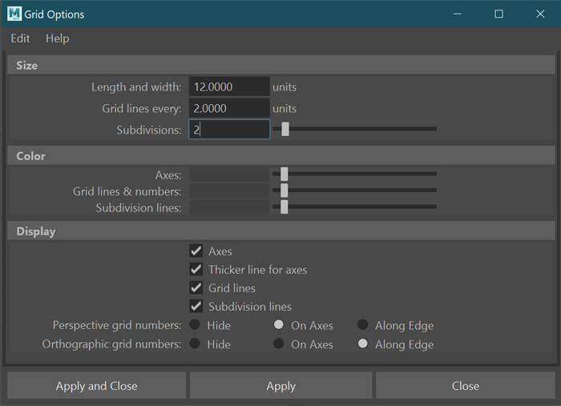
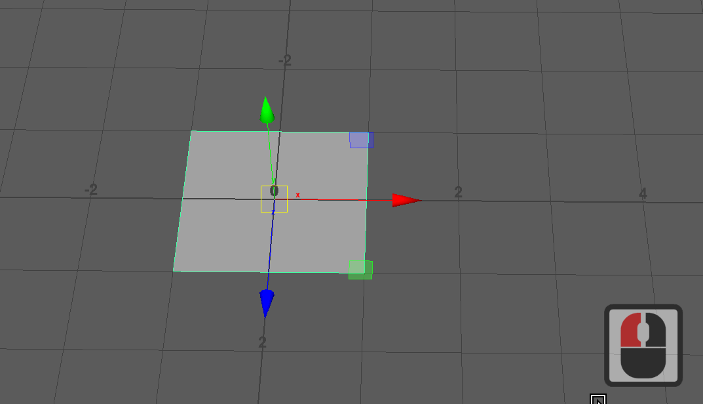
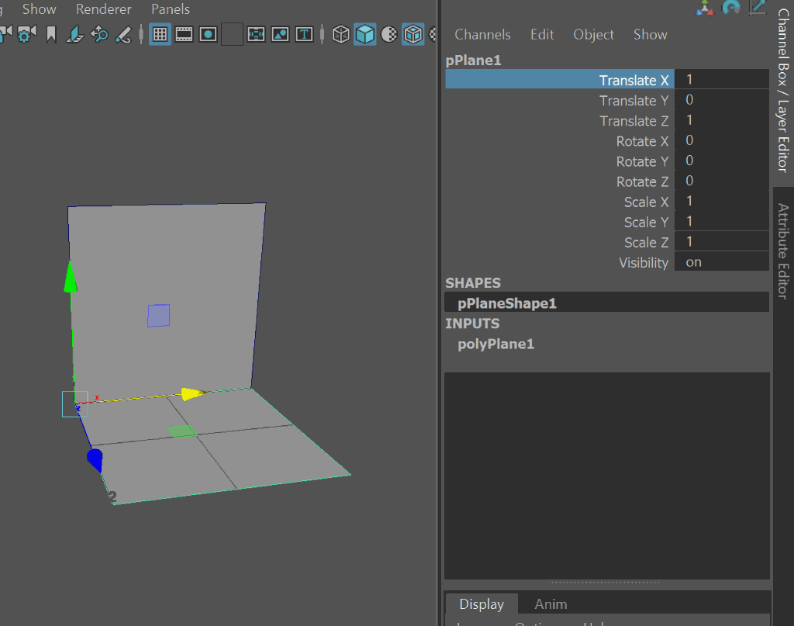

---
html:
  embed_local_images: false
  offline: false
export_on_save:
  html: true
---

# ACR103 Week 5

<!-- @import "[TOC]" {cmd="toc" depthFrom=1 depthTo=2 orderedList=false} -->

<!-- code_chunk_output -->

1. [ACR103 Week 5](#acr103-week-5)
   1. [Filming](#filming)
   2. [Assessment 1 Received](#assessment-1-received)
   3. [Weeks 5-8, modeling game environments](#weeks-5-8-modeling-game-environments)
   4. [Assessment 2: Environment Modelling](#assessment-2-environment-modelling)
   5. [How will we do it all?](#how-will-we-do-it-all)
   6. [Wacom Tablets](#wacom-tablets)
   7. [This week](#this-week)
   8. [Inspect plane uvs](#inspect-plane-uvs)
   9. [Styles and concepts](#styles-and-concepts)

<!-- /code_chunk_output -->

## Filming

Crew coming in to film today for maybe 30 mins max.

## Assessment 1 Received 

Thanks for assessment 1 submissions.
* A couple issues, i’ve messaged those people about correcting submission

## Weeks 5-8, modeling game environments

We'll learn about:
#### Modular modelling
  - Assembling usable level pieces from basic components
  - components like floors, walls, columns, doors
  - level pieces like repeating wall with floor, corner of room etc

**Modular (simple) in the real world:**

_Bunnings modular storage_

**Modular level construction:**

Examples by [Glenatron](https://polycount.com/discussion/158818/another-modular-dungeon-tileset)

_Components for making modules_

_Levels made from modules_

| Objects     | Description
|---          |---
| wall        | basic component 
| floor       | basic component 
| wall+floor  | wall_floor module
| 2 walls + floor | wall_floor_corner module
| 5 x wall_floor  | one side of a corridor? | 

#### Texturing
  - uv unwrapping
  - Applying textures
  - Creating/editing textures
  - Using wacom tablets
  - 3d coat and painter

_Low poly dagger with hand painted texture (diffuse)_

_Download the [dagger_maya project](assets/week5/dagger_maya.zip)_

## Assessment 2: Environment Modelling

Assessment 2 brief [on blackboard](https://laureate-au.blackboard.com/webapps/blackboard/content/listContentEditable.jsp?content_id=_8008776_1&course_id=_75841_1)

 You will be designing*, building and lighting a 3D environment. 
 
 * You'll be provided with a range of existing 2D environment concepts and finished 3d environment assets to use as a guide.
 * You can modify the scene from say a level 1 dungeon to level 5 dungeon, or a lounge room to an attic bedroom). * You can add elements that aren't there, but aim to match them stylistically
  
**OPTIONS**
1. Dungeon crawler world (games like diablo)
2. Interior scene:
   a. modern home interior
   b. fantasy interior
3. Cartoony tiered environment (see concepts)
4. Suggest and discuss with Danny (facilitator)

**TECH SPECS, CREATIVE DIRECTION**
1. Keep polycount low. Elements between 20 and 100 polys roughly.
2. UV unwrap models
3. Keep textures minimal with little lighting. Keep individual textures at 512x512 or lower (256, 128, 64)
4. Export to Unity and apply baked lighting (AO)

**DELIVERABLES:**
Week 6:
* Designs and first renders on class forum (blackboard)
* 10-15 untextured components, arranged into modules
Week 12:
* Unity project with interactive fly through (camera using a basic unity-provided controller script)
* Maya project

## How will we do it all?

- Choose and modify/extend a concept
- Model and uv unwrap in Maya
- Test with a texture designed to help uv mapping
- Export to 3D Coat/Photoshop for texturing.
- Import components to Unity
- Make simple prefabs
- Snap pieces together

## Wacom Tablets

Get one!

## This week

Beginning the assessment, practising working to a grid.

### Modules and components 

A little more context. 

_Notice one road lane component and one sidewalk component making up a module. Look for more._

_Components being arranged to make ledge/raised walkway modules_

### Choose your environment and style

Lots of styles and concepts at the end of these notes, many more on [my acr103 pinterest board](https://www.pinterest.com.au/dmacdraws/acr103/)

Can match existing style as closely as possible, work directly from concepts in 2D.

### Rough design of your level
Sketch out an approximation of your idea (obviously more refining at home!)

### Figure out components you'll be making.
Getting started here. What do you see in the image? wall, flor, railing, stairs, column, sign?

### model and texture a wall and floor 

<!--
> TODO: add this file
> First, play in this scene to see what we'll be doing.
>
> Make some modules by duplicating (ctrl-d) and moving components:
>  - select translate tool (w)
>  - enable grid snapping (hold down x)
>  - click and drag the translate handle
> -->

* Set up grid

  
* Make a wall plane, a floor plane
* Move our pivot points using d (modify pivot)
  - select translate tool (w)
  - select an object
  - enable pivot editing (d)
  - you can move pivot freely by dragging handles
  - enable snap to vertex (hold down v), click and drag manipulator handles.
  - disable snap to vertex (release v)
  - disable pivot edting (d)
  

* Move and snap our objects. Duplicate, move w snap.
  - select translate tool (w)
  - enable grid snapping (hold down x)
  - click and drag the translate handle

When you have your pivot set, and your object at the origin, you're going to be stuck with funny x and z coordinates, and maybe leftover rotation. Remove them with "Freeze Transforms"
* Select your objects
* Right Click the channel box as in the gif below and freeze all transforms.

_Your new level component should be all 'zeroed out' with its pivot at the origin_

* Make a column
* Move pivot, duplicate, move w snap.
  
## Inspect plane uvs
Only if time allows.

## Styles and concepts

For these and more, continue to [my acr103 board on Pinterest](https://www.pinterest.com.au/dmacdraws/acr103/).

#### Blocky rooms and zones

### Snake Temple 
These shots are from [Bitgem's store](https://shop.bitgem3d.com/products/snake-temple-low-poly-3d-proto-series)

### Cartoony concepts

More Minxi Zhuang on Artstation

### Bangzheng Du concepts

Multi tier mayhem.

### Baldi Konjin concepts

### Some simple, effective construction:

### Blocky shapes, relatively low fi textures

By cgart dot com, [on artstation](https://www.artstation.com/artwork/RzB5e) 

