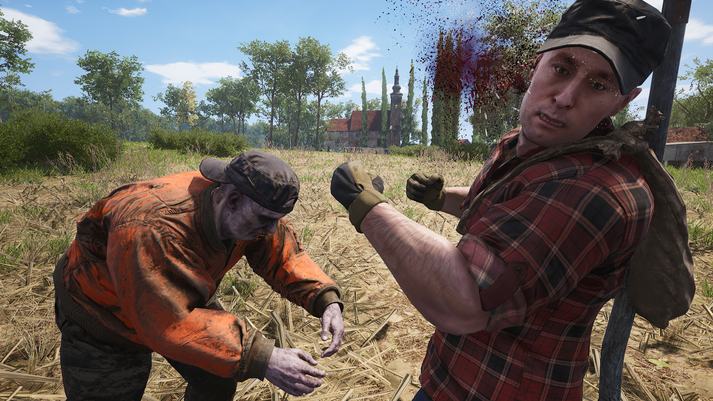

# Week 7: Lighting and texturing

## Maya To Unity

### Prepping for export

Each piece needs to arrive in Unity ready to use: 
* It has a reasonable name
* It appears at the origin if zeroed out
* If it's one 1m grid unit in Maya, it matches that in Unity

<iframe width="720" height="480" src="https://www.youtube.com/embed/Gzi4g21NnM8" frameborder="0" allow="accelerometer; autoplay; encrypted-media; gyroscope; picture-in-picture" allowfullscreen></iframe>

Grab my pre lit Unity project

1. Renaming
2. Exporting pieces in fbx format to unity assets folder
3. Dragging into Unity scene. Seeing pivots.
4. Unity fbx import settings
5. Combining pieces into modules. Empty objects.
6. Prefabs!
7. Applying default material
8. Generate lighting
   
## Realtime vs offline rendering

3D rendering isn't defined by a single piece of software or target use/audience. It's the many ways that data definining 3D scenes/objects (in text or binary files) can be converted into viewable images.

**Arnold:** Offline renderer supported by Maya and other 3D programs.

**Unity:** A game engine and editing environment that uses a realtime renderer to create many frames per second.

> **Offline rendering** is the generation of images from a 3D scene to be used either statically or assembled into a video sequence. It can take seconds, minutes or hours to generate a single image.

> **Realtime rendering** is the very fast generation of images from a 3D scene to display games (or other experiences) at up to hundreds* of frames per second

_60 frames per second enables exciting experiences like 'dwarf glowers at camera' and 'zombie council worker encounter'_

_* A realtime game engine could in theory generate thousands of frames per second, but our monitors wouldn't make use of them._
