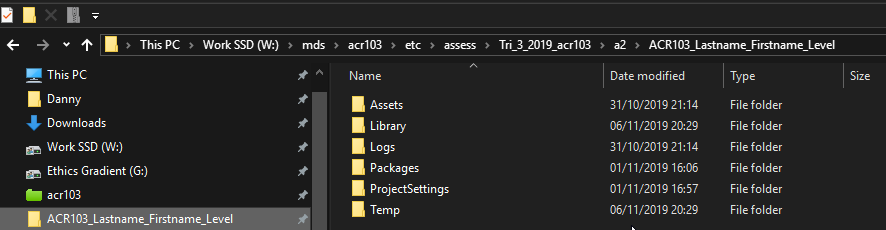
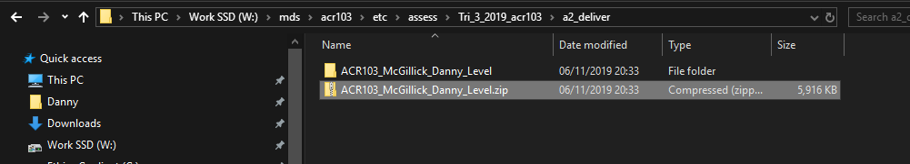
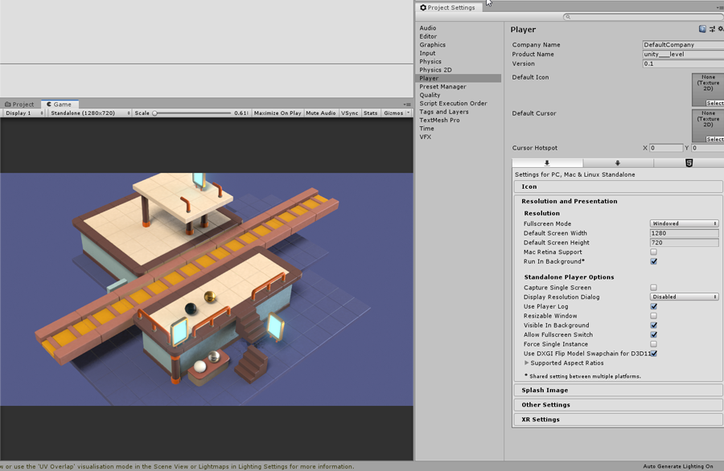
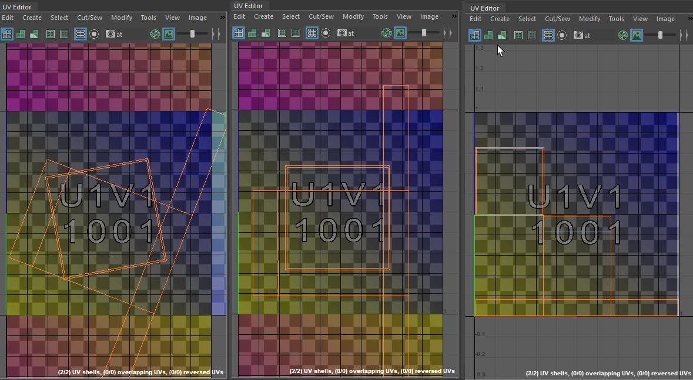

---
html:
  embed_local_images: false
  offline: false
export_on_save:
  html: true
---

# Week 8: Finalising Assessment 2

<!-- @import "[TOC]" {cmd="toc" depthFrom=1 depthTo=2 orderedList=false} -->

<!-- code_chunk_output -->

- [Week 8: Finalising Assessment 2](#week-8-finalising-assessment-2)
  - [This week](#this-week)
  - [How to deliver the assessment](#how-to-deliver-the-assessment)
  - [Using Unity materials](#using-unity-materials)
  - [Necessary Lighting info](#necessary-lighting-info)
  - [Basic UV unwrap](#basic-uv-unwrap)
  - [Basic texturing](#basic-texturing)
  - [Further learning](#further-learning)

<!-- /code_chunk_output -->

## This week
How to deliver the assessment
Setting the project to windowed and choosing a resolution
Using unity materials
Basic uv unwrapping and texturing of floor tile

## How to deliver the assessment

1. You **DO NOT** need to supply a build of your level.
2. I **DO** want your Unity project folder zipped up and named like so, but with your own name:
  **ACR103_Lastname_Firstname_Level**
3. You'll notice it has the name of the project I gave you, because I gave it to you to use as your base. **DO** import and build your level pieces in the project and scene I provided.

_Common contents of a Unity project folder_

I step up one folder, right click the Unity project folder and right click it -> _Send To_ -> _Compressed folder_ or _z7ip_ -> _add to ACR103_McGillick_Level.zip_

_The zip file made from my project folder._

### Project resolution

You want me to see what you saw in the game view.

* kIn _Edit->Project Settings_ head to _Player Settings_ and _Resolution_
* I already set it to _Windowed_. Change resolution to something common like **1280x720** or **1920x1080**. _(Mine used a weird vertical resolution because of the concept)_
* Open the "Game" window/tab in Unity if you don't already have it open, and make sure it's set to "Standalone" rather than "Free aspect ratio".

## Using Unity materials

The Unity materials work similarly to Arnold. They're based on the same 'physically based rendering' concept.
  - <https://docs.unity3d.com/Manual/shader-StandardShader.html>
  - Albedo gives you basic colour control
  - Metallic goes from 0 (plastic/wood/cloth etc) to 1
  - Smoothness goes from 0 (completely matte) to 1 (sharp reflections)
  - Emission allows an object to emit light. HDR colours can go above 1 (the maximum for normal colour), to create bright light sources.
  

### A word on how we'll apply materials

We're going to be applying multiple materials to get different colours and surfaces. In a game we'd be using fewer materials and painting texture maps to control colour and surface on different parts of our models.

We'll do that in assessment 3. For now we'll touch on the idea.

### Using gloss and matte, metallic and not to create contrast.

Dark and light, contrasting colours, contrasting gloss and metalness.

// screenshot of well textured object would be welcome

### Assigning to objects in a prefab

Covered in this video last week:

<iframe width="720" height="480" src="https://www.youtube.com/embed/UeC2UtKhnk4" frameborder="0" allow="accelerometer; autoplay; encrypted-media; gyroscope; picture-in-picture" allowfullscreen></iframe>

### Multiple materials for one fbx
Some assets need multiple materials, despite being exported as a single component to fbx:
* A wall with a window
* A table with cloth/metal components
* If you leave them as separate objects they will still be separate inside the fbx, and can have their own materials

### // live demo

## Necessary Lighting info

* Gloss only works once the reflect map (from the hdr environment) is baked, giving the material something to reflect.
* Speed vs Quality: useful lightmap settings values.

### // Live Demo  of lighting
(coming soon:screenshot settings with fields hilighted)

## Basic UV unwrap
Textures are 2D images wrapped around 3D objects. We have to find ways to do that without stretching the image too much. It's much like creating papercraft toys in 3D.

_Click unfolded Thanos to download a pdf pattern_

_Click unfolded monster to download a pdf pattern.

_Have another peek at the DVa textures with fresh eyes.

### Bad UVs

Objects have a default uv layout when Maya creates them. Usually they become badly distorted as you model.

_One side looks blank, the other is striped and full of errors_

####Create new starting UVs:
  - Go into Maya's UV workspace
  
  - (optionally, delet the original uvs)
  - In the perspective view, tumble and look the model from above at 45 degrees, classic strategy game view.
  - UV Tookit -> Create -> Camera-based
  
  
The new UVS are distorted in 2D to resemble what the camera saw. They're all joined together like the mesh too. We need to cut it like papercraft.

#### Cutting and unfolding
  - In edge mode, select (and shift select) edges to cut
  
  - UV Toolkit -> Cut and Sew -> Cut
  
These next steps were all done by hand previously (and often still are):
  - Select all edges
  - Uv Toolkit -> Unfold -> Unfold
  - Uv Toolkit -> Arrange and Layout -> Auto Orient
  - Uv Toolkit -> Arrange and Layout -> Layout
  
  _Unfolded, oriented, then laid out. Colours altered in photoshop._

There are lots of settings for Unfold and Layout. We'll cover in assessment 3 classes.

## Basic texturing

If we have time...

Export uvs layout image
Import to photoshop/krita
Install Krita portable if you want to and don't have photoshop at home. (check krita 3D coat integration)
- [Download Krita portable for Uni workstation](https://sourceforge.net/projects/portableapps/files/Krita%20Portable/)

Create texture in ps/Krita and apply in Unity (we'll apply in Maya next assessment)
(Add very simple rivets and bevel hilights to tiles)
Edit textured meshes in 3D Coat
Export texture from 3D Coat, overwriting Unity texture
Class demo.

## Further learning
Apply texture to phong/lambert/Arnold mat in Maya.

