# Characters!

Making characters in ZBrush

## 1. Introducting ZBrush

* The first screen
* Placing and editing
* Navigation
* Making an object
* Saving
* Subtools
* Brushes and Subdivision
* Move, smooth, clay buildup, standard, dam_standard, hpolish, trim.
* Visibility
* Polygroups

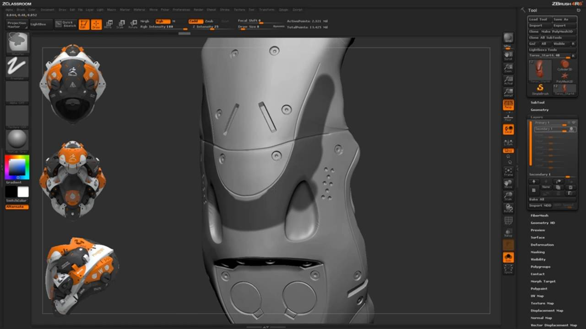

_Masking bits of mesh to protect them from edits_

_Hiding bits of mesh with ctrl-shift-LMB_

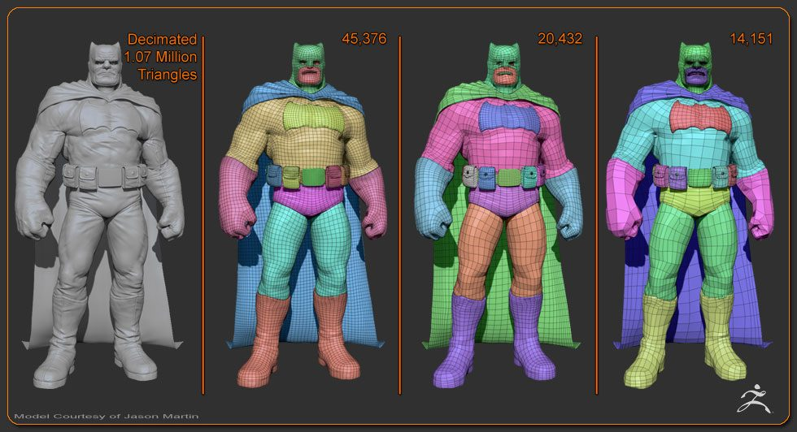

_Polygroups and mesh density, Jason Martin_

## ZBrush Learning

This is the big one for this week:

[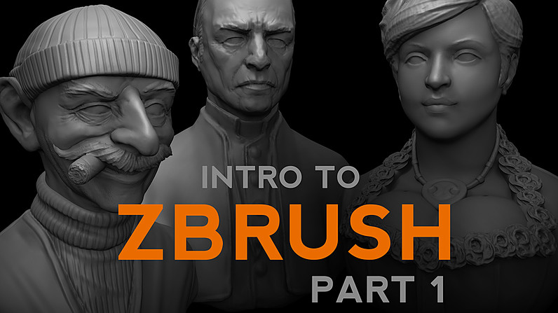](https://www.youtube.com/watch?v=J2B0x9TkFuA&list=PLkzopwqcFevYqrk_0MKIaUwrWYILzYsp6)

_Intro to ZBrush P1 with Michael Pavlovic - [Link](https://www.youtube.com/watch?v=J2B0x9TkFuA&list=PLkzopwqcFevYqrk_0MKIaUwrWYILzYsp6)_

---

## Concepts

_Wolverine by Max Grecke - [Link](https://www.artstation.com/artwork/OoJnK)_

_Rey!_

_Stylised males by Gray Shuko - [Link](_https://www.artstation.com/artwork/freestylesfaces01)_

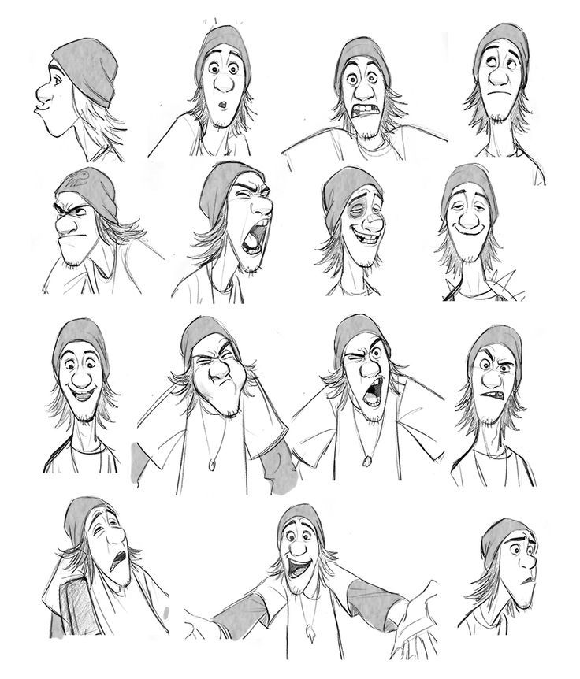

_Fred from Big Hero 6_

_Loish Gold Eyes_

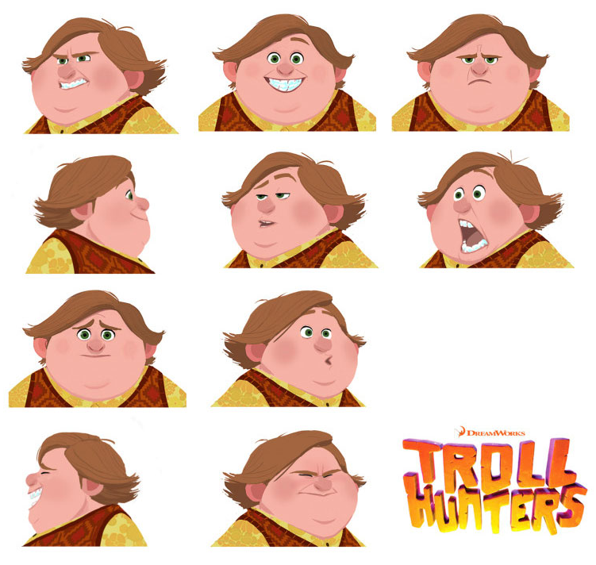

_Troll Hunters_

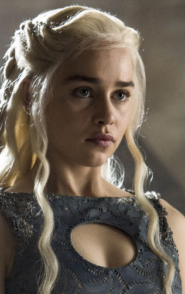

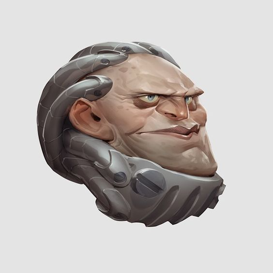
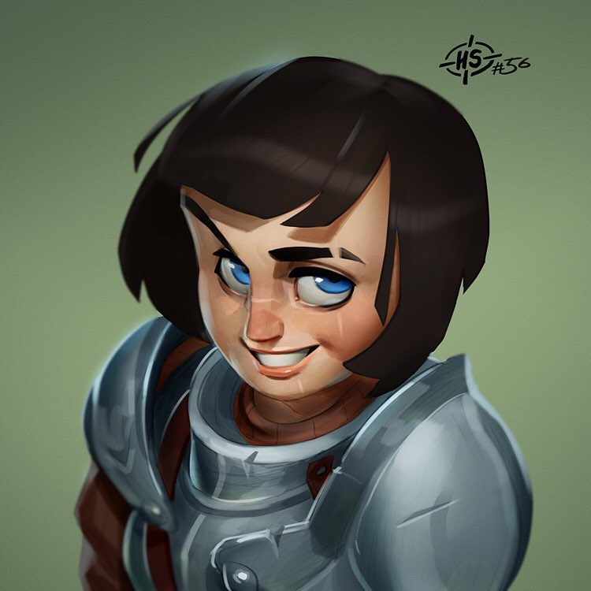
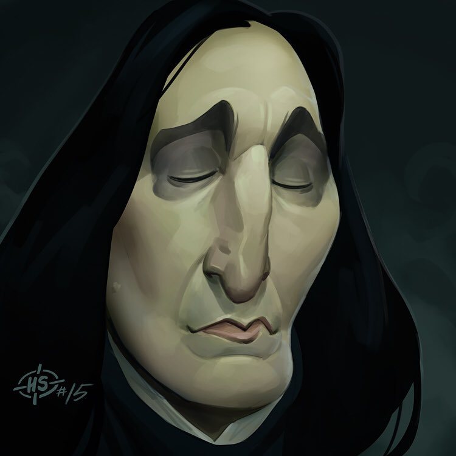
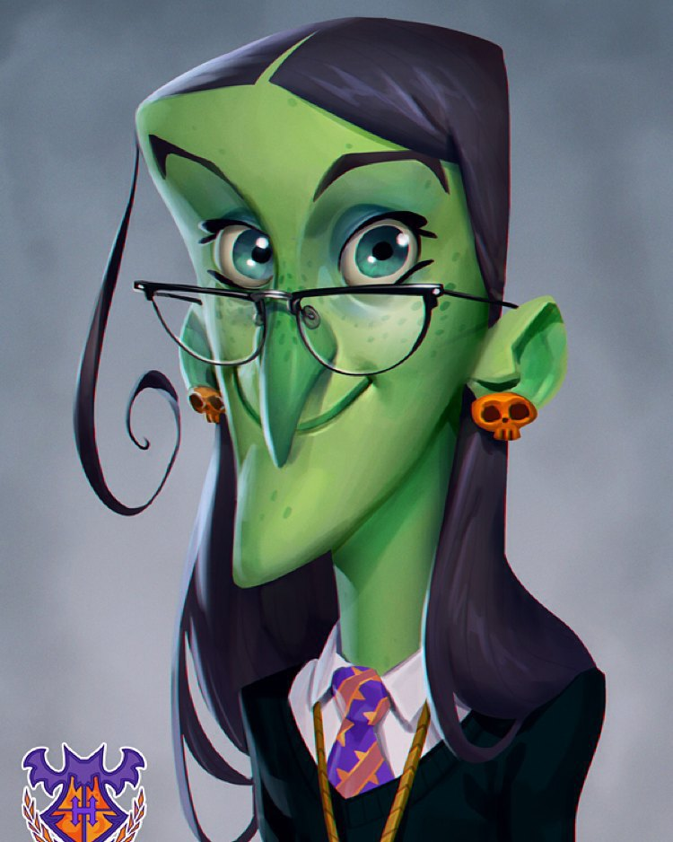

_Various by Max Grecke - [Link](https://www.instagram.com/maxgrecke/?hl=en)_

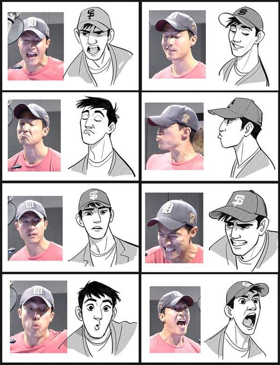

_Stylising from life in Big Hero 6_

---

## Reference

Planes of the head pureref. 3D skulls. Lots of eyes and noses and ears.

---

## 3D Cartoony Style Ref

_Conan by Airborn Studios - [Link](https://www.artstation.com/artwork/Bm0Y9)_

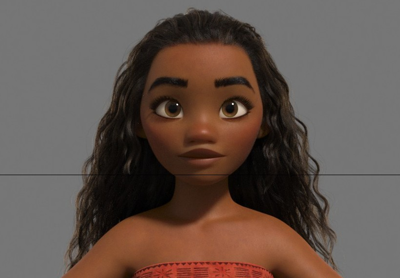

_Moana Look Dev - [Link](https://www.artstation.com/artwork/0ygdG)_

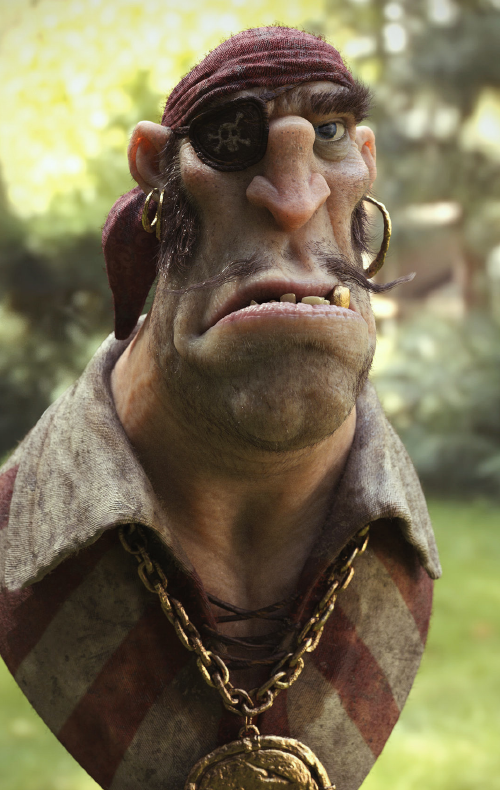

_Pirate by Pedro Conti - [Link](https://www.artstation.com/artwork/VddK5)

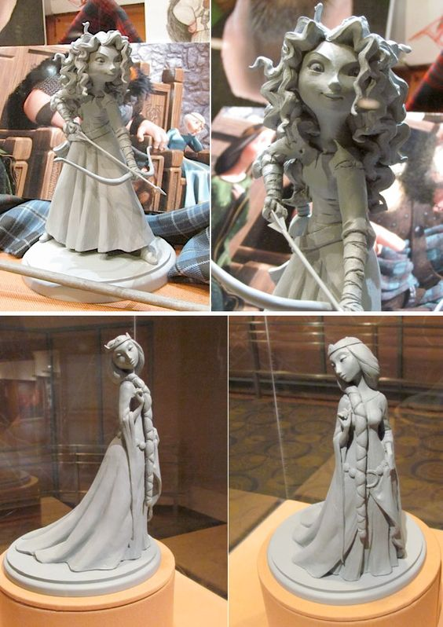

_Merida and Queen Maquettes from Brave - [Link](http://www.theconceptartblog.com/2012/02/09/esculturas-dos-personagens-do-filme-brave/)_

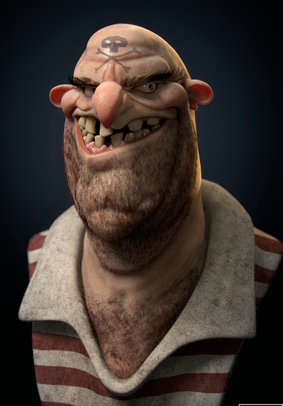

_Pirate by Vincent Dromart - [Link](https://www.behance.net/gallery/31073985/Pirate)

_Chef Skinner, Ratatouille by Pixar_

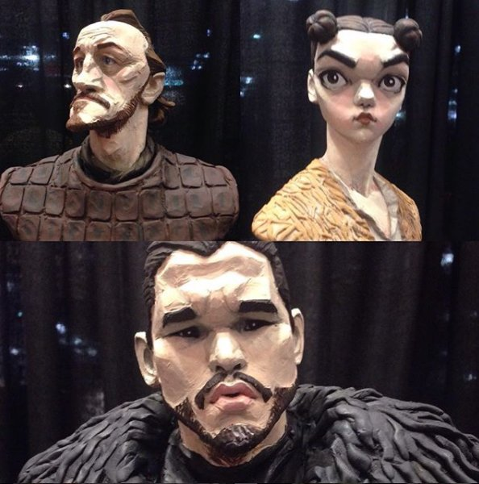
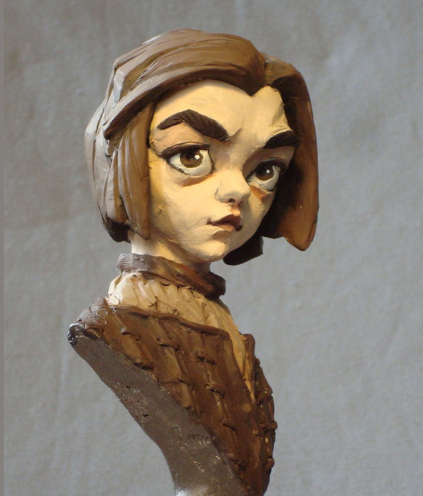

## Sculpting Timelapses

[Conan Timelapse](https://www.youtube.com/watch?v=L6kYhShKXKY)

[Black Cat DVa Cosplay Timelapse](https://www.youtube.com/watch?v=R9se6h_MFCk)

[Pirate Block In](https://vimeo.com/82019501)

## Sculpting Streams

[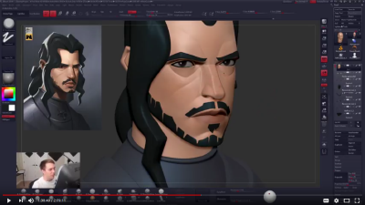](https://www.youtube.com/watch?v=0Dg7c1ClQ1A&t=493s)
[John Snow Stream with Follygon](https://www.youtube.com/watch?v=0Dg7c1ClQ1A&t=493s)

Disclaimer: Snow thumbnail is from stream two. Link is to stream 1 (3 hours) initial build. Stream 2 has detailing.

## Base meshes

Helpful bust mesh. Offer cartoony or real