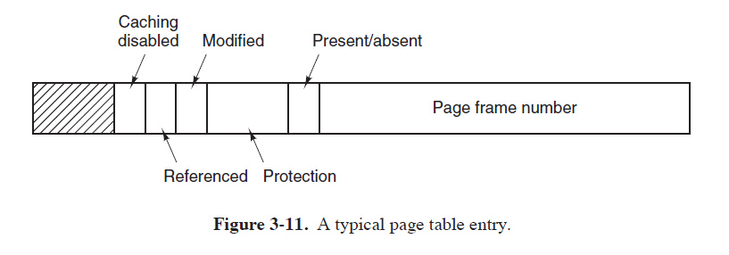
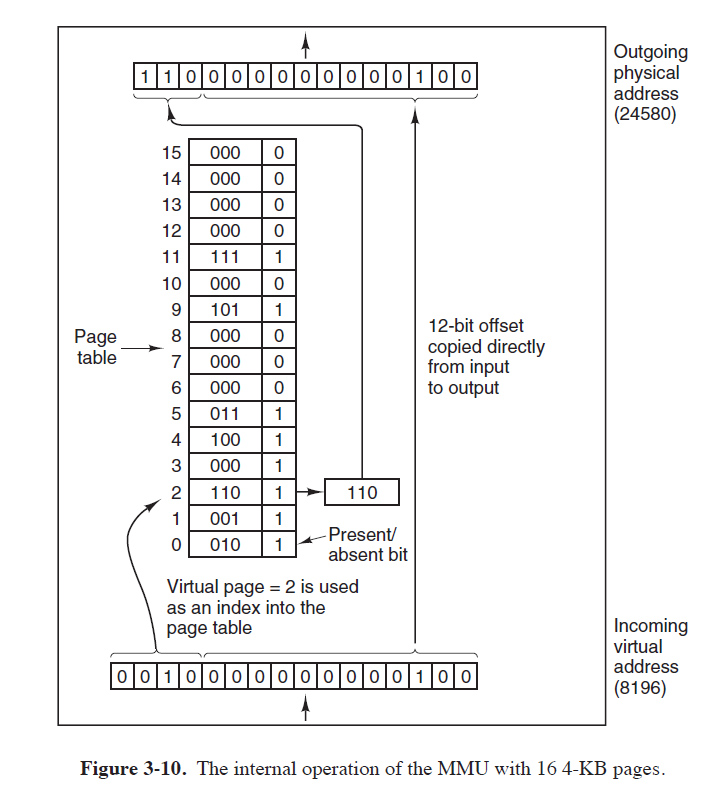

#Week 12

## Page Tables
A page table contains entries for all memory pages.  
  * like cache entries, page table entries are indexed by a part of the virtual memory address
  * The rest of the entry gives you the offset into the page where your address lies.
  * It has a bit for present in memory/absent
  * It also had info on whether a page has been accessed or modified while in memory (not on disk)
  * You have no direct way of looking for addresses, you go via the page table for any virtual address.

_The mmu uses the page table index like it uses a cache index.

## Translation Lookaside Buffer

If we have to go to the page table for every address, that's slow, since the Page Table is _in memory itself_, meaning two memory hits instead of one every time something isn't in the cache.

> 1: Go to memory (300 cycles) to access page table
> 2: Convert to physical address with mmu
> 3: Go to memory and get your data/instruction(300ish cycles)

**How do we avoid going to memory usually? With a cache**. We keep the data from a certain amount of addresses. So why isn't there a cache holding some page entries from the page table? 

There is, it just has a weird name **Translation Lookaside Buffer**.
> * Holds Page Table entries (not data/instructions, that's the cache) 
> * 1ms access time, lives next to the address translation unit just like the regular cache.  
> * multiple levels of them, getting larger and slower each time, just like L1, L2, L3 cache.
> * Top level is 64 entries. Not many given 4K page sizes, but it's enough.

## Page tables for large memories

The top table acesses other tables to get further.
___

## Page Replacement

1. A process requests a page that isn't in memory.
2. You're goint to need room for it. 
3. That means you have to evict a page.
4. Decision..
5. Pages are going to be upset.
6. Policy!
   
Just as in the memory cache, each  choice comes with a cost and a benefit. 

___

### The impossbile dream
If you tag each page with the milliseconds from now till the time it will finally be called on, the page with the highest number is the obvious candidate.
 * Basically if your patron is coming for you last, you're out.
 * Something is wrong with this solution. What?
 * Yet it's actually useful. How?

___

### Not Recently Used

Not that popular. Technically someone invited you, but she hasn't talked to you all night. 

> **QUESTION**
> How do you measure tiers of unpopularity?

  - 0 not referenced, not modified
  - 1 not referenced, modified 
  - 2 referenced, not modified
  - 3 referenced, modified

**Trash tier expulsions:** 
* Random 0 class page is asked to leave.
* Better to remove modified but unreferenced than one heavily referenced (Useful in the past, but now?) 
* A page typically has about 20ms before it's deemed unpopular.

___

### FIFO

Like a supermarket kicking out the oldest product whenever a new one comes in. Might remove mustach wax and thalium based rat poison, but also bread and salt.

___

### Second Chance

It's FIFO but at the last minute you check to see if anyone has bought mustach wax or bread lately. 

* With memory pages that means the **R**eferenced bit is set - it's recently referenced. 
* If so you wipe the **R** and put it back at the start of the queue.
* If it comes back, with R unset, it goes out with the whale-oil.

### Working Set Replacement

Get this.
Here is where thrashing happens.

## Segmentation
Programs can be:
* Spread around memory
* Partially in memory and partially on disk.

> **QUESTION:**
> Along what lines can the program be split, and what is indivisible?

Answer that, because that's segmentation too.