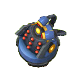
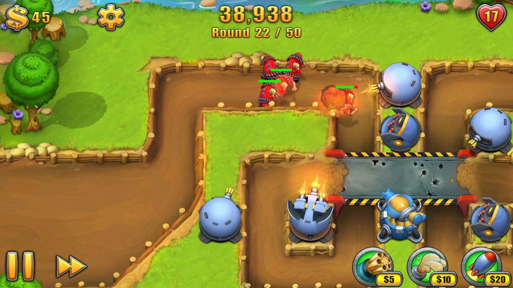
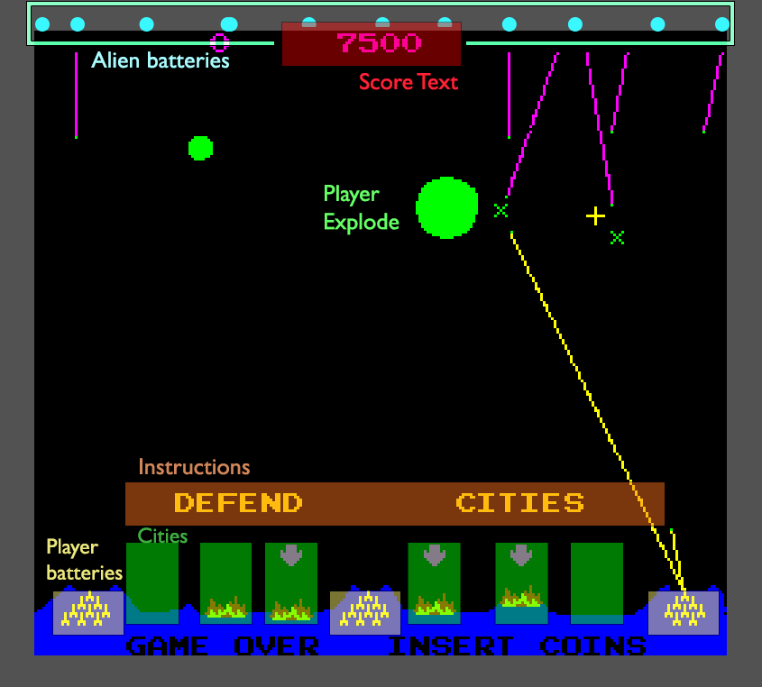
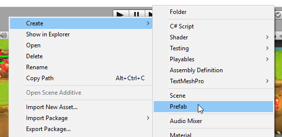

# Week 10 - Finding things, Reusing things, messaging

Very powerful tools this week.
<!-- @import "[TOC]" {cmd="toc" depthFrom=1 depthTo=6 orderedList=false} -->

<!-- code_chunk_output -->

* [Week 10 - Finding things, Reusing things, shooting things](#week-10-finding-things-reusing-things-shooting-things)
	* [Todo before next lecture](#todo-before-next-lecture)
	* [Resources](#resources)
	* [Laying out our game](#laying-out-our-game)
		* [Figuring out the things in our game](#figuring-out-the-things-in-our-game)
		* [A partial list of them](#a-partial-list-of-them)
	* [Practise laying out a scene](#practise-laying-out-a-scene)
		* [Resolution](#resolution)
	* [Prefabs](#prefabs)
		* [Changing prefabs](#changing-prefabs)
		* [Individualising prefabs](#individualising-prefabs)
		* [Instantiating prefabs in code](#instantiating-prefabs-in-code)
	* [Finding the scene things](#finding-the-scene-things)
		* [Inspector variables](#inspector-variables)
		* [Creating things](#creating-things)
		* [Events](#events)
		* [GameObject find methods](#gameobject-find-methods)
		* [Find By Name](#find-by-name)
		* [Find By Tag](#find-by-tag)
		* [Find By Type](#find-by-type)
		* [Singleton](#singleton)
	* [Talking to and commanding things](#talking-to-and-commanding-things)
		* [`SendMessage`](#sendmessage)
		* [`BroadcastMessage`](#broadcastmessage)
		* [Events](#events-1)
		* [GetComponent and call functions](#getcomponent-and-call-functions)
	* [A longer list of attributes of our classes](#a-longer-list-of-attributes-of-our-classes)

<!-- /code_chunk_output -->


## Todo before next lecture

* Lay out sprites on your game stage. Set your resolution.
* Create a bunch of classes
* Practise SendMessage, BroadcastMessage
* Make useful prefabs (missile batteries, missiles, cities etc)
* Update your Hacknplan to reflect all the new knowledge you have and the tasks it suggests.

## Resources

* Pics for unity project
  - 
  - 
  - 
  - 
  

## Laying out our game

Sometimes we can't solely create everything in our game model/manager and adjust the stage to suit. It's handy to lay out things visually.

### Figuring out the things in our game

First here's a drawover of things we might see in this game. This picture isn't just a lecture aid, I'll draw over a design like this to see the game world itself, rather than the final graphics. Remember we're simulating a world, and the job of the graphics is to communicate that world. How will that world be structured? 



>Luckily you don't have to be an coder to figure out the things in your game: just a gamer. Imagine the game playing, and think about the things that happen. Write down the things that do those things.

___

### A partial list of them

* alienBatteries
  - Grouped under stomething? Select a subset of arranged points, or generate random ones? Or pull from a level definition?
* playerBatteries
* cities
* AlienMissile
* PlayerMissile
* Planes
* ScoreText
* DefendPrompt

Later we'll look at how to find and these pre-layed-out elements. First we need a scene to work with.
___

## Practise laying out a scene

* Create Unity 2D project PrefabBits
* Make Sprites and Scripts folders in Assets
* Save images (above in resources) to Sprites folder
* Drag images from project window to stage


_I photoshopped out some towers, we'll add them back_

### Resolution

* Set our resolution so we have consistency.
  - File -> Build settings -> player settings
  - 1280x720 to match our bg 
* Set the pixel density of our various sprites
  - click sprites in the Sprites folder, import properties show in inspector
  - set 72 pixels per inch (common digital screen res)
  - apply
* Scale buildings
  - 1.5x x, y, z. They'll pretty much match the ground now.

___

## Prefabs

Take things you've built in the scene from parts and scripts, then reuse them.

* Make a new folder: Assets -> Prefabs
* Create->prefab
* Drag a thing from the scene heirarchy onto it.
* The thing in the scene is now an instance of the new prefab (text turned blue)
* Drag another from assets/prefabs to the stage to see it


_creating_


_duplicating or dragging from Assets

### Changing prefabs

Getting into our prefab and editing, propagating.

### Individualising prefabs

Do things have to all be the same? Is conformity the cost of reusability?

No, we can change our individual prefab instances a bit, and not apply the change. This is a deeper topic, so look into it and explore.

### Instantiating prefabs in code

Yes, you can spawn prefabs. That's one of their main use: peach trees, missiles, cherry pies, cherry pie customers, these are all things we'll be constantly spawning.

Lets look it up the details together. Google is our friend.
___

## Finding the scene things

There are quite a few things, and this isn't the dark ages so we want to use our visual layout from unity for position info at the very least.

> We can look at the objects, as placed, and get their position or any other info they contain. There are a number of ways.

Some of these were covered in the video I asked you to watch last week. If you did watch it you'll have the benefit of further engraving it into your memory, along with some new examples.

### Inspector variables

`public vector3 thingTransform` or `[SerializeField]` are familiar friends since weeks 2/3. 

### Creating things

If an object creates another, like we did with our Test and Player classes, it keeps a reference in a variable. That won't work for outside objects.

### Events

We can listen for events, and objects can pass us information, whole components, or their whole selves (`GameObject gameObject`).

### GameObject find methods

The GameObject offers a number of static methods that are very powerful. Those methods help it to act a bit like a higher level game manager that already has lists of everything in our game. **It can find them by name, tag, category and more**.

> GameObject find methods are slow/resource intensive. They're not something you do every frame. If you're going to use them, do it during awake or sleep and cache the results in a local variable.

### Find By Name

Search by the name in the inspector.

```cs
GameObject.Find("MissileTower_charlie");
```

### Find By Tag

Tags can be created and applied in unity as a way of grouping things without requiring other similarities to rely on (like sharing a component type). 

```cs
GameObjects[] spawnPoints = GameObject.FindObjectsByTag('Spawn');
```

### Find By Type

Searching by type is super handy: if you're looking for all your lightning towers, or any damageable items, just search for anything with that component.

I'm not sure how it goes with Polymorphism and finding LightningTower while looking for Tower, so we'll google it together.

```cs
GameObjects[] towers = GameObject.FindObjectsOfType<BaseTower>();
```

### Singleton

You can now probably see the benefit of a singleton. Access objects in the scene from anywhere. It's sort of like GameObject and the find functions, but you are making it from scratch and can structure it to your needs, along with custom functions.
That singleton of course will have to find all the objects too, using techniques above and others, but it does all of that and all other objects grab from it.

```cs

GameObject battery_1 = GameManager.instance.Batteries[GameManager.BATTERY_1];

```
___


## Talking to and commanding things

Once you have your list of objects, we know we can get info from them by accessing their components (monobehaviours) and the variables we exposed. We can call functions on them. But how else can we inform and command objects 

### `SendMessage`

If you have a reference to a gameObject you can ask for a function to be called on any monobehaviour it has. This is useful if multiple components on one object with the same function, say `Update()` or `ApplyTeamColour(TeamColours.GREEN))`, or you want to make things Damageable with component, so they can `TakeDamage()`. 

This is handy for building things up in a modular way using components.

> <//https://docs.unity3d.com/ScriptReference/GameObject.SendMessage.html>

```cs
// More info in the unity docs
using UnityEngine;

public class Tester : MonoBehaviour
{
  public GameObject structure;

    void Start()
    {
        // Some structures are damageable, if they have a 
        // Damageable component. Try to do damage:
        structure.SendMessage("TakeDamage", 20);
    }
}
```
Here are components you'll find on the structure.
```cs
public class Damageable : Monobehaviour
{
  private int _health;

    // A public function that can 
    public void TakeDamage(float damage)
    {
      Debug.Log("Ow. Seriously, " + damage + " damage?");
      _health -= damage;
      // You can call sendmessage on other gameObjects or the current one.
      // If there's a component on this unit/structure that can change the visuals on damage, call it.
      gameObject.SendMessage(ShowDamage()); 
    }

    public int Health
    {
      get { return _health; }
      private set
      {
          // Prevent health going below 0.
          // If (value >= 0) _health = value, else health = 0 
         _health = (value >= 0) ? value : 0;
      } 
    }

}

public class DamagedArtController : Monobehaviour
{
  public void ShowDamage()
  {
    // swap the sprite, jump to an animation frame,
    // start particle smoke etc
    Debug.Log("showing damage");
  }
}
```
### `BroadcastMessage`

Similar deal to `SendMessage`, but it applies it to all components on the current object _and any child objects_ - anything in the scene heirarchy that this object is parent to. Note this function is local to the `Component/MonoBehaviour`, we don't need to use the `gameObject`.

> <https://docs.unity3d.com/ScriptReference/Component.BroadcastMessage.html>

```cs
using UnityEngine;

public class Tower : MonoBehaviour
{
    void Start()
    {
        // Make sure nothing is firing or tracking till round starts
        BroadCastMessage("SetStatus", GameUnitStatus.READY_INACTIVE)
        // Listen for the level/round to start
        GameController.OnRoundStart += OnRoundStartHandler;
    }

    void OnRoundStartHandler()
    {
      // Any turrets/zappers components on this object or it's children start tracking and firing
      BroadCastMessage("SetStatus", GameUnitStatus.ACTIVE)
    }
}
```

### Events

As we've already already used, and seen in the example above (BroadcastMessage).

### GetComponent and call functions

As we did with `SpriteRenderer.Sprite`. We can call these on current gameObject or on ones we have a reference to.

```cs
  void ExplodeAThing(GameObject thing)
  {
    thing.GetComponent<Explodeable>().Explode(); 
    // IRL we'd check the result of GetComponent before calling Explode
  }
```
___

## A longer list of attributes of our classes

**PlayerBattery**
  - position
  - capacity
  - MissileCount
  - Id (1, 2, 3. Match mouse button)
  - isOnline
  - collider

**AlienBattery**
  - position

**City**
  - position
  - isDestroyed
  - collider

**AlienMissile**
  - start Pos
  - Direction/angle
  - Speed
  - Trail
  - OnLaunched
  - OnHitSomething
  - explode
  - collider

**PlayerMissile**
Prefab with long tail rect with emissive mat
 - start Pos
 - StartBattery
  - Direction/angle
  - Speed
  - Trail
  - OnLaunched
  - OnHitSomething
  - explode
  - collider

**Plane**

**ScoreText**


