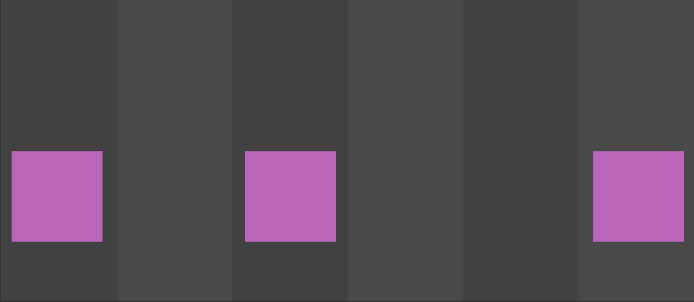
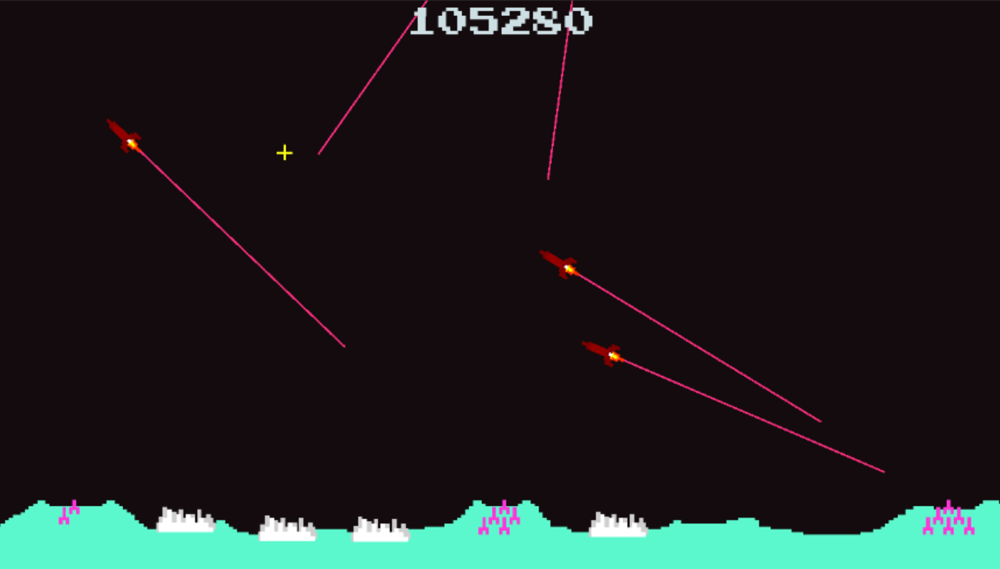
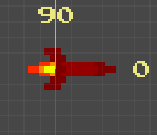
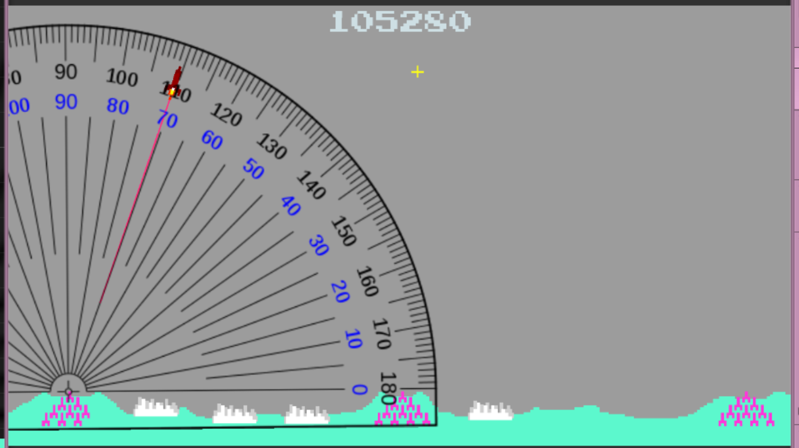
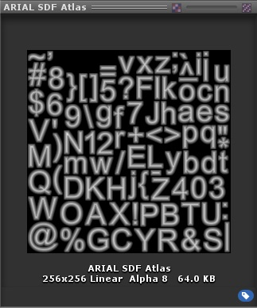
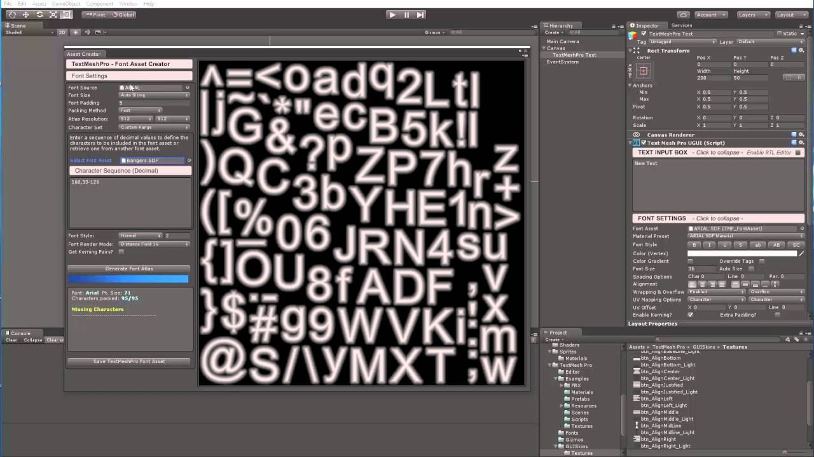

---
html:
  embed_local_images: false
  embed_svg: true
  offline: false
  toc: undefined
export_on_save:
  html: true
---
# Week 11 - Time, text, collisions

Hitting as many useful assignment-finishing tools as we can.


<!-- @import "[TOC]" {cmd="toc" depthFrom=1 depthTo=6 orderedList=false} -->

<!-- code_chunk_output -->

- [Week 11 - Time, text, collisions](#week-11---time-text-collisions)
  - [Todo](#todo)
  - [Resources](#resources)
  - [Fixed demo: aiming.](#fixed-demo-aiming)
    - [Class diagrams of that demo](#class-diagrams-of-that-demo)
  - [Missiles and Targets](#missiles-and-targets)
    - [Moving at a given speed](#moving-at-a-given-speed)
  - [Missiles come in waves in each level](#missiles-come-in-waves-in-each-level)
    - [Psuedocoding the waves](#psuedocoding-the-waves)
  - [Doing things over time](#doing-things-over-time)
    - [Things that need timing](#things-that-need-timing)
    - [Ways to time](#ways-to-time)
    - [Invoke](#invoke)
    - [Update and time.deltaTime.](#update-and-timedeltatime)
    - [Coroutines](#coroutines)
    - [Sliding Squares](#sliding-squares)
  - [Missile explosions](#missile-explosions)
    - [Hitting things](#hitting-things)
  - [Scoring/Displaying text](#scoringdisplaying-text)
    - [Adding UI canvas and text](#adding-ui-canvas-and-text)
    - [Editing TMP text in script](#editing-tmp-text-in-script)

<!-- /code_chunk_output -->


## Todo

* Finalise, as much as you can, keep working in git
* Game should be basically done by next class.

## Resources

Code: 
  - My coroutines demo project: <https://github.com/dmcgits/gpr103_week11>
  
  

Collisions:
  - Official docs https://docs.unity3d.com/ScriptReference/MonoBehaviour.OnCollisionEnter2D.html
  - Colliders and triggers https://youtu.be/RxG7YYEdmVE

Timers:
  - Blog tute: [Build a reusable timer](https://medium.com/@jaredehalpern/build-a-reusable-timer-in-unity-to-control-explosions-and-other-fun-stuff-too-1689210b733)
  - Docs: [StartCoroutine](https://docs.unity3d.com/2017.4/Documentation/ScriptReference/MonoBehaviour.StartCoroutine.html)
  - Docs: [Waiting for game seconds](https://docs.unity3d.com/2017.4/Documentation/ScriptReference/WaitForSeconds.html)
  - Docs: [Waiting for real world seconds](https://docs.unity3d.com/2017.4/Documentation/ScriptReference/WaitForSecondsRealtime.html)

DoTween: 
  - Documentation <http://dotween.demigiant.com/documentation.php>

TextMeshPro:
  - Unity Blog: <https://blogs.unity3d.com/2018/10/16/making-the-most-of-textmesh-pro-in-unity-2018/>


## Fixed demo: aiming.

  - Fixed the aiming demo I made in the Ultimo class using old fashioned trig
  - Repo: <https://github.com/dmcgits/gpr103_Week10>



### Class diagrams of that demo

Visual studio class diagrams are great.

## Missiles and Targets

When we spawn an alien or human missile, it needs to rotate toward a target.

We orient sprites to the right when they're at zero. It feels wierd 90 points straight up. It is familiar though: in trigenometry we figured out the sides or angle of elevation in a triangle at the origin of an x-y plan. As the hypotenuse of the triangle rose from the x axis and rotated toward the y, our triangle's angle crept from 0 up to 90. Also, that tells us rotation is anti-clockwise.

* You want a sprite to point at things properly when rotation (theta θ) is applied: lie them along the x axis. 
* Also **use the Sprite Editor to set the pivot point** of your rocket near where the hot gases are exiting.



> Aiming it requires a target (mouse position in world space during click, see lecture 5 project i think), our rocket's position, and some math using **distance, degrees to radians and atan2. Google some of those** with the usual "unity c#" keywords added.



---

### Moving at a given speed

2D objects can't use transform.forward, because that's the Z axis. Use transform.right.

Use deltaTime (time since last frame) adapt your movments to the changing length of time each frame runs for. This will avoid jittery movement.

```cs
// MissileAlien
void Update()
{
  // Right is the x axis in trig. We travel along that.
  // Any rotation of the object is applied after position, so
  // we'll go whatever way the thing is pointing.
  transform.position += transform.right * Time.deltaTime * _speed;
}
```
---
## Missiles come in waves in each level

A level in Missile Command consists of _n_ wave of missiles, where _n=5_ last time I checked. It might vary?

* Within each wave you spawn _n_ missiles. 
* It's just a matter of knowing how many you want to launch, from what point in space, and in what direction. 

> You could handle these waves in a special `LevelManager`, directly in a large `GameManager`, in a `GameModel`: Choose the structure you understand best and think you have time to finish.

___

### Psuedocoding the waves

Here's one way to break it down. **It's just the missile firing and tracking loop,** without collisions, scoring, a "click to play" or final game over stats. All those can come **once I have missiles in the air.** 

You might think of a better way, or just one that suits you better.

```
//////// LevelManager -

A MissileShot has a launch angle and position
A Wave has all the missile shots for one wave and a duration
A Level has all the waves for a level
A list of levels exists

When asked to:
  
  grab next level from list
  while there are waves left in level
    
    for each MissileShot
      create an alien missile from a prefab, add to a list
      add listener for demise of any missiles, which removes from list
      Rotate and position it accordingly
      Fire it
      Publicise the info with a link to the missile
      
    Wait for wave duration

  loop for remaining waves

  while there are still missiles in list
    listen for and remove any remaining missiles
  loop while
  announce level complete

//////////////// Game Manager/Model:
start game

While player isn't dead
  Ask Level Manager to kick off a level
  Listen for level complete
  Show results of level, wait a bit
loop

show final result.
play again?
```
---

## Doing things over time

We've all played games where time is critical. Time to finish a level, time per lap, time to get out of a space station before it blows.

Timings affect us in lots of other scenarios. Cooldown times, facility/vehicle upgrade and repair times, rounds fired per second.

### Things that need timing

Potential things that need timing

> - From press play 
> - From level finish (last missile destroyed) till next level, showing results
> - From game over till game over graphics appear, play out and show play again or return to home screen

How do we specify a series of times, say:
 1. 0s
 2. 1.3s, 
 3. 3.1s

### Ways to time

`Invoke`, counting time in `Update()`, `StartCoroutine` and more.

### Invoke

Invoke will call a function after a given delay. This doesn't pause your program like sleep would in c++. Execution continues.

From [Stack Overflow](https://stackoverflow.com/questions/30056471/how-make-the-script-wait-sleep-in-a-simple-way-in-unity)
```cs
void Start()
{
    Invoke("feedDog", 5);
    Debug.Log("Will feed dog after 5 seconds");
}

void feedDog()
{
    Debug.Log("Now feeding Dog");
}
```
---

### Update and time.deltaTime.

Basically counting time as update executes over and over. Then after a certain time, doing something. 
* This is okay for the same thing happening at intervals.
* A sequence of things happening with various timings gets trickier/messier. Maybe a combo of a list and a function?

From [Stack Overflow](https://stackoverflow.com/questions/30056471/how-make-the-script-wait-sleep-in-a-simple-way-in-unity)
```cs
float timer = 0;
bool timerReached = false;

// Modified from stackoverflow a little
void Update()
{
  if (!timerReached)
    timer += Time.deltaTime;
    if (timer > 5)
    {
      Debug.Log("Done waiting");
      feedDog();

      //Set to false so that We don't run this again
      timerReached = true;
    }
  }
}

void feedDog()
{
    Debug.Log("Now feeding Dog");
}
```

### Coroutines

What if we could pause a function and come back to it after a given interval. That way our timed things could all be encapsulated in one function, and we could do stuff while it's paused. A coroutine is a function, but it's also a similar to a process that can be stopped and started, returning control to our main execution.

### Sliding Squares

Squares arrive in waves of different colours, using differing lane combos.


_The [sliding squares demo](https://github.com/dmcgits/gpr103_week11) has a lot in common with missile wave launches_

#### More Waves with a coroutine

Also,From [Stack Overflow](https://stackoverflow.com/questions/30056471/how-make-the-script-wait-sleep-in-a-simple-way-in-unity)

```cs

private List<float> _times;

void Start() {
  SpawnWaves();
}

// Regular old routine kicking off a special routine, one that can stop and start.
void SpawnWaves())
{
  // A list of intervals to wait. 0s for first, 4s for second, and so on.
  List<float> times = new List<float>() { 0.0f, 4.0f, 2.5f, 6.0f };
  
  StartCoroutine(ReleaseWaves(times));
  Debug.Log("This line will run right away");
}

// The unity engine needs to track these coroutines so we can do
// things like start and top them. They need to be of type "IEnumerator"
// for it to do that.
private IEnumerator ReleaseWaves(List<float> waitTimes)
{
  // For each number of seconds to wait
  foreach (float waitTime in waitTimes)
  {
    // Stop this function running until waitTime has ended
    yield return new WaitForSeconds(waitTime);
    // Then this code will run. Here's where I'd spawn all the missiles
    // in this particular wave, if I had a list of positions and angles.
    Debug.Log("Waited for " + waitTime + " seconds");
  }
  Debug.Log("Releasewaves done, signing off");
  // Call yield break; to end function, much like return
  yield break;
}

```
---

#### Side notes on coroutines and threads for the curious

I didn't discuss threads above, but Unity c# does provide them.

**Coroutines**: multiprocessing/multitasking within the main game engine loop/thread. Doesn’t establish a system thread.

* **Pro**: doesn’t risk race conditions, threads corrupting data, easy to follow, allows multitasking. Before multi core processors and multithreaded applications,all multitasking was achieved like this. Most games still rely on single core performance like this.

* **Con**: not a true thread so can’t run on a separate core for performance boost, will bog down all code if heavy

**Coroutine and thread use cases**
**Coroutines:** most simple timed operations inside component
**Threads:** long intense operations like file save. Also used at higher levels for AI, path finding. If you’ve studied threading. They are simple in concept and stupendously complex to syncronise/manage in real life. The bugs they generate are capricious in the extreme.

---


## Missile explosions

* spawn where our rocket stops (ie where we clicked)
* grow over time, with a collider, and listen for impacts.
   
Explosions can be grown
* with unity animation tools
* Lerp(linear interpolation/tweening)
* just scaling over a series of frames in Update.

---

### Hitting things

Unity has a built in physics engine for this. We'll use it just to check if one sprite has contacted another, but not sign up for the actual physical action and reaction.

* Both objects need to have a `RigidBody2D` component
* also a collider such as `BoxCollider2D` or `CircleCollider2D`. Add them via the inspector
* set their Rigidbody Body Type to Kinematic
* enable "Use Full Kinematic Contacts". This lets us check for intersection of colliders without the smash and bounce.

Any object with the setup above will have `OnCollisionEnter2D` called  if you define it. `Collider2D collision` will be passed in, filled with info about the collision and its participants.

```cs
// In MissileAlien component
void OnCollisionEnter2D( Collision2D collision )
  {
    Debug.Log(gameObject.name + " 2D Collided with " + collision.gameObject.name);
    
    // Use collision.GetContact to grab the collision point, 
    // Code here to instantiate AlienExplosionPrefab at that point
    // Maybe throw an event about collision, passing the collided object?
  }

```

## Scoring/Displaying text

We're used to text being an everyday thing in our apps. Word, web browsers, photoshop and so on. But these are inherently 2D apps. How are fonts drawn in a world of polygons and textures?

Traditionally:
1. Use an image editor to **place all the characters and symbols you want in a bitmap**
2. Arrange them all to fit in a power of 2 square (256x256, etc)
3. **Define rectangles for each letter** in your game engine
4. Create a material with the font atlas as a teture
5. For each letter in a string **generate a quad with UV coordinates** to match the letter's rectangle, add the font material.



That's a lot of work. So someone made TextMeshPro for Unity, and Unity bought it.

> TextMeshPro has an atlas generator for the first 3 steps, and components for the rest.




### Adding UI canvas and text

Unity UIs are contained within a component called a **canvas**. It does a lot, including fitting our UI to our window and adapting to resolution changes.

* Creating a UI Canvas
* Creating tex mesh pro (TMP) label


### Editing TMP text in script

```cs
// Code from unity incoming

```
---

