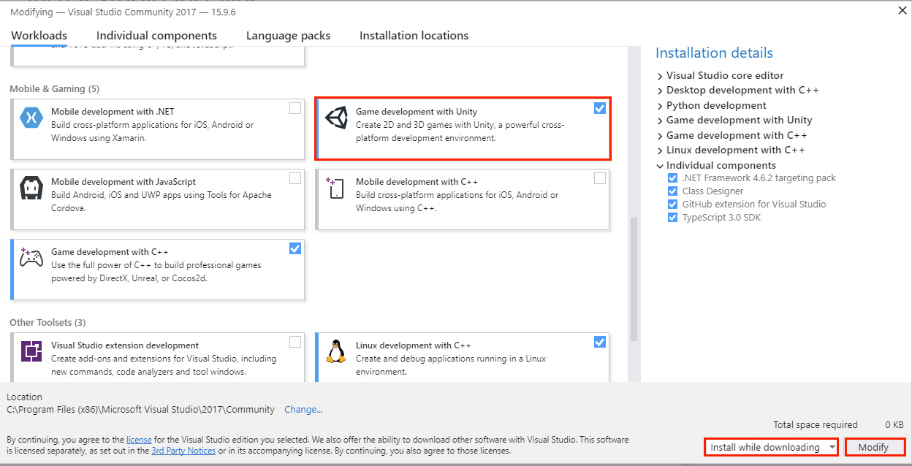

# GPR103 Week 1

Welcome, Object Oriented Design, C#


<!-- @import "[TOC]" {cmd="toc" depthFrom=1 depthTo=6 orderedList=false} -->

<!-- code_chunk_output -->

- [GPR103 Week 1](#gpr103-week-1)
  - [Part 1 - Studying 2D Games Programming](#part-1---studying-2d-games-programming)
  - [Who are we?](#who-are-we)
  - [How will we make 2D games?](#how-will-we-make-2d-games)
    - [C++?](#c)
    - [Unity, C#?](#unity-c)
    - [Visual Studio Community](#visual-studio-community)
    - [Dammit Jim! I'm a programmer, not an artist.](#dammit-jim-im-a-programmer-not-an-artist)
    - [Dammit Jim! I'm an artist, not a programmer!](#dammit-jim-im-an-artist-not-a-programmer)
  - [Hour splits and thriving in 2D Games Programming](#hour-splits-and-thriving-in-2d-games-programming)
    - [Blackboard is your friend](#blackboard-is-your-friend)
    - [My notes are your friends](#my-notes-are-your-friends)
  - [Assessments](#assessments)
    - [Assessment 1 - Programming exercises](#assessment-1---programming-exercises)
    - [Assessment 2 - Character customiser](#assessment-2---character-customiser)
    - [Assessment 3 - Missile Command](#assessment-3---missile-command)
  - [Part 2: Programming and Unity](#part-2-programming-and-unity)
    - [Installing Unity](#installing-unity)
    - [Installing Visual Studio](#installing-visual-studio)
  - [Hello world.](#hello-world)
    - [Inheritance vs Composition](#inheritance-vs-composition)
    - [First, GameObjects](#first-gameobjects)
    - [Creating Objects vs Components/Monobehaviours](#creating-objects-vs-componentsmonobehaviours)
  - [Inheritance and Composition work together in Unity](#inheritance-and-composition-work-together-in-unity)
    - [Cohesion and Coupling](#cohesion-and-coupling)
  - [Part 3: Exercises](#part-3-exercises)

<!-- /code_chunk_output -->

## Part 1 - Studying 2D Games Programming

Exploring 2D games programming.

> * Core concepts of game programming
> * Structuring a project
> * `C++` or `Unity c#` options
> * Required knowledge: you should have basic programming knowledge and have written code in an object oriented language. 
> The good news is, if you struggled with `C++`, you'll find `c#` much more welcoming.

---

## Who are we?

**Me:** Danny McGillick. Computer Science @ UTS, Web dev, Creative technologist in advertising (flash/actionscript, unity), 2D and 3D artist for Torus, Halfbrick, Blowfish studios. Keyboard enthusiast, bits maker.

https://cargocollective.com/dmac/ - advertising
http://www.artstation.com/dmacdraws/ - game art

**You:** The next makers with long futures.

---

## How will we make 2D games?

Two options:
* Unity engine and _C#_. This is what I'll teach in class.
* _C++_ in Visual Studio with an _SFML_. An option for those who have c++ experience and great optimism.

---

### C++?

* Big-time game engines are written in _C++_, _C_.
* Fast, low level.
* No game making tools by default.
* You can use _Simple and Fast Multimedia Library (SFML)_, a library to provide windowing, graphics, audio and networking functionality.

```c++
// c++ main function
int main()
{
    cout << "Battle Royale Game." << endl;
}
```


SFML tutes and downloads for all platforms - _https://www.sfml-dev.org_

---

### Unity, C#?

A full 2D/3D game development IDE with models, sprites, physics, sound, input, c# scripting, cross platform building and more. For free.

```c
// Unity Start function
void Start()
{
    Debug.Log("Battle Royale Game");
}
```


_Unity IDE_

---

### Visual Studio Community

Either way, you'll need Microsoft Visual Studio Community. Not to be confused with Visual Studio Code.


___

### Dammit Jim! I'm a programmer, not an artist.


That's okay, we're here to focus on the building of games. The [asset store](https://assetstore.unity.com/categories/2d) is full of sprites for people like us.


___

### Dammit Jim! I'm an artist, not a programmer!
 


Unity makes programming life a lot easier than starting out in C++.

* No compiler, command line! Very visual.
* Unity's API/engine does most of the dirty work, we just have to order it around.
* Drag and drop used for lots of things you'd normally have to manage in code.
* Code can run in the editor each time we save and scripts can be disabled with a check box. Testing becomes much easier.


---

## Hour splits and thriving in 2D Games Programming

> **30%** class hours.
> **70%** studying, programming, gaining experience. 

The benefit of these courses comes from putting in work between classes. What we learn in class won't stick if you don't work and experiment at home.

### Blackboard is your friend

Find assignment briefs, due dates, slides, programming tutes/samples and much more. 

> Digging through Blackboard material is the second key to coming out ahead in these subjects, just below coding at home.


_Grab the subject outline and subject planner_


_Every subject has modules in the left menu. Click one for important info_


_The blue button, top of screen, takes you to more info and resources. Don't skip the learning resources_

### My notes are your friends

The original course notes are in powerpoint, and available from the module pages in Blackboard. I write up new ones (like the one you're reading) for most lessons and post them on Git. The url pattern is:

https://dmcgits.github.io/mds/GPR103/week1_notes.html

> If I post an announcement before class I will often post an html notes link.

___

## Assessments


_Assessments as shown on Blackboard_


### Assessment 1 - Programming exercises
3 programming challenges completed during the first 2 modules (first 4 weeks). Topics are _encapsulation_, _polymorphism_ and _engine calls_. **Due end of week 5**

### Assessment 2 - Character customiser

You will develop a single module for a theoretical game. The character customiser lets you change appearance and stats. **Due end of week 8**


_An example 2D character customiser_

### Assessment 3 - Missile Command

You'll be making a whole game: a clone of arcade classic, Missile Command. **Due end of week 12**


_Missile command screenshot - for gameplay description see [wikipedia](https://en.wikipedia.org/wiki/Missile_Command#Gameplay)_

---

## Part 2: Programming and Unity

> Let's learn by doing. We'll create a unity project, add something to our game, and give it behaviour.

### Installing Unity 

Important note: we'll be using **2018.2**, not the latest unity editor.

1. Head over to https://unity3d.com/get-unity/download and download the **Unity Hub**, then install it. 
2. Run Unity Hub, choose Installs from the top menu, then official releases on left, and finally click Download next to **2018.2.21f1**. This will not be the latest version, so pay attention to this step. **If you install the wrong version and then submit an assignment that doesn't compile in 2018.2 it'll cost you marks**. 


_You'll see 21f1 rather than 20f1 in hub now_

1. When the "Add Components" window appears make sure documentation is checked, click the "Done" button and wait for it to install.

### Installing Visual Studio

We also won't be using the latest Visual studio, **we'll use Visual Studio Community 2017** (not 2019) so be careful.
If you already have Visual Studio: search for and run the Visual Studio Installer, select More > Modify (next to the launch button), then go to step 2. 

1. Go to https://visualstudio.microsoft.com/vs/older-downloads/. Don't click "Download Visual Studio", scroll down and expand "2017" to download.
2. Under _Workloads_ scroll down to _Mobile and Gaming_ and check the **Game development with Unity** option.
3. Select _install while downloading_ and click _modify_. Or Install if that's what you have instead of modify.



---

## Hello world.

I'll be running through this in class. It'll move fairly quickly but you can re-watch the video.

* Create a new 2D project
* Drop in a talking square, add a script.
* Log hello world, I am square
* Add a collider, log hello world on click.
* Add a shy circle, with a collider, add a script.
* Give circle a public variable talker.
* Have shy circle pass call a function on square.
* Cube says "hello world, she is circle."
* Have her pass a string to reduce coupling.

### Inheritance vs Composition

Object oriented design, we've talked about inheritance. What we're now seeing in Unity isn't just that though, is it? Monobehaviour, sure. But we're making these components and adding them on to our sprite.

#### Inheritance

The "is a" relationship. Human -> Mammal -> Animal is our classic.


    1. Animal
    2. Mammal animal
       - inherits animal
    3. Human mammal animal
       - inherits mammal animal.

That all works. However..

    1. Gun
    2. Gun With Grenade Launcher 
       - inherits gun
    3. Gun w Grenade Launcher and Laser sight 
       - inherits gun w grenade
    4. Gun w Laser sight and bayonet 
       - um inherit gun w nade w laser sight and use if-then to hide grenade launcher?
    5. Gun with grenade launcher and bayonet. 
       - We might need gun w everything and lots of if-then or case statements? 

Inheritance can't really handle this kind of crossover. We're moving away from a tree diagram.

#### Composition: 

More of a "has a" relationship, or a "can" relationship. Has a collider, can collide. Gun has a grenade launcher and has a sight. But how? Unity components!

### First, GameObjects

These are things created by unity at runtime. They are created from the things in your scene when you hit play. 

*SCREEN OF OBJECTS IN UNITY WITH INSPECTOR OR VIEW IN DEMO WE JUST MADE*

### Creating Objects vs Components/Monobehaviours

*THIS SECTION NEEDS DIAGRAMS*

This is important, and a lot of students missed it last trimester so I'll be drilling it in a bit.

If you make a script that doesn't inherit from anything, it's just a basic c# class. You create basic Objects from them using the `new` keyword, like `Tower trashTower = new Tower();`. This is consistent with other object oriented languages, and normal in c#.

> Scripts created in Unity extend Monobehaviour, making them components: they add functionality to other GameObjects. You're going to drag them to or add them in the inspector panel. You don't create them with new, that's already handled by unity.

If you try to call "TowerComponent noobTower = new TowerComponent()" it'll work, but it'll throw errors in Unity, which will hurt your marks. It'll hurt them for a good reason, because you're including a bunch of stuff in your object that is totally unused.

If you want to create GameObjects at runtime along with components, rather than relying on what's in the scene, you can do it by instantiating prefabs. We'll talk about that another week.

## Inheritance and Composition work together in Unity

We can make components that inherit from eachother. We can make objects that don't inherit from anything. It'll be important to know the difference, so keep it in the back of your mind.

### Cohesion and Coupling

> Cohesion: putting stuff where it belongs.
> Coupling: making objects dependent on eachother.

---

## Part 3: Exercises

#### 1. Learn basic Unity

Unity is deep, and the interface might seem deceptively minimal. In order to get on with the fun stuff in class, you'll need to get a familiar with the basics at home. These official Unity tutorials will get you across the fundamentals quickly. There are maybe 2 hours of videos here total, and they'll save you loads of time.

These Unity official tutorials have embedded Youtube videos. Make sure you click the cog and set them to 1080 quality and go full screen to clearly see the interface. You can also click the Youtube logo to launch it there.

* "Using the Unity Interface"
  <https://unity3d.com/learn/tutorials/topics/interface-essentials>
* "Basic Game Objects and Components"
  <https://unity3d.com/learn/tutorials/topics/interface-essentials/game-objects-and-components?playlist=17090>
* "Beginner Gameplay Scripting". Watch **1-8, 10, 11, 18, 19, 22**. "Intermediate Gameplay Scripting" Watch **1, 6**.
  <https://unity3d.com/learn/tutorials/s/scripting>
  
#### 2. Learn basic C# with Sololearn

We'll be focussing in the class on higher level programming concepts of designing programs/games, so there **won't be a lot of in-class explanation of basic c#.** For c++ coders a lot will be familiar in c#, but there are also significant differences (no .h files!). These quizzes will check how you went with the unity tutes above.

If you've taken this elective without c++ and **if you haven't coded, learning the fundamentals at home quickly will be critical**. 

Sololearn tutorials teach you the language while providing low pressure quizzes that help you retain what you've read.

1. Install Sololearn for [android](https://play.google.com/store/apps/details?id=com.sololearn) or [ios](https://itunes.apple.com/us/app/sololearn-learn-to-code/id1210079064). 
2. Register
3. Go to the _learn_ section and select the _C# Tutorial_ under programming languages. 
4. Work through Module 1 "Basic Concepts". They are short and you can stop and start when you need to.

