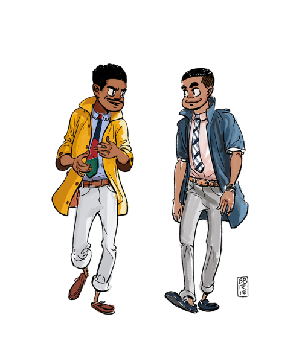

# GPR103 Week 1

Welcome, Object Oriented Design, C#

## Part 1 - Studying 2D Games Programming

Exploring 2D games programming.

> * Core concepts of game programming
> * `C++` or `Unity c#`
> * You should have basic programming, but there will be revision revision, and `c#` is much more welcoming than `c++`

---

## Who are we?

**Me:** Danny McGillick. Computer Science @ UTS, Web dev, Creative technologist in advertising (flash/actionscript, unity), 2D and 3D artist for Torus, Halfbrick, Wayforward L.A., Blowfish studios. Keyboard enthusiast, bits maker.

https://cargocollective.com/dmac/ - advertising
http://www.artstation.com/dmacdraws/ - game art

**You:** The next makers with long futures.

---

## How will we make 2D games?

Two options:
* Unity engine and C#. In-class choice.
* C++ in Visual Studio with an engine. An option for those who have c++ experience and great optimism.

---

## C++?

* Bigtime game engines are written in C++, C.
* Fast, low level.
* ON it's own doesn't offer any game making tools, you'll need a basic multimedia engine like olcConsoleGameEngine.
* Students who choose C++ can use Simple and Fast Multimedia Library (SFML), a library to provide windowing, graphics, audio and networking functionality.

```c++
int main()
{
    cout << "Battle Royale Game." << endl;
}
```  
_c++ main function_


SFML tutes and downloads for all platforms - _https://www.sfml-dev.org_

---

## Unity, C#?

A full 2D/3D game development IDE with models, sprites, physics, sound, input, c# scripting, cross platform building and more. For free.

```c
void Start()
{
    Debug.Log("Battle Royale Game");
}
```


_Unity engine downloads - https://unity3d.com/get-unity/download_

---

## Visual Studio Community

Regardless of which option you pick, you'll need Microsoft Visual Studio Community. It's the free version of their high end development IDE. Not to be confused with Visual Studio Code, their open source text editor.

>Whether you're coding c# for Unity or C++, we'll be using Visual Studio to do it.

Download VS Community 2017 here: https://visualstudio.microsoft.com/downloads/

___

## Dammit Jim! I'm a programmer, not an artist.


That's okay, we're here to focus on the building of games. The [asset store](https://assetstore.unity.com/categories/2d) is full of sprites for people like us.


___

## Dammit Jim! I'm an artist, not a programmer!
 


Unity makes programming life a lot easier than starting out in C++.

* No compiler, command line! Very visual.
* Unity's API/engine does most of the dirty work, we just have to order it around.
* Drag and drop used for lots of things you'd normally have to manage in code.
* Code can run in the editor each time we save and scripts can be disabled with a check box. Testing becomes much easier.


---

## Class and home hours

> **30%** class hours.
> **70%** studying, programming, gaining experience. 

The benefit of these courses comes from putting in work between classes. In class I can show you where to direct your efforts. But it'll just be concepts that fall away if you don't work between classes. The work between classes is what turns them into things you can do.

---

## Assessments


_Assessments as shown on Blackboard_

### Assessment 1 - Programming Exercises
3 programming challenges completed during the first 2 modules (first 4 weeks). Topics are _encapsulation_, _polymorphism_ and _engine calls_. **Due end of week 5**

### Assessment 2 - Character Customiser

You will develop a single module for a theoretical game. The character customiser lets you change appearance and stats. **Due end of week 8**


_An example 2D character customiser_

### Assessment 3 - Missile Command

You'll be making a whole game: a clone of arcade classic, Missile Command. 


_Missile command screenshot - for gameplay description see [wikipedia](https://en.wikipedia.org/wiki/Missile_Command#Gameplay)_

---

## Part 2: Programming and Unity

> Let's learn by doing. We'll create a unity project, add something to our game, and give it behaviour.

1. Create a new Unity project. 2D.
2. Add sprites to the game.
3. Make the sprites do something with a script.


**CUT THESE UP INTO TWO SPRITES**
**Make a radial gradient bg also**

## So, what is programming?

SOURCE

* What is this course teaching?
* Who am I?
* Who are you?
* What is unity? C#? C++?
  * Did any of you know those things
* What are 2D games?
* What assignments will there be? What language?
* How much will assignments be in class vs at home?
* How can we check assignment/course info ourselves or ask for help (blackboard review)
* How does the class load work (i am with your for 3 hrs and you are expected to do at least 7 hours follow up to understand and practise what we learned, and to read through next week’s lecture slides).

* Oo programming review
* Unity + visual studio or code intro/review
* C++ visual studio review
* How unity composition differs from object oriented code.
* I won’t be teaching how to do composition in c++, but i can answer c++ language questions. If you find a technique or guide for composition/decorator we can chat. 

* Do i need to be a 2d artist? Asset store!