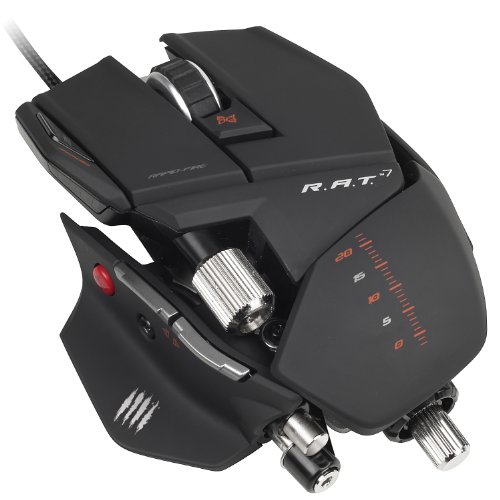

# GPR103 Week 2

Object oriented design principles: encapsulation, abstraction, cohesion, coupling.

### Encapsulation

At the heart of OOD is encapsulation. The word has many syllables, but it embodies two simple things we see every day. 

_capsule: a thing with things inside_

And it's what we expect of all the tools in our every day life: **Hide the bits I don't need to know about**

_outside v inside_

##### Maximum encapsulation is not a virtue in itself

The answer to most any interface question is: it depends. If you only open and read things on your computer, an Apple magic mouse is a very nice thing. If you play mobas, you might live or die by your razer naga. If you live the office live, a microsoft mouse is a safe middle ground. It's not good vs bad, it's appropriate vs inappropriate.

_!!_

This week we're going to be doing the Killer Robot exercise, so let's look at the encapsulation language/practises it defines:

> From KillerRobot exercise: 
> - Separate interface from implementation
> - Constructor and Destructor (self setup, self clean up)
> - Initialising members to appropriate default values.
> - "private member variables"
> - "accessor methods (properties)"

## Reminder of code basics places to learn. 
Rather than having me speed through conditionals and loops, jump into the sololearn app and drill on these fundamentals. Too fast for new coders, too slow for c++ people.

## Exercises

1. Assessment progression
2. UML stuff
3. Killer Robot Exercise
   * unity enum tutorial link