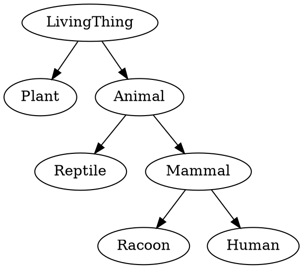
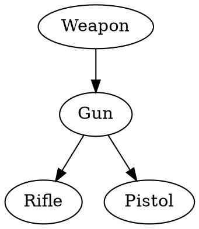
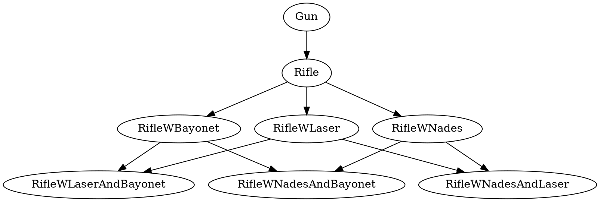
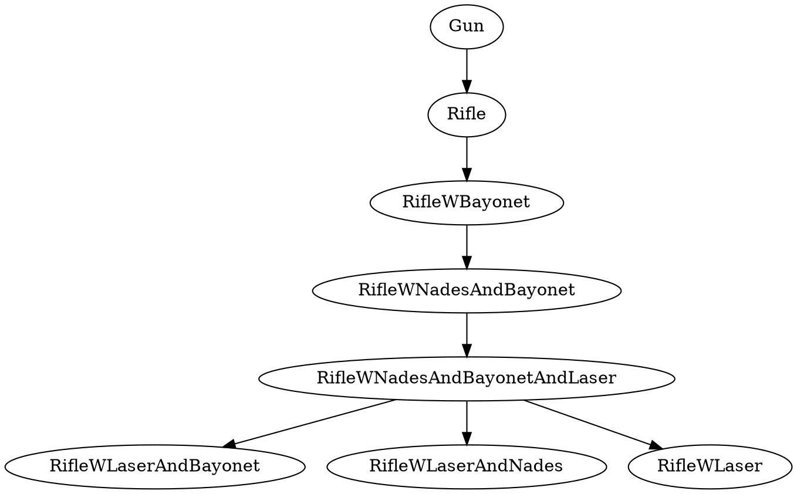
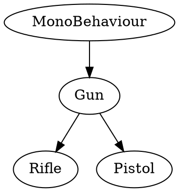
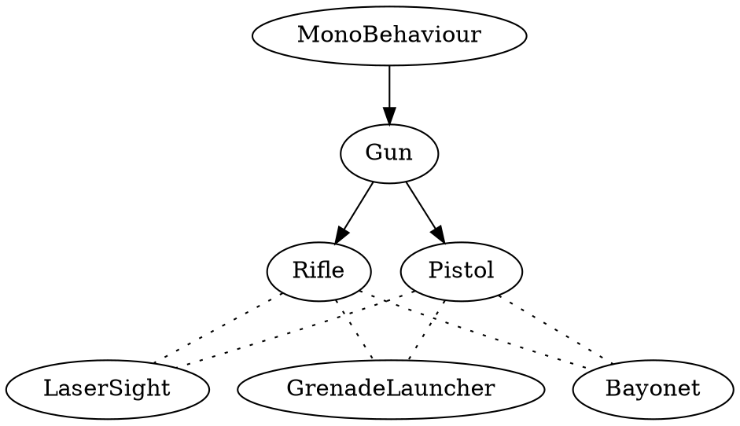
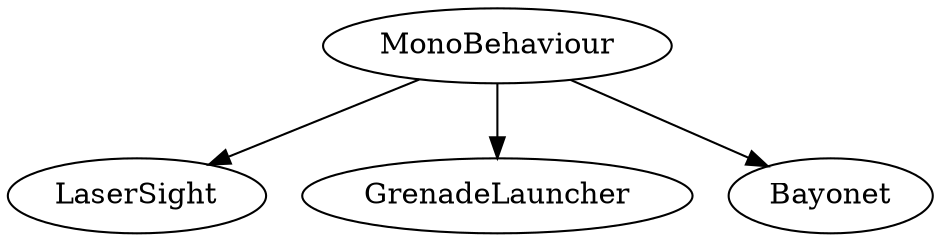
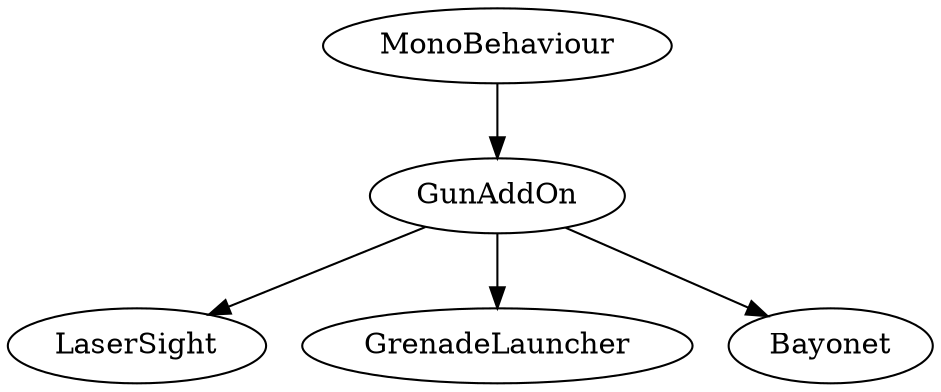

---
html:
  embed_local_images: false
  embed_svg: true
  offline: false
  toc: undefined
export_on_save:
  html: true
---
# GPR103 Week 2 (module 1.2)

Learning to hide the grease, pistons and wires.

<!-- @import "[TOC]" {cmd="toc" depthFrom=1 depthTo=6 orderedList=false} -->

<!-- code_chunk_output -->

1. [GPR103 Week 2 (module 1.2)](#GPR103-Week-2-module-12)
   1. [About Assignment 1 Part 1](#About-Assignment-1-Part-1)
   2. [Exercises to do before next class](#Exercises-to-do-before-next-class)
   3. [Resources](#Resources)
   4. [New design pattern, Composition!](#New-design-pattern-Composition)
   5. [Why not just inheritance?](#Why-not-just-inheritance)
      1. [Inheritance in Unity](#Inheritance-in-Unity)
      2. [Limits of Inheritance](#Limits-of-Inheritance)
   6. [Composition saves the day:](#Composition-saves-the-day)
      1. [Put your components on GameObjects](#Put-your-components-on-GameObjects)
   7. [Making a rifle with inheritance and composition](#Making-a-rifle-with-inheritance-and-composition)
      1. [Inheritance: From Monobehaviour to Rifle and Pistol.](#Inheritance-From-Monobehaviour-to-Rifle-and-Pistol)
      2. [Composition: add ons](#Composition-add-ons)
      3. [Handy tip: RequireComponent](#Handy-tip-RequireComponent)
   8. [Object oriented design principles.](#Object-oriented-design-principles)
      1. [What is encapsulation?](#What-is-encapsulation)
         1. [Goldilocks factor](#Goldilocks-factor)
   9. [Encapsulation in practice](#Encapsulation-in-practice)
      1. [Classes and Objects refresher](#Classes-and-Objects-refresher)
      2. [Scope in _C#_ and _C++_](#Scope-in-_C_-and-_C_)
      3. [Access modifiers](#Access-modifiers)
      4. [Using functions to hide variables](#Using-functions-to-hide-variables)
      5. [Access functions aka properties](#Access-functions-aka-properties)
      6. [Creating Objects vs Components/Monobehaviours](#Creating-Objects-vs-ComponentsMonobehaviours)
      7. [Constructors and destructors](#Constructors-and-destructors)
   10. [More detail on Cohesion](#More-detail-on-Cohesion)
         1. [Medium Cohesion](#Medium-Cohesion)
         2. [High cohesion](#High-cohesion)

<!-- /code_chunk_output -->


___

## About Assignment 1 Part 1

Assignment 1 Exercise 1 [rebrief is here](a1_exercise1_brief.html).
___

## Exercises to do before next class

1. conditionals etc up to objects in sololearn. 

___

## Resources

Rifle Unity Project: [WeaponAddOns.7z](assets/week2/WeaponAddOns.7z)

Documentation and Tutes:
1. Finalizers/destructors in [Microsoft's c# documentation](https://docs.microsoft.com/en-us/dotnet/csharp/programming-guide/classes-and-structs/destructors)
2. Constructors in [Microsoft's docs](https://docs.microsoft.com/en-us/dotnet/csharp/programming-guide/classes-and-structs/using-constructors)
3. Creating Properties video in [official Unity tutorials](https://unity3d.com/learn/tutorials/topics/scripting/properties?playlist=17117)
4. [Using Properties](https://docs.microsoft.com/en-us/dotnet/csharp/programming-guide/classes-and-structs/using-properties) and [all their syntax](https://docs.microsoft.com/en-us/dotnet/csharp/programming-guide/classes-and-structs/properties) in the Microsoft docs.  

 

## New design pattern, Composition!

That was probably easier than you expected. It was **easy but also strange** when you think about it.

1. We made a Class/Object and.. 
2. put on another class already in the scene? It's not like inheritance!

> This design pattern is called **composition** and it's less **Rifle is a Gun (inheritance)** and more **Rifle has a Laser Sight and Bayonet**. 


_Multiple components on TalkySquare not just our Talk script._


---

## Why not just inheritance?

We learned inheritance last trimester in c++, and you may have seen it in other languages. 
* Its the **"is a" relationship**. 
* Human -> Mammal -> Animal is a classic example



### Inheritance in Unity

Our `Rifle` can still be a `Gun`, gaining useful things, **c# and Unity are fine with inheritance.**



```cs
// The syntax is familiar to c++ users, minus all the header nonsense
public class Rifle : Gun { // Rifle is a gun

	void Start () {		
	}
}

// Your inheritance has to start with Monobehaviour if you want to use it in the inspector.
public class Gun : MonoBehaviour { // Gun is a component

	void Start () {		
	}
}
```

### Limits of Inheritance

Thing is, when you add _optional_ things rather than _evolving_, inheritance gets.. silly.

* To equip **multiple options in combination** do you try to inherit from multiple classes?


* Or do you
  1. Build a big dumb class with everything
  2. Pretend all that stuff isn't there, using just bits you want? Sort of de-evolving?




No.
___

## Composition saves the day: 

This sort of thing matters when making games, so Unity loves components.

* inheritance defined an "is a" relationship
* **composition defines the "has a" relationship**. Has a collider, has a sprite renderer. 
* Great, a rifle can just be a rifle and _have_ a grenade launcher and/or a sight. 

But how to do? 

* You've already made one, by extending _MonoBehaviour_

**A MonoBehaviour is, for our purposes, the same thing as a Component.** 

___

### Put your components on GameObjects

In Unity, everything on the stage extends `GameObject`.
* When you select a thing in your Unity scene, the Inspector is showing the **GameObject.**
* Each panel in the inspector is a **component**, added to the GameObject
* **If your script extends MonoBehaviour, it's a component you can add!**


_Look again. See them, see the components/MonoBehaviours_

## Making a rifle with inheritance and composition

Here's the combo that really gets work done in Unity: use inheritance to make the components you want, and then add them in combination!

1. A `Rifle` is a `Gun` is a `Monobehaviour`, thanks to inheritance
2. Add `Rifle` to a sprite plus `GrenadeLauncher`, `LaserSight` and `Bayonet` thanks to composition!


_If you haven't grabbed the unity project, [download it here](assets/week2/WeaponAddOns.7z)_

### Inheritance: From Monobehaviour to Rifle and Pistol.

Just like we'd have done in c++ or another OO language.



```cs
using System.Collections;
using System.Collections.Generic;
using UnityEngine;

// Gun is a component
public class Gun : MonoBehaviour {

	// Use this for initialization
	void Start () {
    Debug.Log("pew");
	}
	
}

// Rifle is a gun. Dead easy inheritance.
public class Rifle : Gun {

	void Start () {
		
	}

}
```

### Composition: add ons

Season our gameobject with components like Nade, Laser, Bayonet in any combination.



That looks noodley as a diagram, but as you saw it's clear in Unity:


_Inheritance isn't directly visible, except that these all must be descended from MonoBehaviour_

1. Obviously `LaserSight`, `GrenadeLauncher` and `Bayonet` all extend `MonoBehaviour` too.



But would add an evolution between them say `GunAddOn`, to add things common to all addOns. Still using inheritance where it helps!



___

### Handy tip: RequireComponent

GunAddOns are all going to need a gun to be useful right? What if someone tries to delete the Rifle component?

```cs
using System.Collections;
using System.Collections.Generic;
using UnityEngine;

// This line means you can't have a GunAddOn component unless 
// another component is descended from Gun.
[RequireComponent(typeof(Gun))]

public class GunAddon : MonoBehaviour {
  //no functions at all  
}

```

```cs
public class GrenadeLauncher : GunAddon {

	// Use this for initialization
	void Start () {
    Debug.Log("I spew pineapples");	
	}
	
}
```

---

## Object oriented design principles.
> **Quick definitions:**
> * Encapsulation: putting data/code that go together into a capsule (class).
>    * Cohesion: When the stuff in that capsule really does belong together  
>    * Coupling: when a class reaches too specifically into another can be easily broken by changes in that class.
> * Abstraction: The outside view of encapsulation. You see the simplest controls: the interface.

___

### What is encapsulation? 

It's a long word but it's a simple thing we experience every day. 


_capsule: a thing with things inside_

The objects in our every day life usually **hide the bits we don't need to know about:**


_outside v inside_

#### Goldilocks factor

> How much to hide? The answer is, as with most design questions: it depends.

 If you only open and read things on your computer, the simple magic mouse is a nice thing. If you play MOBAs, you might live or die by the macro buttons on your razer naga. 
 


## Encapsulation in practice

Object Oriented design is all about encapsulation, and classes/objects are made for it.

### Classes and Objects refresher

**Classes** are the basic way we bundle up data, say our player data, with the code that acts on it.

> Classes: thing in itself, the definition. The recipe, the blueprint.

Tower defense tower:


So a `FireballTower` might contain things like `health`, `firingRate`, `shotDamage`, `FireShot()`, `TrackTarget(target)`, `Build()`,`Collapse()`.

```cs
 
Class FireballTower
{
    // stats
    public int health = 100;
    public int firingRate = 0.25;
    public int shotDamage = 30;

    // Upgrades
    public int level = 0;

    public function Tower()
    {
        // Constructor
    }

    public function Build (int xLocation, int yLocation)
    {
        // spell casting code
    }

    public function FireShot()
    {
        // spell casting code
    }

    private function Track ( Transform target)
    {
        // Tracking code
    }
}
```

**Objects** are what we make from classes.

> A unique thing made to the specifications of the class. The dinner made from a recipe.   

The 4 chairs at your dinner table are real objects based on a design. One chair has a slightly softer cushion, one has a ding in the leg, one is mum's favourite. A design can't have these things, it's just specifications.

```cs
    // Create an object/instance of Class FireballTower
    FireballTower fireball1 = new FireballTower();

    // Ask this object to build itself at a location. 
    // Already it's unlike the Class/design because it has a state:
    // it's built, and has a real location on the map. 
    // When it's destroyed, it's gone forever.
    fireball1.Build(2,3);
```
___

### Scope in _C#_ and _C++_

Scope (simplified) is a way to encapsulate data(variables) to separate areas even inside a class. They're only usable inside the code blocks {} in which they're defined. 

```cs
    Class Missile
    {
        // A value here has class scope. All functions can see it.
        // It is also called a "member variable".
        // public/private doesn't have an effect inside the class.
        private int _damage = 40;

        public function SetDamage(int newValue = 15)
        {
            // Assigning newValue, which is a function argument, to localDamage.
            // localDamage is defined here (because you see the type "int" before
            // the name). localDamage then is only visible to code inside this function.
            int localDamage = newValue;

            // Assigning the local variable's value to the class scoped variable _damage
            _damage = localDamage; 
        }

        public function LogDamage() 
        {
            Debug.Log(localDamage); // error, variable not defined
            Debug.Log(newValue); // same error
            Debug.Log(_damage);  // Logs value of _damage successfully
        }
    }
```
___ 

### Access modifiers 
 
 ..are what we've used so far to allow/bar access to the delicate insides of a class. They're vital, but they're also dumb. Once they're defined they never react to change, like a sign on a gate. 

```c++
    // public: any class has access
    public int health = 100;

    // protected: any class that inherits this one has access
    protected int _shotDamage = 20;

    // private: Only this class has access
    private int _trackingSpeedY = 1.2;

    // no modifier: defaults to private
    int _firingRate = 0;

    // public const: we can make it public while preventing
    // others changing.. but we can't change it either.
    public const int MAX_HEALTH = 100;

```

___

### Using functions to hide variables
 Instead of a sign, a function can act more like a security guard: they do the same job but can react to changes and apply conditions.

> **In game situation:** You receive a Medallion Of Massive Damage and it attempts to set your damage to 30. You already have 50, so this would be a debuff. Our tower should not drop below 50 shot damage.

Translated to a **Coding problem:** 
1) Allow only certain direct changes to shot damage
2) Can't be lowered for example
3) Changes aren't always allowed 

One way is to **all the object suggesting the change to check**:
  * it looks at our shot damage
  * it checks for permission
  * it makes the adjustment.
  
Maybe it seems ok for the first weapon, the calling object might be friendly and can be trusted with the logic. But it **becomes a huge mess later**: anything damaging the player has to worry about our health range. It also has to be trusted with important rules we want followed. It's risky and there's a mess of redundant code.

**The solution is a private health variable and a public setter function inside our Tower.** We'll need a getter too. Psuedocode:
```
    Class Tower
    ...
    function SetShotDamage ( amount )
        if amount is more than current damage and changes are currently allowed
            set damage to new amount
        otherwise
            don't alter damage

    function GetShotDamage ()
        return shot damage
```
___

### Access functions aka properties

It's such a useful and common solution, c# has built in syntax to tidy it up and make errors less likely. These are officially **Properties**"** but **accessor functions** or plain **getters/setters** is fine. 

In a new Unity project I created a new script. We don't want this script created as a Component. Instead, browse to the assets folder in the project panel. Right click the space below "scenes" and select _Create -> C# Script_. Name it FireballTower.


Double click the script to edit in Visual Studio and type in (don't copy paste) this code:

```cs
// We don't need the unity includes    
public class FireballTower  // and we don't inherit `MonoBehaviour`
{
    private int _shotDamage = 50;
    private bool _damageBuffAllowed = true;

    public FireballTower()
    {
        // Empty constructor for now
    }

    // no need to write SetHealth(int value), GetHealth()
    // with correct function definitions etc
    public int ShotDamage
    {
        get { return _shotDamage; }
        set {
            if (_damageBuffAllowed && value > _shotDamage)
            {
                _shotDamage = value;
            }
        }
    }

} // end class
```

To **test it**, we now want a script component like last week:

1: Create a sprite
2: Change it to a circle or square, scale it up large enough to see.
3: With it selected, go to the Inspector panel and name it `TestSprite`. Then click "Add Component", type "script" in the search field and select New Script. Name it `TestTheTower`.
4: Edit the code to look like this:

```cs
using System.Collections;
using System.Collections.Generic;
using UnityEngine;

public class TestTheTower : MonoBehaviour {

    // Define a variable of type (aka class) FireballTower:
    private FireballTower _fireballTower;
    
	// Use this for initialization
	void Start () {
        
        // Create the tower with `new`
        _fireballTower = new FireballTower();

        Debug.Log("_fireballTower ShotDamage = " + _fireballTower.ShotDamage);
        Debug.Log("Attempting to set it to 30.");
        
        // Even though it's a function, we treat ShotDamage like a variable
        _fireballTower.ShotDamage = 30;

        Debug.Log("_fireballTower ShotDamage = " + _fireballTower.ShotDamage);
        Debug.Log("Attempting += 25");

        // We can use regular math and assignment operators (+=) and increment (++)
        _fireballTower.ShotDamage += 25;
        Debug.Log("_fireballTower ShotDamage = " + _fireballTower.ShotDamage);
    }

    // Update is called once per frame
    void Update () {
		
	}
}

```

Make sure your Console is visible (not hidden behind the project panel) and **hit the play button**. 

Here's **the output.** (Tip: in the Console's top right menu you can change log entry to 1 row to get these shorter log entries.)


___


### Creating Objects vs Components/Monobehaviours

*THIS SECTION NEEDS DIAGRAMS*

This is important, and a lot of students missed it last trimester so I'll be drilling it in a bit.

If you make a script that doesn't inherit from anything, it's just a basic c# class. You create basic Objects from them using the `new` keyword, like `Tower trashTower = new Tower();`. This is consistent with other object oriented languages, and normal in c#.

> Scripts created in Unity extend Monobehaviour, making them components: they add functionality to other GameObjects. You're going to drag them to or add them in the inspector panel. You don't create them with new, that's already handled by unity.

If you try to call "TowerComponent noobTower = new TowerComponent()" it'll work, but it'll throw errors in Unity, which will hurt your marks. It'll hurt them for a good reason, because you're including a bunch of stuff in your object that is totally unused.

If you want to create GameObjects at runtime along with components, rather than relying on what's in the scene, you can do it by instantiating prefabs. We'll talk about that another week.


### Constructors and destructors

The knowledge required to properly set up an object, and to finish it off and clean up its data requires a lot of knowledge of its internals. We're trying to hide that stuff, so the Class defines a **constructor function** and **destructor function.** The _C#_ specification uses "finalizer" and "destructor" interchangeably.

```cs

Class Tower
{
    // A public function with the Class's name is the constructor.
    // An invisible, automatic one will be created if you don't define it.
    public Tower()
    {
        // Setup goes here.
    }

    // The leading ~ (tilda) symbol makes this the destructor.
    // Destructors cannot be called, inherited or overriden. 
    // The have no access modifier, which makes them private by default.
    ~Tower()
    {
        // Tidy up before disappearing.
    }

}
```

___

## More detail on Cohesion

Ideas of what belongs in a class, how big a class should be, that's not set in stone. At home you'll get a feel for it based on projects and experience. At an organised workplace it'll be somewhat defined by coding standards/team lead/existing project code.

We'll get into that more in Design Patterns. For now, it's really just a measure of how much your code/data belongs where you've put it.

#### Medium Cohesion

A tower looks for targets, so it's fair to have targeting here. 

```cs
Class Tower
{
    List<Player> potentialTargets;

    function AquireTarget() {}

    function TrackTarget() {}
    
    function FireAtTarget() {}
}
```

#### High cohesion 
..might look like the following: a targeter that acquires and 
tracks targets. It's more specific, and leaves out firing.

```cs
Class Targeter : public Monobehaviour
{
    List<Trackable> potentialTargets;

    function FindClosestTarget() {}
    function FindRandomTarget() {}
    function GetCurrentTargetVector() {}
}
```

If wanted to use **inheritance**, our Enemy could inherit from Targer. Another approach is **composition**: the Targeter is a component we add to our Tower. We'll keep coming back to inheritance and composition.
