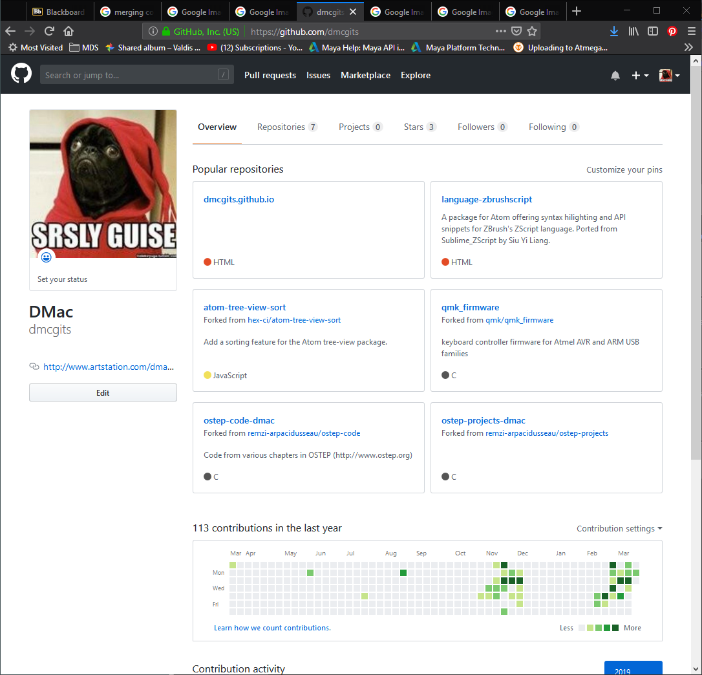
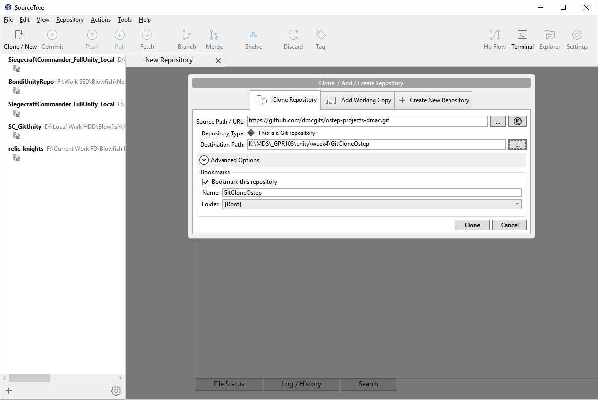
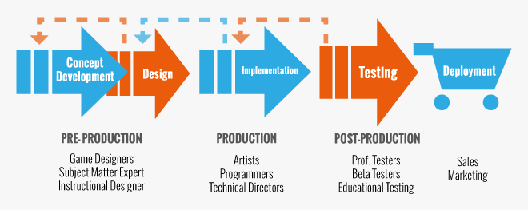
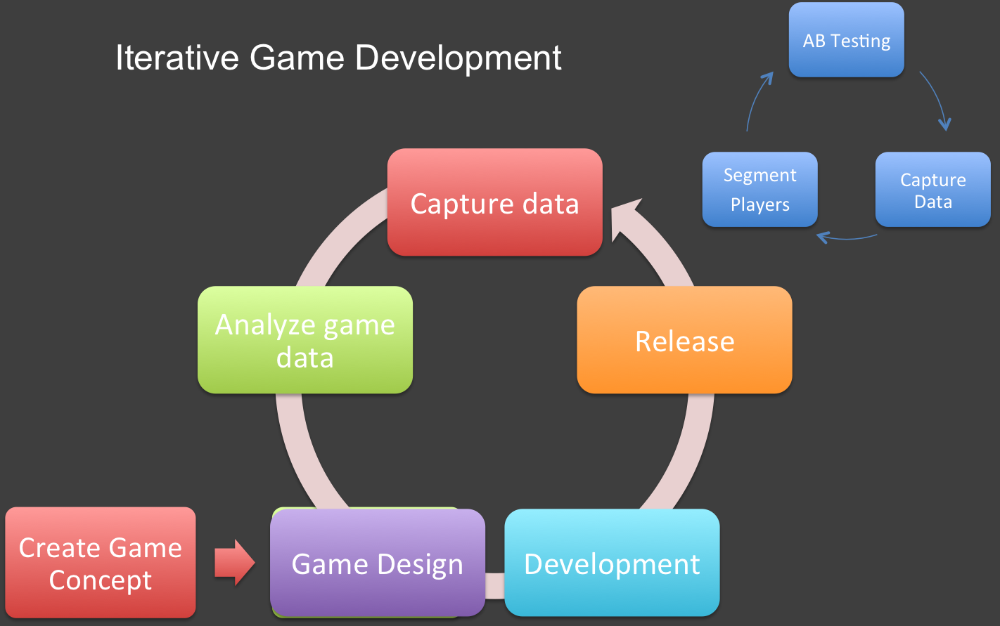
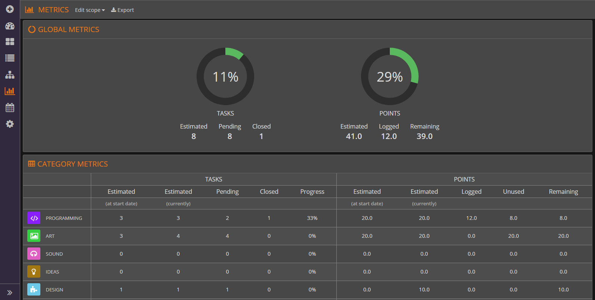

# Games Programming Week 4

 Storing your source files and collaborating. Project management and planning.

<!-- @import "[TOC]" {cmd="toc" depthFrom=1 depthTo=6 orderedList=false} -->

<!-- code_chunk_output -->

1. [Games Programming Week 4](#Games-Programming-Week-4)
   1. [Source Control](#Source-Control)
      1. [Git!](#Git)
      2. [Fail: Overwriting changes](#Fail-Overwriting-changes)
         1. [Solution: Conflicts and merging](#Solution-Conflicts-and-merging)
      3. [Big picture: waterfalls and agility](#Big-picture-waterfalls-and-agility)
      4. [Week to week view](#Week-to-week-view)
   2. [Exercises](#Exercises)
   3. [Resources](#Resources)

<!-- /code_chunk_output -->

## Source Control

How do 10, 100, 1000 people work on a project together? How do they do it without constantly overwriting eachother's code?
___

### Git!

Git. Acquire code, merge people's work, keep history, branch out and merge from the main project trunk, much more.

Shots of github:

_A typical github project page_

_Grabbing the cloning url_

_Bash for Windows_

_Sourcetree_

_Git Kraken_

There are loads of tricky things about working on source files with other people:

1. **Overwriting** other people's changes
2. Opening a file someone has changed and **figuring out what they changed**.. was it just additions?
3. 5 people have edited a file and a url for a game server was changed to point to a different region at some point. **Who made the change when, and what was the old value?**
___

### Fail: Overwriting changes

> 1. James grabs PlayerController.cs from the files server and adds crouch movement.
> 2. Darlene does the  same but adds double jump.
> 3. If Darlene copies hers to the server last, it's bye bye crouch movement. If it's vice versa, no more double jump.

#### Solution: Conflicts and merging

Git can do a solid job of **merging changes** automatically, especially if they are in different sections of the file.

When it can't merge changes, it notes a **conflict**. There are numerous interfaces for resolving conflicts, but they all boil down to showing you the two versions and letting you choose which change to keep from either version or hand editing.

___

 ## Project Management

Games are big, people have their own ways of working, and making stuff is complicated.

### Big picture: waterfalls and agility

Usually a team project uses many resources over a fair amount of time to make something more complex than you would make on your own. Even ambitious one-person projects can be similar.

You're attempting to take a big problem and use organisational skills and tools as a scaffolding to make things you can't just plan and hold all in your head.

___

 #### Waterfall development 
 Is the God's Great Plan take on making things. You spend ages refining a document describing your project or game, get sign off, then just build till it's done. Graphic and concept design, modelling, texturing, shaders, animation. Program the code a module at a time till done. It's river passing over multiple falls (milestones) and it travels inexorably from source to destination. 
 
 
 
 > It can certainly make things. Usually, you find a load of things you should have done differently, but often they can't be adjusted. Fine if you're making office software maybe, terrible if you find your game isn't good.
 
 ___

 #### Iterative/agile dev

Iterative development, also referred to as agile, scrum and 200 other changing terms, is a process of sketching out your best idea of the project, and then going through a series of waterfalls on barebones products and features, then increasingly polished features. It has more in common with sketching thumbnails of comic pages, then pencilling, inking and colouring, making changes as you go.

___

### Week to week view

Kanban, Scrum?
Trello, Jira, KanbanTool?

1. backlog (features to go in)
2. pre production
3. ready
4. in production
5. Blocked 
6. QA
7. Approved

___

## Exercises

1. Part 3 of Asessment 1
2. Sign up for Trello, put in some cards for assignment 2
3. Github:
   1. Install git and git LFS at home too
   1. Greate a repository on github. When it asks if you want to create a .gitignore, select the Unity template from the dropdown.
   2. Clone that empty repo to your home computer.
   3. Add a hello world unity project, or copy last week's sprite demo tower to the folder.
   4. Add/stage all the files using either the commandline, SourceTree or GitKraken. 
   5. Commit the files and then push to github.

___

## Resources

1. Trello - google
2. HacknPlan - google
3. Look at more api calls on the Unity tutorial scripting site.