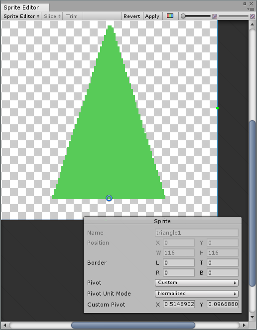

---
html:
  embed_local_images: false
  embed_svg: true
  offline: false
  toc: undefined
export_on_save:
  html: true
---
# Demo: Utility class with static function


#### FollowTheMouse.cs

Make a sprite, use the _knob_ circle from the sprite library. Scale it up a bit and add a script to follow the mouse.

```cs
// FollowTheMouse.cs
using System.Collections;
using System.Collections.Generic;
using UnityEngine;

public class FollowMouse : MonoBehaviour {

  void Start () {
    Debug.Log("Follow that mouse!");
  }
	
	void Update () {
    transform.position = Handies.MousePosToWorldVec();
	}

}
```
#### LookAtAThing.cs


Make a `graphics` folder in the `assets` folder in your Unity project window. Put this amazing triangle in there. Click the sprite once it's there and use the sprite editor (in the inspector) to put the blue pivot point circle at the bottom middle of the triangle. 

Make sure to hit the badly placed **"**apply** button up top.



Put it on your stage and then make  a new script, `LookAtAThing.cs`.

```cs
// LookAtAThing.cs
using System.Collections;
using System.Collections.Generic;
using UnityEngine;


public class LookAtAThing : MonoBehaviour {

    [SerializeField]
    protected Transform targetTransform;

    // Update is called once per frame
    void Update () {
        Handies.PointObjectAtAnother(transform, targetTransform);     
	}
}
```

#### Handies.cs

None of that worked. Because those components are lazy. Handies is going to do the hard work. 
>Is this class cohesive? Maybe?

```cs
//Handies.cs
using System.Collections;
using System.Collections.Generic;
using UnityEngine;

public class Handies {

  protected static Vector2 mousePoint;
  protected static Camera cam;

  public static void PointObjectAtAnother(Transform o1, Transform o2)
  {
    //o1.LookAt(o2);
    float angleRad = Mathf.Atan2(o2.position.y - o1.position.y, o2.position.x - o1.position.x);
    float angleDeg = Mathf.Rad2Deg * angleRad;

    o1.rotation = Quaternion.Euler(0, 0, angleDeg-90);
    //Debug.Log(angleDeg);
  }

  public static Vector2 MousePosToWorldVec()
  {
    if (cam == null) cam = Camera.main;

    mousePoint = Input.mousePosition;
    return ( cam.ScreenToWorldPoint(mousePoint) );
  }
}
```