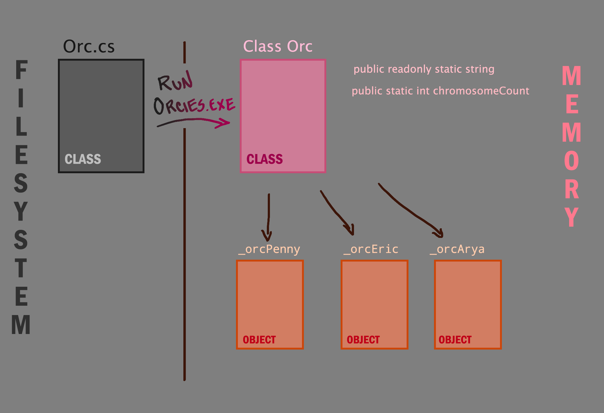
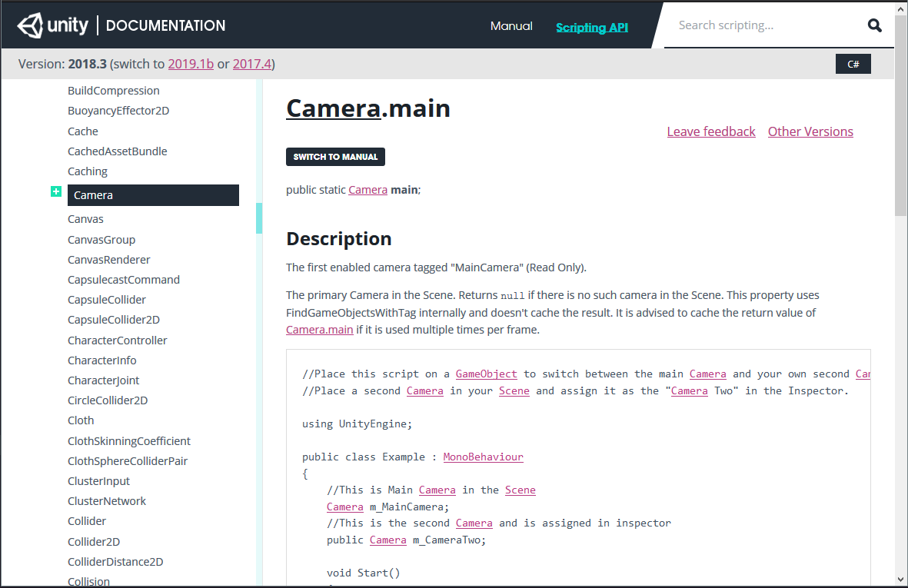
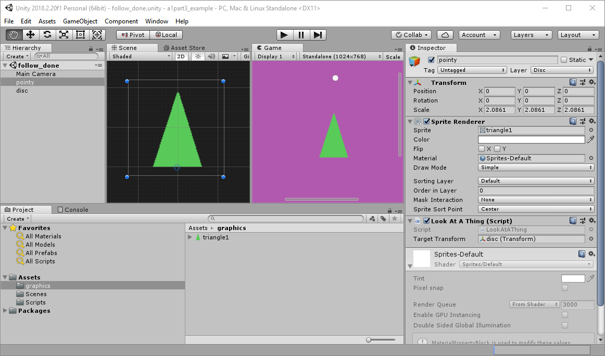

---
html:
  embed_local_images: false
  embed_svg: true
  offline: false
  toc: undefined
export_on_save:
  html: true
---
# Games Programming Week 4

 Storing your source files and collaborating. Project management and planning.


<!-- @import "[TOC]" {cmd="toc" depthFrom=1 depthTo=6 orderedList=false} -->

<!-- code_chunk_output -->

- [ Games Programming Week 4
](#games-programming-week-4)
  - [ A1 exercise 3: Unity api, static utility functions
](#a1-exercise-3-unity-api-static-utility-functions)
    - [ Engine Implementation
](#engine-implementation)
  - [ Utility classes: Static functions and variables
](#utility-classes-static-functions-and-variables)
    - [ They lied about classes
](#they-lied-about-classes)
    - [ Statics WTH
](#statics-wth)
    - [ Using statics to make utility classes
](#using-statics-to-make-utility-classes)
    - [ What are Unity API calls
](#what-are-unity-api-calls)
    - [ Our utility class, Helpies
](#our-utility-class-helpies)
    - [ Singletons
](#singletons)
  - [ Exercises
](#exercises)

<!-- /code_chunk_output -->

## A1 exercise 3: Unity api, static utility functions

### Engine Implementation
You need to create a `Class` that provides a useful, fairly generic function. This function should make use of **at least 2 Unity API calls** and return a result. Having it call multiple Unity API calls instead of just one is what makes it useful.. otherwise we'd just make the api call. Create a **test class** that shows this off running in the engine.

> We'll write out an example of this today using a Singleton or a static class.

## Utility classes: Static functions and variables

If you've ever used a unity api function without creating an object,you've used a static function/variable. 

* `Debug.Log(string)`
* `Mathf.Round(number)`
* `Camera.main`
* `Input.mousePosition`,

Classes like `Mathf` and `Input` can be thought of as utility classes. You don't make objects out of them, you use them .

### They lied about classes

Sort of. For most purposes yes, classes are simply designs that are made real in the form of objects. But it turns out it's useful to be able to call functions on classes without wasting cycles and memory creating objects. The way to achieve this is with static functions. 

### Statics WTH

Statics are like exceptions to the rule of encapsulation. Instead of every chair object being unique, imagine all chairs had a single component, say the cushion, and if you damaged one cushion you damaged them all. It's like quantum entanglement.

```cs

class Orc 
{
  static public int gestationMonths = 6;
  protected string _name = "";
  protected int _age = 0;

  static public string TranslateToOrcish(string englishWords)
  {
      // do some lookup
      // in a orc dictionary
      string orcishWords;
      return (orcishWords);
  }

  public Orc( string name, int age)
  {
    _name = name;
    _age = age;
  }


  public string GetName()
  {
    return (_name);
  }
}


class Tester : Monobehaviour
{
  Orc _orcPenny;
  Orc _orcEric;

  void Start()
  {
    _orcPenny = new Orc("penny the new", 160);
    _orcEric = new Orc("eric the pensive", 600);

    Debug.Log("Her title is " + _orcPenny.GetName());
    Debug.Log("An orc usually born about " + Orc.gestationMonths + " months after parent kisses.");

    Debug.Log("Big hammer in orcish is: " + Orc.TranslateToOrcish("Big hammer");
    
    
  }
}

```



### Using statics to make utility classes

Sounds a lot like something we might do in an assessment. Let's look at how we can enclose a couple of _Unity API_ calls in a single function, and call it from an object.

___ 

### What are Unity API calls

> **API** stands for **Application Programming Interface**. What it actually means is **a way to control something with code**. Whether it's facebook's platform and user data, or an arduino, or the unity game engine. They write a bunch of code that does amazing things, and then give us a bunch of functions we can call to control it.

The Unity API is documented here:
<https://docs.unity3d.com/ScriptReference/>



It's dead easy: you look up the Camera class, find a function you need, and they explain it. They have source code too. All those autocomplete suggestions in Unity when you type Transform or Camera or Vector3? They're all fully explained and demonstrated.

### Our utility class, Helpies

[week4_code_utility.html](week4_code_utility.html)



___

### Singletons

A Singleton is basically a trick to make all the objects you create from a class, say your custom "GameManager" class, essentially be the same object. 

* It has all the state upside of an object
* It has the access anywhere upside of static functions
* It kinda breaks the rules of OO and should ideally be avoided. But it's super handy and the alternatives are.. not perfect either. 

[Trent's Singletons pdf](assets/week4/singleton_cs_trent.pdf)

___
___

## Exercises

1. Part 3 of Asessment 1
___

