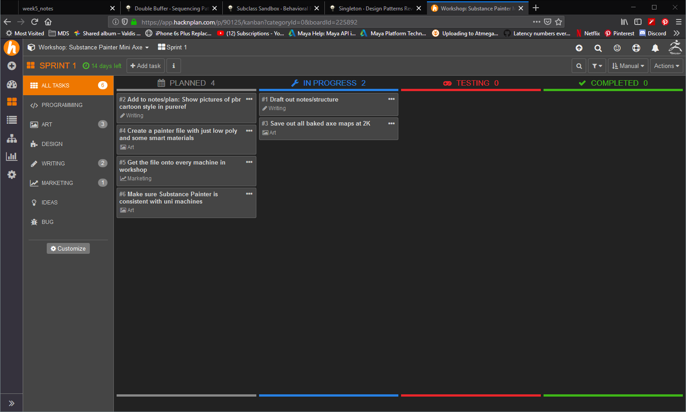

# Week 5: Design Patterns

Programming leads to lots of code. Lots of code leads to lots of files and objects and madness. 

> Design patterns are abstract ways of thinking about big programs and saves us from madness.


<!-- @import "[TOC]" {cmd="toc" depthFrom=1 depthTo=6 orderedList=false} -->

<!-- code_chunk_output -->

* [Week 5: Design Patterns](#week-5-design-patterns)
	* [Assessment 1 due end of this week.](#assessment-1-due-end-of-this-week)
		* [Encapsulation exercise](#encapsulation-exercise)
		* [Inheritance/Polymorphism exercise](#inheritancepolymorphism-exercise)
		* [Engine Implementation](#engine-implementation)
	* [Design patterns and the Gang Of Four](#design-patterns-and-the-gang-of-four)
	* [Patterns in Game Design](#patterns-in-game-design)
		* [Game Loop](#game-loop)
		* [Observer Pattern](#observer-pattern)
		* [Utility classes: Static functions and variables](#utility-classes-static-functions-and-variables)
		* [I lied about classes](#i-lied-about-classes)
			* [Statics](#statics)
			* [Using statics to make utility classes](#using-statics-to-make-utility-classes)
		* [What are Unity API calls](#what-are-unity-api-calls)
		* [Our utility class, Helpies](#our-utility-class-helpies)
		* [Singletons](#singletons)
		* [Component/Composition](#componentcomposition)
	* [HacknPlan](#hacknplan)
	* [Exercises](#exercises)
	* [Resources](#resources)
			* [Double Buffering](#double-buffering)
			* [Free examples of Design Patterns in unity c#](#free-examples-of-design-patterns-in-unity-c)
			* [gameprogrammingpatterns dot com:](#gameprogrammingpatterns-dot-com)
			* [Do factory](#do-factory)

<!-- /code_chunk_output -->


## Assessment 1 due end of this week.

Yes, it is **due end of Sunday, March 31.** 
These are brief reminders, in my own words, of what is in each exercise. READ THE PDF BRIEF CAREFULLY.
**[Assessment 1 pdf on the server](https://laureate-au.blackboard.com/bbcswebdav/pid-7197505-dt-content-rid-11808948_1/xid-11808948_1)**

You are delivering 3 Exercises:

### Encapsulation exercise
 Create the `Player` class which is tested by a test class, eg: `TestPlayer`. If you're at all confused about this [do the exercise in week 2's notes.](https://dmcgits.github.io/mds/GPR103/week2_notes.html?nocache#access-functions-aka-properties). It creates a test class, puts it on a sprite, and uses it to create and test a class.

### Inheritance/Polymorphism exercise
 Create a base `Class` with variables and functions. Create classes that derive from it. `Override` a `virtual` function. Put the different child classes in one `List` and iterate over them, calling a function. Almost exactly what we did in [week 3 in the section on polymorphism](https://dmcgits.github.io/mds/GPR103/week3_notes.html#polymorphism). The classes themselves are up to you. Inventory items, types of spells, types of door lock, whatever.

### Engine Implementation
You need to create a `Class` that provides a useful, fairly generic function. This function should make use of **at least 2 Unity API calls** and return a result. Having it call multiple Unity API calls instead of just one is what makes it useful.. otherwise we'd just make the api call. Create a **test class** that shows this off running in the engine.
**We'll write out an example of this today using a Singleton or a static class.**
  
___

## Design patterns and the Gang Of Four

* Patterns of programming design were hotly discussed through the late 70s and 80s
* In 1994 a book called _Design Patterns: Elements of Reusable Object-Oriented Software_ caught on with computer scientists. It was produced by the awesomely named "Gang Of Four". 
* Growth and discussion of pattern design hasn't slowed. 
* Sadly, the Gang of Four were very disappointing in photographs


_The Gang of 4 (+2)_

___

## Patterns in Game Design

Some patterns common to game design

* Game Loop (game logic)
* Composition - Unity components
* Type Object - A little like composition. A way to create variants from a text file rather than a million class definitions.
* Double buffering (graphics)
___

### Game Loop

**Long view:** All games are loops. The menu system. Finding a game, joining, ending. 

**Short view** Every frame is a pass through a loop. 
1: Get user input. 
2: One frame of simulation and consequences
3: Draw the results to the screen, vibrate controllers, play sounds.


_[http://gameprogrammingpatterns.com/game-loop.html](http://gameprogrammingpatterns.com/game-loop.html)_

___

### Observer Pattern

At the core of a lot of modern programs and games is the _Model, View, Controller_ pattern or _**MVC**_. It can create a lot of extra code and inflexibility though, but you can use the simpler underlying _observer_ pattern. 

> The observer pattern is where parts of your code can choose to keep an eye open for certain things that happen to other objects.

Say our subject below is a player:
1. Our player might equip her first magical armour. 
2. The Achievements system hears "magical_armour_equipped" and grants you a "Untouchable. Almost!" achievement and shows a popup.
3. The sound audio system hears the same thing and plays a tingly magic sound.
   


This can be done by passing function pointers around, or having anythign that listens for events implement a certain interface. Next week, we'll do it with events.

Make sure to read up properly on it here, because it's absolutely fundamental and will be a big part of assessment 2:
<http://gameprogrammingpatterns.com/observer.html> 
___

### Utility classes: Static functions and variables

If you've ever used a unity api function without creating an object, say `Mathf.Round(number)`, or `Camera.main`, or `Input.mousePosition`, you've used a static function/variable. Classes like `Mathf` and `Input` can be thought of as utility classes. You don't make objects out of them, you use them .

### I lied about classes

Sort of. For most purposes yes, classes are simply designs that are made real in the form of objects. But it turns out it's useful to be able to call functions on classes without wasting cycles and memory creating objects. The way to achieve this is with static functions. 

#### Statics
Statics are like exceptions to the rule of encapsulation. Instead of every chair object being unique, imagine all chairs had a single component, say the cushion, and if you damaged one cushion you damaged them all. It's like quantum entanglement.

#### Using statics to make utility classes

Sounds a lot like something we might do in an assessment. Let's look at how we can enclose a couple of _Unity API_ calls in a single function, and call it from an object.

___ 

### What are Unity API calls

> **API** stands for **Application Programming Interface**. What it actually means is **a way to control something with code**. Whether it's facebook's platform and user data, or an arduino, or the unity game engine. They write a bunch of code that does amazing things, and then give us a bunch of functions we can call to control it.

The Unity API is documented here:
<https://docs.unity3d.com/ScriptReference/>


It's dead easy: you look up the Camera class, find a function you need, and they explain it. They have source code too. All those autocomplete suggestions in Unity when you type Transform or Camera or Vector3? They're all fully explained and demonstrated.

### Our utility class, Helpies

[week5_code_utility.html](week5_code_utility.html)


___

### Singletons

A Singleton is basically a trick to make all the objects you create from a class, say your custom "GameManager" class, essentially be the same object. 

* It has all the state upside of an object
* It has the access anywhere upside of static functions
* It kinda breaks the rules of OO and should ideally be avoided. But it's super handy and the alternatives are.. not perfect either. 

[Trent's Singletons pdf](assets/week5/singleton_cs_trent.pdf)

___

### Component/Composition

How we've been doing things in Unity!

___

## HacknPlan

* Make sure you create an account this week on [hacknPlan](http://www.hacknplan.com/). 
* Then make a project and choose "agile" from the types allowed. 
* Go to _Boards_ (left menu) and sprint 1 (it'll make a first sprint for you.)
* Create a few cards under "art" and "programming" tasks, just to get the hang of it. Expect to make mistakes, it's fine! 



___

## Exercises

1. Finish assignment 1
2. Catch up on Sololearn, you need a certain amount of _c#_ to be automatic. Time you lose looking up basics, or on confusing errors, that's all potential coding time gone.
3. Sign up to HacknPlan. 

## Resources

More detail on what we've covered here today. If a pattern  sounds like a good thing to use in assessment 2 or 3, go read more about it.

#### Double Buffering

Double buffering is important to know about, but for Unity for now that's handled by the engine. I wrote notes on it though, so here the are!
[week 5 leftovers - double buffering](week5_leftovers.html)

#### Free examples of Design Patterns in unity c#

https://github.com/dmcgits/unity-design-patterns-naphier
You can grab the code with gitkraken, sourctree, or typing the following in a dos/bash window:
```sh
git clone https://github.com/dmcgits/unity-design-patterns-naphier
```
#### gameprogrammingpatterns dot com:

Easy to read, gaming focussed.

1. <http://gameprogrammingpatterns.com/component.html>
2. <http://gameprogrammingpatterns.com/double-buffer.html>
3. <http://gameprogrammingpatterns.com/subclass-sandbox.html>
4. <http://gameprogrammingpatterns.com/type-object.html>
   
#### Do factory
 Has loads of patterns explaine in c#, though this time for .net (not unity specific)
 <https://www.dofactory.com/net/design-patterns>
