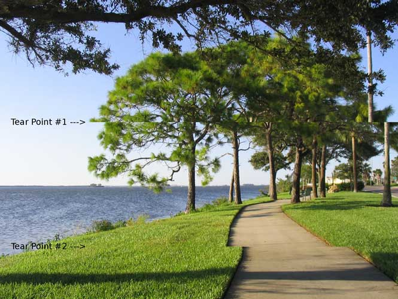

# Week 5 leftovers

<!-- @import "[TOC]" {cmd="toc" depthFrom=1 depthTo=6 orderedList=false} -->

<!-- code_chunk_output -->

* [Week 5 leftovers](#week-5-leftovers)
	* [Double buffering](#double-buffering)

<!-- /code_chunk_output -->

## Double buffering

If you draw directly to the pixels of the screen, the speed of your processing and the updating of the screen aren't guaranteed to sync. This shows up on screen as tearing. 

Instead:
1. We draw to two different canvases. 
2. When we finish one, the gpu is allowed to render the screen from it. 
3. While it's doing so, we draw to the other.
4. ... forever

More information, including code: <http://gameprogrammingpatterns.com/double-buffer.html>

This, and even triple buffering, doesn't guarantee a perfect outcome, because monitors typically draw at an unchanging rate, and if your gpu is too fast it can still outpace them.

 * V-Sync is one solution, holding frames and waiting for the monitor. Causes input lag.
 * G-Sync and Freesync are technology where the screen refresh rate is matched to the gpu frame rendering speed. Best outcome. It was pricey but now NVidia has promised to support cheaper freesync monitors.
