---
html:
  embed_local_images: false
  embed_svg: true
  offline: false
  toc: undefined
export_on_save:
  html: true
---
# Week 5

Assessment 1 summarise, assessment 2. Git, singletons and gamemanager. Observers and events if time.

## Assessment 1 catch up

* Due **end of this Sunday**
* Reminder of **part 1 clear brief**: [Link](a1_exercise1_brief.html)
* Deliver by 7zipping (or other compression) the **folder your unity project lives in**. It contains /Assets, /Library, /Packages etc. Don't worry about making a build.
* Your project must be **made in Unity 2018.2.x** 
  - This includes 2018.2.2f1 like on the uni machines, and more recent updates to that release like 2018.2.21f1. 
  - Does not include 2018.3.x releases or 2019.x. 
  - If your project is made in the wrong Unity release: install the correct one and import the project, fix any issues before submitting.
* Questions?

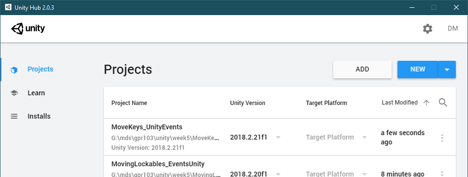

## Assessment 2

* Brief: [link](https://laureate-au.blackboard.com/bbcswebdav/pid-7523976-dt-content-rid-11808949_1/xid-11808949_1)
* Due end of Week 8 (end of sunday, Aug 4)

### Examples from past students

### My example

## Git
  
What is git?

> Git is a distributed version-control* system for **tracking changes in source code** during software development. It is designed for **coordinating work among programmers**, but it can be used to track changes in any set of files. Its goals include speed, data integrity, and [teams working on shared files without problems].

* Version control is the term for Git and systems like it, including mercurial, svn, (defunct) visual source safe and others.

### Git has a change history
It saves and records versions of your file so you can retreive them.
  * If you mess up your code or somehow completely overwrite it, you can retrieve it.
  * In the past you would have had to constantly duplicate your main.c file as main.c.bak1, main.c.bak2 etc. Or duplicate your project folder as backups. MyProject_old_old comes to mind.

### Git merges changes!
Without version control:
  * If you worked on something with multiple people, or work on different pcs, you'd have to copy the project to a usb/email the project/place it on a server. 
  * Other person does some work on it and returns the project, telling you what files they edited (as best they recall) and you copy them back over.
  * If they edited a file you also edited, oh hell: you need to look at the differences, mix your changes with theirs and check if the project compiles/works.
# Screen shot wikipedia git

### It does loads of other things

* Branching a repository (the name for where all the code lives) so you can work on a copy of the whole project, later merging the new bits back to the master copy.
* Tagging certain points in history as releases so you can get back whole old versions
* much git knowledge is shared and challenged on stack overflow
  
# Screenshots stack overflow

## Git and Clients

Git is a type of server/service software, and that server software is accessed/controlled from the command line. Fortunately there are lots of GUIS to help visualise and automate interactions with the server.

### Server

Git is software on a server or on your PC. 
* Github might have your offsite master repository
  - You clone it to your machine
  - commit changes to it all day
  - pull down changes by others during the day perhaps, merging them with your local changes
  - then push all your changes up to the server to be merged with everone elses.
* It keeps information in your project folder. 
* It is command-line operated, so it's all text commands typed in.

# Screenshot of git cli

### Clients

Sourcetree by atlassian (uni machines supported)
Gitkraken (free cross platform for basic edition?)

### Github use

* creating account
* making a repo
  - initialise with readme, gitignore
* cloning to your machine.

Add your github account to sourcetree:
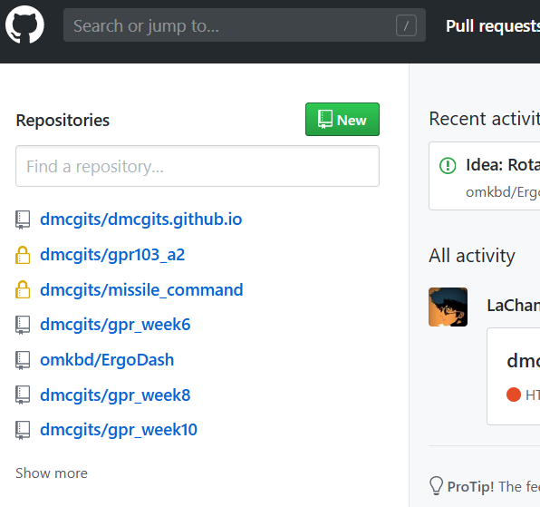
clone:
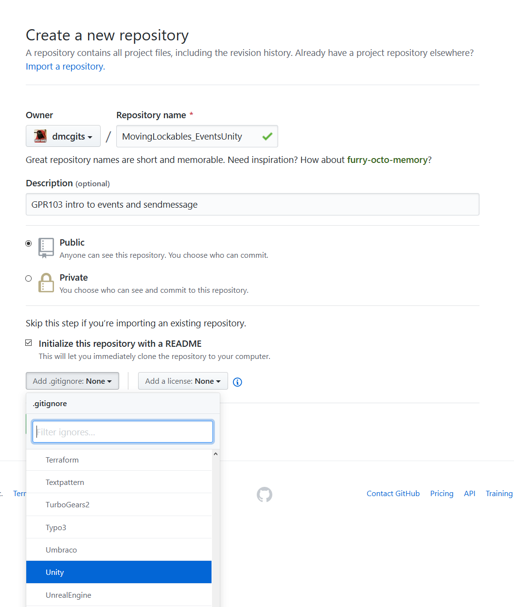
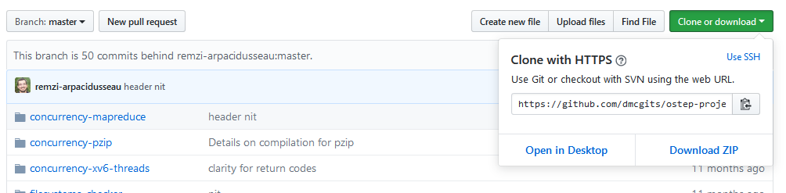

### Sourcetree cloning

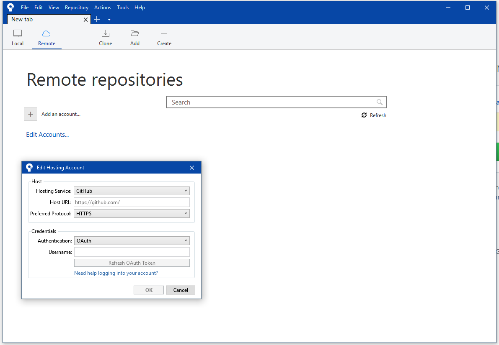
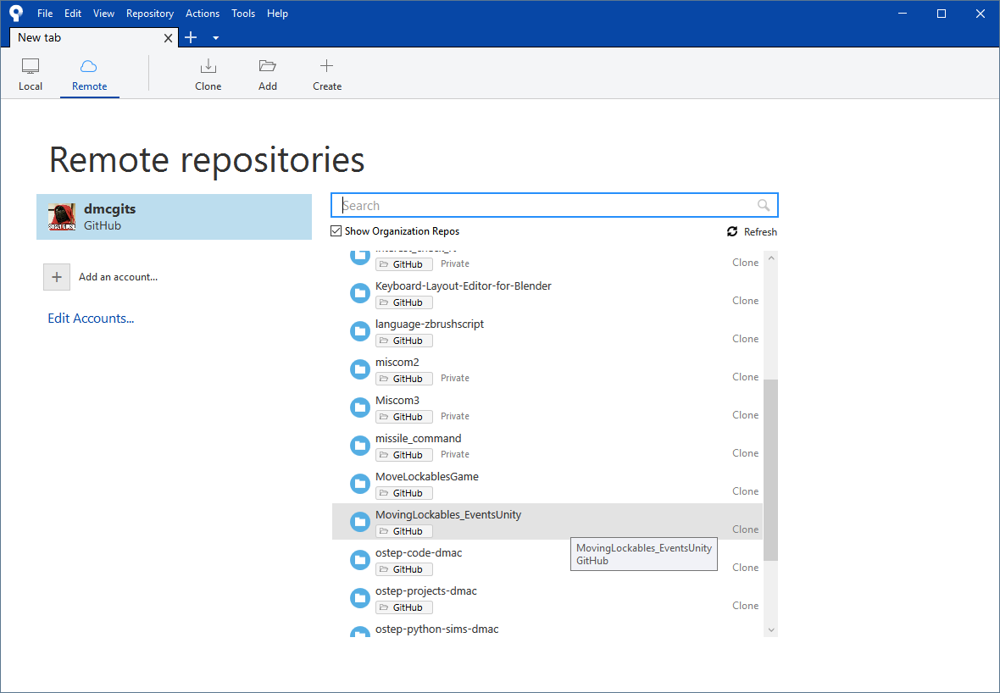
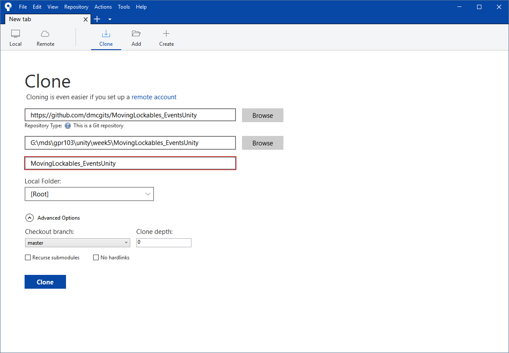

### Moving your unity project into your github repo
* transferring a unity project into the folder you cloned repo into

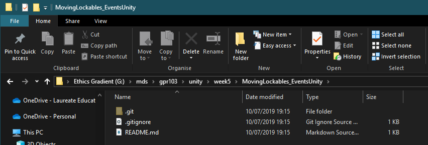

#### adding files, staging files

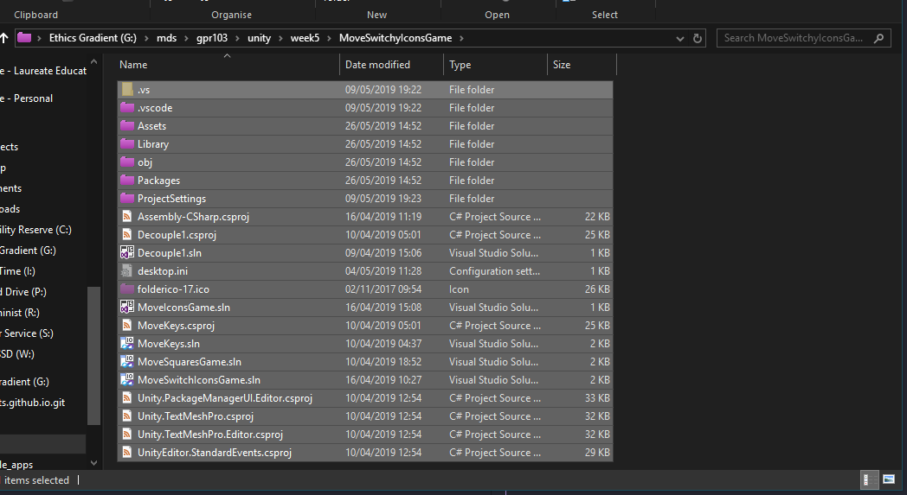
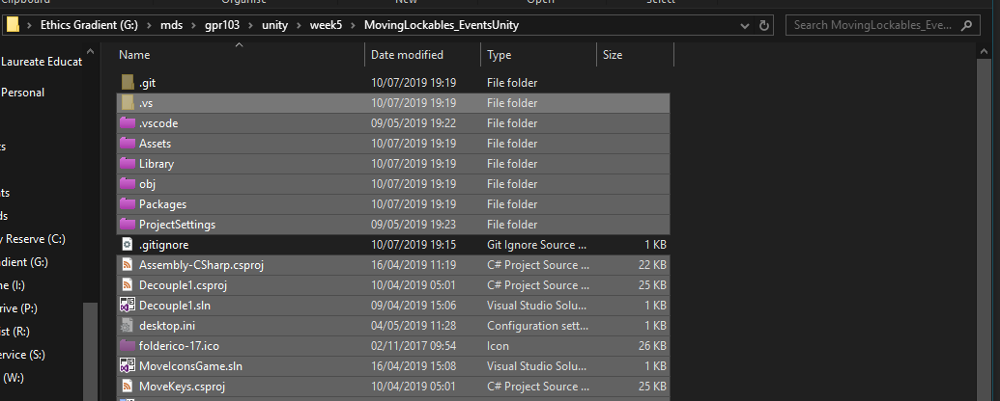

#### committing and pushing
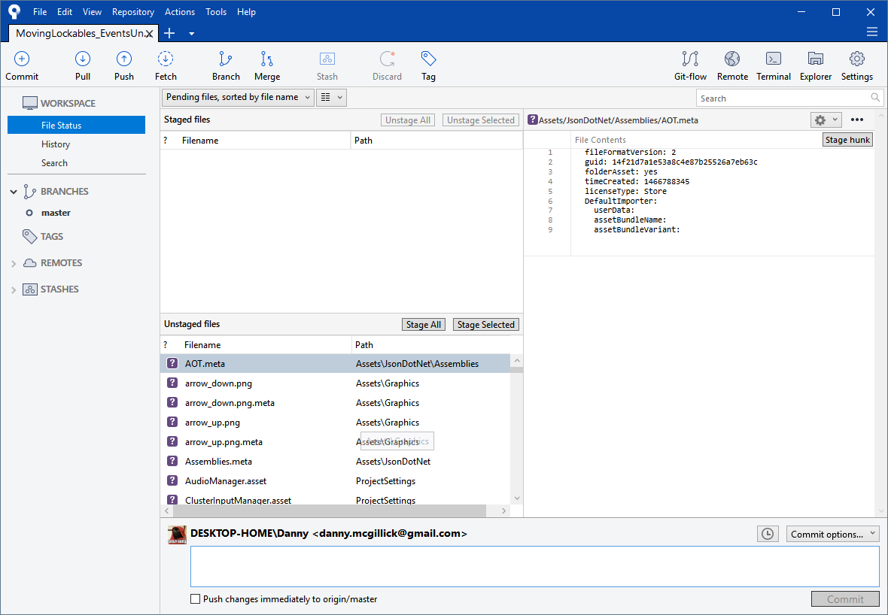
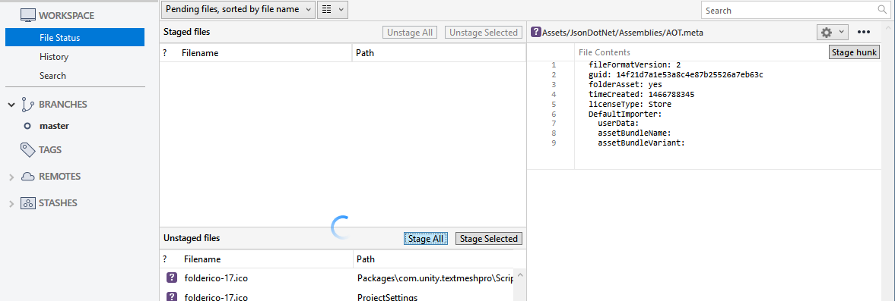
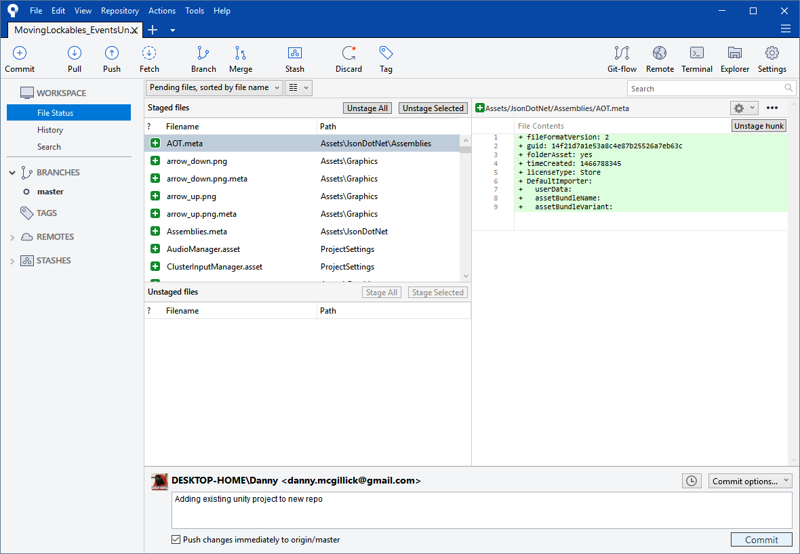

More info: 
* <https://www.atlassian.com/git/tutorials/saving-changes>
* <https://www.atlassian.com/git/tutorials/learn-git-with-bitbucket-cloud>
---

## Decoupling: what

Decoupling is a way of **keeping things in your game from knowing too much directly about other things** in the game. At the very least, **not having references to eachother and calling functions** on eachother.

> Reasonable question: So we have to avoid doing the stuff you just taught us and made assessment 1 about?


___

### Decoupling, why

What scenario moves us from talking about _functions_ and _inheritance_ to discussing **decoupling**? Just when we gained control of our objects and their public interface.. why avoid it?


_In the long term, this._

In the short term, even our next assignment will quickly become a quagmire if we don't decouple.

### A simpler example 


Here I've just made a project to move a few things up and down, when they are unlocked. 
* Even on this teeny thing, look at the heirarchy on the left there.
* How much do you like repeating the same action on 20 things. 

> What decoupling does is 
> 1. **Add a little friction at the start** of our project to **avoid massive friction later ** when changing or adding anything.
> 2. Lets us dream big and make mental games!

## Events

* Door to door knocking is slow
* Getting people to your house is hard and complicated
* Clever people instead broadcast indiscriminately on  _Twitter_


_Let's watch this in action_

Up the top are just some rectangles with numbers. I was thinking of them as keyboard keys (visually) at the time. Move Up and Move Down are buttons to control them.

How it's put together:
1. The **move buttons** are saying to the twitterverse **"I Request a move"**
2. The **keys are listening** out for those events
3. They then individually **choose what to do.** If they are locked, they simply ignore the request.

Imagine having to code all this from the button perspective, each button needing four references to the keys. Then imagine if there were 16 or 128 keys. 

### Throwing an event

Buttons have my TriggerMoveEventOnClick Component. I should have called it MoveRequesterClickable maybe.

```cs
// I make a component to put on my buttons. Nothing special, 
// just a class that coule be called anything. 
// I want it to trigger a move event on click, so I called it:
public class TriggerMoveEventOnClick : MonoBehaviour {

	// set up an event called OnMoveRequested. It's static, 
	// so it can be accessed from other  classes. Don't worry about 
	// "delegate" for now
	public static event Action<string> OnMoveRequested = delegate {};
```

```cs
	// In the same componentI trigger the event on a mouse click,
	// but it could be triggered anywhere for any reason you like.
	private void OnMouseUpAsButton() {
		// Call the event like a normal function. It instead is
		// sent out to any listening objects, for them to handle.
		OnMoveRequested("up");
	}
```

### Listening for an event

Keys, the guys up top, have a KeyMover:

```cs
// On each key is a component: the KeyMover class.
// In start is this line, which means:
// When a move is requested, I want my function
// (MoveRequestedHandler) to handle it.

TriggerMoveEventOnClick.OnMoveRequested += MoveRequestedHandler;

```

### Reacting to an event

Again, KeyMover

```cs
// Here's the function, further down in keyMover. Notice it
// has signature that matches the event's: 
// Action<string> where Action means function and string is the // //// argument type
private void MoveRequestedHandler(String wayToMove)
    {
        if (wayToMove == "up") transform.position += transform.up;
    }
```
___

## How did that actually happen?

`event` is a built in keyword and part of how it happened is just, that's a thing c# can do. But it depends on some new we just wrote, and we need to understand those.
___

### Function delegates

Have you ever made a windows folder shortcut? No matter where the shortcut is on your drive, it'll open the folder it was created from.


Same same with function delegates. When you call them, they call another function with the same signature, and it does the work. They delegate the work to others.

```cs
// This code makes a delegate Type BossWork. This is a bit like making shortcut folders available
delegate void BossWork(string task);

// Then you have to make a real delegate function. A bit like making 
// an actual shortcut, but not yet assigned a target folder.
// In this case A boss, Sandra, has been given work, and seen fit 
// to delegate it. 

BossWork bossSandrasWork;

// Other functions are assigned to receive the work delegated.
// Witness Boss Sandra deciding the best way to "do" her work.
bossSandrasWork = GeraldsTimeEnergy;
// Look, she's "working"
bossSandrasWork("writing her proposals.");
```

Why do we see this output of bossSandrasWork?
> "Sandra drives me mental. All my time and energy is spent writing her proposals" grumbles Gerald to noone.

```cs

// Notice the delegate has to have the same function signature as
// the function that delegated the work. If not you'd have random 
// errors trying to pass the wrong parameters, expecting the wrong 
// returns.

void GeraldsTimeEnergy(string task)
{
	Debug.Log("\"Sandra drives me mental. All my time and energy is spent " + task + "\" grumbles Gerald to noone.");
}
```
___

### Generics aka what is `<that>`?

Rather than start with a theoretical description, be relieved that you've already used generics and it wasn't that hard.

> * Here in _c#_ you've used `List<Tower>`, maybe `Dictionary<Weapon>`.
> * In _c++_ some of you used `vector<string>` 

The **generic** bit means:
* Someone was able to write the `List` class not knowing what type of object you'd store in it. They did that by **putting** `<T>` **for type** wherever you would put your object type.


Notice when I hover over "List" in VS I see `List<T>` and `T is string`

## Assessment 2: Character cusomiser

>First, here's the brief:
>[Assessment 1 brief on blackboard](https://laureate-au.blackboard.com/bbcswebdav/pid-7197507-dt-content-rid-11808949_1/xid-11808949_1)
 
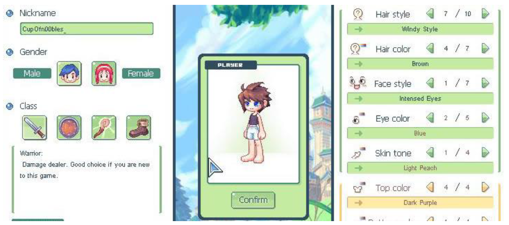
_an example of a customiser


