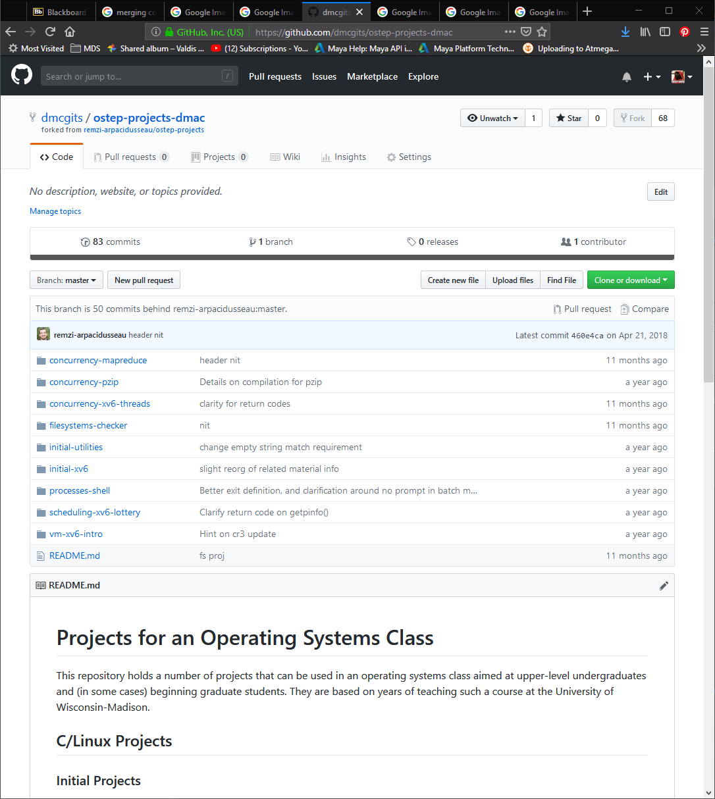
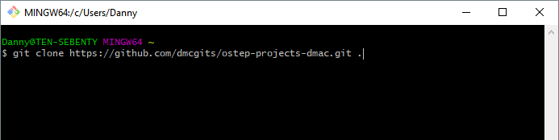
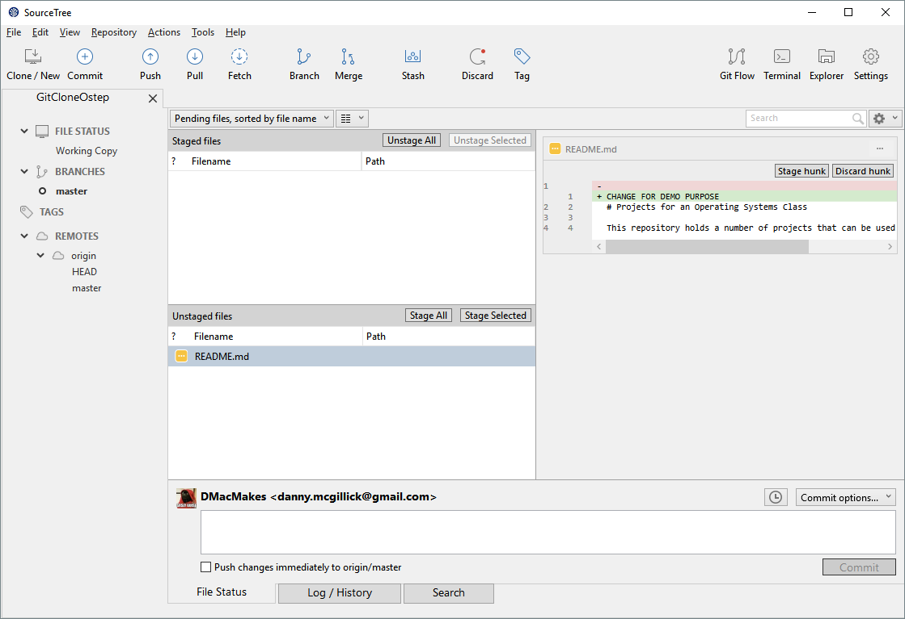
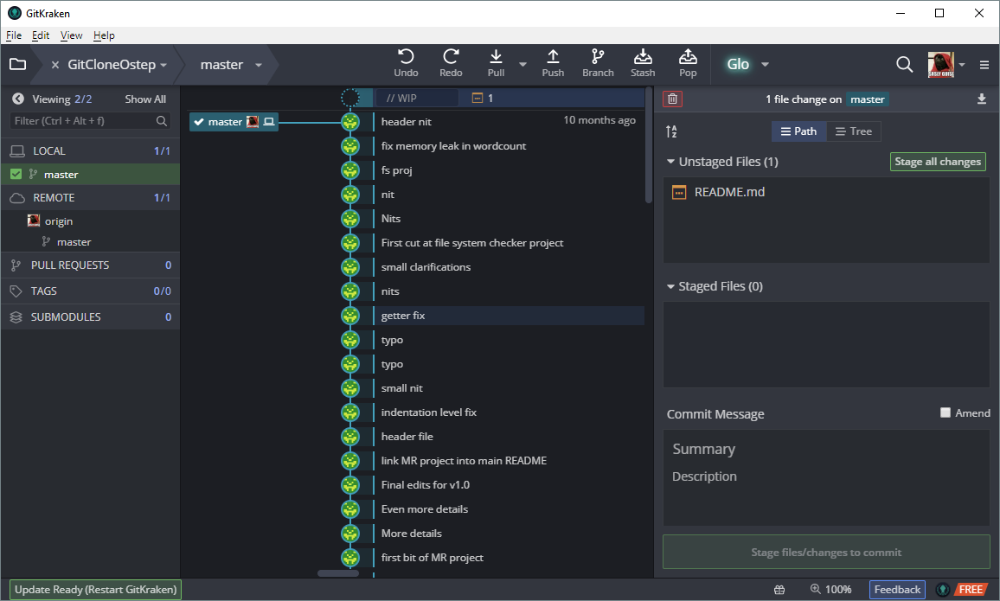
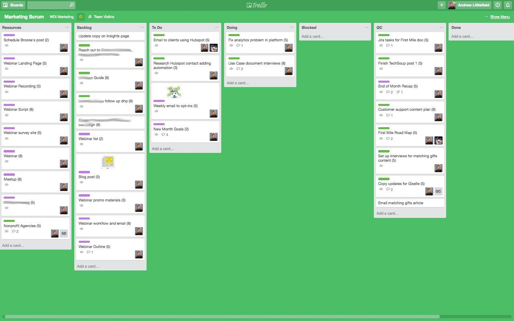

---
html:
  embed_local_images: false
  embed_svg: true
  offline: false
  toc: undefined
export_on_save:
  html: true
---
# Week 5: Design Patterns

Programming leads to lots of code. Lots of code leads to lots of files and objects and madness. 

> Design patterns are abstract ways of thinking about big programs and saves us from madness.


<!-- @import "[TOC]" {cmd="toc" depthFrom=1 depthTo=6 orderedList=false} -->

<!-- code_chunk_output -->

- [ Week 5: Design Patterns
](#week-5-design-patterns)
  - [ Exercides
](#exercides)
  - [ Resources
](#resources)
  - [ Assessment 1 due end of this week.
](#assessment-1-due-end-of-this-week)
    - [ Encapsulation exercise
](#encapsulation-exercise)
    - [ Inheritance/Polymorphism exercise
](#inheritancepolymorphism-exercise)
    - [ Engine Implementation
](#engine-implementation)
  - [ Design patterns and the Gang Of Four
](#design-patterns-and-the-gang-of-four)
  - [ Patterns in Game Design
](#patterns-in-game-design)
    - [ Game Loop
](#game-loop)
    - [ Observer Pattern
](#observer-pattern)
    - [ Component/Composition
](#componentcomposition)
  - [ HacknPlan
](#hacknplan)
  - [ Exercises
](#exercises)
      - [ Free examples of Design Patterns in unity c#
](#free-examples-of-design-patterns-in-unity-c)
      - [ gameprogrammingpatterns dot com:
](#gameprogrammingpatterns-dot-com)
      - [ Do factory
](#do-factory)
  - [ Source Control
](#source-control)
    - [ Git!
](#git)
    - [ Fail: Overwriting changes
](#fail-overwriting-changes)
      - [ Solution: Conflicts and merging
](#solution-conflicts-and-merging)
    - [ Big picture: waterfalls and agility
](#big-picture-waterfalls-and-agility)
    - [ Week to week view
](#week-to-week-view)
  - [ Exercises
](#exercises-1)
  - [ Resources
](#resources-1)

<!-- /code_chunk_output -->

## Exercides
2. Sign up for Trello, put in some cards for assignment 2
3. Github:
   1. Install git and git LFS at home too
   2. Greate a repository on github. When it asks if you want to create a .gitignore, select the Unity template from the dropdown.
   3. Clone that empty repo to your home computer.
   4. Add a hello world unity project, or copy last week's sprite demo tower to the folder.
   5. Add/stage all the files using either the commandline, SourceTree or GitKraken. 
   6. Commit the files and then push to github.

## Resources

1. Trello - google
2. HacknPlan - google
3. Look at more api calls on the Unity tutorial scripting site.
   
## Assessment 1 due end of this week.

Yes, it is **due end of Sunday, March 31.** 
These are brief reminders, in my own words, of what is in each exercise. READ THE PDF BRIEF CAREFULLY.
**[Assessment 1 pdf on the server](https://laureate-au.blackboard.com/bbcswebdav/pid-7197505-dt-content-rid-11808948_1/xid-11808948_1)**

You are delivering 3 Exercises:

### Encapsulation exercise
 Create the `Player` class which is tested by a test class, eg: `TestPlayer`. If you're at all confused about this [do the exercise in week 2's notes.](https://dmcgits.github.io/mds/GPR103/week2_notes.html?nocache#access-functions-aka-properties). It creates a test class, puts it on a sprite, and uses it to create and test a class.

### Inheritance/Polymorphism exercise
 Create a base `Class` with variables and functions. Create classes that derive from it. `Override` a `virtual` function. Put the different child classes in one `List` and iterate over them, calling a function. Almost exactly what we did in [week 3 in the section on polymorphism](https://dmcgits.github.io/mds/GPR103/week3_notes.html#polymorphism). The classes themselves are up to you. Inventory items, types of spells, types of door lock, whatever.

### Engine Implementation
You need to create a `Class` that provides a useful, fairly generic function. This function should make use of **at least 2 Unity API calls** and return a result. Having it call multiple Unity API calls instead of just one is what makes it useful.. otherwise we'd just make the api call. Create a **test class** that shows this off running in the engine.
**We'll write out an example of this today using a Singleton or a static class.**
  
___

## Design patterns and the Gang Of Four

* Patterns of programming design were hotly discussed through the late 70s and 80s
* In 1994 a book called _Design Patterns: Elements of Reusable Object-Oriented Software_ caught on with computer scientists. It was produced by the awesomely named "Gang Of Four". 
* Growth and discussion of pattern design hasn't slowed. 
* Sadly, the Gang of Four were very disappointing in photographs


_The Gang of 4 (+2)_

___

## Patterns in Game Design

Some patterns common to game design

* Game Loop (game logic)
* Composition - Unity components
* Type Object - A little like composition. A way to create variants from a text file rather than a million class definitions.
* Double buffering (graphics)
___

### Game Loop

**Long view:** All games are loops. The menu system. Finding a game, joining, ending. 

**Short view** Every frame is a pass through a loop. 
1: Get user input. 
2: One frame of simulation and consequences
3: Draw the results to the screen, vibrate controllers, play sounds.


_[http://gameprogrammingpatterns.com/game-loop.html](http://gameprogrammingpatterns.com/game-loop.html)_

___

### Observer Pattern

At the core of a lot of modern programs and games is the _Model, View, Controller_ pattern or _**MVC**_. It can create a lot of extra code and inflexibility though, but you can use the simpler underlying _observer_ pattern. 

> The observer pattern is where parts of your code can choose to keep an eye open for certain things that happen to other objects.

Say our subject below is a player:
1. Our player might equip her first magical armour. 
2. The Achievements system hears "magical_armour_equipped" and grants you a "Untouchable. Almost!" achievement and shows a popup.
3. The sound audio system hears the same thing and plays a tingly magic sound.
   


This can be done by passing function pointers around, or having anythign that listens for events implement a certain interface. Next week, we'll do it with events.

Make sure to read up properly on it here, because it's absolutely fundamental and will be a big part of assessment 2:
<http://gameprogrammingpatterns.com/observer.html> 
___


### Component/Composition

How we've been doing things in Unity!

___

## HacknPlan

* Make sure you create an account this week on [hacknPlan](http://www.hacknplan.com/). 
* Then make a project and choose "agile" from the types allowed. 
* Go to _Boards_ (left menu) and sprint 1 (it'll make a first sprint for you.)
* Create a few cards under "art" and "programming" tasks, just to get the hang of it. Expect to make mistakes, it's fine! 


___

## Exercises

1. Finish assignment 1
2. Catch up on Sololearn, you need a certain amount of _c#_ to be automatic. Time you lose looking up basics, or on confusing errors, that's all potential coding time gone.
3. Sign up to HacknPlan. 


#### Free examples of Design Patterns in unity c#

https://github.com/dmcgits/unity-design-patterns-naphier
You can grab the code with gitkraken, sourctree, or typing the following in a dos/bash window:
```sh
git clone https://github.com/dmcgits/unity-design-patterns-naphier
```
#### gameprogrammingpatterns dot com:

Easy to read, gaming focussed.

1. <http://gameprogrammingpatterns.com/component.html>
2. <http://gameprogrammingpatterns.com/double-buffer.html>
3. <http://gameprogrammingpatterns.com/subclass-sandbox.html>
4. <http://gameprogrammingpatterns.com/type-object.html>
   
#### Do factory
 Has loads of patterns explaine in c#, though this time for .net (not unity specific)
 <https://www.dofactory.com/net/design-patterns>

 Storing your source files and collaborating. Project management and planning.


<!-- @import "[TOC]" {cmd="toc" depthFrom=1 depthTo=6 orderedList=false} -->

<!-- code_chunk_output -->

* [Games Programming Week 4](#games-programming-week-4)
	* [Source Control](#source-control)
		* [Git!](#git)
		* [Fail: Overwriting changes](#fail-overwriting-changes)
			* [Solution: Conflicts and merging](#solution-conflicts-and-merging)
		* [Big picture: waterfalls and agility](#big-picture-waterfalls-and-agility)
		* [Week to week view](#week-to-week-view)
	* [Exercises](#exercises)
	* [Resources](#resources)

<!-- /code_chunk_output -->


## Source Control

How do 10, 100, 1000 people work on a project together? How do they do it without constantly overwriting eachother's code?
___

### Git!

Git. Acquire code, merge people's work, keep history, branch out and merge from the main project trunk, much more.

Shots of github:


_A typical github project page_


_Grabbing the cloning url_


_Bash for Windows_



_Sourcetree_


_Git Kraken_

There are loads of tricky things about working on source files with other people:

1. **Overwriting** other people's changes
2. Opening a file someone has changed and **figuring out what they changed**.. was it just additions?
3. 5 people have edited a file and a url for a game server was changed to point to a different region at some point. **Who made the change when, and what was the old value?**
___

### Fail: Overwriting changes

> 1. James grabs PlayerController.cs from the files server and adds crouch movement.
> 2. Darlene does the  same but adds double jump.
> 3. If Darlene copies hers to the server last, it's bye bye crouch movement. If it's vice versa, no more double jump.

#### Solution: Conflicts and merging

Git can do a solid job of **merging changes** automatically, especially if they are in different sections of the file.

When it can't merge changes, it notes a **conflict**. There are numerous interfaces for resolving conflicts, but they all boil down to showing you the two versions and letting you choose which change to keep from either version or hand editing.


___

 ## Project Management

Games are big, people have their own ways of working, and making stuff is complicated.

### Big picture: waterfalls and agility

Usually a team project uses many resources over a fair amount of time to make something more complex than you would make on your own. Even ambitious one-person projects can be similar.

You're attempting to take a big problem and use organisational skills and tools as a scaffolding to make things you can't just plan and hold all in your head.

___

 #### Waterfall development 
 Is the God's Great Plan take on making things. You spend ages refining a document describing your project or game, get sign off, then just build till it's done. Graphic and concept design, modelling, texturing, shaders, animation. Program the code a module at a time till done. It's river passing over multiple falls (milestones) and it travels inexorably from source to destination. 
 
 
 
 > It can certainly make things. Usually, you find a load of things you should have done differently, but often they can't be adjusted. Fine if you're making office software maybe, terrible if you find your game isn't good.
 
 ___

 #### Iterative/agile dev

Iterative development, also referred to as agile, scrum and 200 other changing terms, is a process of sketching out your best idea of the project, and then going through a series of waterfalls on barebones products and features, then increasingly polished features. It has more in common with sketching thumbnails of comic pages, then pencilling, inking and colouring, making changes as you go.


___

### Week to week view

Kanban, Scrum?
Trello, Jira, KanbanTool?

1. backlog (features to go in)
2. pre production
3. ready
4. in production
5. Blocked 
6. QA
7. Approved




___

## Exercises

1. Part 3 of Asessment 1
2. Sign up for Trello, put in some cards for assignment 2
3. Github:
   1. Install git and git LFS at home too
   1. Greate a repository on github. When it asks if you want to create a .gitignore, select the Unity template from the dropdown.
   2. Clone that empty repo to your home computer.
   3. Add a hello world unity project, or copy last week's sprite demo tower to the folder.
   4. Add/stage all the files using either the commandline, SourceTree or GitKraken. 
   5. Commit the files and then push to github.

___

## Resources

1. Trello - google
2. HacknPlan - google
3. Look at more api calls on the Unity tutorial scripting site.
