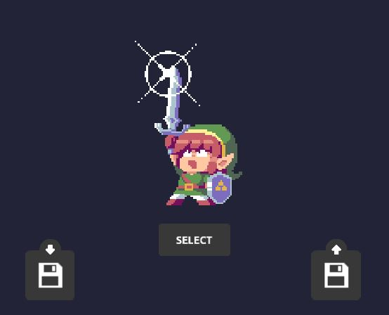
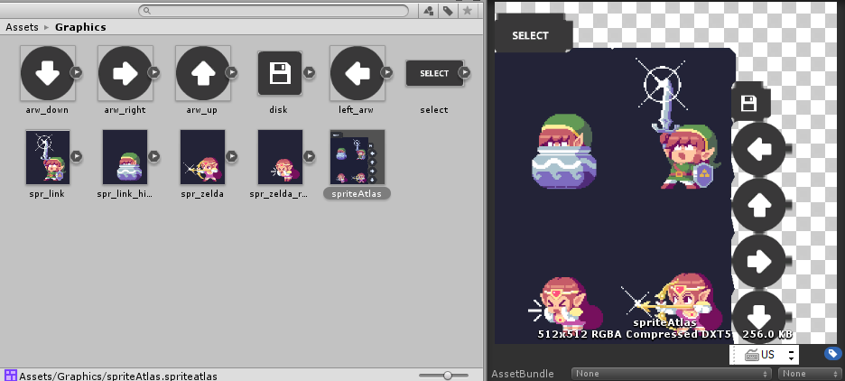
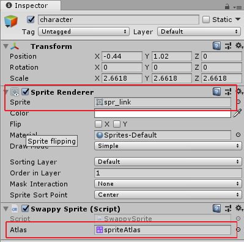

---
html:
  embed_local_images: false
  embed_svg: true
  offline: false
  toc: undefined
export_on_save:
  html: true
---
# Week8: Sprites, saving state

Atlasses, loading and swapping sprites, loading and saving to JSON.


<!-- @import "[TOC]" {cmd="toc" depthFrom=1 depthTo=6 orderedList=false} -->

<!-- code_chunk_output -->

- [Week8: Sprites, saving state](#week8-sprites-saving-state)
  - [Example: Loading sprite from atlas, save and load](#example-loading-sprite-from-atlas-save-and-load)
  - [Loading from a sprite atlas](#loading-from-a-sprite-atlas)
    - [The code:](#the-code)
  - [Load/Save](#loadsave)
    - [What? (config/state)](#what-configstate)
    - [Keeping your stuff ready to save](#keeping-your-stuff-ready-to-save)
    - [Parser/JSON](#parserjson)
    - [Using Json.net in unity](#using-jsonnet-in-unity)
  - [Writing/Reading files.](#writingreading-files)
  - [Recapping inheritance](#recapping-inheritance)
  - [Questions?](#questions)
  - [Resources](#resources)
  - [Todo](#todo)

<!-- /code_chunk_output -->


## Example: Loading sprite from atlas, save and load

I've made a simplified example. Grab this project that uses the sprite swapper from git. You can clone it from this url using _SourceTree_ or click it, then click the green download button (if you're logged in).

<https://github.com/dmcgits/gpr_link_switch_save.git>



---

## Loading from a sprite atlas

There are two easy steps to loading from a sprite atlas. First here's our Graphics folder, note the file names and the packed atlas preview.



Here's the inspector for our character game object, with its **sprite renderer** and slot for a sprite **atlas**.



### The code:

>The code, then, just needs to change the sprite in the renderer, and do so with a sprite pulled from the atlas by file name.

In this simple example I've put it in `SwappySprite`, a component on the character. In your customiser you'd put it on the model.

```cs
[SerializeField]    // Make a slot for our sprite atlas in the inspector
private SpriteAtlas _atlas;  // Make sure you drag it over from the project

private SpriteRenderer _renderer; // keep a reference to our sprite renderer

private void Awake()
{
  _renderer = gameObject.GetComponent<SpriteRenderer>(); // get reference to renderer
}

 private void ChangeSprite()
    {
        // We can assign directly to the renderer's sprite, and
        // the atlas can give us any packed sprite by file name.
        _renderer.sprite = _atlas.GetSprite("spr_zelda");
    }
```

## Load/Save

Before we ask how to save, we need to know what we're saving.

### What? (config/state)

> When we save a game or character we want to go back to where we were. Same ammo, same position on map, monsters in same places etc. 
 
If it's a customiser, we want our character to load, and the interface to be in the right state. If you're a troll warlock you shouldn't see a list of human outfits for example.

To do that, we need to **save the _state_ or _config_ of our game**. If you're using a model this is easy because your state is really just what the variables in your model currently hold.

### Keeping your stuff ready to save

> Whether you use a model/game manager/whatever it's easiest to save that config if you already have it in an object or a struct.

Here's an example struct for our sprite swapper. Structs are basically objects/classes minus the functions (except constructor).

```cs
struct SpriteConfig
    {
        public List<string> names;	// file names of our sprites
        public int index;			// index of displayed sprite

		// simple constructor
        public SpriteConfig(List<string> spriteNames, int spriteIndex)
        {
            names = spriteNames;
            index = spriteIndex;
        }
    }


private void Awake()
{
		// Make a list of filenames
		var names = new List<string>() { "spr_zelda", "spr_link", "spr_zelda_roar", "spr_link_hide" };

        _config = new SpriteConfig(names, 0); // create+init an instance of our SpriteConfig struct
}

```

### Parser/JSON

If we're using an object to store all our state, it would be great if we had a text format that easily held object information. 

> JSON, or Javascript Object Notation, is that text format. 
> 	* It is a very widely used standard
> 	* There are writers and parsers for most languages
> 	* Unity has a crap convertor but the proper c# .net one is free the asset store

Here's some json. It looks a lot like the set notation we use to define a list or a dictionary. You can see a sub object car, which is maybe a dictionary of cars, or an object with 3 variables. You can clear that up on import by specifying the type to convert to.

```json
myObj = {
  "name":"John",
  "age":30,
  "cars": {
    "car1":"Ford",
    "car2":"BMW",
    "car3":"Fiat"
  }
 }
```

The Json .net asset on the store: <https://www.assetstore.unity3d.com/en/#!/content/11347>


### Using Json.net in unity

Converting an object from something in memory to a string you can store in a file is known as _serializing_. It's just a thing you'll remember. Serialize, deserialize. A string is a _series_ of characters.

```cs
using Newtonsoft.Json;
..
string toJson()
{
	// Serialize the SpriteConfig stored in our variable _config
	string configJson = JsonConvert.SerializeObject(_config); 

	return configJson
}

SpriteConfig fromJson()
{
	// If we don't tell deserialize what type of objects to make, it might make 
	// conversions (list? array? object?) we don't want.
	object config = JsonConvert.DeserializeObject(loadedJson);

	// But we can also pass it in the type we want it to produce using
	// our old friends the angle brackets
	SpriteConfig loadedConfig = JsonConvert.DeserializeObject<SpriteConfig>(loadedJson);

	return loadedConfig;
}
```

## Writing/Reading files.

Veeeerry tricky.

```cs
using System.IO;

string _savePath = Path.Combine(Application.persistentDataPath, "swappy_sprite_config.json");

File.WriteAllText(_savePath, configJson); // Save file

```

```cs
if (File.Exists(_savePath)) // Don't try to load a file that isn't there
{
	string loadedJson = File.ReadAllText(_savePath);
}
```

Not really.

## Recapping inheritance

ISE week 8 objects: trucks and snakes.

## Questions?

More on managers/singletons? 

## Resources

## Todo