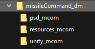
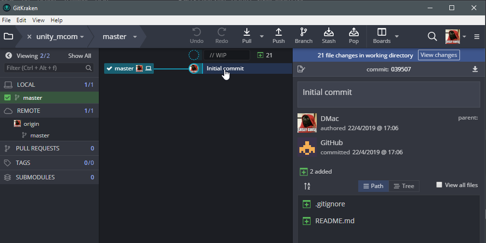
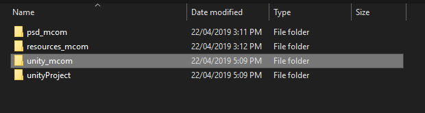
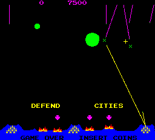
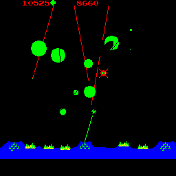

# Week 9

Recap A2.

Look at A3. Our goal is to get rid of the blank page and get things OUT of our head and onto paper/documents/hacknplan/github. Give yourself a base.

<!-- @import "[TOC]" {cmd="toc" depthFrom=1 depthTo=6 orderedList=false} -->

<!-- code_chunk_output -->

* [Week 9](#week-9)
	* [Your todos for next week](#your-todos-for-next-week)
	* [Assessment 2](#assessment-2)
	* [Assessment 3](#assessment-3)
		* [Gameplay](#gameplay)
		* [Set up Hacknplan](#set-up-hacknplan)
		* [Git project](#git-project)
		* [Unity Project](#unity-project)
	* [Art](#art)
	* [Systems and Psuedocode](#systems-and-psuedocode)
		* [Notes/Thoughts doc?](#notesthoughts-doc)

<!-- /code_chunk_output -->

## Your todos for next week

The Unity3D College videos below are more advanced than things I've shared before, but you don't have to understand every part of his videos to benefit.

* Set up your hacknplan, message me a screenshot on blackboard.
* Watch finding objects video
  - [5 ways to reference gameobjects by Unity3D College](https://www.youtube.com/watch?v=ymq2AUckws0)
* Watch prefabs videos. We're on unity 2018.2, so we don't have nested prefabs  yet. 
  - [prefab concepts](https://unity3d.com/learn/tutorials/topics/interface-essentials/prefabs-concept-usage?playlist=17090)
  v=SMH8wY4HQ0I)
  - I haven't watched this yet but I watch his videos on everything, he's great. [prefabs 101 on Unity3D College](https://www.youtube.com/watch?v=46BxZNP0WXk)
* If you like Unity3D College guy, watch his top unity mistakes video and some others. Some stuff will go over your head, but you'll pick things up. Brackeys is solid too if you don't mind lots of smiling man face and bad jokes.

## Assessment 2

My code. Questions, suggestions.

## Assessment 3

pdf: <https://laureate-au.blackboard.com/bbcswebdav/pid-7197509-dt-content-rid-11808950_1/xid-11808950_1>

Missile command using what we've learnt and proper project management.

### Gameplay

<https://en.wikipedia.org/wiki/Missile_Command#Gameplay>

A few design points:
* One trackball, 3 buttons
* 3 batteries have 10 missiles each, each controlled by one button.
* central battery is fastest
* If you're out of missiles before the attack stops, you must watch helplessly.

### Set up Hacknplan

Think of cards as cohesive chunks of work, and as problems that need cracking. Early ones are pretty easy, setting up

* Set up git
* Set up a working folder for the assessment, make aunity project.
* Example structure: 
>  - missileCommand
>    - unity
>    - psd
>    - resources

I add a project code to the end of the folders - super useful when they show up in your quick links or recent folders.

### Git project

Set it up, then clone the project into your `missileCommand/unity`

### Unity Project

Create a unity 2d project in another folder, say unityProject or unityTemp

* Now you can move the contents of the unityProject folder over to the unity folder you checked out from git and delete the empty folder.
* Changes appear in gitkraken
* Stage all the files, commit, push.

## Art

Here's some pixel art cut from the arcade/atari original. They're tiny, so you want to scale them up in _photoshop_ or _krita_ using the  _nearest neighbour_ resampling option. Otherwise you can bring them into Unity at this tiny size and set _filtering_ to _point_.

[arcade art starter zip](assets/week9/arcade_art.zip)

More screens to pull from:

## Systems and Psuedocode

Before figuring out classes needed, write down all the systems you can think of in this game

* level setup and oversight: level manager. runs the model, starts stops game.
* game world model: contains entities and updates them, notifies listeners.
* Enemy attack spawner - wave
  * incoming missiles
  * planes
* player missile firing
* scoring system
* hud 
* gameplay physics: 
  * enemy missiles colliding with explosions, cities
  * planes being destroyed

Try writing basic pseudocode, just to get your brain going, starting with simplest form of game.

### Notes/Thoughts doc?