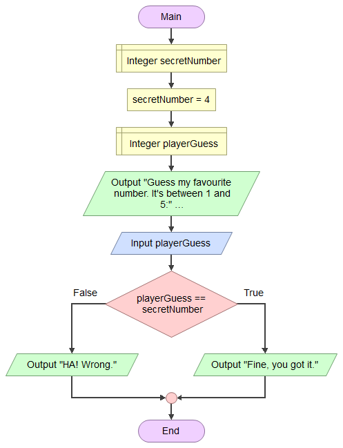
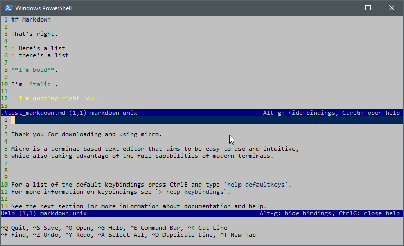
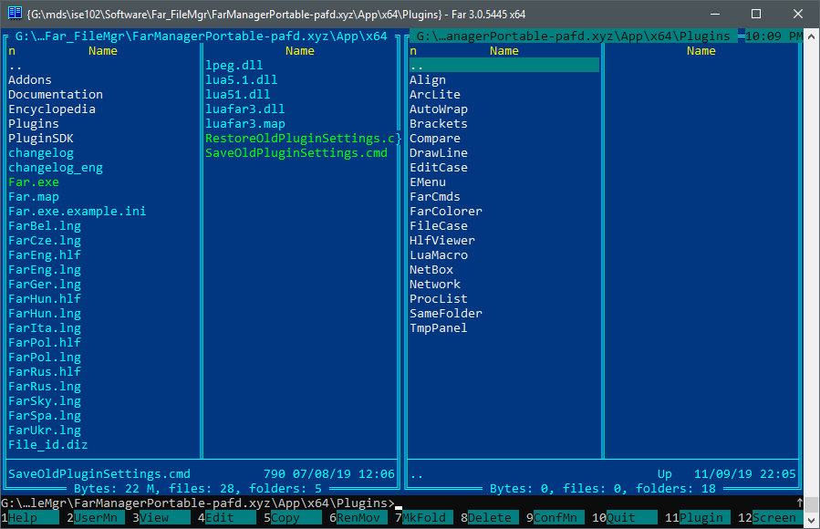

---
html:
  embed_local_images: false
  embed_svg: true
  offline: false
  toc: undefined
export_on_save:
  html: true
---
# ISE102: Intro To Software Engineering

<!-- @import "[TOC]" {cmd="toc" depthFrom=1 depthTo=6 orderedList=false} -->

<!-- code_chunk_output -->

1. [ISE102: Intro To Software Engineering](#ise102-intro-to-software-engineering)
   1. [Learning:](#learning)
   2. [Weekly Lectures](#weekly-lectures)
   3. [Software](#software)
      1. [Flowgorithm](#flowgorithm)
      2. [Micro text editor](#micro-text-editor)
      3. [Far file manager](#far-file-manager)
   4. [Book Chapters](#book-chapters)

<!-- /code_chunk_output -->

## Learning:
  - to create games in C++.
  - how to solve a problem in code
  - how code becomes software

## Weekly Lectures
* [Week 1: High Low](week1_notes.html)
* [Week 2](week2_notes.html)
* [Week 3](week3_notes.html)
* [Week 4](week4_notes.html)
* [Week 5](week5_notes.html)
* [Week 6](week6_notes.html)
* [Week 7](week7_notes.html)
* [Week 8](week8_notes.html)
* [Week 9](week9_notes.html)
* [Week 10](week10_notes.html)
* [Week 11](week11_notes.html)
* [Week 12](week12_notes.html)

## Software
[Download this zip](assets/week1/flogorithm_micro.zip) containing Flowgorithm and Micro ready to run.

### Flowgorithm
* Portable version (no install needed) [download](http://flowgorithm.altervista.org/#elf_l1_Lw)
* Documentation:
  - [All](http://www.flowgorithm.org/documentation/)
  - [Operators](http://www.flowgorithm.org/documentation/operators.htm) (multiply, times, equals, assign, etc): 

)

### Micro text editor

### Far file manager

## Book Chapters

* [Chap 1: IO, Variables](book_1/chap1_cpp_games.pdf)
* [Chap 2](book_2/chap2_cpp_games.pdf)
* [Chap 3](book_3/chap3_cpp_games.pdf)
* [Chap 4](book_4/chap4_cpp_games.pdf)
* [Chap 5](book_5/chap5_cpp_games.pdf)
* [Chap 6](book_6/chap6_cpp_games.pdf)
* [Chap 7](book_7/chap7_cpp_games.pdf)
* [Chap 8](book_8/chap8_cpp_games.pdf)
* [Chap 9](book_9/chap9_cpp_games.pdf)
* [Chap 10](book_10/chap10_cpp_games.pdf)
