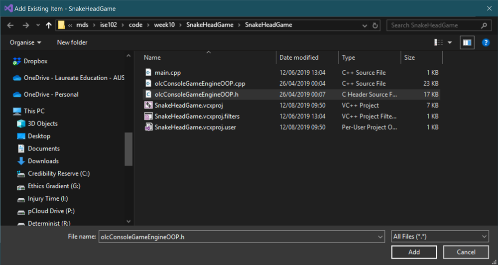
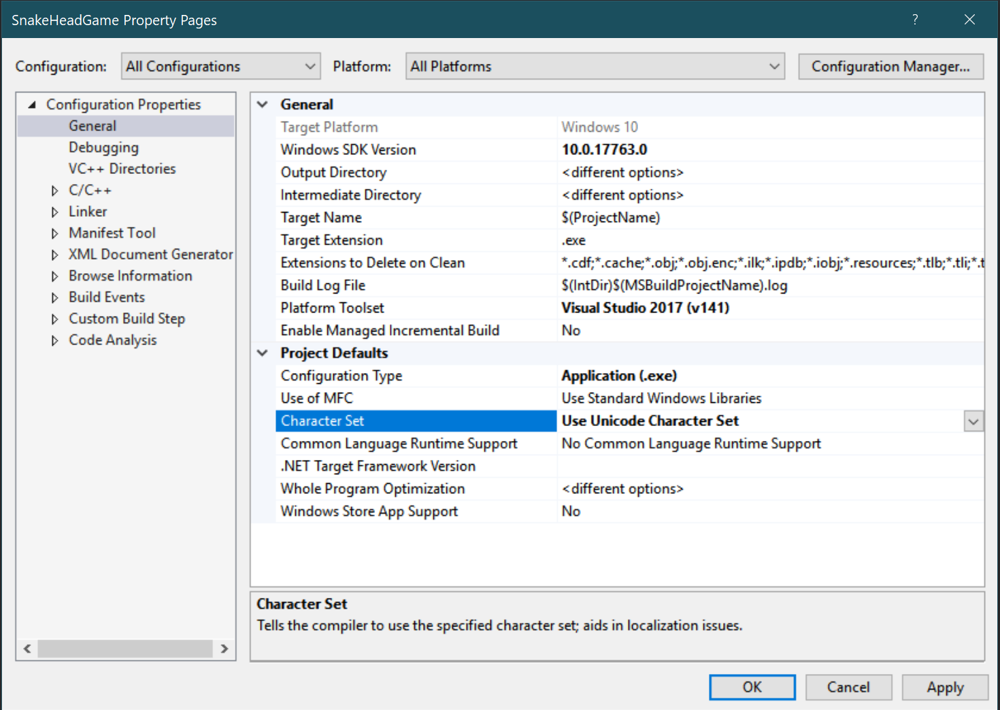

---
html:
  embed_local_images: false
  embed_svg: true
  offline: false
  toc: undefined
export_on_save:
  html: true
---
# Week10 Drawing and Moving

A fly stands in for our snake.

<!-- @import "[TOC]" {cmd="toc" depthFrom=1 depthTo=6 orderedList=false} -->

<!-- code_chunk_output -->

- [Week10 Drawing and Moving](#week10-drawing-and-moving)
  - [Resources](#resources)
  - [A refresher on simulated things](#a-refresher-on-simulated-things)
  - [Rendering / Drawing](#rendering-drawing)
  - [Building on last week's hello world base](#building-on-last-weeks-hello-world-base)
    - [A Snake Head is data](#a-snake-head-is-data)
      - [SnakeHead.h](#snakeheadh)
      - [SnakeGame.h key parts](#snakegameh-key-parts)
      - [Snake Game](#snake-game)
    - [Rendering the action](#rendering-the-action)
  - [Movement](#movement)
    - [Torment: the wormhole](#torment-the-wormhole)
  - [Thoughts on things following things](#thoughts-on-things-following-things)

<!-- /code_chunk_output -->

## Resources

* Grab this: [olc and termcolor include files](assets/week9/olcAndTermColor.zip)

* [week 10 code html](week10_code.html)

## A refresher on simulated things

Remember, programming is about imagining a world, then converting it into data and the code that moves/changes that data. 

Looking at a pic of snake, some things we can imagine:

> * A magic garden that grows enchanted fruit. 
>  - It has wormhole walls that deliver you to the opposite side, so the only escape is death. 
> * A snake who grows longer by a segment when eating the fruit.
>  - It can turn only in 90 degree increments, meaning it is limited to travelling up, down, left or right.
>  - the snake's body flows through these 90 degree turns after it
>  - If it encounters its own body it thinks it has met a dangerous enemy and bites itself to death.

## Rendering / Drawing

Once you have made your simulation, you output it somehow. In a game, we do it in realtime, often as fast as our graphics card can manage. I'll go with a pixel style, reflecting the tiny screens of old Nokias, but it could easiliy be 3D, 2D sprites, Virtual Reality, whatever. 

* Some things we'd draw in a snake game:
  - Grass/ground
  - A border if you like
  - A snake
  - Fruit

## Building on last week's hello world base

We're going to design a snakes head, then make one and move it around the torture garden. 
* At first it will escape
* You will put it in the eternal prison of the magic garden.

To draw them, we'll build on the SnakeGame we made last week. It inherited from the olcConsoleGameEngineOOP class, and overrode the OnUserCreate and OnUserUpdate functions.


For a refresher and more instructions, watch [One Lone Coder's getting started guide:](https://www.youtube.com/watch?v=u5BhrA8ED0o)
[](https://www.youtube.com/watch?v=u5BhrA8ED0o)

> To draw most anything we can use _olcConsoleGameEngine's_ ```Draw()```, ```Fill()``` and ```DrawString()``` functions. 

Remember to add the .h file under _Header Files_ using "Add Existing.." and cpp file under _Source Files_ the same way.



And don't forget to use the Unicode character set for OLC projects



### A Snake Head is data

Our Snake Head, drawn or not, is a thing with properties: a location (x, y) and a colour. It has a size too but it's so small we'll just call it a pixel. 
* It's time for a new type of data collection, a `SnakeHead`.
* It's a class, but since we only have variables and no functions, we only need an h file.

#### SnakeHead.h

```cpp {.line-numbers}
#pragma once

class SnakeHead
{

public:
  float x = 0.0f;
  float y = 0.0f;
  float speed = 0.0f;
  int colour = 0;

  // We're using floats for x,y,speed because at the rate the screen updates,
  // maybe 800x a second, moving 1 whole pixel per frame would
  // put us 770 pixels off screen after 1 second
};
```

#### SnakeGame.h key parts

These are snippets, full version in the code file.
```cpp

class SnakeGame : public olcConsoleGameEngineOOP
{

protected:
  int _score = 232995;

  virtual bool OnUserCreate();
  virtual bool OnUserUpdate(float fElapsedTime);

  bool isUpKeyHeld_ = false;
  bool isDownKeyHeld_ = false;
  
  const int START_X = 10;
  const int HEAD_COLOUR = BG_DARK_YELLOW | FG_BLUE;
  const int GROUND_COLOUR = FG_DARK_YELLOW;
 
  SnakeHead _head;

  void RenderWorld();
};
```
private variables can feel bad at first, being defined at class level instead of in functions. Kinda like using globals. They're not nearly as bad though because we're encapsulating them. Still, use locals in your functions wherever they make sense.

#### Snake Game

Initialising our game. Weonly need to set up the head for now.
```cpp {.line-numbers}
// Runs when you create "SnakeGame" because you extended olcConsoleGameEngineOOP
// This is where you put everything in their starting state/position
bool SnakeGame::OnUserCreate()
{
  _head.x = _head.y = (float)START_X;
  _head.speed = 0.02f;
  _head.colour = HEAD_COLOUR;
  
  return true;
}
```

```cpp {.line-numbers}
// Runs many times a second in "SnakeGame" because you extended olcConsoleGameEngineOOP
// This is where your game action happens
bool SnakeGame::OnUserUpdate(float fElapsedTime)
{
    // Get input
    _isUpKeyHeld = m_keys[VK_UP].bPressed || m_keys[VK_UP].bHeld;
    _isDownKeyHeld = m_keys[VK_DOWN].bPressed || m_keys[VK_DOWN].bHeld;
		
    // update everything
    if (isUpKeyHeld_) _head.y -= _head.speed;
		if (isDownKeyHeld_) _head.y += _head.speed;;

    // Draw the world
    RenderWorld();
    
    // OnUserUpdate has to return true for the engine to continue
    return true;
}
```
### Rendering the action

```cpp {.line-numbers}
void SnakeGame::RenderWorld()
{
  // Clear the screen by drawing ground colour
  Fill(0, 0, ScreenWidth(), ScreenHeight(), PIXEL_SOLID, GROUND_COLOUR); //
  // Check the up and down states of our arrow keys on screen
  DrawString(2, 2, L"UP: " + to_wstring(isUpKeyHeld_));   DrawString(2, 3, L"DN: " + to_wstring(isDownKeyHeld_));
  Draw((int)_head.x, (int)_head.y, PIXEL_SOLID, _head.colour);
}
```

## Movement

We can move our fly by stepping a little way each frame.

```cpp
struct Fly
  {
    int x;
    int y;
    int speed;
    int colour;
  };

...

bool isUpKeyHeld_ = false;
bool isDownKeyHeld_ = false;

...

bool OnUserUpdate(float fElapsedTime)
{
    // Get input
    isUpKeyHeld_ = (m_keys[VK_UP].bHeld || m_keys[VK_UP].bPressed) ? true : false;
		isDownKeyHeld_ = (m_keys[VK_DOWN].bHeld || m_keys[VK_DOWN].bPressed) ? true : false;

    // update everything
    if (isUpKeyHeld_) _blueFly.y -= _blueFly.speed;
		if (isDownKeyHeld_) _blueFly.y += _blueFly.speed;;

    // Draw the world
    RenderWorld();
    
}

```

### Torment: the wormhole

```cpp

if (_blueFly.y == -1)
  {
    _blueFly.y = ScreenHeight();
  } else if (_blueFly.posY == ScreenHeight()+1)
  {
    _blueFly.posY = 0;
  }

```

## Thoughts on things following things

To follow something you have to know where it's been. It has to have left a record, or be willing to answer your question: what's the last pixel you were in?

The world remembers (history book/story teller) or the leader you are following remembers.
