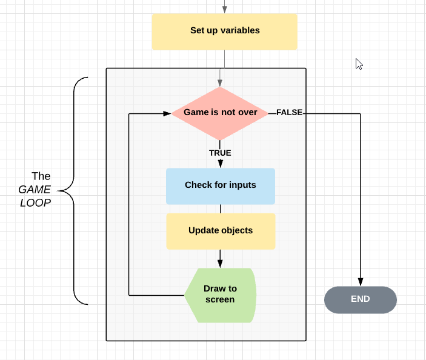
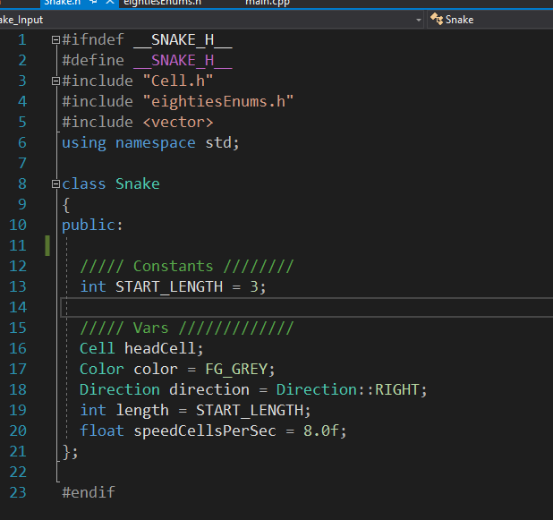
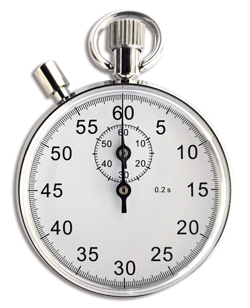
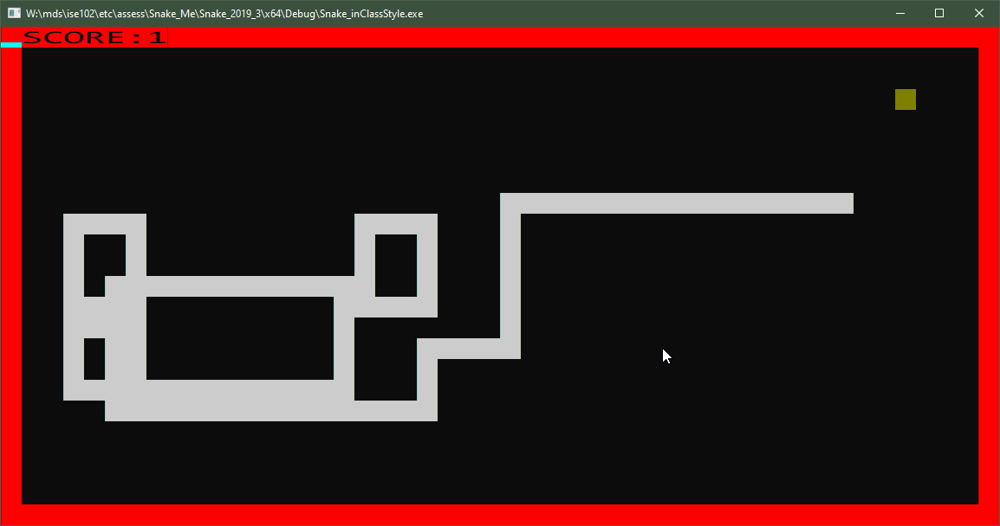
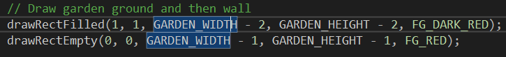

---
html:
  embed_local_images: false
  offline: false
export_on_save:
  html: true
---
# Week 11: A working game


<!-- @import "[TOC]" {cmd="toc" depthFrom=2 depthTo=2 orderedList=false} -->

<!-- code_chunk_output -->

- [Completing the game loop](#completing-the-game-loop)
- [Drawing a one pixel snake.](#drawing-a-one-pixel-snake)
- [Refresher: How to submit assessment:](#refresher-how-to-submit-assessment)
- [The middle of the game loop: Collisions!](#the-middle-of-the-game-loop-collisions)
- [Thoughts: Menus in frame based game](#thoughts-menus-in-frame-based-game)
- [Game over](#game-over)

<!-- /code_chunk_output -->

## Completing the game loop

Everything comes back to the game loop.



We've learned about classes and objects, which is critical. 

### Last weeks code
The task during the week was to add a Snake class to your code.

Check yours against mine:


_Today's code below will expect this snake.h, but you can modify yours or the code a bit._

### Input and update
For the game loop though, so far **we only have setup and output/display**.

It's time to **capture input** and **update our objects.**

First, save the latest version of [the eightiesGame headers](assets/week11/eightiesGame_week11.zip) to your downloads folder.

### Listening for keys
  You can use a char for a alphabetic/numeric/punctuation keys:
  - keyIsDown('A') 
  
  For specials, use a Microsoft-defined constant called a Virtual Keycode:
  - `keyIsDown(VK_SPACE)` for example, or `keyIsDown(VK_RIGHT)` 
  List of **virtual keycodes** provided by Microsoft:
  https://docs.microsoft.com/en-gb/windows/win32/inputdev/virtual-key-codes
  
### Exercise: Capturing keypresses

// PICTURE: Input code

### So, getting direction

We listen for keys that the game allows, then we set direction accordingly.

// DIAGRAM: replace with screenshot.

```
// Top of file: 

Direction getDirectionInput();

int main()
{
  // 1. Get input
  Direction kbDirection = getDirectionInput();

  // 2. Move things, update objects

  // 3. Draw everything
  drawTheGame(snake);
}


Direction getDirectionInput()
{
  Direction direction;
  
  if (keyIsDown(VK_UP) || keyIsDown('W')) // Allowing cursor keys or WASD
  {
    direction = Direction::UP;
  } 
  else if (keyIsDown(VK_LEFT) || keyIsDown('A'))
  {
    direction = Direction::LEFT;
  }
  // CRISIS! If a player presses UP and LEFT or W and A at the same time..
  // one of those keys has to win. How do we choose? There's no right answer.
  // We just have to pick an order.
  return direction;
}
```

## Drawing a one pixel snake.

Your task during this week was to, at minimum, make a Snake class. It should have a location for the snake's head and a color for the snake,along with speed and direction. In my example, I have headCell and color.

To draw it, we call drawpixel.

```cpp
drawTheGame(Snake snake)
{
  drawPixel(snake.headCell.x, snake.headCell.y, snake.color);
}
```

### Ticking stopwatch
The main loop of a game has different names in game engine making. 
* You might call it a _frame_, or an _update_.
* Unreal Engine calls it a **tick**, which is instructive. The game  loop isn't stopping and waiting for you, it's the march of time.
  



### Controlling speed

The _game loop_ runs as fast as the computer can run, often ticking much faster than we want to move something or draw to the screen.
  - This simple game can loop over 1000x a second.
  - Moving every frame would be insane. The snake would be moving at over 1000 cells per second.

  Instead, lets move x times per second, say 10. That means we'd need to wait 1/10 = 0.1 seconds to move.
  - Code is already in RandomPixel.
  - Apply it to our game.
  
### Missed inputs 1
If we're only checking for inputs when we're willing to move the snake we'll miss a lot of inputs. The snake speed might be as slow as 10 cells per second, and 100ms is a long time in key press land.

So, we check for inputs every frame.
  - We can still only move at our slower rate
  - Since nothing changes unless the snake moves, we only need to update the screen when our snake moves.

### Missed inputs 2

Wait! If people input too quick, we'll still miss key presses! How?
  - Imagine moving up screen to get a fruit, you have to turn super quickly to avoid hitting the wall.
  - /// DIAGRAM:: Snake approaching fruit on wall.
  - People going up screen will rapidly press LEFT, then DOWN to turn around, by "drumming" their fingers down. Move your hand down in one movment but have the index land on _LEFT_ first, your middle finger on _DOWN_ a fraction of a second later. In fighting games it's called _plinking_.
  - If it's done very fast the newDirection will be overwritten with _DOWN_ before it's time to move again.
  - /// DIAGRAM:: frames being drawn over time down the screen, and key presses next to it. Easy to understand.
  - Changing direction to DOWN while going up will either:
    - run the head into the body, causing death
    - be ignored, if you don't thing reversing direction is a game-over offense.

#### Forcing the issue
Force a move & draw as soon as a key is pressed
 
### Drawing a clean frame each time
Our snake leaves an endless trail if we don't clear the screen. How do we clear the screen?



#### Clearing is filling

> Clearing the screen is just filling all cells with background colour.

I've added functions to eighties game to clear draw filled rectangles and empty ones.




## Refresher: How to submit assessment:
 Remember:
  - Check your naming conventions
  - Do not rename your project folder, main.cpp, or move any files around before submitting. Don't break stuff!
  - Make sure your delivered files work. Unzip the zip you made into a temporary folder, then go in and double click the sln file. Test that it all opens and compiles properly.
  
#### Conventions
Week 6 notes cover the [naming conventions](https://dmcgits.github.io/mds/ISE102/week6_notes.html#checking-your-coding-conventions). Do it, it's worth good marks!
  
#### Zipping and naming
Zipping your files and naming the zip file is the same as in Assessment 1, but with "SnakeGame" or "Snake" instead of "SlotsGame".
    - Instructions for how to find and zip your solution folder are [here in the week 6 notes.](https://dmcgits.github.io/mds/ISE102/week6_notes.html#delivering-assessment-1-files)

## The middle of the game loop: Collisions! 

Collisions happen when two solid objects, say a hatchback and an SUV, try to occupy the same space. When it happens, there are repurcussions.

#### Game loop w collisions:  
1. Check for inputs 
2. Update objects
  2a. move things
  2b. Check if things occupy the same space
  2c. Decide the repurcussions (benefit or cost?)
3. Draw the screen
  
### Collisions in Snake

1. Snake tip sharing cell with wall
   1a. Consequence: Snake succumbs, game ends.
2. Snake sharing cell with fruit
   2a. Consequence: Snake grows a segment, score increases by 1, Fruit relocates
3. Snake tip sharing cell with own body
   3a. Consequence: Snake succumbs, game ends.
  

## Thoughts: Menus in frame based game
  - write strings
  - Waiting for keypress just like movement
  - Mode/state of game: menuscreen, game screen

## Game over
Our game simply stops right now. To get a polished result, you'll need to put a message on screen indicating the game is over, and make sure people looking at the defunct snake can see why.