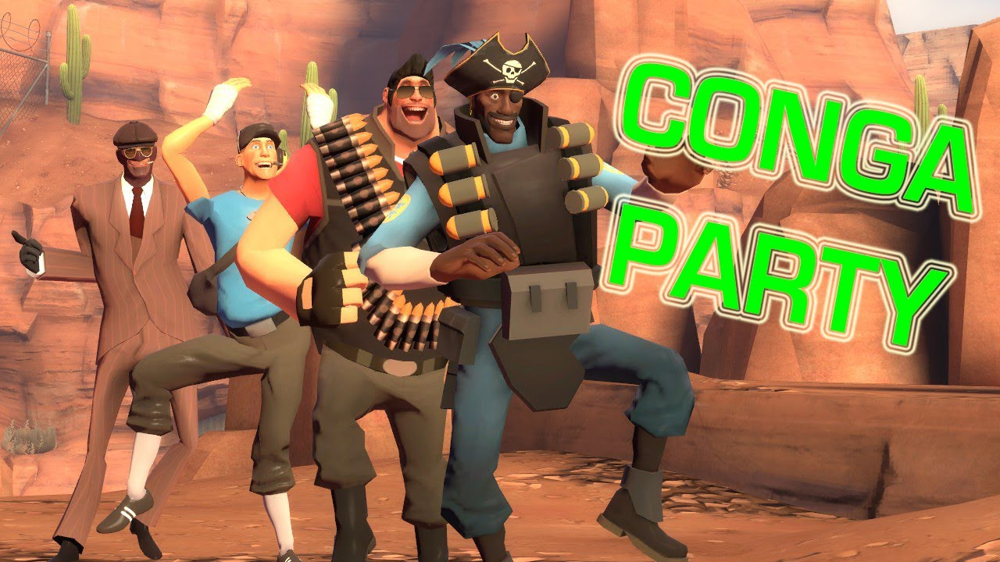
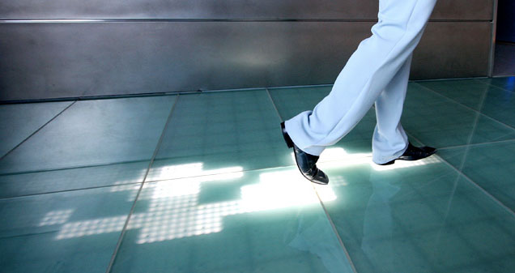
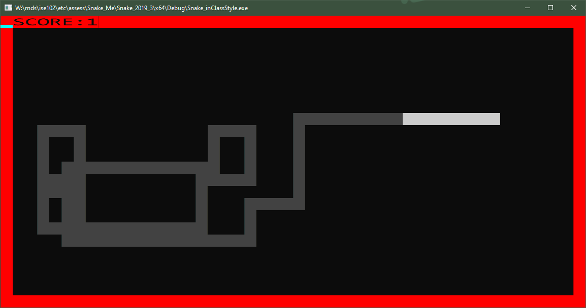
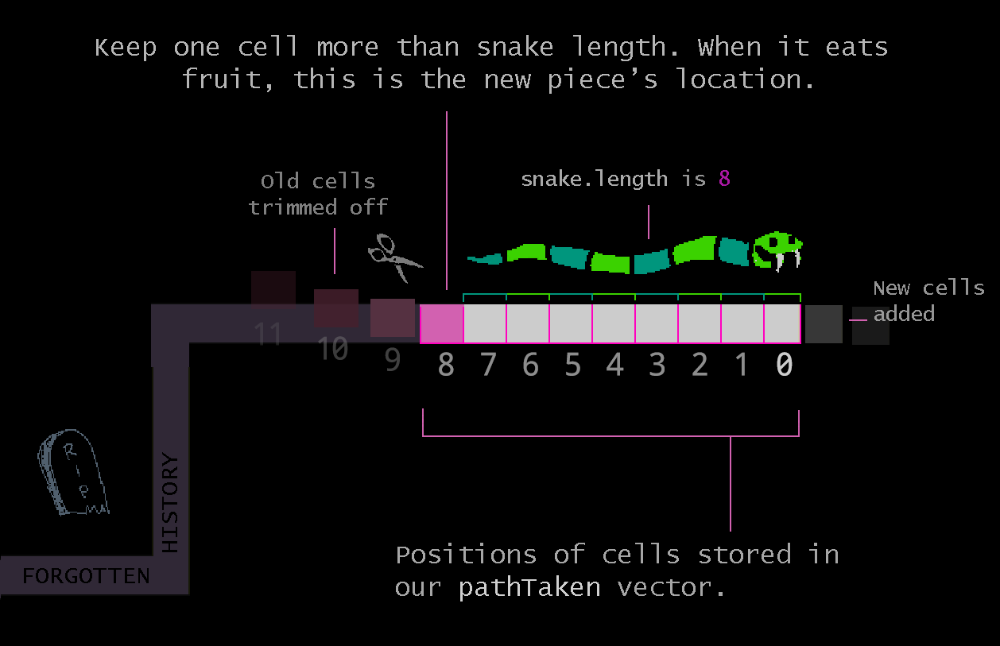

# Week 12: Slithering

## Assessment 3: final stage

* Reminder of what'll get marks.
    // RUBRIC INFO
* Flow and feel:
  - Forget it's c++, that it's a uni project: what's missing?
  - People play the game for a max snake length and score. Make sure they get time to know/bask in their results
  - People need a chance to see the game is open and play - Get a "press to start" option in.
* Extra features:
  * Rubric values extra features added on top of what I've walked you through. Shows you can bend what you know toward fun. // WORDING

## Moving a Snake

### Segments following along

The snake is a conga line. As the leader dancers forwards, the next in line congas along after them to fill the gap. 




### Super simple: Draw your history



  * Remember when we didn't clear the screen? We had one long noodle. Along the entire path taken by the snake head there were white pixels left behind.
  * Just by not being erased, the screen is acting as a record of the path taken.
  
  
  * If we could clear everything except the last few cells of path taken we'd have a moving snake. 
  
  
#### Clear and draw recent history
We could get that same effect if we cleared the screen but had a record of our recent history: we could just draw those pixels again.
  - We'd need to store the cells we'd travelled through using memory.
  - How can you **store a long list** of values in memory using C++? A **vector**. 
  - Every time we move, add the cell's location to the vector. That's history.

    ```cpp
    // Declare a collection to hold the cells along the path we've travelled.
    // = {} initialised it as an empty collection
    vector<Cell> pathTravelled = {}; 

    // If we calculate the new head position into a Cell called "cellTo", add it to the vector
    pathTravelled.push_back(cellTo);
    ```

#### Adding to the beginning of a vector

- We're dealing with recent history though. It'd be nice to push stuff into the start of our vector, and later trim off any excess history.

You can insert things into a vector at any position.  C++ provides handy references to certain places, like `myVector.begin()`. More documentation // HERE

```cpp
  // Insert cellTo at the beginning of the vector
  pathTravelled.insert(pathTravelled.begin(), cellTo);
```
If you **start at 5,5** and move right for a few frames, the vector will look like so:
```
0: 8,5  // current cell
1: 7,5
2: 6,5
3: 5,5  // starting cell
```
#### Trim what we don't need


