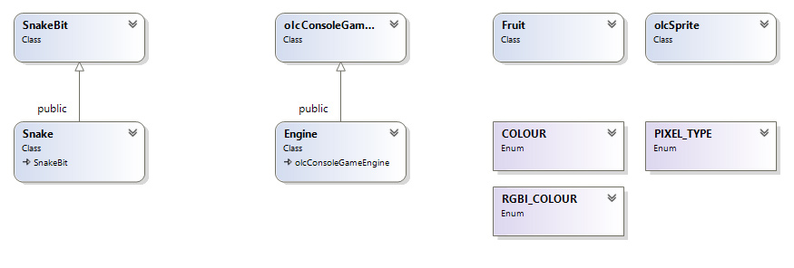
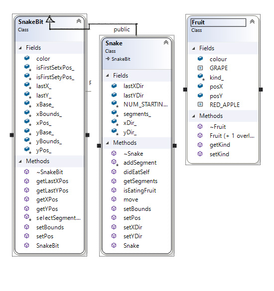

---
html:
  embed_local_images: false
  embed_svg: true
  offline: false
  toc: undefined
export_on_save:
  html: true
---
# Week 12 - Working on Snake


<!-- @import "[TOC]" {cmd="toc" depthFrom=1 depthTo=6 orderedList=false} -->

<!-- code_chunk_output -->

1. [Week 12 - Working on Snake](#week-12---working-on-snake)
	1. [Snake!](#snake)
		1. [We're stuck, how do we add the body/tail?](#were-stuck-how-do-we-add-the-bodytail)
			1. [Train engines and carriages](#train-engines-and-carriages)
			2. [The trick question](#the-trick-question)
	2. [One way to make a Fruit class](#one-way-to-make-a-fruit-class)
		1. [Storing fruit in a vector](#storing-fruit-in-a-vector)
		2. [How do you know you ate fruit?](#how-do-you-know-you-ate-fruit)
		3. [How do you add more to your snake?](#how-do-you-add-more-to-your-snake)
	3. [How do you know if you ate yourself?](#how-do-you-know-if-you-ate-yourself)
	4. [How do I quit?](#how-do-i-quit)
	5. [Class Diagrams](#class-diagrams)

<!-- /code_chunk_output -->


## Snake!

We're working on the assignment.

I'll come around and check with everyone, but feel free to ask questions.

<!--
### We're stuck, how do we add the body/tail?

To solve the programming puzzle, solve the real world problem:

> How do articulated things move?

---

#### Train engines and carriages

Think of a train and carriages: 
* Where is the force applied to the rails?
* How is it transferred to the carriages?

If the engine is pulling, the carriages are passive and rely on their links. 

A question arises: 
> Carriage a is in front of b: is carriage a dragging b along? Or is b clinging to a for a ride? 

Both are true, like acrobats performing monkey grip. But in code `a` is either commanding `b` to its next position, or `b` is interrogating `a`.

---

#### The trick question

Trains can be pushed by the rear engine. 
* The snake doesn't have to be a head pulling segments. 
* The tail could be pushing all segments ahead of it, and the head only chooses the direction.

---
-->

## One way to make a Fruit class

This Fruit class has some static constants. They are constants you can access from the Class without ever making an object.

Due to a weirdness with C++ they are handy for a case statement:

> **Quick Question**: Why can't I use a regular  `const` in the `case` bit of my `switch` statements? Why does it tell me "not a constant expression"
> **Answer:** You can do it though by making your `const` a `static const`. The full explanation is long and.. not satisfying.


```C++
// Fruit.h
#pragma once

class Fruit
{

public:
		// Constants
	static const int RED_APPLE	= 1;
	static const int GRAPE		= 2;

		// Variables
	int		posX		= 0;
	int		posY		= 0;
	int		colour		= 0;

		// Construct
	Fruit	();
	Fruit	(int posX, int posY, int kindOfFruit);
		// Destroy
	~Fruit	();

	// Member Functions
	int		getKind	();
	bool	setKind	(int kind);
	
protected:
	
	int _kind	= 0;
	
};
```
Here you can see the fruit type constants being used in a case statement.

```C++
#include "Fruit.h"
#include "rgbi_colours.h"
#include <vector>

Fruit::Fruit()
{
}

Fruit::Fruit(int x, int y, int kindOfFruit = Fruit::RED_APPLE)
{
	posX = x;
	posY = y;
	setKind(kindOfFruit);
}

Fruit::~Fruit()
{
}

bool 
Fruit::setKind(int kind)
{
	_kind = kind;
	
	switch (_kind) 
	{
	case (RED_APPLE):
		colour = FG_RED | BG_RED;
		break;
	case (GRAPE):
		colour = FG_MAGENTA | BG_MAGENTA;
		break;
	}
	return (true);
}

int
Fruit::getKind()
{
	return _kind;
}
```
 ---


_Fruit class diagram_

### Storing fruit in a vector

To use these `Fruit` as they come and go, we need to track them in a collection.  We've used arrays like `Fruit myFruitArray[5]` but they're inflexible. The `vector` class is a very handy replacement.

> Note: We use of `<TypeOfContents>` to define the type of data our vector holds. Or you could think of it as `<ClassOfContents>`. We haven't seen angle brackets used this way before.

```C++
	// include the vector class from the standard library
	#include <vector>
	
	// How to declare an empty vector to hold Fruit objects
	// vector<TypeOfContents> nameOfVector;
	vector<Fruit> fruits;

	// Create a new fruit at x=5, y=5. Make it a Red Apple
	Fruit apple1 = Fruit(5, 5, Fruit::RED_APPLE);
	
	// Push it on to the back of the vector.
	fruits.push_back(apple1);

	// Some example vectors of other types:
	vector< int > goalsIScoredInEachGameThisSeason;
	vector< string > linesOfMySadPoem;
	vector< Hat > myTeamFortressHats;
	vector< Achievement > cheevs;

```

---

### How do you know you ate fruit?

Fruit has a position. You have a position. But there are many fruits. You'll need to **step through your vector with a loop**.


```C++ {.line-numbers}
// A function that checks if we're eating fruit, and returns true
// if we are. Takes a vector of objects of the Fruit class.
bool isEatingFruit( vector< Fruit > fruits )

	for (int i = 0; i<fruits.size(); i++)
	{
		// Get the fruit at i (first time 0, second time 1 and so on)
		Fruit fruit = fruits[i];
		
		// Use an if here to check if snake head x,y
		// match fruit x-y
		
	}
	return(false);
}
```

<!--
// Is it at the same point on the screen?
if (xPos_ == fruit.posX && yPos_ == fruit.posY) {
	// Then we ate the fruit!
	// Grow.
	addSegment();
	
	return(true);
}-->
<!--
### How do you add more to your snake?

Who should add the segments? The snake or the engine?

___ 

## How do you know if you ate yourself?

Ask these easy questions:
1. Where is my head?
2. Where is each segment of my body?
3. Is my head.. on any of my body segments?
   
Feels like the fruit question doesn't it?

---

## How do I quit?

Return type of `OnUserUpdate()` will do for now.

---

## Class Diagrams



_Top level class diagram_



_expanded class diagram_
-->