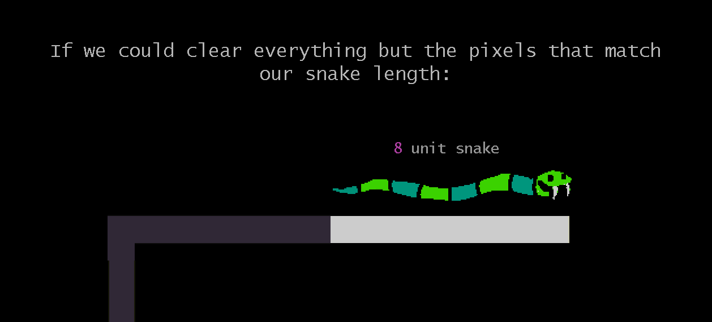
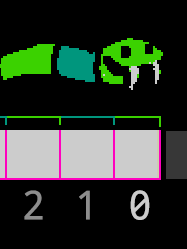

# Week 12: Slithering

## Assessment 3: final stage

* Reminder of what'll get marks.
    - [Ultimo Assessment 3](https://laureate-au.blackboard.com/webapps/blackboard/content/listContentEditable.jsp?content_id=_7976100_1&course_id=_76681_1)
    - [Online Assessment 3](https://laureate-au.blackboard.com/webapps/blackboard/content/listContentEditable.jsp?content_id=_7956906_1&course_id=_76906_1)
* Flow and feel:
  - Forget it's c++, that it's a uni project: what's missing?
  - People play the game for a max snake length and score. Make sure they get time to know/bask in their results
  - People need a chance to see the game is open and play - Get a "press to start" option in.
* Extra features:
  * Rubric values extra features added on top of what I've walked you through. Shows you can bend what you know toward fun. As above.


### Moving a snake 1: Conga.

There are many ways to move a snake. I'll briefly cover this method, and go in depth with the next.

In Conga line:
- the leader dances forwards
- the next in line feels (hands on shoulders/hips) or sees them moving and
- congas along after them to fill the gap. 

Our snake can work the same way, each segment following the one in front.


Pros:
  - Flexible, powerful.
  - If it clicks for you - it's straightforward
Cons:
  - Requires solid understanding of objects and references.
  - Doesn't click for everyone in this short project.

## Moving a snake 2: keep a journal

If you know where the head has been, you can draw a body.

### Super simple: Leave a trail


  * Remember when we didn't clear the screen? We were left with one long noodle of white pixels along the snake head's path.
  * Just by not being erased, the screen is a record of the path taken.
  
  
  * If we could somewhow clear everything except the last few cells of path taken, the fruit, the border etc we'd have a moving snake!
  
  

  ..but figuring that out would be _complicated_. Let's do it another way.
  
#### Remembering where you've been

We'd get the same effect if we:
1: **Cleared** the screen
2: **Remembered the path travelled**, a list of cells visited. A log of the Snake's journey.
3: Looped through, say, the 8 most recent cells and drew a pixel.


  - We'd need to store the cells we'd travelled through using memory.
  - We'd need to put new cells at the front
  - We'd need to delete excess history
  - There's no history at the start, so we'd have to create some pre-history when the game starts. 

### Doing it in code

 - How can you **store a long list** of values in memory using C++? A **vector**. 

  ```cpp
    ///// Snake.h declarations

    snake.length = 3;
    // Declare a collection to hold the cells along the path we've travelled.
    // = {} initialised it as an empty collection
    vector<Cell> pathTravelled = {}; 
  ```
  - Setting up a bit of prehistory for our starting length.

  ```cpp
    ///// Snake.cpp constructor
    // INITIALISE SNAKE
    // add some cells representing the first snakebits
    for (int i = 0; i < snake.length + 1; i++)
    {
      // add a cell for each bit of our starting length.
      pathTravelled.push( {startingX, startingY});
    }
    
  ```

#### Moving the snake the new way

- Every time **we move, add the cell's location** to the vector. That's history.

```cpp
  // move the snake
  // NEXT SPOT IS THIS SPOT PLUS DIRECTION THING
  Cell cellTo = (next cell calculation)
  // instead of changing headCell.cell.x we create a new cell 
  // with the new head location, place it on pathTravelled.
  pathTravelled.push_back(cellTo);
```

#### Adding to the beginning of a vector

- We're dealing with recent history though. It'd be nice to push stuff into the start of our vector, and later trim off any excess history. This keeps our snake head at the front of the collection.. index `[0]`.

You can insert things into a vector at any position.  C++ provides handy references to certain places, like `myVector.begin()`. 

```cpp
  // Insert cellTo at the beginning of the vector
  pathTravelled.insert(pathTravelled.begin(), cellTo);

```
> More on `vector::insert()` [at GeeksForGeeks.](https://www.geeksforgeeks.org/vector-insert-function-in-c-stl/)
  
If you **start at 5,5** and move right for a few frames, the vector will look like so:
```
0: 8,5  // current cell
1: 7,5
2: 6,5
3: 5,5  // starting cell
```

### Drawing the Snake



Now that the first thing in the vector is always the spot the head has travelled to, drawing a pixel at `pathTravelled[0]` is the same as drawing the head.

Since we know the snake length, we can draw pixels in that many of the recently travelled cells to get our body.

```cpp
for (int i = 0; i < snake.length + 1; i++)
{
  // add a cell for each bit of our starting length.
  DrawPixel(pathTravelled[i].x, pathTravelled[i].y, color);

  // We're in the Snake class so we don't need `snake.color`
}
```

#### Trim what we don't need


_The same diagram as above, for reference_

Rather than keep a journal of every cell we've ever visited, it'd be nice to trim off the old ones like in the diagram.

* We can resize the vector to the snake's length. 

```cpp
// after moving to a new cell and adding it to the front of pathTravelled,
pathTravelled.resize(length);
```

> More on `vector::resize()` [at GeeksForGeeks](https://www.geeksforgeeks.org/vector-resize-c-stl/) 

## Eating a fruit.

We've shortchanged ourselves. How?

When we eat a fruit **where do we put the new tail?** With only enough travel history to cover our existing pieces, we're guessing.

* Don't trim so much.
* A spare cell (or more) of history gives us flexibility to add to the tail.
* When we move and call resize, add a little something on top of length.

```cpp
// after moving to a new cell and adding it to the front of pathTravelled,
pathTravelled.resize(length+1);
```

#### Adding the tail

Ideas??

## Adding a start/end/pause screen

It's just a screen where we're not listening for arrows/wasd and not simulating our snake.

It's our Snake game loop under different conditions so.. use a conditional! `if` or `switch`.

```
if screen is START_GAME 
  show "press key to start"
  if key pressed change screen to PLAYING
else if 
  screen is PLAYING
  snake stuff
  if dead 
    change screen to GAME_OVER
else if
  screen is GAME_OVER
  make cause of death visible
  say something nice/mean/whatever
  show "press key to start over"
  if key pressed change screen to PLAYING
end if

```
