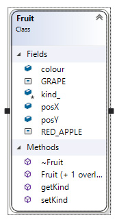

---
html:
  embed_local_images: false
  embed_svg: true
  offline: false
  toc: undefined
export_on_save:
  html: true
---
# Week 12 - Working on Snake


<!-- @import "[TOC]" {cmd="toc" depthFrom=1 depthTo=6 orderedList=false} -->

<!-- code_chunk_output -->

- [Week 12 - Working on Snake](#week-12-working-on-snake)
  - [Snake!](#snake)
  - [Checking your coding conventions](#checking-your-coding-conventions)
  - [Olc Color problems](#olc-color-problems)
    - [OlcEnums.h](#olcenumsh)
    - [SnakeGame.cpp and anywhere else](#snakegamecpp-and-anywhere-else)
  - [One way to make a Fruit class](#one-way-to-make-a-fruit-class)
    - [Storing fruit in a vector](#storing-fruit-in-a-vector)
    - [How do you know you ate fruit?](#how-do-you-know-you-ate-fruit)
  - [How do I quit?](#how-do-i-quit)

<!-- /code_chunk_output -->

---

## Snake!

We're working on the assignment.

I'll come around and check with everyone, but feel free to ask questions.

---

## Checking your coding conventions

In every team or project we use coding conventions so we humans can read the code a little better. It helps you to debug, and me to 

**Using naming conventions correctly is worth marks**, and they're easy marks so go through and check!

```cpp
// ISE102 class coding conventions
// Based on common conventions for C++
// This is a series of examples. All in one file it wouldn't compile.

// Classes, the recipes for objects
// Lead with upper case, use again for subsequent words
Class AttackShip : public SpaceShip // AttackShip extends the 
{
	public:
}

// constants, numbers that won't change.
// Use ALL_UPPER_CASE with underscores replacing spaces
const int LIVES_REMAINING_AT_START = 3;
const int MAX_HEALTH = 100;
const float HEADSHOT_DAMAGE_MULTIPLIER = 2.5f;
const string DEFAULT_INVITE_TEXT = "You have been invited to rumble.";

// public variables. Variables that code outside a class can see.
// Start lower case, upper case for subsequent words
public:
	int score = 0;
	string myTag = "";
	string myRealName = "";
	Hat topHat; 		// "H" tells us H is a class, or type.
						// "t" tells us topHat is an instance/object.

// protected or private variables. Only seen inside class.
// Use an _ and start lower case, upper case subsequent words
protected: 
	float _baseDamage = 3.2f;
	string _secretPassword = "AndSheWas";
	BroadSword _mightyBroadSword;

// functions: whether public or private, name them as you would a public variable. 
// leading lower case, then upper case words.
float damagePerSecond() 
{
	// Notice how you can immediately tell I'm using my private variables
	// to calculate a return value. The leading _ tells us.
	return (_damagePerAttack * _attacksPerSecond);
}

// How it would look inside a Hero class cpp file with scoping.
float Hero::damagePerSecond() 
{
	// Notice how you can immediately tell I'm using my private variables
	// to calculate a return value. The leading _ tells us.
	return (_damagePerAttack * _attacksPerSecond);
}
```

## Olc Color problems

Are you trying to **make classes with default colour values**? Then including `olcConsoleGameEngineOOP.h` for the colors? Or for the character/pixel constants? 

You might have ended up with weird errors due to **circular includes**: a pair of files keep including eachother, in turn, forever.

> You can solve the enum problem by **removing** them from `olcConsoleGameEngineOOP.h` and putting them **in a new file** with hardcore include guards. The enums will never be declared twice.

### OlcEnums.h

Make an `OlcEnums.h` file in headers, then paste this in.

```cpp {.line-numbers}
//////////////////// FILE: OlcEnums.h
// Extracts the enums from olcConsoleGameEngine for easy inclusion
////////////////////
#pragma once

#ifndef __OLC_ENUMS__   // This compiler directive ensures the enums
#define __OLC_ENUMS__   // are only defined once, regardless of include count.

enum COLOUR
{
    FG_BLACK = 0x0000,
    FG_DARK_BLUE = 0x0001,
    FG_DARK_GREEN = 0x0002,
    FG_DARK_CYAN = 0x0003,
    FG_DARK_RED = 0x0004,
    FG_DARK_MAGENTA = 0x0005,
    FG_DARK_YELLOW = 0x0006,
    FG_GREY = 0x0007, // Thanks MS :-/
    FG_DARK_GREY = 0x0008,
    FG_BLUE = 0x0009,
    FG_GREEN = 0x000A,
    FG_CYAN = 0x000B,
    FG_RED = 0x000C,
    FG_MAGENTA = 0x000D,
    FG_YELLOW = 0x000E,
    FG_WHITE = 0x000F,
    BG_BLACK = 0x0000,
    BG_DARK_BLUE = 0x0010,
    BG_DARK_GREEN = 0x0020,
    BG_DARK_CYAN = 0x0030,
    BG_DARK_RED = 0x0040,
    BG_DARK_MAGENTA = 0x0050,
    BG_DARK_YELLOW = 0x0060,
    BG_GREY = 0x0070,
    BG_DARK_GREY = 0x0080,
    BG_BLUE = 0x0090,
    BG_GREEN = 0x00A0,
    BG_CYAN = 0x00B0,
    BG_RED = 0x00C0,
    BG_MAGENTA = 0x00D0,
    BG_YELLOW = 0x00E0,
    BG_WHITE = 0x00F0,
};

enum PIXEL_TYPE
{
    PIXEL_SOLID = 0x2588,
    PIXEL_THREEQUARTERS = 0x2593,
    PIXEL_HALF = 0x2592,
    PIXEL_QUARTER = 0x2591,
};

#endif		// This ends the compiler directive.
```

I chopped them out of the `olcConsoleGameEngineOOP.h` file, between the windows include and olcSprite class. Make sure they're removed!

```cpp
using namespace std;

#include <windows.h>

// xxxxx
// ENUMS CHOPPED!!!!
// xxxxx

class olcSprite
{
public:
	olcSprite()
```

### SnakeGame.cpp and anywhere else

Make sure you include it before `olcConsoleGameEngineOOP.h` in your `SnakeGame` class.

```cpp {.line-numbers}
//////////////////// FILE: SnakeGame.h
#pragma once
#include "OlcEnums.h"
#include "olcConsoleGameEngineOOP.h"
#include "SnakeHead.h"

class SnakeGame : public olcConsoleGameEngineOOP 
{ ...
```

Add it to `SnakeGame.h` _before_ `olcConsoleGameEngineOOP` because olc requires those enums. Alternately you could add the include to `olcConsoleGameEngineOOP` above the `windows.h` include.

```cpp {.line-numbers}
#pragma once
#include "OlcEnums.h"
// Snake head has x pos, y pos, speed, colour.

class SnakeHead
{

public:
  float x = 5.0f;
  float y = 5.0f;
  float speed = 0.0f;
  int colour = BG_BLUE | FG_BLUE;

  // We're using floats for x,y,speed because at the rate the screen updates,
  // maybe 800x a second, moving 1 whole pixel per frame would
  // put us 770 pixels off screen after 1 second
};
```

---

## One way to make a Fruit class

This Fruit class has some static constants. They are constants you can access from the Class without ever making an object.

Due to a weirdness with C++ they are handy for a case statement:

> **Quick Question**: Why can't I use a regular  `const` in the `case` bit of my `switch` statements? Why does it tell me "not a constant expression"
> **Answer:** You can do it though by making your `const` a `static const`. The full explanation is long and.. not satisfying.


```C++
// Fruit.h
#pragma once

class Fruit
{

public:
		// Constants
	static const int RED_APPLE	= 1;
	static const int GRAPE		= 2;

		// Variables
	int		posX		= 0;
	int		posY		= 0;
	int		colour		= 0;

		// Construct
	Fruit	();
	Fruit	(int posX, int posY, int kindOfFruit);
		// Destroy
	~Fruit	();

	// Member Functions
	int		getKind	();
	bool	setKind	(int kind);
	
protected:
	
	int _kind	= 0;
	
};
```
Here you can see the fruit type constants being used in a case statement.

```C++
#include "Fruit.h"
#include "rgbi_colours.h"
#include <vector>

Fruit::Fruit()
{
}

Fruit::Fruit(int x, int y, int kindOfFruit = Fruit::RED_APPLE)
{
	posX = x;
	posY = y;
	setKind(kindOfFruit);
}

Fruit::~Fruit()
{
}

bool 
Fruit::setKind(int kind)
{
	_kind = kind;
	
	switch (_kind) 
	{
	case (RED_APPLE):
		colour = FG_RED | BG_RED;
		break;
	case (GRAPE):
		colour = FG_MAGENTA | BG_MAGENTA;
		break;
	}
	return (true);
}

int
Fruit::getKind()
{
	return _kind;
}
```



_Fruit class diagram_

---

### Storing fruit in a vector

To use these `Fruit` as they come and go, we need to track them in a collection.  We've used arrays like `Fruit myFruitArray[5]` but they're inflexible. The `vector` class is a very handy replacement.

> Note: We use of `<TypeOfContents>` to define the type of data our vector holds. Or you could think of it as `<ClassOfContents>`. We haven't seen angle brackets used this way before.

```C++
	// include the vector class from the standard library
	#include <vector>
	
	// How to declare an empty vector to hold Fruit objects
	// vector<TypeOfContents> nameOfVector;
	vector<Fruit> fruits;

	// Create a new fruit at x=5, y=5. Make it a Red Apple
	Fruit apple1 = Fruit(5, 5, Fruit::RED_APPLE);
	
	// "Push" it on to the "back" of the vector: adds it to the
	// end of the vector.
	fruits.push_back(apple1);

	// Some example vectors of other types:
	vector< int > goalsIScoredInEachGameThisSeason;
	vector< string > linesOfMySadPoem;
	vector< Hat > myTeamFortressHats;
	vector< Achievement > cheevs;

```

---

### How do you know you ate fruit?

Fruit has a position. You have a position. But there are many fruits. You'll need to **step through your vector with a loop**.

I would have this function in a `Snake` class, so the snake itself can check each frame if it has eaten a `Fruit`. It will return `true` 

```C++ {.line-numbers}
	// in SnakeGame.cpp

	if (_snake.isEatingFruit(_fruits)
	{
		// add fruit score value to player score
	}
```

```C++ {.line-numbers}
	// in Snake.cpp

	bool Snake::isEatingFruit( vector< Fruit > fruits )
		bool eating = false;

		for (int i = 0; i<fruits.size(); i++)
		{
			// Get the fruit at i (first time 0, second time 1 and so on)
			Fruit fruit = fruits[i];
			
			// Use an if here to check if snake head x,y
			// matches fruit x-y. If so, eating = true;
			
		}
		return(eating);
	}
```

## How do I quit?

Returning `false` in `OnUserUpdate()` sorta kind of works, but I'll look into the real command now.

