---
html:
  embed_local_images: false
  embed_svg: true
  offline: false
  toc: undefined
export_on_save:
  html: true
---
# ISE102 Week 1

<!-- @import "[TOC]" {cmd="toc" depthFrom=1 depthTo=2 orderedList=false} -->

<!-- code_chunk_output -->

- [ISE102 Week 1](#ise102-week-1)
  - [Resources](#resources)
  - [Fixing the guessing game with processing](#fixing-the-guessing-game-with-processing)
    - [Our instructions, with processing added](#our-instructions-with-processing-added)
  - [Checking and deciding: `if`](#checking-and-deciding-if)
    - [What are conditional expressions?](#what-are-conditional-expressions)
  - [Flow: working guess game with `if`](#flow-working-guess-game-with-if)
    - [C++: how does the guess game export?](#c-how-does-the-guess-game-export)
  - [Welcome to Relational Operators](#welcome-to-relational-operators)
  - [The `bool` type](#the-bool-type)
    - [Not equal operator: `!=`](#not-equal-operator-)
  - [Assessment 1: Slot machine](#assessment-1-slot-machine)
    - [Original work and crediting sources](#original-work-and-crediting-sources)
  - [Adding randomness to the Guessing Game](#adding-randomness-to-the-guessing-game)
    - [_Random numbers in Flowgorithm_](#_random-numbers-in-flowgorithm_)
    - [Exercise](#exercise)
    - [More Flowgorithm Built-In Functions](#more-flowgorithm-built-in-functions)
  - [Random numbers in C++](#random-numbers-in-c)
    - [Why `srand()`?](#why-srand)
    - [Why `rand() % 6`?](#why-rand--6)
    - [Results of division and modulus](#results-of-division-and-modulus)
  - [Only `if` test when you have to](#only-if-test-when-you-have-to)
    - [Nested if](#nested-if)
    - [`else if` instead of nesting](#else-if-instead-of-nesting)

<!-- /code_chunk_output -->

## Resources

Here's a new Visual Studio solution to start from. 

> When you unzip it, rename the folder called.. "renameMe".

[VS_ConsoleSolution.zip](assets/index/VS_ConsoleSolution.zip)

## Fixing the guessing game with processing

Last week we made a **guessing game**. It insulted players to hide its **missing functionality**.

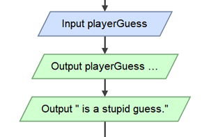

Remember the **4 basic things a pc program does**?

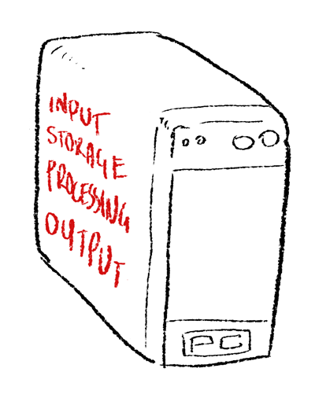

We were missing **processing.**

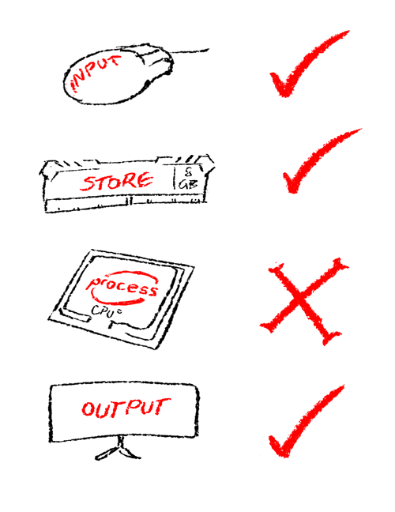

> When it's time for a person or machine to **decide** things, they do it by **checking** and **comparing** things.

___

### Our instructions, with processing added

Here are the computer's new instructions: how to host a super fun guessing game:

> 1. **Pick a number** between 5 and 10, **remember it**.
> 2. tell me to **guess** it.
> 3. let me **input** a number, and you **remember it**. 
> 4. If i’m wrong tell me i’m wrong, but u take the blame computer
> 5. If i’m right give me a thousand moneys

___

## Checking and deciding: `if`

The real game would **check if the player guessed the secret number**: 
  - Is the `playerGuess` the same as `secretNumber`?
  - Say something if it's true, otherwise say something else.

>To check if something is true, click on an arrow in your flowchart and select the red if diamond.

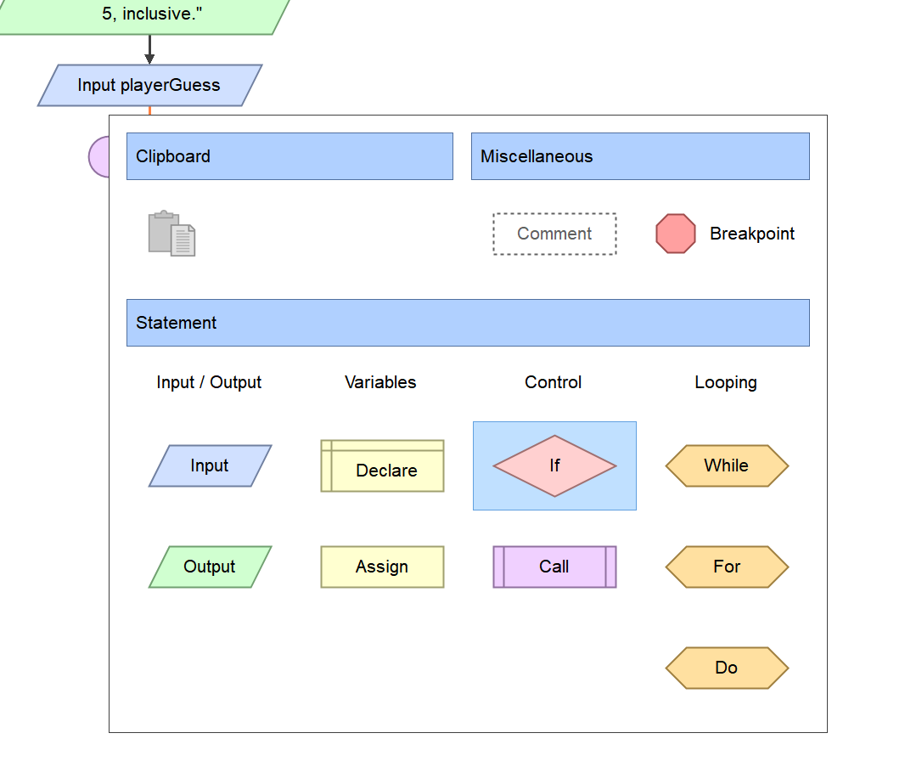

Double click the if and it **asks for a conditional expression**

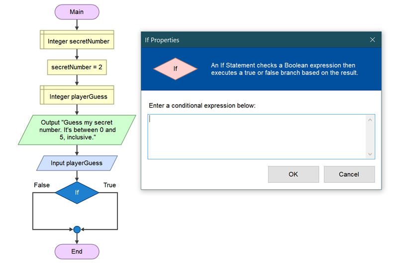

### What are conditional expressions?

Something that **produces a true or false answer**. 

* Has the player run out of health?
* Is the distance to Los Angeles further than my Griffin can fly?
* Is my phone in my bag, and does it have reception here in Zombietown?
* Is 5 greater than 2?

> We need an expression for **playerGuess is equal to secretNumber**, meaning they have the same values stored.

---

#### _The "is equal to" operator_

Any punctuation that compares, does math on or relates two values is called an operator.

> The **equals** or **is equal to** operator is **`==`**, two equals signs.

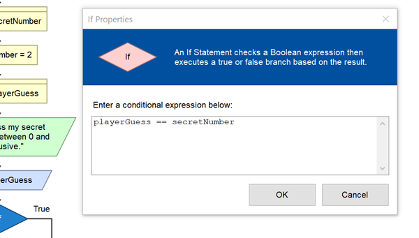
_The expression we need._

#### _Why not one `=` sign?_

Because **`=`** is already the **assignment**, or **store** operator. 

```cpp
  // C++ has the same syntax for assignment/storage

  int boxA;       // remember, a variable is like a little storage box in your RAM.
  int boxB = 5;   // boxB is another storage box.

  boxA = boxB;    // Look at the number in boxB (5), and put a copy of the same number in boxA
  boxB = 22;      // Put a new number in boxB, discarding the old one.
  
  // Now boxA holds 5, boxB holds 22. 
```

## Flow: working guess game with `if`

Finish it up in Flowgorithm. 

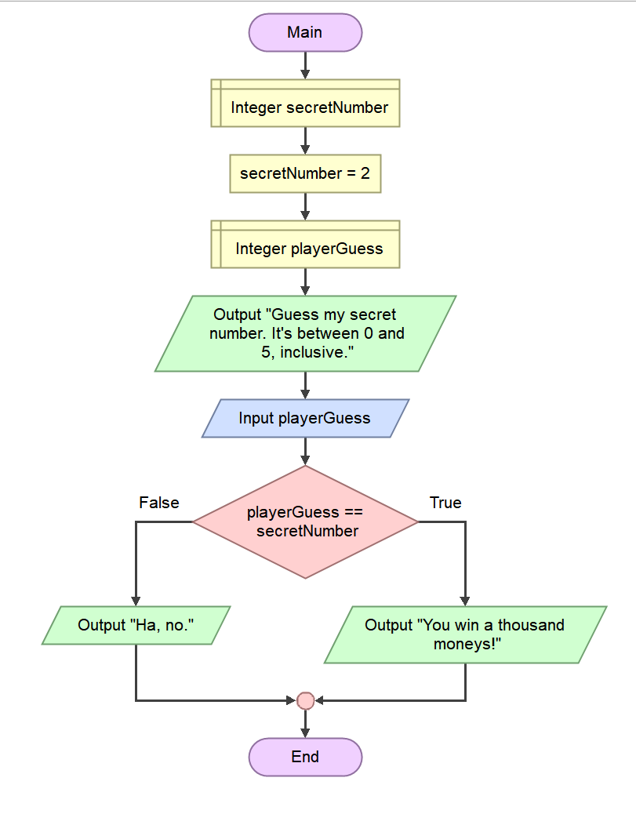

---

### C++: how does the guess game export?

Here's the flowgorithm export.

**Exercise:**
1. Grab an updated quick start solution: [VS_ConsoleSolution.zip](assets/index/VS_ConsoleSolution.zip)
2. **Now type it out yourself** in `main.cpp` and run it. Absorb the syntax. 

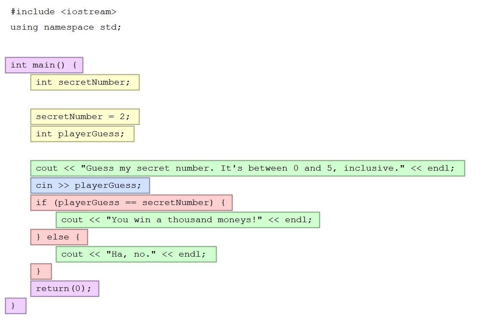

___

## Welcome to Relational Operators

**`==`** is your first **relational operator**. Its operation: compares two variables, returns `true` if they store the same value.

> Relational operators assess the **relationship of two values**: 
>   - Is one bigger, smaller than the other? Are they equal or not?

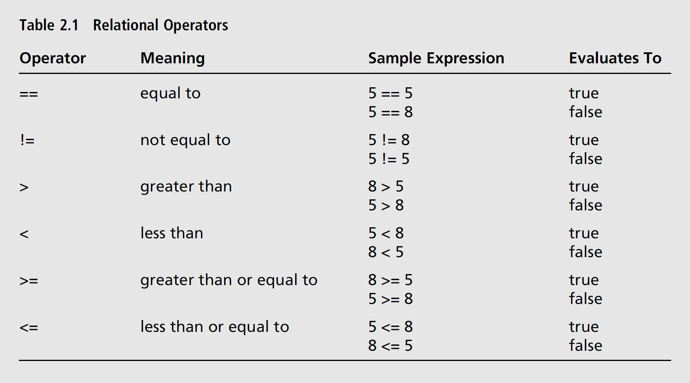
_The relational operators of c++: page 38, [Chapter 2 of the textbook](book_1/chap2_cpp_games.pdf)_

___

## The `bool` type

If we're talking about expressions that evaluate to `true` or `false`, we need a nice way to store the results as variables.

* An `int` is an integer. -10, 0, 45, 324544245.
* A `string` is, say, what you get in a tweet. "@lizzosmith I went to 34 concerts in 2019. #rockpig"

> A **`bool`** is another type: it only has two potential values, **`true`** or **`false`**


```cpp
// Here's a bool variable in C++.

// Declare isSad and initialise it to true
bool isSad = true;  // ;~;

// Change its value to false
isSad = false;  // :D
```

And in Flowgorithm, we use Boolean:
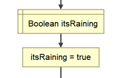

> Booleans are named after George Boole, who introduced a branch of algebra dealing with true/false values, or 1s and 0s.

Behind the scenes, `true == 1` and `false == 0`. We'll come back to it.

### Not equal operator: `!=`

Pay special attention to the not symbol, `!`, an exclamation mark. When it replaces the first equals in equal to, you get **not equal to, `!=`**. It will have other uses.

```cpp
bool rainingNow = true;

if (rainingNow != false)   // Sooo, it's not false.. dang, it's true.
{
  cout << "You'll need your umbrella";
}

```
___
## Assessment 1: Slot machine

1. Brief.

### Original work and crediting sources

Submitting **work that isn't yours** and **not crediting** the original creator is known as **plagiarism**. 
* It's a big deal at university. 
* It'll wipe your assessment mark.

#### _DON'T: look at slot machine tutorials_

Never look at tutes that build the same thing you're building.
* You can't unsee them, and they make it much harder to come up with your own solution.
* You'll likely end up using their structure at a minimum.
* I've seen the tutes, I recognize the copied structure/algorithms.

#### _DO: look at tutorials on C++_

Look at tutorials that help with the individual problems:
* logical operators, math operators, relational operators in c++
* clearing the console screen
* laying out your text on screen (\t,\n)
* Game loops c++
* Programming menus in c++ console


___

## Adding randomness to the Guessing Game

Avoid having the same game each time. Let's **generate a random number in the range 0-5 inclusive** (including 0 and 5).

### _Random numbers in Flowgorithm_

Flowgorithm has **built-in functions** we can write into an expression. 
>  - Functions are sorta like smart variables: when you call them they can return a value
>  - That value can change basd on circumstances
>  - They do it by running some code of their own instead of just reading memory.

If you enter `Random(6)` as an expression, it will be replaced with a **number between `0` and `5`**. That's `0` to `whatever - 1`.


### Exercise

Change your guessing game flow to make secretNumber random, like in the image above.

### More Flowgorithm Built-In Functions

You can get the length of a string, do trigonometry, convert between data types and more.

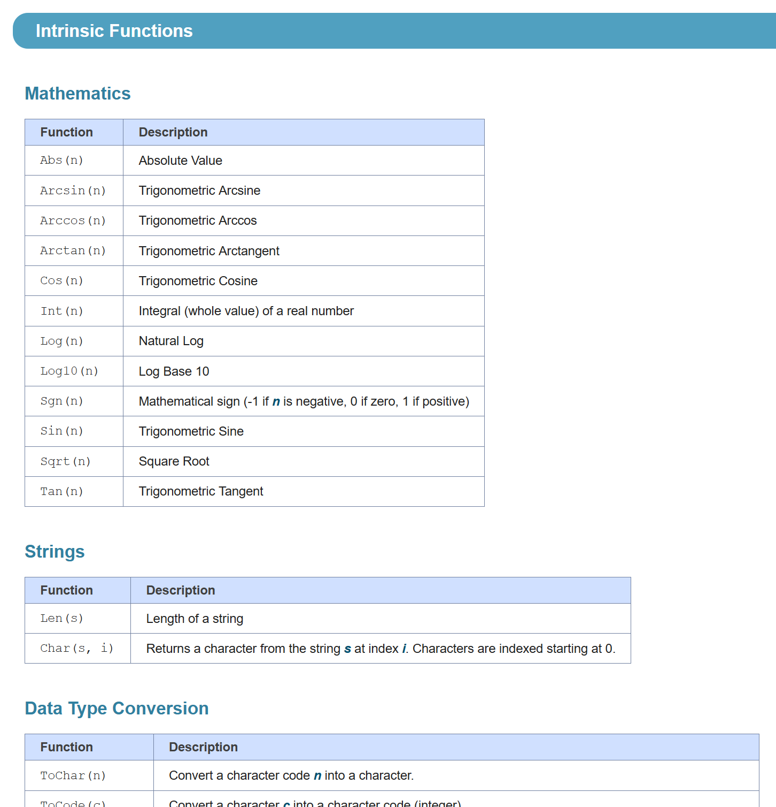
_More built ins: <http://flowgorithm.org/documentation/intrinsic-functions.htm>_

___

## Random numbers in C++

C++ provides built in random functions too.

**Exercise**
Make another copy of the ConsoleSolution and type + run this random number code in `main.cpp`:

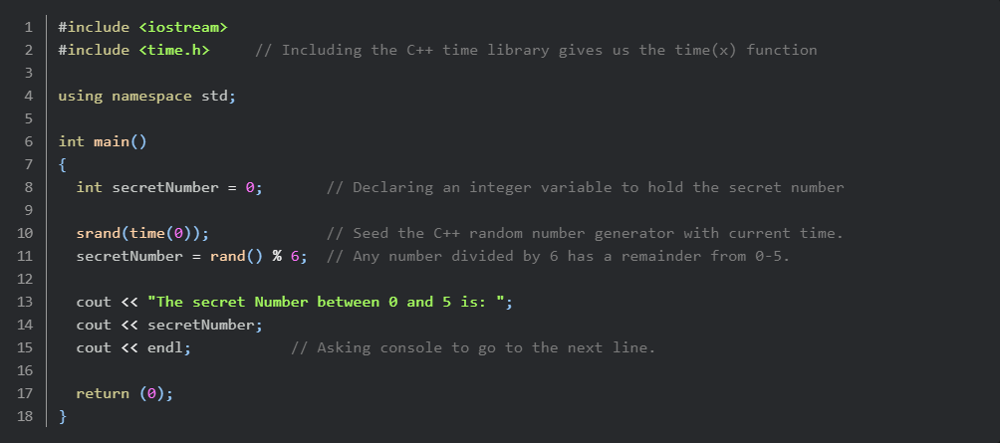


### Why `srand()`?

> **Computers aren't random.** They're super organised. They need a random starting point for making random-seeming numbers. `time(0)` gives us the **time elapsed, in seconds, since 1970**. That's pretty random.

### Why `rand() % 6`?

> `rand()` is a built in **C++ function**. When the line of code runs, it's replaced with a psuedorandom (kinda random) number **between 0 and 32,767**

* `a % b` is `a modulus b`. It means "divide `a` by `b` and give **just the remainder**"

### Results of division and modulus

`11 / 6` is `1`, leaving a remainder `5`.
So `11 % 6` is `5`

`12 / 6` is `2`, leaving a remainder `0`. 
So `12 % 6` is `0`

> **More info: rand**
> Good info on geeksforgeeks: <https://www.geeksforgeeks.org/rand-and-srand-in-ccpp/>
> C++ reference docs: <http://www.cplusplus.com/reference/cstdlib/rand/>

___

## Only `if` test when you have to

Many times, you only have to test further values when all previous tests failed.

If we just use one `if` after another they all run. 
```cpp
int age=8;

if ( age < 12)
{ 
  cout << "This is a child." << endl;
}

if (age < 20)
{
  cout << "This is a teenager." << endl;
}

// Look at the problem in the output:
This is a child.
This is a teenager.
```
### Nested if

We only need to run tests until one is true.
You can **nest `if` statements** within the `true` block, or within the `else`/`false` block.  

```cpp
int age=8;

if ( age < 12)
{ 
  cout << "This is a child." << endl;
} 
else   // only check (age < 20) if (age < 12) was false
{
  if ( age < 20)
  {
      cout << "This is a teenager." << endl;
  }
  else
  {
    if ( age < 65) // only check (age < 65) if (age < 20) and (age < 12) were false
    {
        cout << "This is an adult." << endl;
    } 
    else
    {
      // Things are getting inceptiony. Even worse with wide tab spacing.
    }
  }
}

// It works. Output:
This is a child.

```
___ 

### `else if` instead of nesting

It does the same thing but:
* without nesting
* with less typing and tabbing.

**Exercise:** 
Type in score rater and run it. Get the hang of `else if`, and you'll reap the rewards in the assessments.

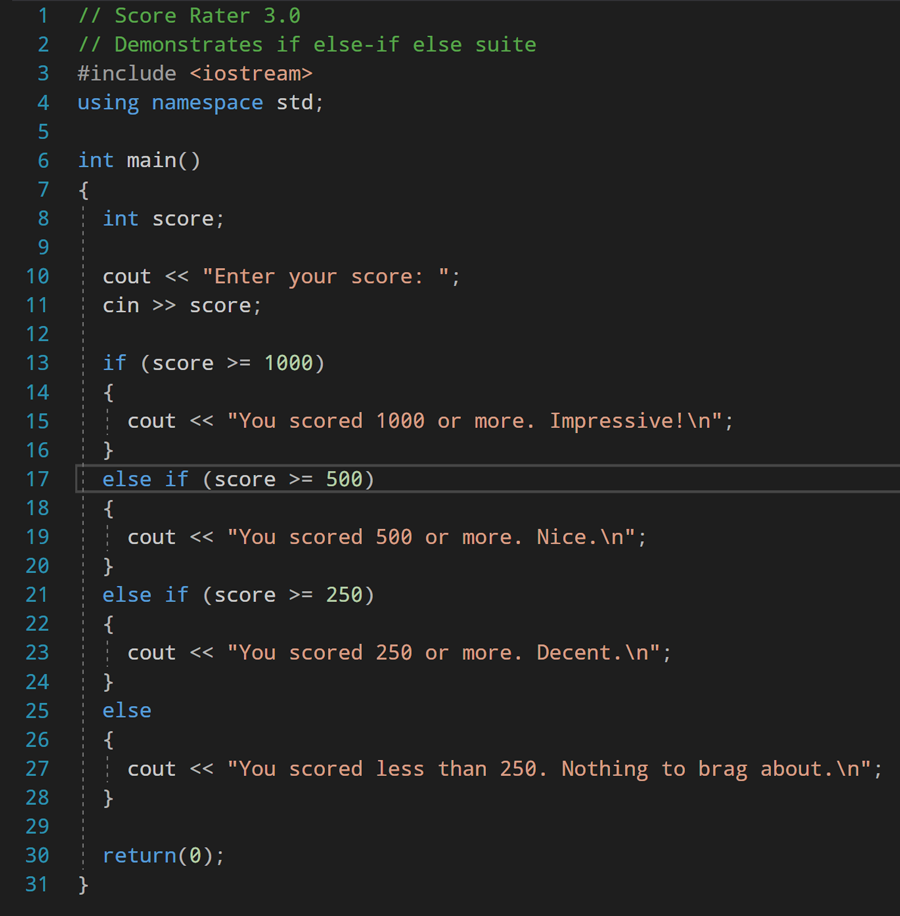


