---
html:
  embed_local_images: false
  embed_svg: true
  offline: false
  toc: undefined
export_on_save:
  html: true
---
# ISE102 Week 3 - Loops, basic functions

<!-- @import "[TOC]" {cmd="toc" depthFrom=1 depthTo=2 orderedList=false} -->

<!-- code_chunk_output -->

- [ISE102 Week 3 - Loops, basic functions](#ise102-week-3-loops-basic-functions)
  - [Repeating!](#repeating)
  - [Limiting guesses with logic](#limiting-guesses-with-logic)
  - [Exercise: Menu Fighter](#exercise-menu-fighter)
  - [Adding constants for clarity](#adding-constants-for-clarity)
  - [Clearing the screen/console in C++](#clearing-the-screenconsole-in-c)
  - [Enumerators: **`enum`**](#enumerators-enum)
  - [Other loop structures](#other-loop-structures)

<!-- /code_chunk_output -->

## Repeating!

Games are built on loops within loops.

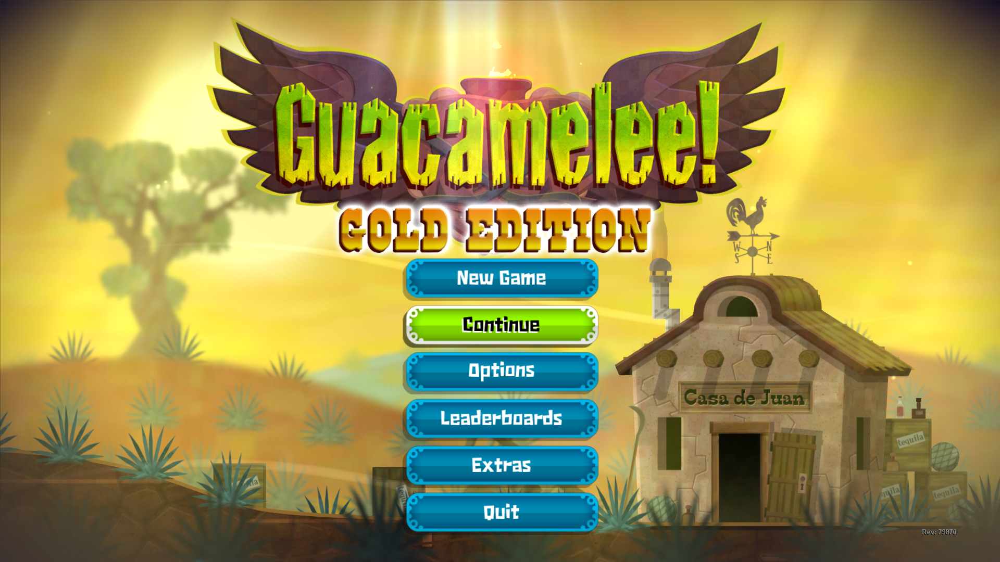
We select something in the **main menu**, and eventually **return**: 


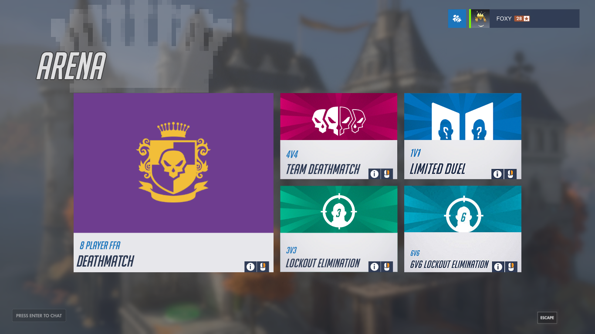
On the **"arcade" screen in _Overwatch_ we choose a game mode** and enter a queue. We'll either **cancel back** to this screen or **play a game** and return to the screen.


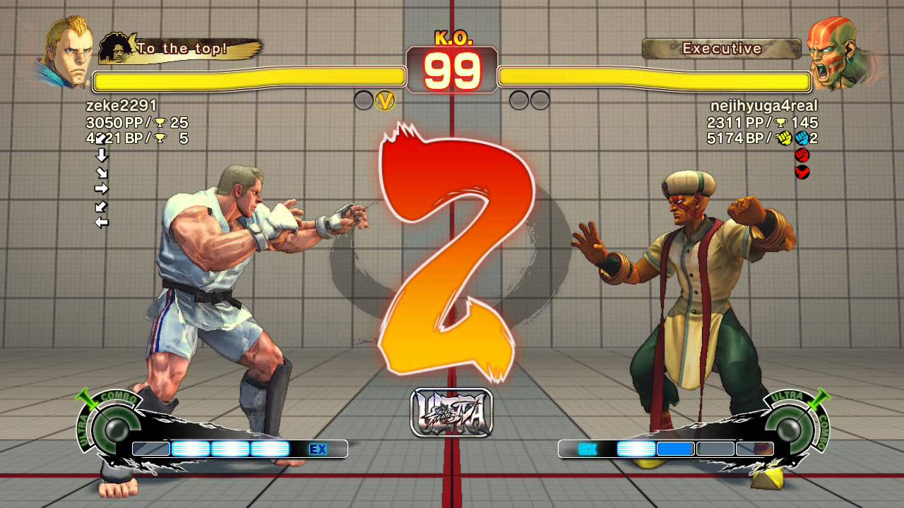
In Street Fighter we **play the best of 3 rounds**, in each of which we recover all our health and fight again.

### Guess Again: `while` loops

Our guessing game wasn't much fun when you had a 5 in 6 chance of losing. 

Let's **add extra chances** with higher/lower prompts until you get it. We'll need a way to **do things repeatedly**. 

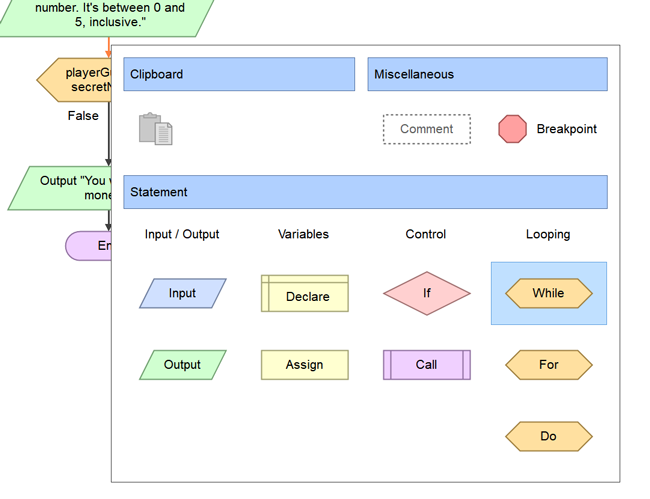
Repeating/looping in flowgorithm is handled by **the while loop**, along with other loops. To make loops useful, **they can be stopped** eventually. 
* **Loops take a condition** in flowgorithm (and _C++_)
* just like an `if` statement it **only executes when the condition is true**. 
* **Enter** the conditional expression: check that playerGuess **is not equal to** secretNumber. 

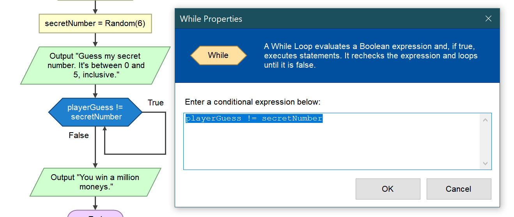

### We need repeated user input

Our prompt and input is missing. Add that, and play your game.

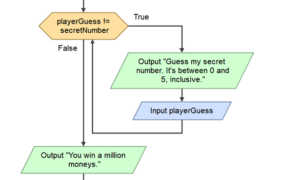

What you'd see if **secret number is 4**.

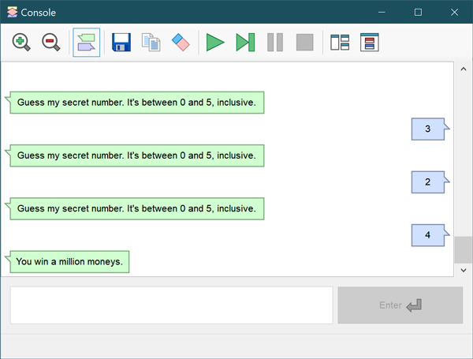

### Exercise: Add higher/lower

* If the playerGuess is less than the secret number, print out "Higher." after their guess.
* Add "Lower." if they guess high.

### `while` In _C++_

```cpp {.line-numbers}
#include <iostream>
#include <string>
using namespace std;

int main()
{
  int playerGuess = -1;
  int secretNumber = 2;

  while ( playerGuess != secretNumber)  // Only runs if guess is not equal to secret
  {
    // Display prompt, get input.
  }
  return(0);
}
```

## Limiting guesses with logic

Our **end game** condition is `playerGuess == secretNumber`. Let's also **limit the player to 3 guesses**.

**We need a variable to count guesses:**

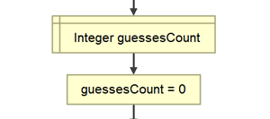

Then, increase the count each time someone guesses, using the **assignment operator** to overwrite guessCount.

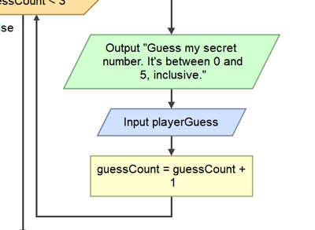


### Checking two things

We could:
1. **Add an if statement**  to the loop, checking condition 2. if `guesses >= 3` it breaks out of the loop. 
2. More graceful: check both conditions in the loop.

### If A is true _or_ B is true

When we have multiple conditions in life, they.. depend.

> "Okay, I'll go to the party," Sharmeen sighed, "IF Bruno Johnson is going."
> ".. or Claus Hansomme." she added, looking into the distance.

With the help of the **logical operator `||`**, that's two pipe symbols (above `enter`), we can check for **A _or_ B**. 

**C++ uses the same syntax:**

```cpp {.line-numbers}
#include <iostream>
#include <string>
using namespace std;

int main()
{
  bool brunoIsGoing = false;
  bool clausIsGoing = true;

  if (brunoIsGoing || clausIsGoing)
  {
    cout << "\t" << "Looks like Sharmeen is going." << endl; // \t adds a tab at the start.
  }

  return(0);
}
```


More operators are also available here: <http://flowgorithm.org/documentation/operators.htm>


### If A is true _and_ B is true

We don't need `||` though. We need to **continue if the player hasn't guessed the number AND they have guessed less than 3 times**. 

This requires **logical _and_.** Let's see Jessie use it.

> "Okay, I'll go to the party," Jessie flounced, "if you make the DJ play Cardi B."
> "**And** someone else drives." she added.

```cpp {.line-numbers}
#include <iostream>
#include <string>
using namespace std;

int main()
{
  bool djPlaysCardiB = true;
  bool someoneElseDrives = false;

  if (djPlaysCardiB && someoneElseDrives)
  {
    cout << "\t" << "Ok Jessie is going." << endl; // \t adds a tab at the start.
  }

  return(0);
}
```
**Spoiler:** she doesn't go. Jessie respects her P plates too much to lose them drink driving.

### Exercise: The Guess Limit

Add **two required conditions** to your while loop using `&&`. **Learn from Jessie.**

1. Player guess **is not equal to** secret number.
2. Guess count is less than 3.

Print "No more guesses, you're done" before quitting if they run out of guesses.

## Exercise: Menu Fighter

**Make this amazing game by yourself.** 

You can:
- Write it **directly in _C++_** 
or
- Make it **in _Flowgorithm_** and then **export it to _C++_**. Paste it into a Visual Studio project's main.cpp and **get it running in the console.**

> ########################
> Welcome to Menu Fighter.
> ########################
>
>   1. Play Game
>   2. Options
>   3. Quit
>
>   Enter your choice: _
>

Here are the **computer's instructions**:
1. If player hasn't quit, **display a numbered menu**.  _(begins the loop)_
2. Let me **choose an entry** by inputting a number.
3. **Display a screen** for the option I chose.
   **a.** If it's **play**: print `"You win! Hit a key to go back."`
   **b.** If it's **options**: print `"Your only option is to fight. Hit a key to go back."` 
   **c.** If it was **quit**: print `"Correction: quitting is an option."` and remember **playerQuit is true**. 
5. **Loop back** to displaying menu. _(returns to 1), top of loop, **checks condition again**)_

_6: If playerQuit is true, the loop won't run, we'll go to the end of the main function. It's a good way end your program, hitting **`return(0)`** at the end of main_

## Adding constants for clarity

Checking if a number is 1, 2 or 3 is fairly meaningless to a human. We call these **magic numbers** because, without context, they could **mean anything**. They **appear and work as if by magic**.

Constants **are variables** in C++.. **that don't vary**. They mean something like **`PI`**, or **`SECONDS_IN_MINUTE`**. When we use them in an if, it's clear what's happening.

```cpp {.line-numbers}
#include <iostream>
#include <string>
using namespace std;

const int PLAY = 1;
const int QUIT = 2;

int main()
{
  int choice = -1;
  cout << " 1: Play \n 2: Option \n 3: Quit \n Choose: ";
  cin >> choice;
  if ( choice == PLAY)
  {
    // play
  }
  else if (choice == QUIT)
  {
    //quit
  }
  return(0);
}
```

#### The `const` keyword
When the compiler sees **`const`** before **`int`** it means that variable can't be changed. If you **try to assign to**/overwrite a constant, your program **won't compile**.

#### Conventions and `CONSTANT_NAME`
There's **no compiler rule saying** `const` names have to be **`UPPER_CASE_WITH_UNDERSCORES`**. It's purely for human eyeballs. We'll know it's an unchanging number **on sight**.

> **Conventions are practises** programmers follow to **make reading code easier** on themselves and others. If we follow conventions that are widely used, and do it consistently:
> 1. **Debugging our code** will be easier
> 2. **Sharing and receiving** code will be easier
> 3. **We can write bigger programs** and more complex games, because we'll **minimise wasted mental energy**. 
> 
> Like a marathon runner with a disciplined stride, we'll go further with the same resources.

## Clearing the screen/console in C++

Nobody wants to play **scroll down the screen fighter**.

Add **`System(cls)` before showing sub screens**, and **before returning** to the main menu.

## Enumerators: **`enum`**

Enumerators provide a shorthand for creating (and grouping) constants with integer values.

```cpp {.line-numbers}
#include <iostream>
#include <string>
using namespace std;

enum MenuChoices { STORY_MODE, ONLINE_MULTIPLAYER, OPTIONS, QUIT };

int main()
{
  int choice = -1;
  cout << " 1: Play \n 2: Option \n 3: Quit \n Choose: ";
  cin >> choice;
  if ( choice == MenuChoices.PLAY)
  {
    // play
  }
  else if (choice == MenuChoices.QUIT)
  {
    //quit
  }
  return(0);
}
```

I've shown you an **enum defined on a single line** because hopefully it'll **help you remember** you need **a semi colon at the end** of an enum definition.

* Conventionally, an enum definition is **spread over multiple lines** for readability. 
* These curly braces **don't define a code block**. They're actually starting and ending a _set_, a collection. More on this later in data collections.

```cpp

enum MenuChoices    // enums can get long, so they're defined over multiple lines
{ 
  STORY_MODE, 
  ONLINE_MULTIPLAYER, 
  OPTIONS,
  STORE,
  LOOTBOXES,
  CREDITS,
  STATISTICS,
  QUIT 
};              // DON'T FORGET this semi colon. Spoiler: you will.
```


There's **a lot more to enums**, read on: <https://www.geeksforgeeks.org/enumerated-types-or-enums-in-c/>

## Other loop structures

**`for`** loops. **`do..while`** loops. Look into them in _Flowgorithm_ and _C++_

You'll mostly see **`for`** loops used to go through collections of data. We'll get to that next week.

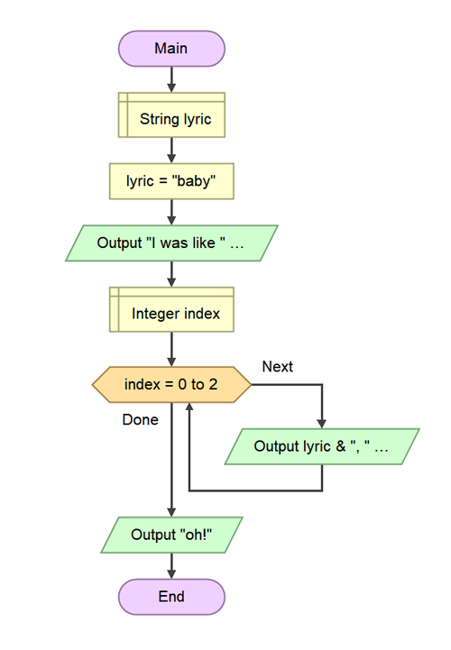

**Note** I joined the `lyric` variable and the string `", "` using a single `&`. That's a flowgorithm thing.

### `for` exported to _C++_

**Note** how in _C++_ `lyric` and `", "` are joined using `<<`. This works when the line starts with `cout`.

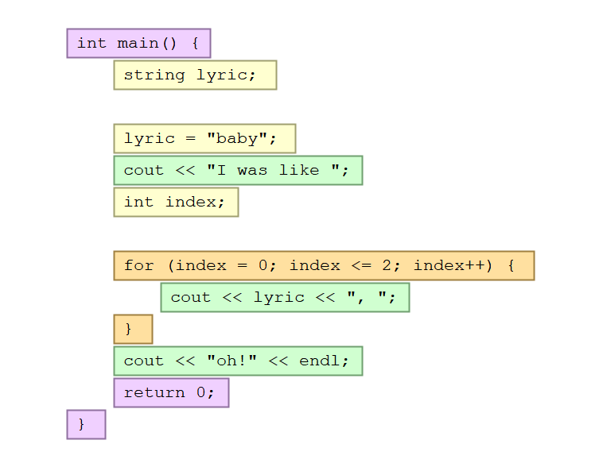


