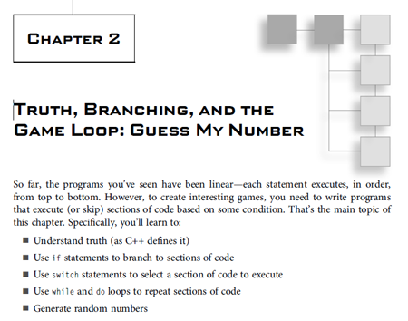

---
html:
  embed_local_images: false
  embed_svg: true
  offline: false
  toc: undefined
export_on_save:
  html: true
---
# ISE102 Week 3 - Loops, basic functions

<!-- @import "[TOC]" {cmd="toc" depthFrom=1 depthTo=3 orderedList=false} -->

<!-- code_chunk_output -->

- [ISE102 Week 3 - Loops, basic functions](#ise102-week-3---loops-basic-functions)
  - [Repeating!](#repeating)
  - [Limiting guesses with logic](#limiting-guesses-with-logic)
  - [Home Todos:](#home-todos)
  - [Menu Fighter:](#menu-fighter)

<!-- /code_chunk_output -->

## Repeating!

Games are built on loops within loops.


We select something in the **main menu**, and eventually **return**: 


On the **"arcade" screen in _Overwatch_ we choose a game mode** and enter a queue. We'll either **cancel back** to this screen or **play a game** and return to the screen.


In Street Fighter we **play the best of 3 rounds**, in each of which we recover all our health and fight again.

### Guess Again: `while` loops

Our guessing game wasn't much fun when you had a 5 in 6 chance of losing. 

Let's **add extra chances** with higher/lower prompts until you get it. We'll need a way to **do things repeatedly**. 


Repeating/looping in flowgorithm is handled by **the while loop**, along with other loops. To make loops useful, **they can be stopped** eventually. 
* **Loops take a condition** in flowgorithm (and _C++_)
* just like an `if` statement it **only executes when the condition is true**. 
* **Enter** the conditional expression: check that playerGuess **is not equal to** secretNumber. 


### We need repeated user input

Our prompt and input is missing. Add that, and play your game.


What you'd see if **secret number is 4**.


### Exercise: Add higher/lower

* If the playerGuess is less than the secret number, print out "Higher." after their guess.
* Add "Lower." if they guess high.

### `while` In _C++_

```cpp {.line-numbers}
#include <iostream>
#include <string>
using namespace std;

int main()
{
  int playerGuess = -1;
  int secretNumber = 2;

  while ( playerGuess != secretNumber)  // Only runs if guess is not equal to secret
  {
    // Display prompt, get input.
  }
  return(0);
}
```

## Limiting guesses with logic

Our **end game** condition is `playerGuess == secretNumber`. Let's also **limit the player to 3 guesses**.

**We need a variable to count guesses:**


Then, increase the count each time someone guesses, using the **assignment operator** to overwrite guessCount.


### Checking two things

We could:
1. **Add an if statement**  to the loop, checking condition 2. if `guesses >= 3` it breaks out of the loop. 
2. More graceful: check both conditions in the loop.

### If A is true _or_ B is true

When we have multiple conditions in life, they.. depend.

> "Okay, I'll go to the party," Sharmeen sighed, "IF Bruno Johnson is going."
> ".. or Claus Hansomme." she added, looking into the distance.

With the help of the **logical operator `||`**, that's two pipe symbols (above `enter`), we can check for **A _or_ B**. 

**C++ uses the same syntax:**

```cpp {.line-numbers}
#include <iostream>
#include <string>
using namespace std;

int main()
{
  bool brunoIsGoing = false;
  bool clausIsGoing = true;

  if (brunoIsGoing || clausIsGoing)
  {
    cout << "\t" << "Looks like Sharmeen is going." << endl; // \t adds a tab at the start.
  }

  return(0);
}
```


More operators are also available here: <http://flowgorithm.org/documentation/operators.htm>


### If A is true _and_ B is true

We don't need `||` though. We need to **continue if the player hasn't guessed the number AND they have guessed less than 3 times**. 

This requires **logical _and_.** Let's see Jessie use it.

> "Okay, I'll go to the party," Jessie flounced, "if you make the DJ play Cardi B."
> "**And** someone else drives." she added.

```cpp {.line-numbers}
#include <iostream>
#include <string>
using namespace std;

int main()
{
  bool djPlaysCardiB = true;
  bool someoneElseDrives = false;

  if (djPlaysCardiB && someoneElseDrives)
  {
    cout << "\t" << "Ok Jessie is going." << endl; // \t adds a tab at the start.
  }

  return(0);
}
```
**Spoiler:** she doesn't go. Jessie respects her P plates too much to lose them drink driving.

### Exercise: The Guess Limit

Add **two required conditions** to your while loop using `&&`. **Learn from Jessie.**

1. Player guess **is not equal to** secret number.
2. Guess count is less than 3.

Print "No more guesses, you're done" before quitting if they run out of guesses.

## Home Todos:

1. Do the _**Menu Fighter**_ exercise below.
2. Read through to the end of [chapter 2 of the textbook](book_1/chap2_cpp_games.pdf). **This book will help you** enormously, all you have to do is put in some time. Save the chapter 2 pdf to your phone, easy.
   a. If there's anything you don't fully understand, type out the code sample for that part! 
   b. If you want to do well in the subject, type out lots of code samples and play with them.
[](book_1/chap2_cpp_games.pdf)
3. **[SoloLearn](https://www.sololearn.com/Course/CPlusPlus/): work through** the _C++_ tutorial to the **end of the second section**, _Conditionals and Loops_
   a. The sololearn [site](https://www.sololearn.com/Course/CPlusPlus/) has the same tute and syncs with your phone progress when you log in.


## Menu Fighter:
**Make this amazing game by yourself.** 

You can:
- Write it **directly in _C++_** 
or
- Make it **in _Flowgorithm_** and then **export it to _C++_**. Paste it into a Visual Studio project's main.cpp and **get it running in the console.**


> ---- WELCOME TO MENU FIGHTER -----
>
> 1: Play Game | 2: Options | 3: Quit
>
> Enter a number to choose:

Here are the computer's instructions:
1. If player hasn't quit, **display a numbered menu**.  _(begins the loop)_
2. Let me choose an entry by **inputting a number**.
3. Check their choice and:
   **Play Game**: print `"Round 1, Fight! Bish bish bash URGH!! You win."`
   **Options**: print `"Your only option is to fight."` 
   **Quit**: print `"You quit."` and remember **playerQuit is true**. 
5. Repeat. 

_6: If playerQuit is true, the loop won't run, we'll go to the end of the main function._

