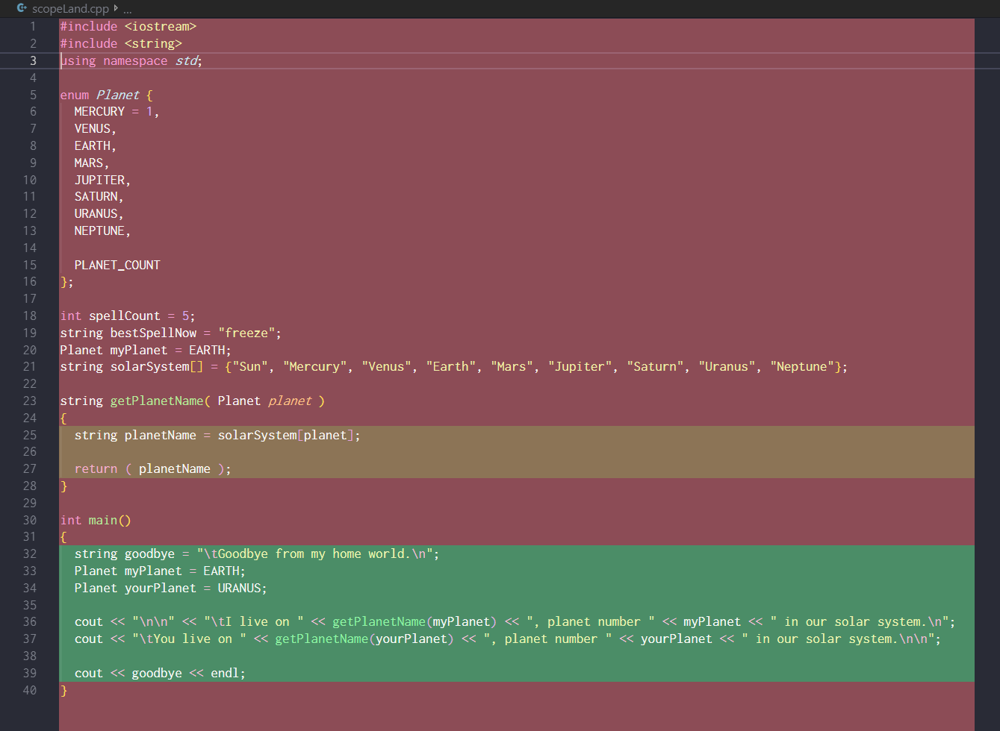

---
html:
  embed_local_images: false
  embed_svg: true
  offline: false
  toc: undefined
export_on_save:
  html: true
---
# ISE102 Week 4

Functions and variable scope.

<!-- @import "[TOC]" {cmd="toc" depthFrom=1 depthTo=6 orderedList=false} -->

<!-- code_chunk_output -->

- [ ISE102 Week 4
](#ise102-week-4)
  - [ Exercises
](#exercises)
  - [ Resources
](#resources)
  - [ Variables and functions: stored info vs helpers
](#variables-and-functions-stored-info-vs-helpers)
    - [ Make toast pseudocode
](#make-toast-pseudocode)
    - [ Make toast cpp
](#make-toast-cpp)
  - [ The Queen of functions: Main
](#the-queen-of-functions-main)
    - [ Functions: Some answers are always changing
](#functions-some-answers-are-always-changing)
    - [ Functions as macros
](#functions-as-macros)
    - [ Arguments: sending data off for calculation
](#arguments-sending-data-off-for-calculation)
  - [ Scope
](#scope)
    - [ Function signatures: keeping functions in their place
](#function-signatures-keeping-functions-in-their-place)
        - [ Elements of a signature:
](#elements-of-a-signature)
        - [ Example signature:
](#example-signature)
    - [ Making toast with better contracts.
](#making-toast-with-better-contracts)

<!-- /code_chunk_output -->

---
## Exercises

1. Write out and run the code in:
   * [week4_code.html](week4_code.html)
   * [week4_book_bits.html](week4_book_bits.html)
2. **Work on Assignment.** You really have everything you need now to complete it.
3. **Complete the 4th module in Sololearn: Functions.** And yep, you need to complete the first 3 to unlock it.
   
## Resources

1. Read chapter 5 on functions in our C++ through games textbook. Skim the bits that are easy but you'll learn some things as you go.
   * Functions: [book_1/cppgameprog_5_funcs_madlib.pdf](book_1/cppgameprog_5_funcs_madlib.pdf)

---

## Variables and functions: stored info vs helpers

**Variables** are very useful storage spots for information. 
* like post it notes where you keep your answers
* by default written in pencil, so you can replace contents
* add `const` and they are ink written, permanent reference info.

What if the info we need changes each time it's checked?

> Is my toast ready? Well, that depends.
> * How long it has been cooking?
> * How long you like your toast cooked?
> * You might check at random points, and errors can happen if you duplicate the same math everywhere you check toast

You need a robot assistant! That assistant is a **function**. 

* It can do the math the same way every time
* be called from anywhere, including inside expressions
* it reduces to a result, just like a variable or expression

### Make toast pseudocode

```{ .line-numbers }
// Pseudocode

  I know: When the toast started cooking, how long I like it cooked

  start_function TOAST_IS_READY (true or false)
    time toast has been cooking = time now - time started
    return TRUE if the toast has cooked enough,
    return FALSE if it hasn't.
  end_function 

  start_program COOK_AND_CHECK_TOAST
    time toast started cooking is now
    wait a bit..

    if TOAST_IS_READY print "toast is cooked";
    chat on discord.
    wait another bit..

    if TOAST_IS_READY print "toast is cooked.";
    print "Adding nutella, eating toast."
  end_program
```

### Make toast cpp
```cpp { .line-numbers }
#include <ctime>
#include <iostream>
#include <Windows.h>
using namespace std;

int timeCookingStarted;
const int PERFECT_COOKING_TIME = 4;


bool toastIsReady()  // functions are just like variables, they have a type.
{
  int timeCooking = time(0) - timeCookingStarted;
  cout << "\t[Time cooking so far: " << timeCooking << "]\n";
  // Long version. Comment this out to run the shorter version below.
  if ( timeCooking >= PERFECT_COOKING_TIME) {
    return(true);
  } else {
    return(false);
  }
  // Since (x >= y) returns true or false, this is the same and less wordy:
   return ( timeCooking >= PERFECT_COOKING_TIME ); 
}

int main()
{
  // time toast started cooking is now. time is in seconds.
  timeCookingStarted = time(0);
  cout << "\n\tStart time: " << timeCookingStarted << endl << endl;

  Sleep(2000);  //buuut sleep takes milliseconds
  if ( toastIsReady() ) 
  {
    cout << "\tToast is cooked already??\n\n";
  } else {
    cout << "\tChatting on discord\n\n";
  }

  Sleep(3000);  //wait a different bit..
  if (toastIsReady()) cout << "\tFinally, toast is cooked. Adding nutella, eating.\n";
}
```


## The Queen of functions: Main

Above all functions is the Queen, `main()`. Look at her with fresh eyes now, see the return type. We don't _have_ to return anything even though she's an int.. but, as with queens, she's special. All other functions not typed `void` have to return something.

By default `main` will return the error code `0` to Windows, meaning no errors. If you find an error (if your program didn't receive an argument) you can return an error code (>0);

```cpp { .line-numbers }

int main()
{
  // no errors:
  return (0);
}
```

### Functions: Some answers are always changing

Once you start toasting, the seconds required by your taste will eventually pass and the toast is ready. 

```cpp { .line-numbers }
const int TIME_SINCE_UNIVERSE_STARTED = x;
``` 

That won't work so long as tiem passes. It'll always be out of date info.

```cpp { .line-numbers }

long long int timeSinceUniverseStarted() // We're going to need a big number
{
  return( timeNow() + AGE_OF_UNIVERSE_WHEN_COMPUTERS_STARTED_COUNTING_TIME );
}
```

### Functions as macros

Macros in games or productivity apps usually just do a series of things fo you. 
* Macros save you clicks/keypresses
* `void` functions save you writing the same code multiple times
* `void` means "nothing"; functions of type `void` return nothing.

```cpp { .line-numbers }
#include <iostream>
using namespace std;

void displayQuitMessage()
{
  // \n\n inserts 2 empty rows, \t inserts 4 spaces
  cout << "\n\n"; // Move down 2 rows
  cout << "\tQuitting again? Aren't you tired of running away?" <<  endl;
  cout << "\tPress enter to confirm you are running away: ";
  
  cin.get(); //Listen for input ending with enter

  // A void function doesn't return anything. 
  // Return with no argument just returns execution to main thread.
  return;
}

int main()
{
  // call a function to display quit message.
  displayQuitMessage();  
}
```
___

### Arguments: sending data off for calculation

To take functions to the next level of usefulness, we need **strong control** over the data they use to produce results. Arguments also make functions much more **flexible**.

Get the angle to point my sprite at something:

```c++ { .line-numbers }
#include <iostream>
using namespace std;

struct Point {
	float x = 0.0f;
	float y = 0.0f;
};

struct Sprite {
	float rotation = 0.0f;
};

float getLookAtAngle(Point lookerPoint, Point targetPoint)
{
	// result = distance, atan2, radians to degrees, eye of bat and tail of newt.
	float result = 25.5f;  // yes, fake result. Good for testing program structure.
	
	return (result);
}

int main()
{
	Point myPos = { 3.5f, 2.5f };
	Point targetPos = { 1.1f, 6.2f}; 
	Sprite arrow;

	float angle = getLookAtAngle(myPos, targetPos);
	arrow.rotation = angle;
  cout << "Arrow now pointing to target. Angle is " << arrow.rotation;

}
--- 

```


## Scope

* Variables outside main can be seen/modified by all functions.
* Variables inside functions can only be seen by them, but can be passed to other functions.
* When a function finishes executing, the variables it declared are gone with it.
* Define your variables only where you need them

Scope of variables:

_**red** = things defined globally | **green** = things defined in main | **brown** = things defined in getPlanetName_

### Function signatures: keeping functions in their place

If we let functions go looking at data and writing to global variables, we're giving up a lot of control and transparency. As in business, a **contract** is a good way to make things more predictable.
* If we don't pass data to a function, how do we control the output?
* If it writes to a global variable instead of returning the data, how will we know what's changed and when?

> The signature of a function is a contract. I give you this info, you give me back a reliable result.

##### Elements of a signature:

```cpp { .line-numbers }
// function has a type, a name, a list of arguments with types and names.
funcType funcName ( argType argName ) 
{
  // then it has a body
  // and returns a value. It's an expression, and can contain maths, logic, variables etc
  return ( aValue )
}
```

The function **type** tells us what data we'll get back, just like a variable.
The function **name** is a good description of the work it will do.
The parentheses **()** tells is it can be executed.
The **arguments** tells us the data it needs to do its job.

##### Example signature:

```cpp { .line-numbers }

float doubleMyMoney ( float moneyAmount )
{
  return ( 2.0f * moneyAmount );
}
```

What type does it return? What does it need to do its job?

### Making toast with better contracts.

```cpp { .line-numbers }
#include <ctime>
#include <iostream>
#include <Windows.h>
using namespace std;

const int PERFECT_COOKING_TIME = 4;

bool toastIsReady( int whenCookingStarted, int timeToCook )  // functions are just like variables, they have a type.
{
  int timeCooking = time(0) - whenCookingStarted;
  cout << "\t[Time cooking so far: " << timeCooking << "]\n";
  
  return ( timeCooking >= timeToCook ); 
}

int main()
{
  int timeCookingStarted;
  // time toast started cooking is now. time is in seconds.
  timeCookingStarted = time(0);
  cout << "\n\tStart time: " << timeCookingStarted << endl << endl;

  Sleep(2000);  //buuut sleep takes milliseconds
  if ( toastIsReady() ) 
  {
    cout << "\tToast is cooked already??\n\n";
  } else {
    cout << "\tChatting on discord\n\n";
  }

  Sleep(3000);  //wait a different bit..
  if (toastIsReady()) cout << "\tFinally, toast is cooked. Adding nutella, eating.\n";
}
```


___
 