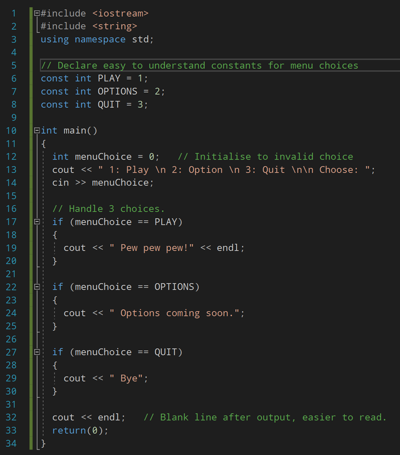

---
html:
  embed_local_images: false
  embed_svg: true
  offline: false
  toc: true
export_on_save:
  html: true
---
# Week 4 ISE102


<!-- @import "[TOC]" {cmd="toc" depthFrom=1 depthTo=2 orderedList=false} -->

<!-- code_chunk_output -->

1. [Week 4 ISE102](#week-4-ise102)
   1. [Last week's home exercise: Menu Fighter](#last-weeks-home-exercise-menu-fighter)
      1. [Recap](#recap)
      2. [How did you do?](#how-did-you-do)
   2. [Making programming easier](#making-programming-easier)
      1. [Take it one challenge at a time](#take-it-one-challenge-at-a-time)
         1. [Exporting our menu to C++](#exporting-our-menu-to-c)
         2. [Decisions](#decisions)
         3. [I can read my loop easily](#i-can-read-my-loop-easily)
         4. [Step back from the code to see the big picture.](#step-back-from-the-code-to-see-the-big-picture)
         5. [Finishing touches.](#finishing-touches)
   3. [Using variables for clarity](#using-variables-for-clarity)
      1. [Use constants for important, unchanging numbers](#use-constants-for-important-unchanging-numbers)
         1. [The `const` keyword](#the-const-keyword)
         2. [Conventions and `CONSTANT_NAME`](#conventions-and-constant_name)
   4. [Exercise](#exercise)
   5. [Clearing the screen/console in C++](#clearing-the-screenconsole-in-c)
   6. [Enumerators: **`enum`**](#enumerators-enum)
   7. [Other loop structures](#other-loop-structures)
      1. [`for` exported to _C++_](#for-exported-to-_c_)
   8. [More on floating point numbers](#more-on-floating-point-numbers)

<!-- /code_chunk_output -->


## Last  week's home exercise: Menu Fighter

### Recap

**Make this amazing game by yourself.** 

You can:
- Write it **directly in _C++_** 
or
- Make it **in _Flowgorithm_** and then **export it to _C++_**. Paste it into a Visual Studio project's main.cpp and **get it running in the console.**


> ---- WELCOME TO MENU FIGHTER -----
>
> 1: Play Game | 2: Options | 3: Quit
>
> Enter a number to choose:

Here are the computer's instructions:
1. If player hasn't quit, **display a numbered menu**.  _(begins the loop)_
2. Let me choose an entry by **inputting a number**.
3. Check their choice and:
   **Play Game**: print `"Round 1, Fight! Bish bish bash URGH!! You win."`
   **Options**: print `"Your only option is to fight."` 
   **Quit**: print `"You quit."` and remember **playerQuit is true**. 
5. Repeat. 

_6: If playerQuit is true, the loop won't run, we'll go to the end of the main function._

### How did you do?

1. Who thought it was an ok task to get through? 
1. Who got a flowgorithm version working?
1. Who exported c++ and got it working?
1. What got people stuck (even if you overcame it)?
1. Questions?

&nbsp;

## Making programming easier

As our games gain features, even flowcharts get detailed. 

> **No one expects you to understand a program/flow like this at a glance.** Or to write one from start to finish in a straight line..


Like building something in the real world, it looks impossible if you take in the whole finished item. Instead, professionals **break projects into manageable chunks**. 

### Take it one challenge at a time

Here's a way to **make the menu** more easiliy. My goal is to get the overall experience working first. 

1. Put in some **variables** for storage: menuChoice. _(yellow)_
2. Add some basic **input** and **output**. _(green and blue)_

1. Add a simple loop, the **processing**, like we did list week. _(orange)_


The menu accepts 1 and 2. It quits on 3.

#### Exporting our menu to C++

Look at the export on the left to see storage, processing and input/output hilighted. 


On the right is the very slightly altered c++ in Visual Studio.

#### Decisions
When we get to the processing, the decisions, it can be hard to keep things straight in our head if we try to code in a straight line. We don't need to write a whole if with correct output messages before moving on to the second one:
1. Since we need three choices, I go ahead and throw in the 3 `if` statements. No worrying about else, or proper output yet.
2. Add in simple output to make sure hitting `2` or `1` gives me the right result.


#### I can read my loop easily
Green **outputs**, a blue **input**, and some red **processing**/decisions for the 3 choices. Forget if-else for now, I want **clarity first**.


#### Step back from the code to see the big picture.
Use the zoom out button on the toolbar. Get away from the syntax. It's no different to when you're drawing something, or trying to hang a frame on the wall at home.

#### Finishing touches.
All it needs now is the right output, maybe an error if it's not 1,2 or 3.

&nbsp;

## Using variables for clarity

We used 1,2,3 for the choices. We could end up with 1-11, or 1-13. Thes **magic numbers**, peppered through our code instead of variables, quickly lose all meaning. 

**Put your numbers in variables with meaningful names.**

Use the words you use in your menu, keep it simple.

```cpp
int play = 1
int options = 2
```

### Use constants for important, unchanging numbers

**Constants are variables in C++.. that don't vary.**

* They're useful reference numbers that don't change while the program's running (if ever). 
* Write them in **`UPPER_CASE_WITH_UNDERSCORES`** so they stand out to programmers. 
* **`PI`**, **`LUIGI_JUMP_HEIGHT`**, **`GRAVITY_MS`** are examples
* When we use them in an _if_ or a _while_ it adds clarity.



#### The `const` keyword
When the compiler sees **`const`** before **`int`** it means that variable can't be changed. If you **try to assign to**/overwrite a constant, your program **won't compile**.

#### Conventions and `CONSTANT_NAME`
There's **no compiler rule saying** `const` names have to be **`UPPER_CASE_WITH_UNDERSCORES`**. It's purely for human eyeballs. We'll know it's an unchanging number **on sight**.

> **Conventions are practises** programmers follow to **make reading code easier** on themselves and others. If we follow conventions that are widely used, and do it consistently:
> 1. **Debugging our code** will be easier
> 2. **Sharing and receiving** code will be easier
> 3. **We can write bigger programs** and more complex games, because we'll **minimise wasted mental energy**. 
> 
> Like a marathon runner with a disciplined stride, we'll go further with the same resources.

&nbsp;

## Exercise

Define constants for each of the following:

1. **4 `int` constants**: significant numbers in your **favourite sport/game**
  
  ```cpp
  // Examples (do not use these yourself)
  const int RESERVES_ALLOWED = 3;
  const int SMALL_HEALTH_PACK_HP = 20;
  ```
2. **4 `float` constants:** **Australian average stats**: height in metres for both genders, also average weight in kg. Ask Google.

> Floating point numbers are used when you need decimal places.  
  ```cpp
  // Example
  const float CM_IN_AN_INCH = 2.54f;
  // Note that you need a trailing f when assigning a value to a float.
  ```

3. 4 `string` constants:
   hat represent type-casting in film, and the actors best known for being in those roles. Some ideas: funny when angry lady, always shadey guy, cowboy, queen, goodlooking idiot guy, scary old lady.

> **The `float` data type** stores numbers with a decimal point including scientific notation. 
> * 11.5 
> * 1.2*10<sup>-20</sup>
> * 0.00000002.

&nbsp;

## Clearing the screen/console in C++

Nobody wants to play **scroll down the screen fighter**.

Add **`System(cls)` before showing sub screens**, and **before returning** to the main menu.

## Enumerators: **`enum`**

Enumerators provide a shorthand for creating (and grouping) constants with integer values.

```cpp
#include <iostream>
#include <string>
using namespace std;

enum MenuChoices { STORY_MODE, ONLINE_MULTIPLAYER, OPTIONS, QUIT };

int main()
{
  int choice = -1;
  cout << " 1: Play \n 2: Option \n 3: Quit \n Choose: ";
  cin >> choice;
  if ( choice == MenuChoices.PLAY)
  {
    // play
  }
  else if (choice == MenuChoices.QUIT)
  {
    //quit
  }
  return(0);
}
```

I've shown you an **enum defined on a single line** because hopefully it'll **help you remember** you need **a semi colon at the end** of an enum definition.

* Conventionally, an enum definition is **spread over multiple lines** for readability. 
* These curly braces **don't define a code block**. They're actually starting and ending a _set_, a collection. More on this later in data collections.

```cpp

enum MenuChoices    // enums can get long, so they're defined over multiple lines
{ 
  STORY_MODE, 
  ONLINE_MULTIPLAYER, 
  OPTIONS,
  STORE,
  LOOTBOXES,
  CREDITS,
  STATISTICS,
  QUIT 
};              // DON'T FORGET this semi colon. Spoiler: you will.
```


There's **a lot more to enums**, read on: <https://www.geeksforgeeks.org/enumerated-types-or-enums-in-c/>

## Other loop structures

**`for`** loops. **`do..while`** loops. Look into them in _Flowgorithm_ and _C++_

You'll mostly see **`for`** loops used to go through collections of data. We'll get to that next week.


**Note** I joined the `lyric` variable and the string `", "` using a single `&`. That's a flowgorithm thing.

### `for` exported to _C++_

**Note** how in _C++_ `lyric` and `", "` are joined using `<<`. This works when the line starts with `cout`.


## More on floating point numbers
**More info:** https://www.learncpp.com/cpp-tutorial/floating-point-numbers/


