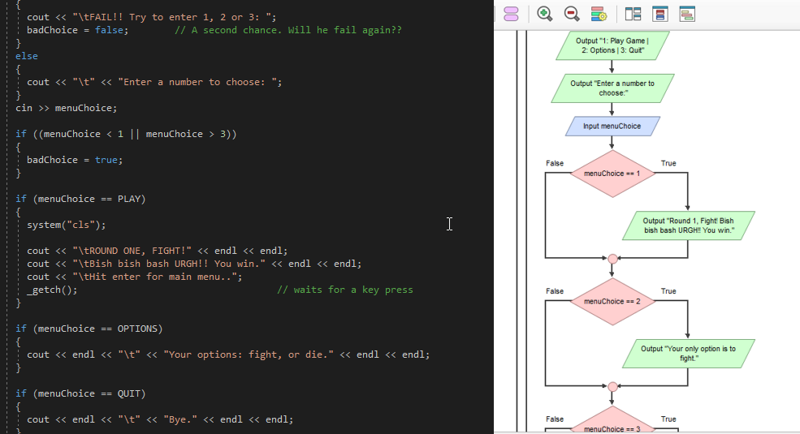
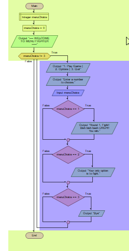
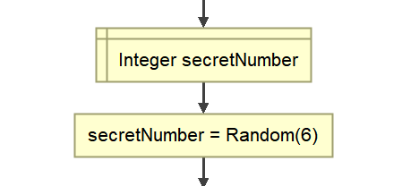
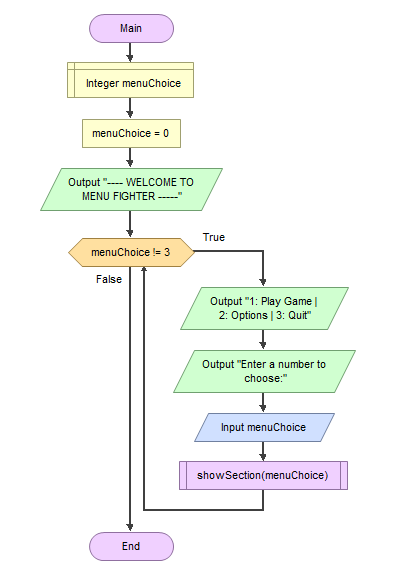
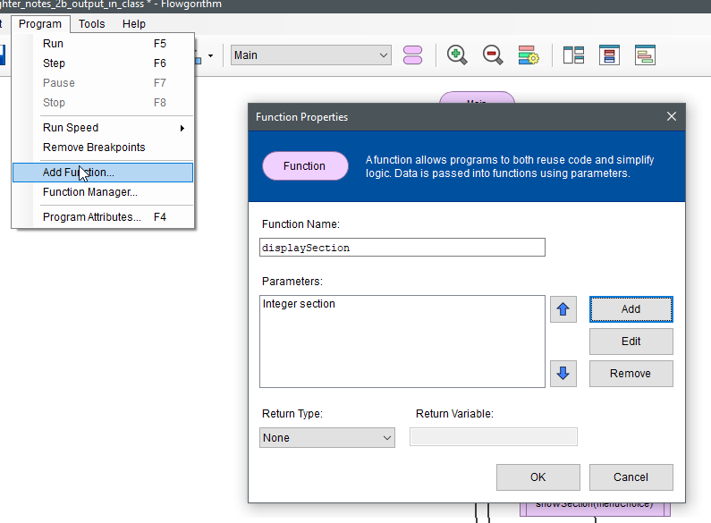
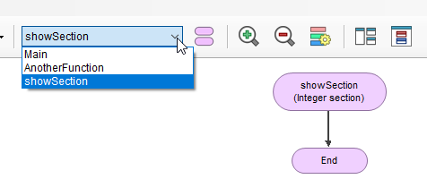
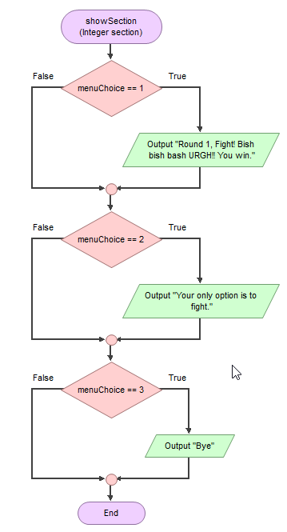
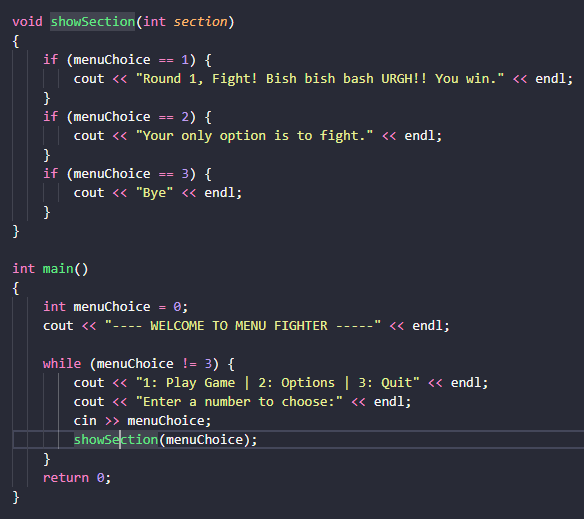

---
html:
  embed_local_images: false
  embed_svg: true
  offline: false
  toc: true
export_on_save:
  html: true
---

# Week 5 ISE102

<!-- @import "[TOC]" {cmd="toc" depthFrom=1 depthTo=3 orderedList=false} -->

<!-- code_chunk_output -->

- [Week 5 ISE102](#week-5-ise102)
  - [Resources for this Lesson](#resources-for-this-lesson)
  - [Tidy code with functions](#tidy-code-with-functions)
  - [Excercise: Add showSection to MenuFigher in C++](#excercise-add-showsection-to-menufigher-in-c)
  - [More about Functions](#more-about-functions)
  - [Solving the slots in Psuedocode](#solving-the-slots-in-psuedocode)

<!-- /code_chunk_output -->

## Resources for this Lesson

* [Menufighter Long](assets/week5/menu_fighter_long.fprg.zip) for Flowgorithm
* [MenuFighterAddFunctions](assets/week5/MenuFighterAddFunctions.zip) project for Visual Studio
* The previous version of these notes as taught in [trimester 2](week5_notes_tri2.html)

## Tidy code with functions

Download [this flowgorithm file](assets/week5/menu_fighter_long.fprg.zip) to get started.

#### Untidy code
As we added more to our menu last week, `main()` was getting pretty long and it got trickier to keep track of the program's flow.  


_The start and end are off screen.. No context!_

Our main function was easy follow until all that loop content went in.
 


What if we could move the body of the loop elsewhere but still know generally what it's doing?

#### A shorter, tidier loop
1. Displaying menu
2. Getting choice
3. Displaying sections

What if the loop could call some functions, just like we did with Flowgorithm's Random?


_Random is on of Flowgorithm's built in functions_

Or C++'s **`time`**, **`_getch`**?

```cpp
secretNumber = time(0);

cout << "Hit a key to contine" << endl;
_getch();
```
_`_getch` was in the `conio.h` library_

**Who wouldn't want the power to create functions?** Functions that do whatever we need on call.

### A function we might want

What if we could ditch all those ifs and, instead, call a function called `showSection`. All it needs to be told is which section.


_showSection: bottom right, in pinky purple_

In C++ it makes things even shorter:
```cpp
int main() {
    int menuChoice= 0;
    cout << "---- WELCOME TO MENU FIGHTER -----" << endl;

    while (menuChoice != 3) {    
        cout << "1: Play Game | 2: Options | 3: Quit" << endl;
        cout << "Enter a number to choose:" << endl;
        
        cin >> menuChoice;
        showSection(menuChoice);
    }
    return 0;
}
```

### Moving code to a Flowgorithm function

There are 4 things we need a way to do:
1. Define/name a custom function
2. Hand it some details, like what section to show. 
3. Copy paste our code over.
4. Run/call the function.

#### 1+2: Create a function in Flowgorithm
From the menu select _Program -> Add Function..._ and give it the name we used above: displaySection.



Notice we give it a **_'parameter'_**: the details it needs to do its job. A parameter is just a variable definition.

#### 3: Copy paste
Now you're stuck in an empty function! 



1. Click the function dropdown to switch to the Main function.
2. Select and cut all the if statements from your while loop
3. Switch back to showSection again
4. Click the one flow line on your chart, paste in the if statments



5. Go back to Main and add a _call_ node to the while loop. Enter "showSection(menuChoice)"


Run it to see if it works!

### Why two names for menuChoice?

Variables aren't really passed to a function, just a _value by copy_.

* `menuChoice` is a variable **in Main**
* When we call `showSection(menuChoice)` **it doesn't pass in the whole variable with its name** and memory location.
* `showSection`, when it starts, only **receives a copy of the number stored in menuChoice.** 
    - It has no idea where it came from. It hears "Hey buddy, show me section 2"
    - It tores that info in it's own variable before it forgets. It maybe writes "note to self: section = 2."

## Excercise: Add showSection to MenuFigher in C++

Create a new project, in Visual Studio: **_MenuFighterFunction_**

You can [download a project](assets/week5/MenuFighterAddFunctions.zip) or just make one and paste in this code:
```cpp
#include <iostream>
using namespace std;

int main() {
    int menuChoice;
    
    menuChoice = 0;
    cout << "---- WELCOME TO MENU FIGHTER -----" << endl;
    while (menuChoice != 3) {
        cout << "1: Play Game | 2: Options | 3: Quit" << endl;
        cout << "Enter a number to choose:" << endl;
        cin >> menuChoice;
        
        if (menuChoice == 1) {
          cout << "Round 1, Fight! Bish bish bash URGH!! You win." << endl;
        }
        if (menuChoice == 2) {
            cout << "Your only option is to fight." << endl;
        }
        if (menuChoice == 3) {
            cout << "Bye" << endl;
        }
    }
    return 0;
}
```
Now go ahead and add in the `showSection()` function!



## More about Functions

How to to remember: relate functions to stuff we already know.

### Functions are like variables

Variables have a data type, a name, and they hold/retrieve data. Variables always get whatever is stored in their little box of memory.

**A variable:**
```cpp
int menuChoice;
menuChoice = 1;

if (menuChoice == 1)
{
  // do something
}
```

**A function:** (Similar deal:it has a data type, a name, and can return data)

```cpp
int garysRealAge()  // Gary's real age needs to be calculated
{
  int realAge;
  realAge = garysCurrentAge + 8;   // Gary usually alters his age by about 8 years 
  
  return(realAge)   // Send back the calculated data
}
```
#### The difference between a variable and a function:

> **A function gives you a freshly calculated, dynamic answer** each time instead of just pulling it from memory.

```cpp
if (garysRealAge() > 50)
{
  cout << "Gary mate, did you have a pet dinosaur as a kid?" << endl;
}
```
### They're also like little worker programs.

They can contain a bunch of variables and statements, like _main()_ has in all our programs so far. They just do a single specialised job, and can be called a bunch of times. Main only runs once.

**A function might do some of these limited things:**
* get the current time
* check if any keys are being pressed
* figure out if you're close enough to a dragon to mount it with the Y button

**If _main()_ is a boss function, its employees are any functions it calls.**

1. _main()_ has an overall plan, and top level information.
2. It tells each function to do a task it's good at, providing just enough info to do it. It might call he same function several times with different info: (`showSection(1); showSection(2);`)


_do your jobs, healer functions_

## Solving the slots in Psuedocode

**The slot machine** part of assessment 1:
1. Keeps cash we bet
1. Spins its three wheels*, for 3 random numbers (2-7 inc) 
2. Awards prizes for two or more matching numbers, special prize for three sevens.
3. Keeps track of our remaining cash.
   
### Winning

Wins are for 2 of a kind, 3 of a kind, and 3 sevens.

> Example wins:  
> \==========
> |||  6  |  2  |  6  |||
> \==========
> |||  4  |  4  |  4  |||
> \==========
> |||  7  |  7  |  7  |||
> \==========

#### When do we have 3 equal numbers

When both of these are true (AND):
* `wheel1` is equal to `wheel2`
* `wheel2` is equal to `wheel3`

As an epression: `(wheel1 == wheel2 && wheel2 == wheel3)`
**Question** Does it have to compare 1 to 2 and 1 to 3?

When both: 
* wheel1 minus wheel 2 is equal to 0
* wheel 1 minus wheel 3 is equal to 0

#### Checking for three sevens

When do we have 3 sevens?

When all are true:
* wheel1 == wheel2 
* wheel1 == wheel3
* Any wheel is 7

Another way:
* wheel1 == 7
* wheel2 == 7
* wheel3 == 7

Building on what we already checked:
* three of a kind and wheel1 == 7

Others?

#### Two of a kind
Here are some situations when we do have a two of a kind

When both true:
* two wheels are the same
* two are not the same.

Both true
* We do not have 3 of a kind
* two are the same. 

### Calculating winnings

Winning results in a prize equivalent to **your bet multiplied by 3, 5 or 10.** From the assessment 1 brief:

> •	If all three numbers are ‘7’, then award the player 10x their bet.
> •	If all three numbers are the same, (but not ‘7’s), then award the player 5x their bet.
> •	If two out of the three numbers are the same, then award the player 3x their bet.

**Pseudocode:**
```
integer multiplier = 0;
integer bet = 0;
integer winnings = 0;

multiplier = result of check for winning numbers
bet = user input;
winnings = bet * multiplier 
```

#### Check for winning numbers as function
"Result of check for winning numbers" sounds like a function to me. It can:
* **take our wheel numbers** as info
* **look for matches**
* **return a multiplier** depending on the outcome: 0 (lose), 3, 5 or 10.
```
multiplier = getPrizeMultiplier(wheel1, wheel2, wheel3);
```

Finally, subtract the bet (booky always keeps the bet) and add on the winnings.

```
totalCash = totalCash - bet + winnings.
```