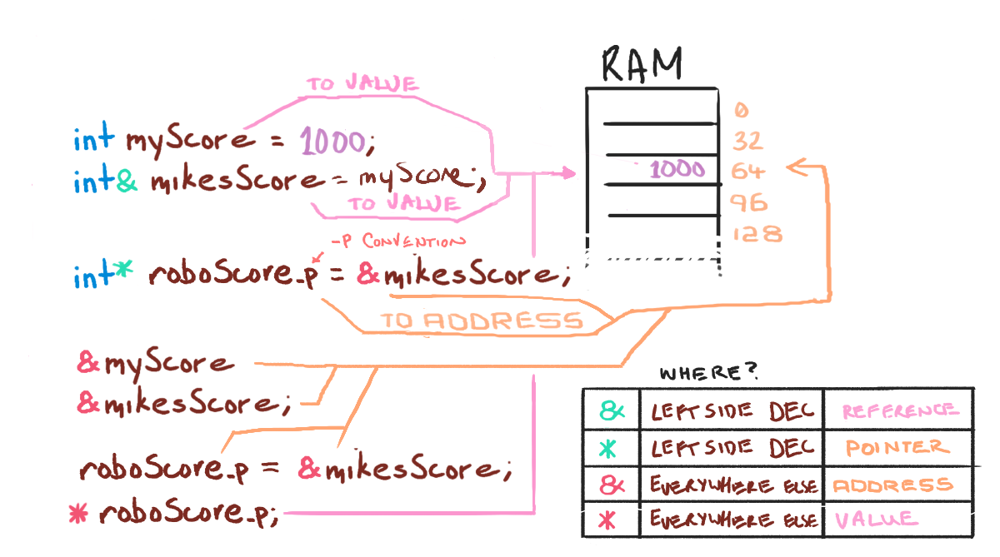

# ISE102 Week 6: References & Pointers 

References and pointers are ways to **pass _access to_ data around. A bit like google Docs, you're able to both edit the same thing.

On the technical side, we're really we're getting a look behind the curtain at the memory in which our data is stored.

> C++ famed low level status is in part due to it's ability to use pointers, because they are very powerful. With that power comes, as you might have guessed, complexity and danger.


<!-- @import "[TOC]" {cmd="toc" depthFrom=1 depthTo=6 orderedList=false} -->

<!-- code_chunk_output -->

- [ISE102 Week 6: References & Pointers](#ise102-week-6-references--pointers)
	- [Different and the same](#different-and-the-same)
	- [References](#references)

<!-- /code_chunk_output -->

## Different and the same

We've been passing things by value (copies). Kinda emailing a copy of your source code or word document to someone. They have their own copy they can do whatever with. But now you have two different copies to be aware of.

## References

> Passing things by reference is kinda like sharing an exercise book with someone. You can both sit down and write in it individually or at the same time, scribble over eachother's work.
 
That's the concept. In practise you're making a second variable name that is just an alias or nickname for another variable/function.

```cpp
int main()
{
	int myScore = 1000;
	int& mikesScore = myScore; //create a reference. 
	// The & goes on the TYPE, not the NAME
	
	cout << "myScore is: " << myScore << "\n";
	cout << "mikesScore is: " << mikesScore << "\n\n";

	// Edit myScore to see both change, if they both point to same thing.
	cout << "Adding 500 to myScore\n";
	myScore += 500;						 
	
	// 
	cout << "myScore is: " << myScore << "\n";
	cout << "mikesScore is: " << mikesScore << "\n\n";
	// Both print 1500

```

 References are nicknames: you can create a nickname for a function or variable. It will return the same data your variable would, ready to use.

 > You can put the & anywhere between int and name.

 ```cpp
 int big = 1000;
 // The following 3 lines are all equivalent.
 int& large =big;
 int & large = big;
 int &large = big; 
```

## Pointers

Pointers are the more technical, deeper version of references. In fact they're the mechanism behind references.

They do the same thing as references except you get the actual memory address. You can then "dereference" that address to get the object, or you can do math on the actual address to access objects. Arrays work a bit like that.

```cpp
int age = 5;
int* age_p = NULL;

age_p = &age; // get address.
cout << age_p << endl;
// prints a memory address
cout << *age_p << endl;
// prints 5;
// Output:
// 0x0af3d
// 5
```

## Meanings of * and &



## Things to do

1. Type out sample code to understand memory addresses, references, pointers.
   * [week6_code.html](week6_code.html)

## Resources

Book chapters:
* 5: [Functions](book_1/cppgameprog_5_funcs_madlib.pdf)
* 6: [References](book_1/cppgameprog_6_refs_tictactoe.pdf)
* 7: [Pointers](book_1/cppgameprog_7_pointers_tic2.pdf)

