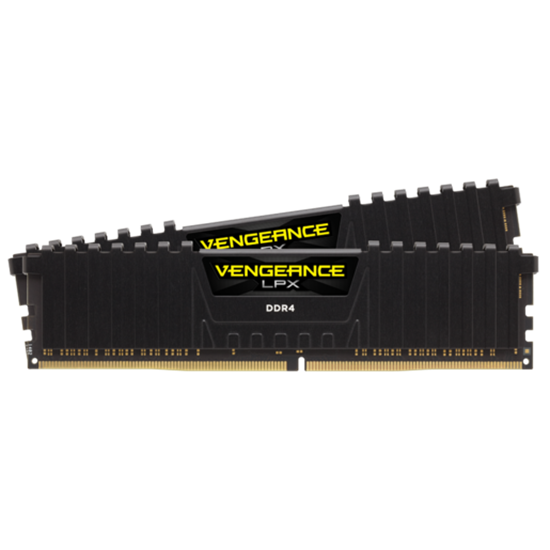

---
html:
  embed_local_images: false
  embed_svg: true
  offline: false
  toc: true
export_on_save:
  html: true
---

# Week 6 ISE102


<!-- @import "[TOC]" {cmd="toc" depthFrom=1 depthTo=3 orderedList=false} -->

<!-- code_chunk_output -->

- [Week 6 ISE102](#week-6-ise102)
  - [Covered this week](#covered-this-week)
  - [Assigning values to variables of different types](#assigning-values-to-variables-of-different-types)
  - [Overflow/wrapping](#overflowwrapping)
  - [Compiler stuff!](#compiler-stuff)

<!-- /code_chunk_output -->


## Covered this week

* How code becomes programs
  - Compiling, linking

* chars and strings

* using the debugger to look at variable values in memory. This helps us see what happens to values when we assign them to various types.

* Creating values for different data types
  - Refresher: `int, long int, short int.`
  - Differences in size (bytes, words, half words, double words.
  - More refresher: `float, double`.    
  - string, wstring, char, wchar, int, long int, unsigned long int

* Exam, briefly.

## Assigning values to variables of different types

When you assign a value to a variable, you write that value down with punctuation in a way c++ recognises. 
  
  > **Very important to understand:**
  > When you write that value, C++ doesn't guess assume it's of the same data type as the variable you're assigning to. It goes strictly off the way you write it!

```cpp
// Some we've covered heavily
string garysFullName = "Gary Gergburger"; 
int age = 22;
float PI = 3.14159f;

// Some less or not at all
char oneCharacter = 'e';        // A char is a single character, the building block of strings
double PI = 3.14159265358979;   // Double is a float at 64 bits. Notice, no `f`
```

It basically creates a nameless variable to hold it.. then does the assignment. 

### Integer assignment

Integers are pretty simple. You write a number with nothing around it.

```cpp
int age = 22;
int avengersBoxOffice = 1518812988; // $1,518,812,988. Using whole dollars only.
int avengersEndGameBoxOffice_fail = 2797800564;   
unsigned int avengersEndgameBoxOffice = 2797800564; // Works because unsigned means more range
long long int avengersEndgameBoxOfficeLong = 2797800564; // works because long long is 64 bit.
```

#### Knowing what your variable can hold

This is super important if you don't want to lose or corrupt your data. You can't stick an elephant in a cat carrier without losing a lot of elephant.. in spaghetti form.

What's wrong with using `int` for `avengersEndGameBoxOffice_fail`? It 'only' handles numbers between `−2,147,483,648` and `2,147,483,647`
  - the default `int` type is shorthand for a `signed long int`
  - `long` means a **32 bit** `int`. `signed` means it has to include negative numbers in those 32 bits, halving the range of positive numbers
  - An `unsigned int` can go up to 4,294,967,295
  - Look at the table to see what a `long long unsigned int` can hold.





#### Ooops, float to int.
It's also bad to assign a float literal to an int if you don't intend it.

If you assign `0.41f` to `int age`, you'll get 0.
  - It will be created for a moment as a nameless `float`, then assigned to the int
  - its value is copied, everything after the `.` is chopped and the result stored in `age`.
  - Finally, our nameless, accurate, temporary float vanishes.

### Floats and doubles

**The `float` data type** stores numbers with a decimal point including scientific notation:
* 11.5 
* 1.2*10<sup>-20</sup>
* 0.00000002.

A `float` is stored in 32 bits of memory, where a `double` has 64 bits. 

>Be careful not to add an `f` when assigning to a `double`. `0.38423223423423423f` tells c++ you're specifying a `float`, and any precision it can't store will be lost. Then that chopped value is stored in your double.


**More info:** https://www.learncpp.com/cpp-tutorial/floating-point-numbers/

 #### Is there a short float? 
 No, not built in, but there are specifications for them and libraries for using them.
 They're becoming very useful in machine learning, along with 8 bit floats.

 ### Chars and strings

`char` is a data type that holds a single character. It's really an 8 bit integer used to look up an entry in a standard ascii table.  _(ps: this is an over simplification)_


#### The ugly reality behind strings

Strings are just arrays of characters with a `\0` at the end. The good news is _C++_ hides it from us with the `string` data type. C programmers had to deal with that `char` array drama directly.

 

### Declaring strings vs chars

```cpp
char letterF = 'f';
string letterF = "f";
string myStory = "Once, I was born. Eventually today came. Tomorrow I'll probably still be alive.";

// What would be the difference between these two in memory?
```

## Overflow/wrapping

See week 2 powerpoint.

## Compiler stuff!
We're making programs from c++ code. Obviously there is a big difference between a text file and a running program, so.. wth is visual studio doing to turn some text into that exe file?

Stages:
  1. our c++ files in an editor (can be anything)
  2. go into a compiler (many c++ compilers exist)
  3. obj/o files pop out   - why useful? Only compile what has changed
  4. linker joins them together with compiled libraries. Only those that change.
  5. Executable file pops out - operating system loads this into memory and begins executing instructions.

Now go into the folders of a solution and see where these really are.
 