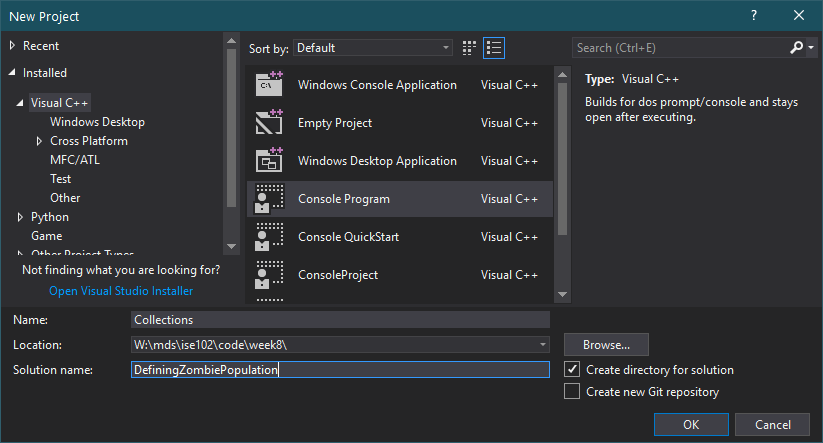

# ISE102 Week 8: Collections and Exam

<!-- @import "[TOC]" {cmd="toc" depthFrom=1 depthTo=3 orderedList=false} -->

## This week

With a focus on this week exam we'll cover
- For loops
- Switch statements
- Collections! Vectors and arrays
- A bit more on enums
- Unary operators (++, --)

### Uses for collections in games

Contents of a Hearthstone deck, inventory items, equipped items, cars in a race, members of a raiding party, performance stats, types of potions, players to select, game modes available, skins you've bought.

> In a game these collections will usually contain a list of objects, which we'll learn more about later. For our purposes we'll just stick to simple lists of strings, numbers or booleans.


### Activity: your collections

Head to this discussion thread and post your own collections:
[Week 8 - Collections on Blackboard](https://laureate-au.blackboard.com/webapps/discussionboard/do/message?action=list_messages&course_id=_76681_1&nav=discussion_board_entry&conf_id=_114402_1&forum_id=_728750_1&message_id=_1856292_1)

5 collections from real games you've played:
5 collections in your online life (ie Instagram follows)

## Big data

When you know something about a single thing or creature (hairLength, characterName, speed, hitPercentage) then a named variable for that piece of data makes sense. 

When it's the number of zombies in each carriage a train has, a record of every shot fired in the game and its hit/miss status, or the tiles/grid cell contents in a starcraft map, it makes more to treat them as a bunch of anonymous values in a list.


_Your code might be checking a looot of cells every frame for things to draw or update_

### Exercise: Code zombies

Create a project in Visual studio and enter the code below, then we'll debug.

Name it like so:


Enter the code and set the breakpoint:


Run the debugger and, in the _locals_ panel,  expand the collections.


### Using the contents of a collection

- Collections are accessed with some `[]` square brackets containing a numerical index, beginning at `[0]`.
- The last index is size-1: if they contain 9 elements, the last index is `[8]`
- You can use a variable in place of a number to check, for example, how many zombies are in the same carriage as the zombie : `[playerCurrentCarriage]`;

Finally, we can talk about `for` loops. With a `while` loop for comparison.

/////////// while loop steps through carriages, 
// states the current population of zombies, detonates Mortein Zombie Fast Knockdown Kitchen Safe, updates the population (0), states the new population.

///// For loop version

### Details of for loop
Parts of it. Declaring variables inside it or outside. 

## Other ways to fool around with vectors

// adding, removing from end. same at other positions.

## Switch statements

Switch is like a series of "if.. else" statements with less curly braces and syntax. Useful for situations where there are many options and one outcome.

Create a project called "Switches" in your Week8Exercises solution and enter the following:


### Break is strange in switch statements

Try this:
1: Remove the `break;` line from the `case 2:` section.
2: Run the program and enter `2`.
3: What?!?

### Enums make switches easier to use


### Enums can get spicey when you assign values.

## Break is brutal in For loops

/// show how it suddenly drops you out.

## Unary operators are complicated

`x++` is pretty simple right? 
So `y = x++;` is kinda simple?
Then why is there `y = ++x`? How's it different?

### Exercise: Testing unary operators

Write some code to discover how ++a and b++ are different.
1. Create integers a and b, each equal to 5. Create x, equal to 0.
2. Print the names and values of x, a and b.
2. Assign ++a to x
3. Repeat step 2
4. Assign b++ to x. 
5. Repeat step 2.
6. What's going on?

It's the only operator that comes to mind which represents 2 whole lines of code (2 statements).
```cpp 
  x = ++a;
  // becomes
  a = a + 1;
  x = a;

  x = b++;
  // What do you think it becomes??
```


