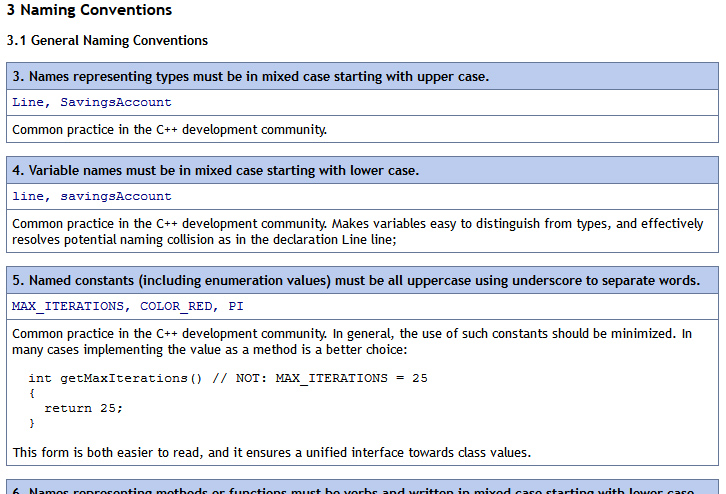

# Week9: Classes and Objects

## Intro to Objects

Remote control. Pie factory. Student.

## Coding Standards

Conventions vary, but most every company that produces code has them. Reasons for conventions according to **Epic Games**

>
> * **80% of the lifetime cost** of a piece of software goes to **maintenance**.
> * Hardly any software is maintained for its whole life by the original author.
> * Code conventions **improve the readability** of the software, allowing engineers to understand new code more quickly and thoroughly.
> * If we decide to expose source code to mod **community developers**, we want it to be easily understood.
> * Many of these conventions are actually required for **cross-compiler compatibility**.

Our source: 
[Geotechnical Software Services Style Guidelines](http://geosoft.no/development/cppstyle.html)

_Screenshot from geosoft.no_

## Classes

What and how?

## Coding exercises

[Monsters and Critters](http://dannymcgillick.github.io/mds/ISE201/week9_code.html)