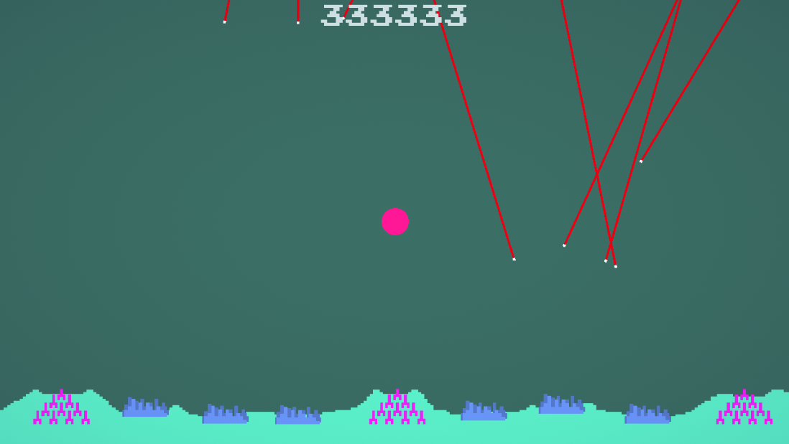
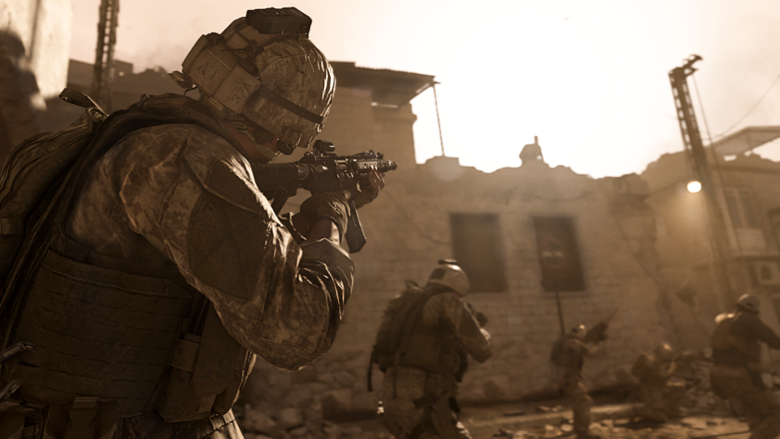
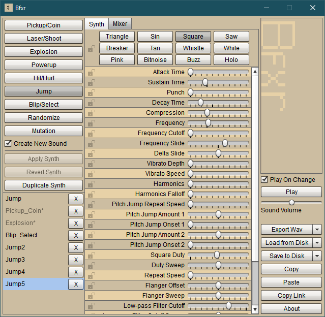

---
html:
  embed_local_images: false
  embed_svg: true
  offline: false
  toc: undefined
export_on_save:
  html: true
---
# Game Design: spice to your games

<!-- @import "[TOC]" {cmd="toc" depthFrom=1 depthTo=6 orderedList=false} -->

<!-- code_chunk_output -->

- [Game Design: spice to your games](#game-design-spice-to-your-games)
  - [Hello](#hello)
  - [Game Design](#game-design)
    - [2D Games with juice](#2d-games-with-juice)
  - [Video: Adding Juice GDC](#video-adding-juice-gdc)
    - [Try it in FD](#try-it-in-fd)
    - [PIC OF FISSILE](#pic-of-fissile)
    - [ADD FISSILE IN UNITY HUB](#add-fissile-in-unity-hub)
    - [No juice in old games?](#no-juice-in-old-games)
    - [PIC OF LOW RES ART ON BIG GRID VS HIGH RES LOW RES ON WEE GRID](#pic-of-low-res-art-on-big-grid-vs-high-res-low-res-on-wee-grid)
  - [Video: Your death animation sucks](#video-your-death-animation-sucks)
    - [Try those techniques in FD](#try-those-techniques-in-fd)
  - [Resources](#resources)
  - [Learning paths](#learning-paths)

<!-- /code_chunk_output -->

## Hello

* You
* Me

## Game Design

Many things come to mind when we talk game design. 
* Genres
* world building
* level design
* scripting
* balancing.

 ### Feel

* Making up for missing sense of touch
* We have to take away physics and anticipation because of 
* Communicating on multi levels: combining light, sound, shape (juice

### 2D Games with juice

* Rayman Legends
* Super meatboy
* 

## Video: Adding Juice GDC

Adding response with tweens and sound.

<iframe width="560" height="315" src="https://www.youtube.com/embed/Fy0aCDmgnxg" frameborder="0" allow="accelerometer; autoplay; encrypted-media; gyroscope; picture-in-picture" allowfullscreen></iframe>

### Try it in FD

Our totally original game, Fissile Demand.

### PIC OF FISSILE

### ADD FISSILE IN UNITY HUB

Fissile without juice.
Add a bit of tweening to flash and bloat and splode things
Add camera shake
Add sound
Add 2d light flare on earth explosion? Tween down.

What is tweening?

### No juice in old games?

They added plenty of juice, but had to do it in different ways with greater restrictions.

Remember, we're producing this:

on hardware built to handle this:

So things like camera shake and tween could appear in limited ways in old games. But mostly they did what they could by drawing every frame in a sprite.
___

#### Resolution and Sprites
Effects were it was limited by resolution and colours available, let alone processing speed. 

> **MC Arc**: 256x231, ?fps on 1.25mhz cpu
> **NES:** 256x240 @ (approx)25-30 fps, 1.78mhz cpu.
> **Megadrive:** 320x240 (PAL) at 30fps, 7.6mhz cpu.

**Now**: Average display 1920x1080 (or up to 4K) on.. 4Ghz multi core cpu.

4 billion cycles per second vs 1.25 million. Ouch. Dedicated GPU along with hardware FPU in x64 cpu.

Large pixels in output vs stylised large pixels made up of many pixels in screen buffer
  - Move by small amounts creating subtle motion
  - Rotate, scale in fractions creating very smooth feel
  - We can scale and rotate again by tiny fractions
  - modern 3d shaders can apply to the sprites, bloating and warping. Loads of power to spare.

___
#### Colours

> **MS Arc:** 16 colours
> **NES:** 4 cols per sprite, 16 total on screen of 52 options. 16KB vram
> **Megadrive**: 61 colours displayed of 512 options. 64KB vram.
 
**Now?** 32 bit RGBA pngs we're importing support 16 million colours. No palette limits. 3-8GB vram is pretty typical.

### PIC OF LOW RES ART ON BIG GRID VS HIGH RES LOW RES ON WEE GRID

#### What does all that mean?

We have much more range to express ourselves. 

> Artists and coders making these games in the 80s and 90s were busting their butts to squeeze all the power and expression they could from their hardware.
> We can **honour their art style** with big pixels, and **their spirit** with modern powered additions!

## Video: Your death animation sucks
 
<iframe width="560" height="315" src="https://www.youtube.com/embed/pmSAG51BybY" frameborder="0" allow="accelerometer; autoplay; encrypted-media; gyroscope; picture-in-picture" allowfullscreen></iframe>

Add bloom
Add particles
Maybe counter shake ground

### Try those techniques in FD

## Resources

* **Unity Hub**: installs Unity, manages Unity installs, modules and projects
  - We are using 2019.1.10f1 or 2019.1.10f1. Any 2019.1.x version should be project compatible.
  - [Download page](https://unity3d.com/get-unity/download)
  - [Direct link to windows 64 bit hub](https://public-cdn.cloud.unity3d.com/hub/prod/UnityHubSetup.exe)
* **DoTween** [free](https://assetstore.unity.com/packages/tools/animation/dotween-hotween-v2-27676 ) and [pro](https://assetstore.unity.com/packages/tools/visual-scripting/dotween-pro-32416) $15 version on Asset store
* **Free 8-bit shooter sound  effects** on [open game art](https://opengameart.org/content/retro-shooter-sound-effects)
* **Make your own** sound effects with [Bfxr free old school sound fx synthesizer](https://www.bfxr.net/). Source also available on a github repo.

* Download the **Markdown** version of these notes [here](designing_spice.md) 
* To edit markdown notes try [Visual Studio Code](https://code.visualstudio.com/download) for any platform
  - Go to extensions and add
    * Markdown All In One
    * Markdown Preview Enhanced

## Learning paths

* Brackey's [2d lighting tutorial](
https://youtu.be/nkgGyO9VG54) using Unity's light weight render pipeline. Provides links to a follow-along Unity scene.
* DoTween documentation: http://dotween.demigiant.com/documentation.php