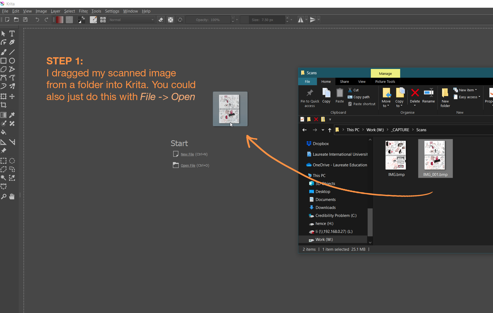
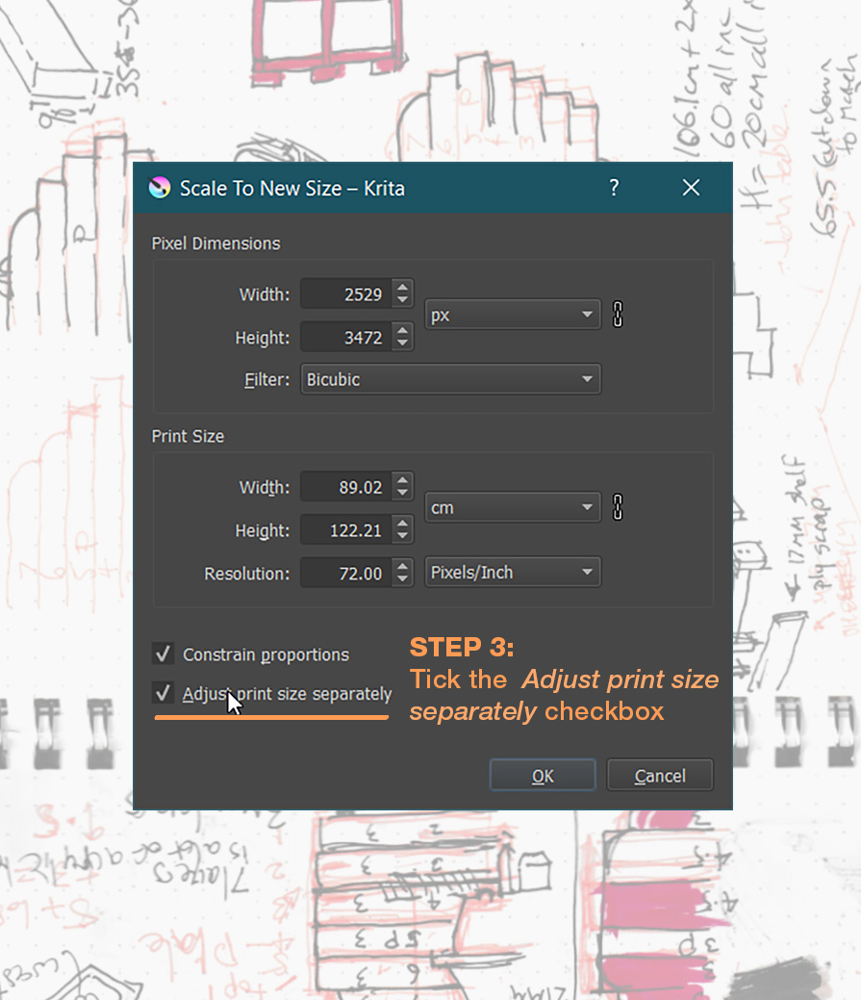
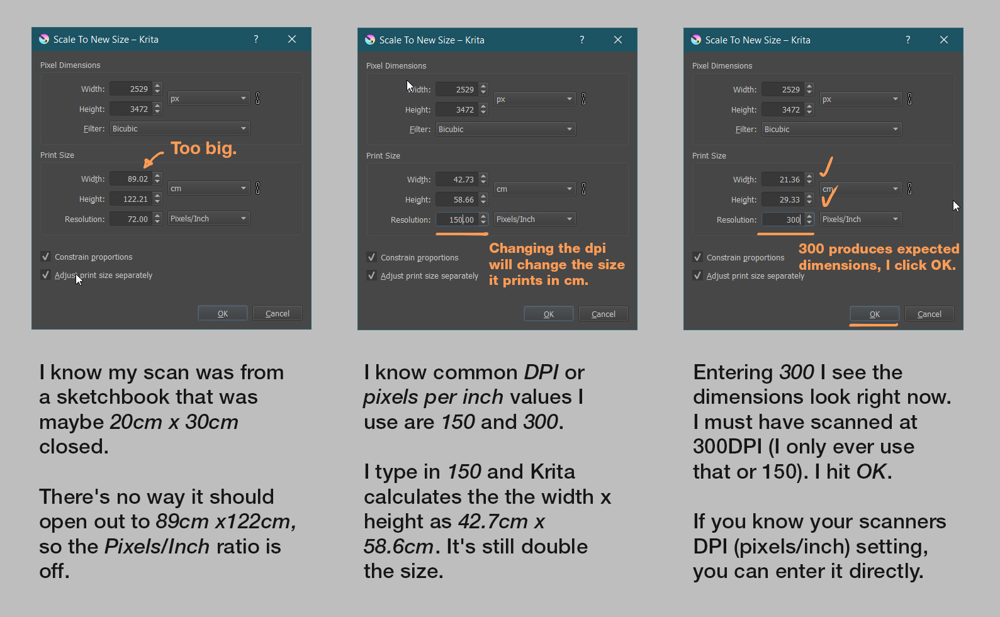
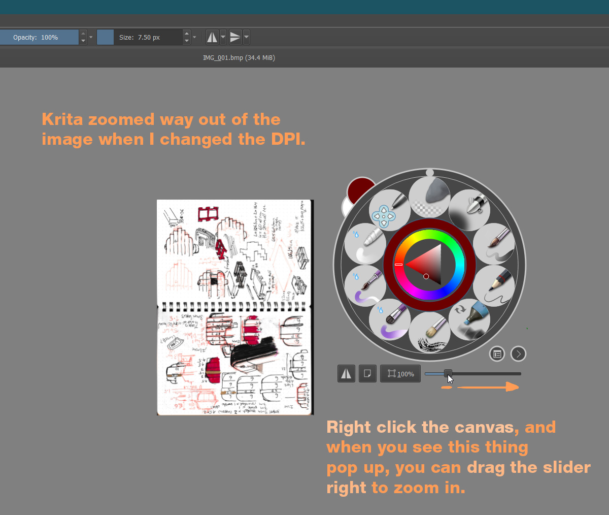
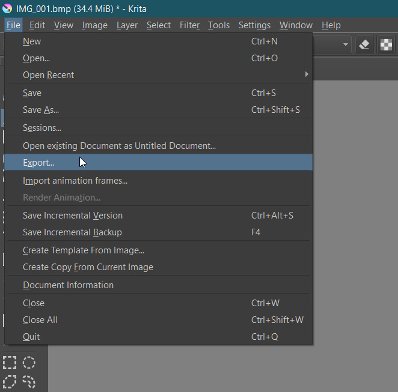
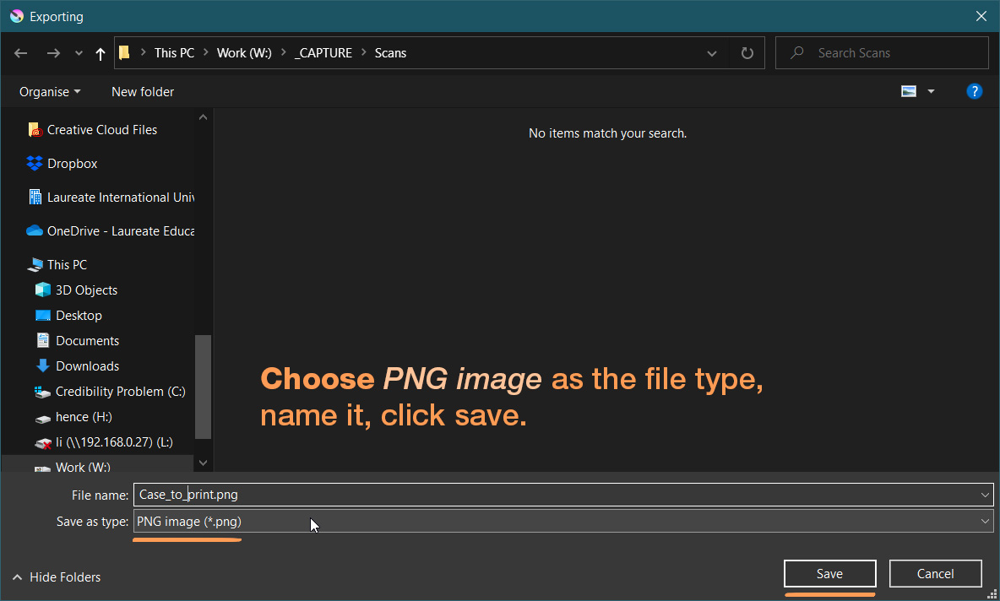
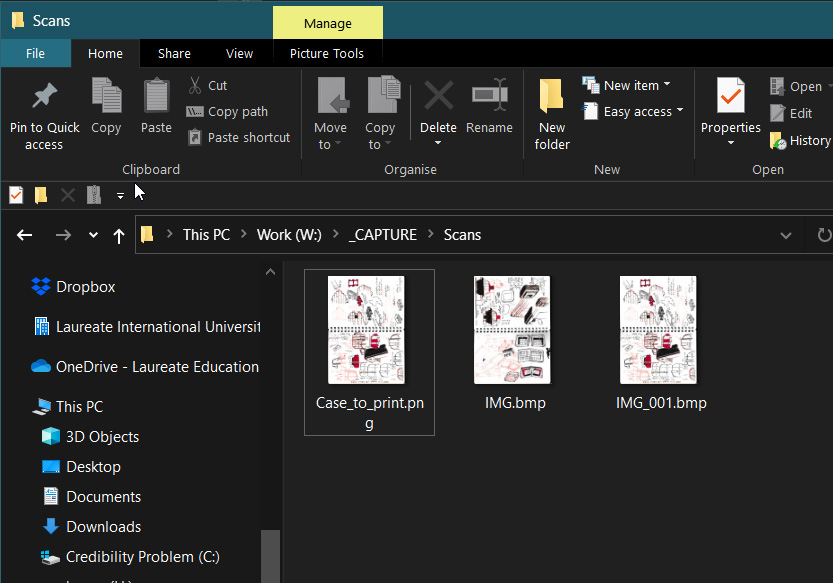

---
html:
  embed_local_images: false
  embed_svg: true
  offline: false
  toc: undefined
export_on_save:
  html: true
---
# DPI/PPI

<!---->

## 1. Open scanned image

## 2. Adjust print size

## 3.  Adjust print size

## 4. Set the pixels per inch (same as dpi)

## 5. Optional: zoom in a bit
This is purely so you can see your picture. It's just small on the screen, it hasn't been shrunk.

## 6. Go to file, export 

## 7. Save as png
Choose PNG from the drop down list of file types. Name your file.

## 8. Your new PNG file
It shouldn't have lost any quality, and should print at it's original scan siz when open{d} in other programes (like photoshop and probably paint shop pro).

